# 设计表单布局:颜色

> 原文：<https://www.sitepoint.com/designing-form-layout-color/>

以下是我们的书《设计 UX:形式 T2》的一小段摘录，作者是杰西卡·恩德斯。这是形式设计的终极指南，是有效 UX 设计的关键部分。SitePoint Premium 会员可以通过他们的会员身份访问，或者您可以在世界各地的商店购买一份。

目前，我们的表单没有多少颜色:

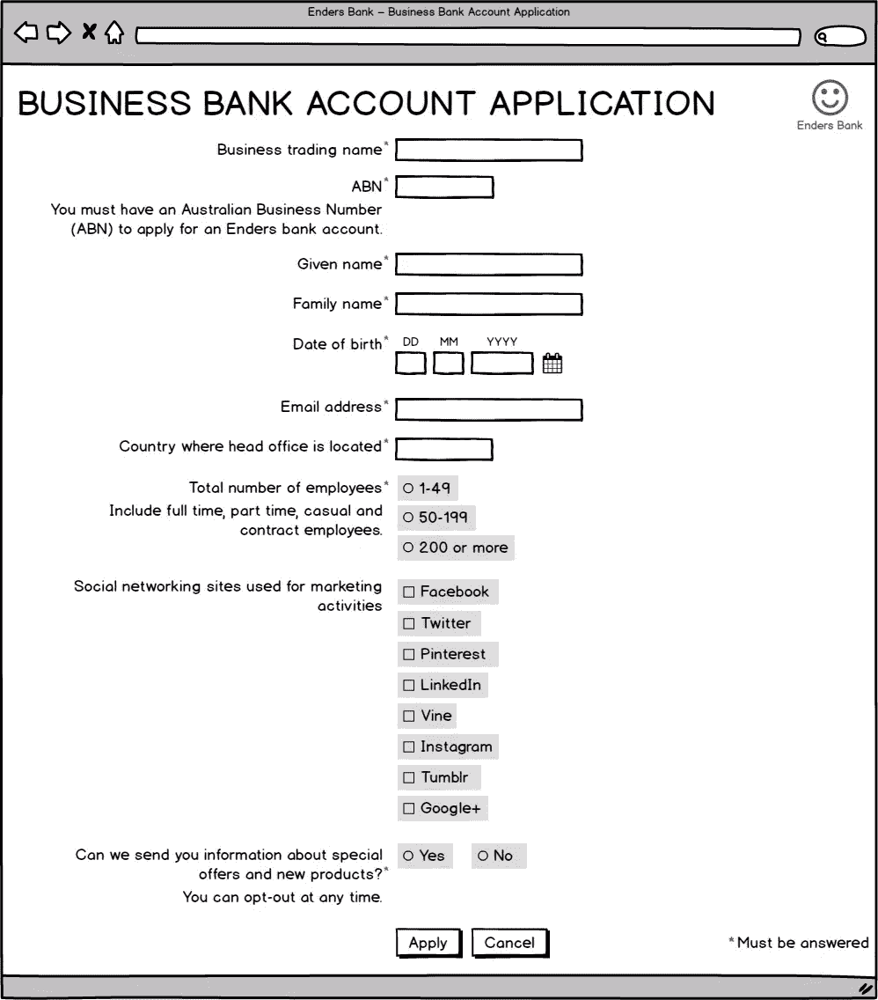

在此阶段，表格上唯一的颜色是徽标和红色星号，表示需要回答的问题。

就这部分设计而言，我们的方向是正确的。我会解释原因。

通常，使用颜色试图使表单“有趣”或“有意思”实际上会使用户体验更糟:

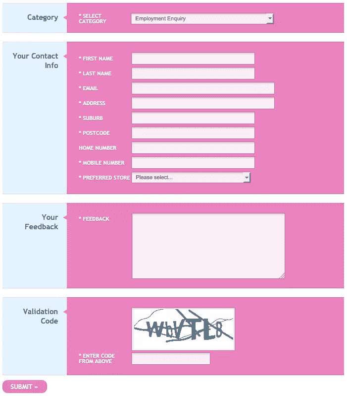

这种非常丰富多彩的形式与其说是有趣，不如说是恐怖和混乱。

有些颜色甚至会伤人:

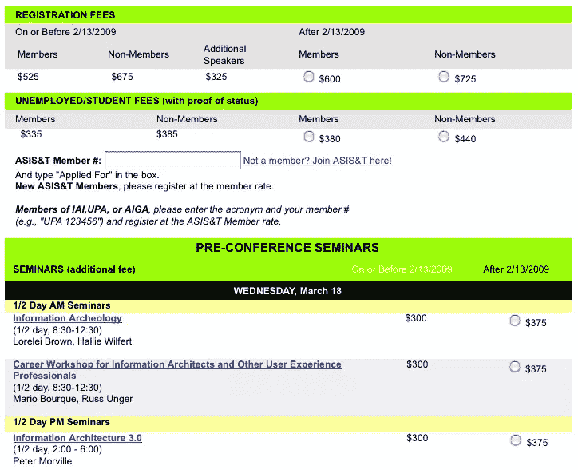

这种形式的荧光颜色对一些人来说可能很难看清。

### 对颜色要非常小心

人类对颜色极其敏感。我们的大脑在我们甚至没有意识到的情况下处理它，我们不禁注意到差异。

在我们的形体中，我们可以利用人类生物学的这一特征来为自己谋利。为需要颜色的东西保留颜色，这样它们就能以某种方式脱颖而出。

以下是表单中可能受益于颜色的一些部分:

**按钮:**

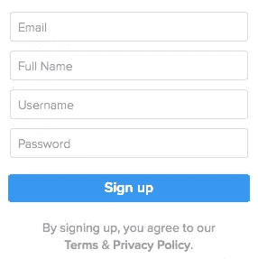

**关键信息，如错误:**

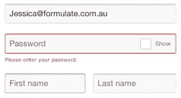

**链接:**

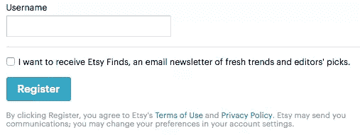

**进度指标:**

**标题:**

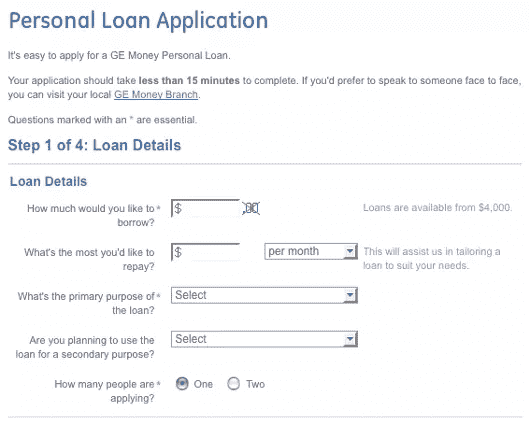

**表单背景:**

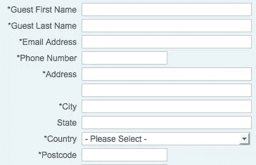

**品牌**与标志和标准标题一样，也可以使用颜色:

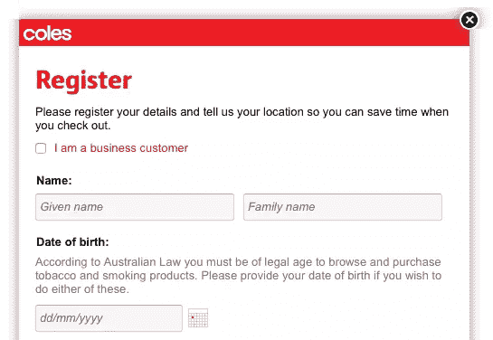

您可能已经注意到，我没有在可能使用颜色的列表中包括必填字段指示符(*)的红色星号。这是因为我不建议使用红色星号来表示必填字段。有关更多信息，请参见下面的“必填字段与可选字段”。

还要注意上面的每个例子总体上使用了很少的颜色。你用的颜色越多，就越不能突出事物:

这种形式几乎在每个元素上都使用了颜色，这意味着没有一个元素是突出的。

### 你应该用什么颜色？

通常，您的组织会有一个可供您参考的调色板。像我的表单设计业务一样，恩德斯银行以蓝绿色为主色调，正如你在下图中看到的标志。让我们使用这种颜色使表单上的主要操作按钮与众不同:

我们的表单现在有了它需要的所有颜色。

### 色盲

估计各不相同，但很可能有 4-10%的 web 表单用户在感知颜色的能力上有所欠缺(通常——但不准确——称为**色盲**)。最常见的色盲是红绿色盲，很难区分这两种颜色。

有鉴于此，你应该**永远不要想在你的网页表单**中仅仅依靠颜色来传达一些东西。下面显示的表单使用红色文本作为必填字段的标签，黑色文本作为可选字段的标签。如果你分不清红色和黑色，那是可耻的！更不用说如果你*能*很好地识别颜色，它会让表格看起来充满错误。

颜色是该表单上必填字段的唯一显示方式，这使得许多用户无法访问该表单。

更好的方法是简单地告诉人们哪些字段是可选的(如下面的“必填字段与可选字段”中所讨论的):

类似地，错误信息应该带有符号或背景阴影，而不仅仅是第 5 章中的红色文本“验证”):

感叹号符号意味着用户可以直观地看出这是一个错误消息，即使他们看不清颜色。

如果你想了解更多关于色盲的知识，有一些很棒的网络资源，包括模拟:

*   我们是色盲
*   [“色彩可及性”](https://24ways.org/2012/colour-accessibility/)

### 色对比度

还有比依靠颜色与用户沟通更糟糕的事情:颜色对比度不足。你的颜色没有足够的对比度意味着即使我们这些视力很好的人也不能*看到*形体的不同元素:

表单背景中的绿色与字段背景中的绿色过于相似，并且这两种绿色都与用于文本的白色过于相似。

这是一个以极大的用户体验为代价，走得太远的例子。这些天它出现得太频繁了:

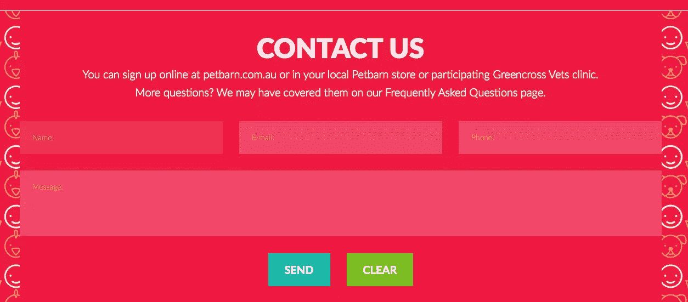

你也许能看到这个表单上的字段，但是阅读标签会很困难。

一个特别常见的对比失败是在白色背景上使用浅灰色。因为它使网站看起来干净和简洁，这种颜色组合目前很流行。可惜完全不能用了:

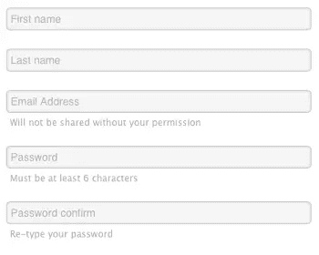

**你的表单元素必须有足够的颜色对比**。对于确保这一点的一些真正实用的技巧，我推荐:

*   [“将对比检查整合到您的 Web 工作流程中”](https://24ways.org/2014/integrating-contrast-checks-in-your-web-workflow/)
*   [“开发者的三个常见陷阱:色彩对比”](http://simplyaccessible.com/article/pitfalls-colour-contrast/)

同时，坚持在白色背景上使用深灰色或黑色:

我们示例表单中的颜色有足够的对比度。

## 分享这篇文章