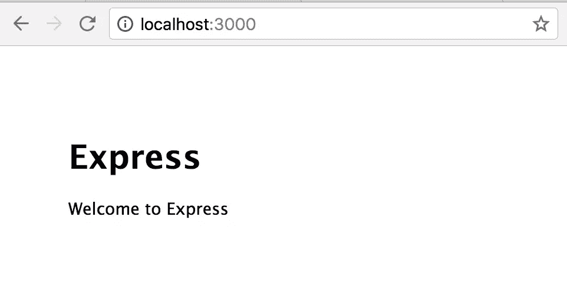
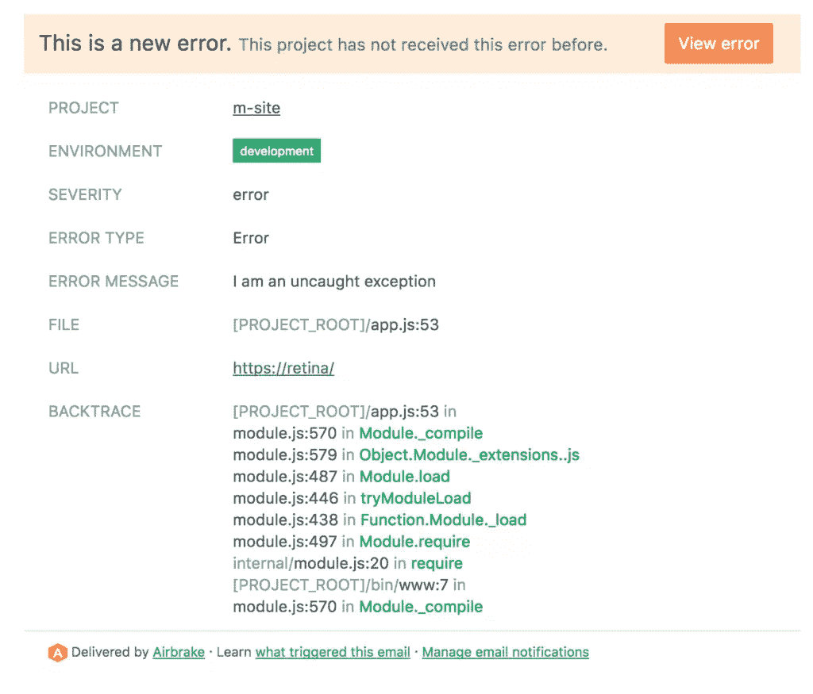
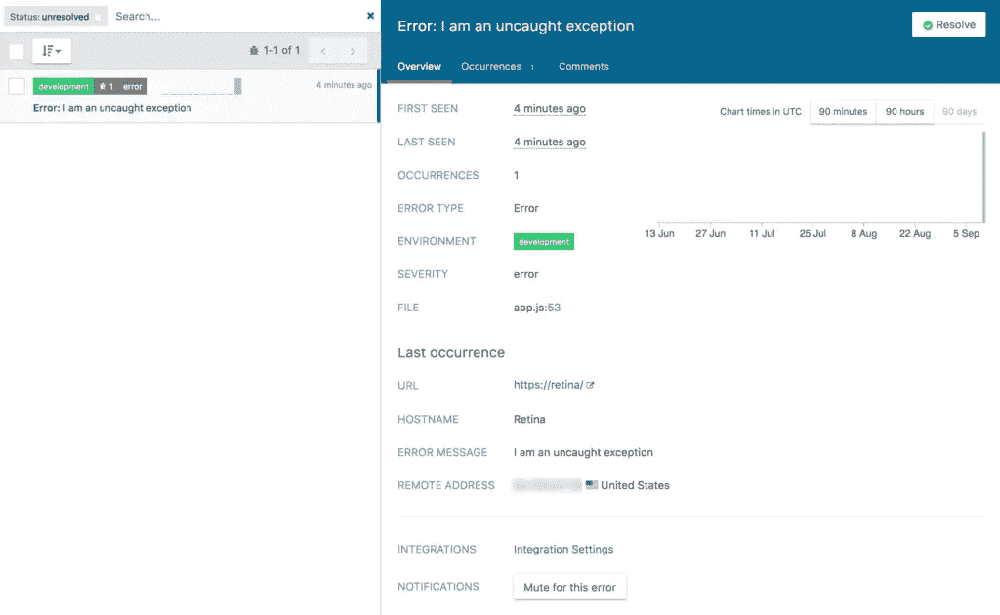
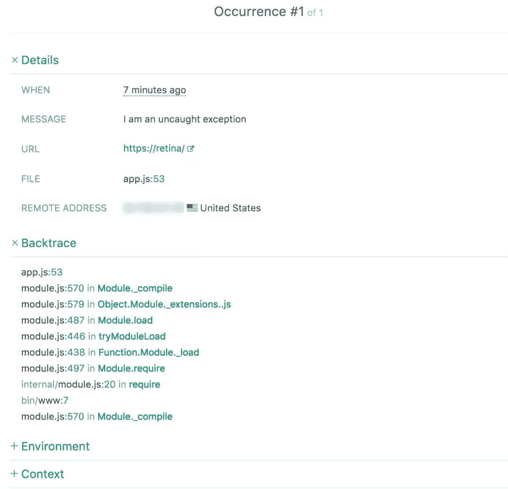
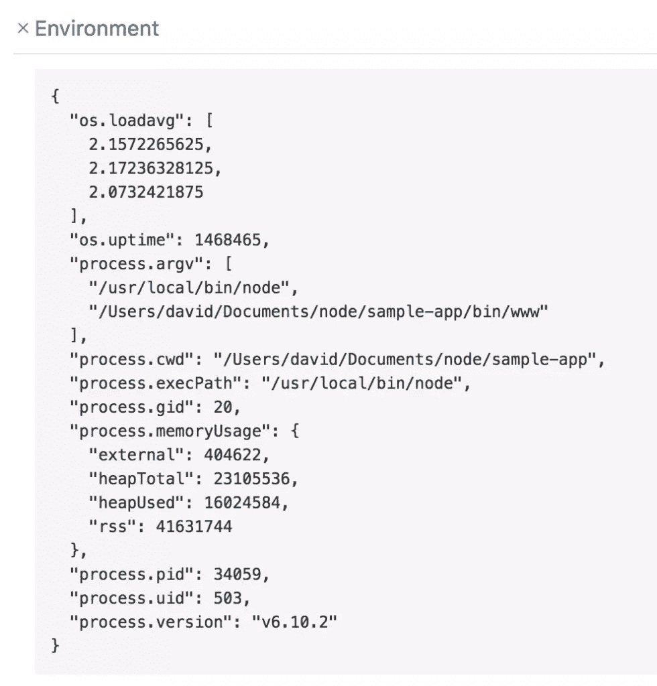
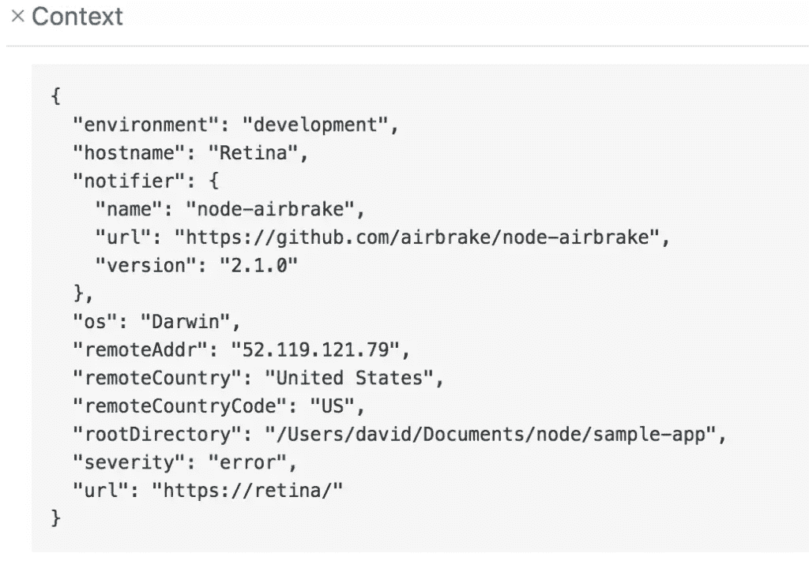

# 如何为您的 JavaScript 应用程序设置空气制动错误监控

> 原文：<https://www.sitepoint.com/how-to-set-up-airbrake-error-monitoring-for-your-javascript-app/>

*本文由[空气制动](http://synd.co/2wyaRGy)赞助。感谢您对使 SitePoint 成为可能的合作伙伴的支持。*

在将代码投入生产环境之前，我们都非常小心地测试我们的代码，对吗？我们使用测试驱动的开发或者构建单元测试、功能测试和集成测试的优雅套件。我们在所有可能的环境中运行我们的产品，在这些环境中，每次我们对代码进行更改时，产品都可能被重复部署。我们测试了用户在所有可能的浏览器上可能遵循的每一条路径。

对吗？

好吧，没人是完美的。但至少我们的用户总是很努力地报告他们遇到的每一个错误，并提供关于如何重现这些错误的详细信息，以便于跟踪和修复。

对吗？

是啊，我不这么认为。

## 错误监控到救援！

令人欣慰的是，有一些服务可以帮助我们诊断和解决在我们勤奋的质量测试过程中可能出现的问题。

我说的是远程错误监控服务。如果你以前没有听说过它们，远程错误监控服务可以在用户有机会提交模糊或误导性的错误报告之前，实时跟踪和报告用户遇到的实际错误。

此外，它们可以为您提供一系列关于错误如何发生的有用细节:用户运行的浏览器版本、登录的帐户、使用的操作系统、任何会话数据、错误本身的回溯，以及您可能插入到代码中以帮助识别问题的任何自定义标记。

## 错误监控入门

市场上有许多服务和选择，但一个很好的综合服务是 [Airbrake.io](http://synd.co/2wyaRGy) 。它们在互联网时代已经存在了很长时间，所以你可能会记得它们在 2011 年改名之前的名字是 Hoptoad。

Airbrake 还支持非常广泛的后端和前端语言和环境，从 Ruby 和 PHP 到。它们还提供了与大多数流行的代码管理和部署服务的本机集成，如 GitHib、JIRA、Bitbucket 和 Slack。很可能不管你在做什么，他们都有你需要的工具，可以让你快速轻松地开始。他们的报告界面也很简洁，易于导航，因此您可以从部署的生产代码中快速生成可操作的信息。

在您的产品中实现 Airbrake.io 代码非常简单。首先，你可以在 Airbrake.io 上创建一个帐户，前 14 天免费，试用期内不需要信用卡。

当您创建您的第一个项目时，您将获得一系列选项，其中包含 20 多种语言的预写集成代码。举个例子，假设我们想端到端地使用 JavaScript，并在后端有一个基于 Express 的 Node.js api 服务。

## 监控快速应用程序

让我们设置一个简单的例子来展示将错误监控与空气制动集成在一起是多么容易。假设我们已经安装了 node，在终端中，我们可以创建一个简单的 Express 应用程序来使用 Express Generator 进行监控，我们可以使用 yarn 或 npm 来安装它:

```
yarn global add express-generator 
```

然后我们可以运行它来创建一个基本的 Express 应用程序:

```
express sample-app 
```

然后`cd`进入创建的目录，运行`yarn`(或者`npm install`，安装我们的依赖项

```
cd sample-app
yarn 
```

然后运行`node bin/www`来启动我们的服务器，可以选择在命令的开头用`PORT=####`设置一个端口。(如果我们不指定端口，节点将默认为端口 3000。)

```
node bin/www 
```

现在，如果我们在浏览器中导航到`http://localhost:3000`，我们会看到一个基本的 Express 应用程序，上面写着“欢迎使用 Express”



您可以将 Airbrake 添加到您的依赖项中，或者使用 yarn 或 npm 来安装 airbrake。我们的 Express 应用程序中已经有了一个`package.json`文件，所以我们可以简单地在依赖项的底部添加一行，指定 airbrake 和目标版本:

```
{
  "name": "sample-app",
  "version": "0.0.0",
  "private": true,
  "scripts": {
    "start": "node ./bin/www"
  },
  "dependencies": {
    "body-parser": "~1.17.1",
    "cookie-parser": "~1.4.3",
    "debug": "~2.6.3",
    "express": "~4.15.2",
    "jade": "~1.11.0",
    "morgan": "~1.8.1",
    "serve-favicon": "~2.4.2",
    "airbrake": "^2.1.0"
  }
} 
```

当然，当前的版本号和特定的依赖项在这个文件中可能已经改变，但是概念是相同的。他们的关键是添加空气制动，在这种情况下，作为最后一行的依赖。一旦这个文件被更新，我们可以在我们的主应用程序目录中再次运行`yarn`(或`npm install`)来更新我们的应用程序。

```
yarn 
```

现在，我们需要做的就是在定义了变量`app`之后，在应用程序源文件`app.js`的顶部附近添加示例 Express airbrake 代码。Airbrake 可以利用早在 2.x 的 Express 版本提供的内置错误处理。

```
var airbrake = require('airbrake').createClient(
  '<YOUR_AIRBRAKE_PROJECT_ID>',
    '<YOUR_AIRBRAKE_API_KEY>'
);
app.use(airbrake.expressHandler()); 
```

Airbrake 将为您提供一个项目 id 和一个 api 密钥，并在您登录帐户后将它们包含在他们提供的示例代码中。现在，通常由 Express 捕获的错误，以及您的代码可能生成的任何其他错误，将由 Airbrake 捕获和跟踪。

## 检查我们的错误监控

例如，让我们看看 JavaScript 抛出错误时会发生什么。我们可以添加代码，在我们的`routes/index.js`文件中的默认路由处理程序中抛出一个`new Error`来触发一个 JavaScript 错误，并查看它是如何被跟踪的:

```
var express = require('express');
var router = express.Router();
/* GET home page. */
router.get('/', function(req, res, next) {
  res.render('index', { title: 'Express' });
  throw new Error('I am an uncaught exception');
});
module.exports = router; 
```

如果这是一个常规的生产站点，当主页生成该错误时，我们首先注意到的可能是来自 Airbrake 的电子邮件消息，或者可能是 Slack 或其他一些受支持的警报系统中的通知。Airbrake 可让您轻松定制各种警报的发送频率、发送位置以及触发通知的事件。

使用默认帐户设置，我们将在开发人员的帐户上收到一封电子邮件，其中概述了所发生的错误。在这种情况下，它会包含一个警告，说明这是第一次遇到此错误。



接下来，我们可以访问我们的 Airbrake 仪表板，查看报告中反映的错误，以及许多有用的信息，包括我们创建的自定义消息、错误发生的时间、来源、特定的 url 和主机以及错误发生的次数。(目前为止只有一次。)



访问仪表板上的“Occurrences”选项卡将向我们显示服务器代码的回溯，以帮助我们调试代码中可能触发错误的时间和位置。



展开选项卡的“Environment”部分将向我们显示一些关于我们的服务器和错误发生时正在运行的进程的有用细节。



通过展开选项卡的“上下文”部分可以找到更多信息，告诉我们错误发生时脚本运行的操作环境。



## 你的应用程序的新好友

想象一下，你的整个用户群的错误覆盖率水平，跟踪用户在生产环境中遇到的应用程序的每个错误，并将结果制成表格。

您可以很容易地看到，在用户看不到您希望他们看到的内容的真实生产环境中，这种信息会有多大的帮助。感谢这些完整而详细的报告，想想你可以节省多少时间、金钱和挫折。

有了 [Airbrake 的远程错误跟踪](http://synd.co/2wyaRGy)，当你的应用程序出现问题时，你就不必等待你的朋友告诉你了。你已经知道了。

## 分享这篇文章