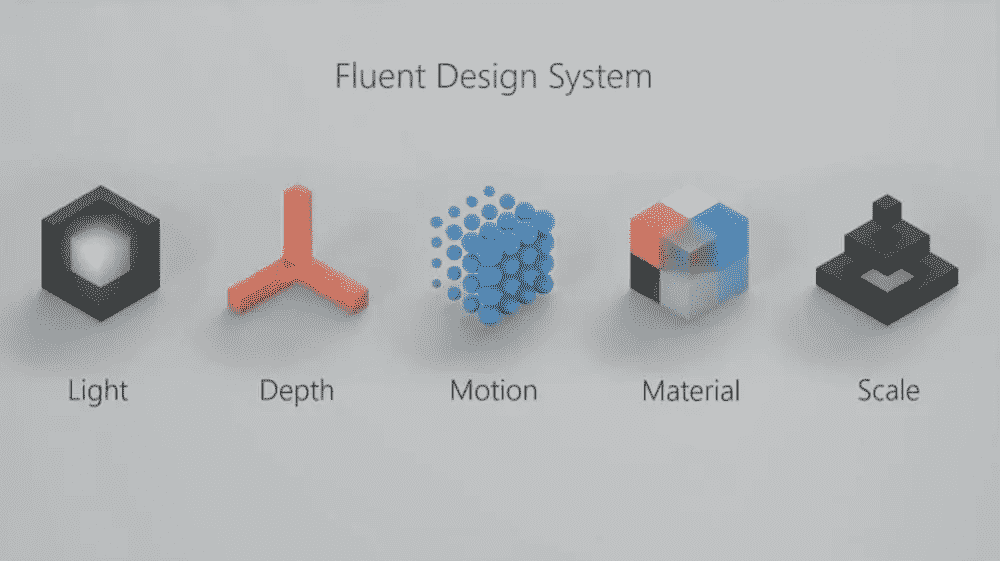
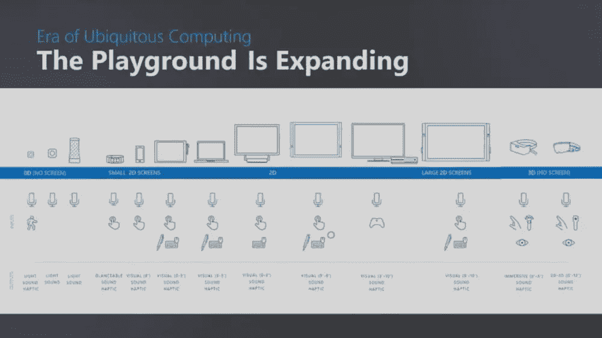
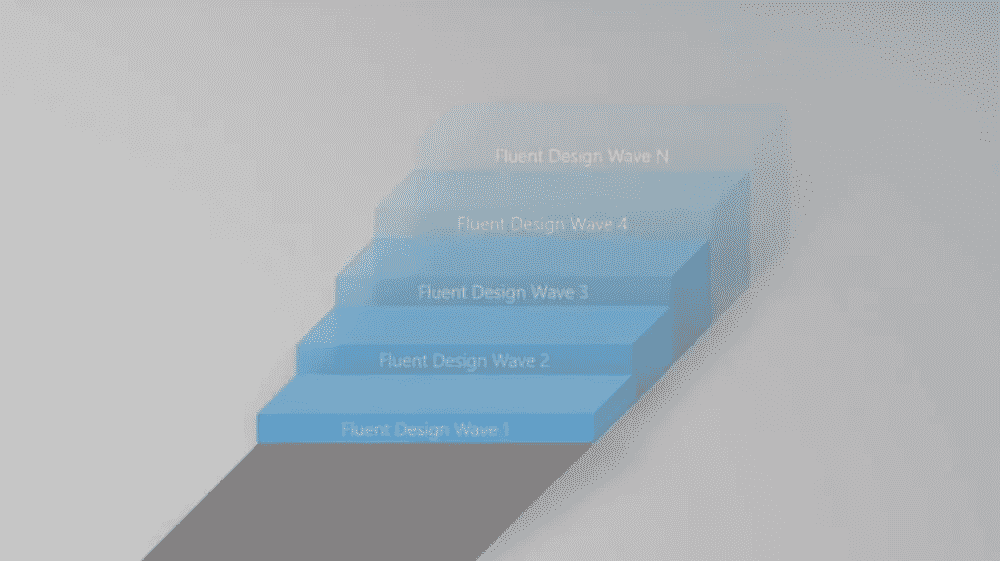
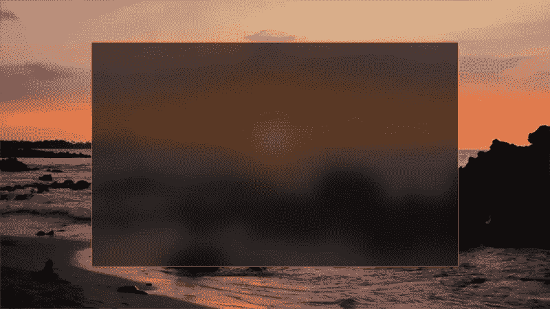
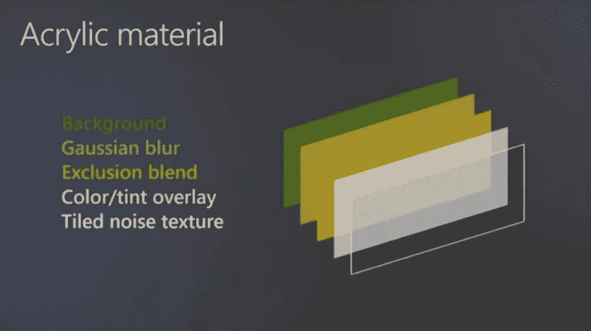
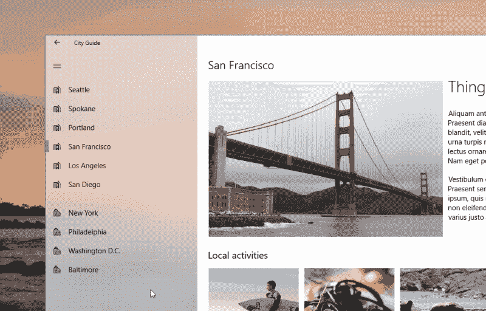
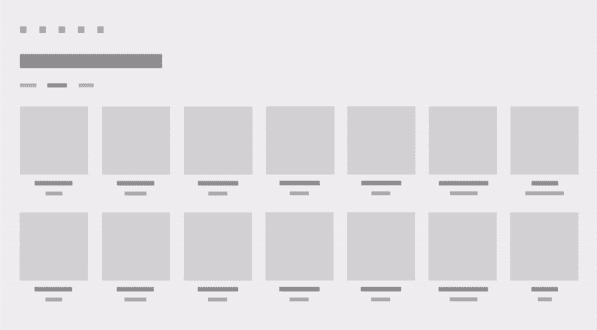

# 介绍微软的 Fluent 设计系统

> 原文：<https://www.sitepoint.com/introducing-microsofts-fluent-design-system/>

我们已经看到领先的公司实现了他们自己的设计语言，或者现有的语言，如谷歌的[材料设计](https://material.io/guidelines/)，为他们的用户提供更加统一、坚如磐石的用户体验。把设计语言想象成一个有良好文档记录的指南，用来创建具有直观、吸引人和一致外观的应用程序和网站。

微软最近发布了他们的 [Fluent 设计系统](https://fluent.microsoft.com/)，该系统旨在用于各种基于 Windows 10 的设备(*即通用 Windows 平台(UWP)应用*)。它旨在扩展已经存在的“微软设计语言 2”，非正式但被广泛称为“Metro”。还有，在撰写本文时，Fluent 设计系统的 80%已经集成到微软已经存在的 *web* 框架中，命名为微软 web 框架(MWF)。

虽然这是另一个时代的故事，但值得知道的是，Fluent 设计系统(我们将讨论)中概述的设计概念可以在 web 和应用程序中实现。让我们展示 Fluent 设计系统的主要特征，并熟悉其方法，以及开发人员如何将该语言应用到 Windows UWP 应用程序中。

***TL；…* 博士 **

如果你对 Fluent Design 感兴趣，并且你更愿意观看总结视频，这里是 Fluent Design 的官方[介绍](https://channel9.msdn.com/Events/Build/2017/B8066)和[在](https://channel9.msdn.com/events/Build/2017/B8034) [Build 2017](https://build.microsoft.com/) 活动上观看的用 Fluent Design 构建令人惊叹的应用视频。

*应该注意的是，Fluent 设计系统正在积极开发中，因此随着设计语言的发展，一些设计原则和功能可能会发生变化。请务必查看官方文档以获取最新信息。*

## 设计概念和原则

我们生活在智能设备时代，智能设备超越了台式机、笔记本电脑或平板电脑，包括任何具有网络功能的设备(即可穿戴技术等)。其中许多设备(如智能手机)都捆绑了不同尺寸和分辨率的屏幕，而其他设备(如传感器)则不提供显示屏。微软的目标是让他们的设计语言适应所有这些类型的设备。

微软新的 Fluent 设计系统基于以下五个基本要素。每一个元素都给用户界面和 UX 带来了独特的外观和感觉。

*   **灯**:在选择和导航时增强用户导向，为用户引导创造必要的氛围。
*   **深度**:利用 z 轴为 2D 显示器增加一个额外的维度，这是一种平面设计的修正，增加了层，元素的堆叠和 10000%的清晰度。
*   **动作**:在元素之间引入平滑、自然的过渡，以及在窗口和屏幕之间的无缝切换，让用户感觉每个动作都是连续的。
*   **材质**:赋予元素专属的手感和触摸体验，诱惑用户互动。
*   **规模**:关注从 2D 到 3D 的各种设备的设计一致性和互操作性。

## 入门指南

让我们来看看通用 Windows 平台应用框架中采用的新特性，以及 [Fluent 设计系统概念如何帮助实现它们](https://docs.microsoft.com/en-us/windows/uwp/layout/design-and-ui-intro#uwp-and-the-fluent-design-system)。这四个特征是:

*   [亚克力](https://docs.microsoft.com/en-us/windows/uwp/style/acrylic)
*   [视差](https://docs.microsoft.com/en-us/windows/uwp/style/parallax)
*   [揭示](https://docs.microsoft.com/en-us/windows/uwp/style/reveal)
*   [连接动画](https://docs.microsoft.com/en-us/windows/uwp/style/connected-animation)

## [亚克力](https://docs.microsoft.com/en-us/windows/uwp/style/acrylic)

Acrylic 使我们能够将色调和不透明度应用于图形对象，并随后为 UI 提供了一种物化的外观，这种外观天生不依赖于纯色。对于开发者来说，它是作为一个 C# [画笔类](https://docs.microsoft.com/en-us/uwp/api/windows.ui.xaml.media.acrylicbrush)而存在的。同样值得注意的是，Fluent Design 采用了微软的[通用调色板](https://www.microsoft.com/en-us/design/color)，这是 Windows 应用程序中经常使用的一组不同的颜色。 [UWP 应用一般使用 48 色](https://docs.microsoft.com/en-us/windows/uwp/style/color)，而 Xbox 上推荐 21 种电视安全色。

如何应用设计概念:

*   **光**:光吸引用户的注意力。用微软的话说，这是“温暖而有吸引力的”，所以通过以一种*自然*的方式在前景和背景元素之间建立最佳对比，这是一种很好的照亮信息的方式。
*   深度:柔和的阴影允许分层的元素，创造一种视觉层次感。
*   **动作**:明亮和谐的 UI 过渡。
*   **材质/比例**:适用于各种尺寸和分辨率的显示器，在整个窗口中提供自然一致的感官视觉风格。

## 视差

视差正在成为一种越来越流行的建立深度的技术，当用户滚动内容时，两个或更多的对象需要以不同的节奏移动。如果处理不当，视差对于用户来说可能是一种非常糟糕的体验，尤其是在没有必要实现这种体验的时候。流畅的设计让我们可以小心处理。

如何应用这些概念:

*   深度:通过设计新兴和次级元素，我们可以创造出深度和沉浸感。
*   **动作**:结合 UWP 框架的[连接动画](https://docs.microsoft.com/en-us/windows/uwp/style/connected-animation)特性，我们可以在赋予内容生命的同时，创造出感觉自然、令人期待的滚动效果。

## 揭示

Reveal 是一种使用照明来帮助用户在 UI 中导航的效果。顾名思义，它不仅可以显示隐藏的元素和边框，还可以通过突出显示来帮助确认用户的选择。

如何应用这些概念:

*   **光**:与亚克力特性一样，reveal 使用光来突出用户的选择，并显示隐藏的边框和元素。
*   **深度**:您将使用深度来访问*层*中的隐藏内容，以相关和上下文的方式显示内容。
*   **材料**:展示元素的材料观将为选择和导航体验提供一种有趣的感觉。
*   Scale : reveal 是一种自适应行为，在各种屏幕尺寸上都有意义，尤其是在 Xbox 上，用户习惯于沉浸式、动画和分层的体验。

## 连接动画

几十年来，页面到页面导航一直是导航用户界面的传统方式。Fluent Design 试图改变这种情况，使用他们新的连接动画功能，在用户通过一系列微交互从一个状态到另一个状态制作动画时保持无缝连续性。

如何应用这些概念:

*   **深度/运动**:通过使用光线、运动和材料，我们可以建立一个视觉层次，将用户的注意力吸引到下一个逻辑步骤，消除混乱，创建用户可以流畅交互的协调元素。在任何阶段，用户都将知道他们做了什么，为什么要这样做，以及他们下一步需要做什么，这一切都是因为直观的动画使用视觉故事来建议接下来的步骤。
*   **比例**:连接动画的使用方式，无论输入(鼠标、触摸屏等)如何，都能让用户感到舒服。

## 结论

虽然有各种不同的设计框架可供选择，但知道选择哪一个很大程度上取决于受众。当涉及到设计*跨平台*应用时，那么它可能是实现几个不同设计系统的情况，例如[苹果 iOS/macOS 的人机界面指南](https://developer.apple.com/ios/human-interface-guidelines/overview/design-principles/)，[谷歌 Android 的材料设计](https://www.sitepoint.com/free-material-design-css-frameworks-compared/)，当然还有微软运行 Windows 的设备的 Fluent 设计系统。

流畅的设计不仅在两个已经建立的系统化代码框架(应用程序的[UWP](https://docs.microsoft.com/en-us/windows/uwp/get-started/whats-a-uwp)和网络的 T2【MWF】)的基础上勾勒出坚实的设计概念，而且它们的工作方式让 Windows 用户有意义，就像 iOS 应用程序以非常类似 iOS 的方式工作，Android 应用程序以非常类似 Android 的方式工作。

通过将 [Fluent Design](https://fluent.microsoft.com/) 中概述的五个设计概念——光线、深度、运动、材料和比例——与 UWP 应用框架中添加的新功能相结合，我们可以设计出直观、无缝的体验，帮助用户像解释现实生活中的物体和交互一样轻松地解释界面。

## 分享这篇文章