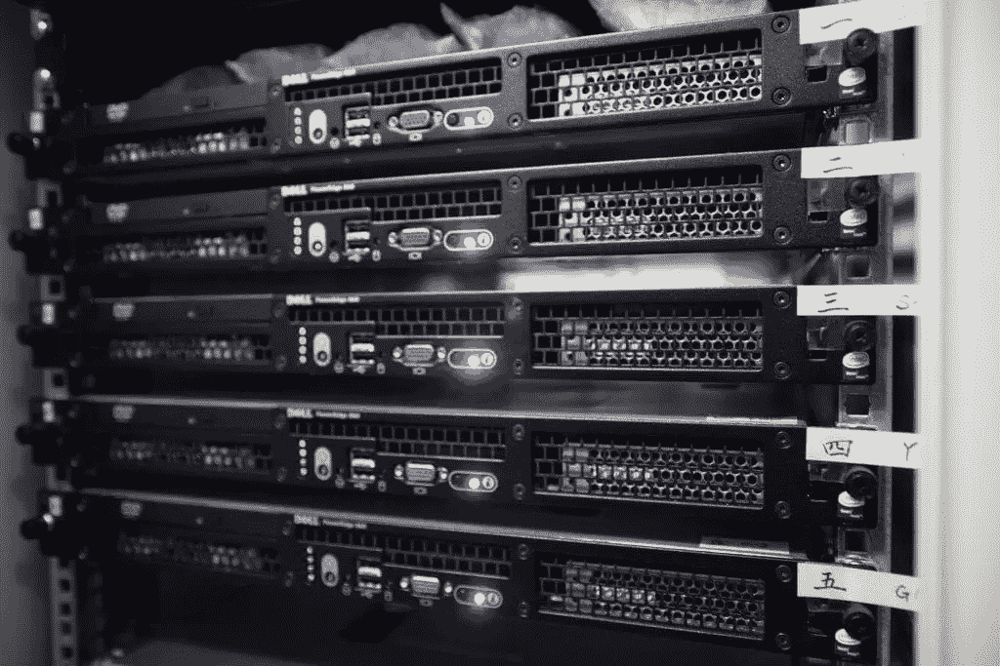

# 共享和云托管的比较，以及如何选择

> 原文：<https://www.sitepoint.com/shared-vs-cloud-hosting-how-to-choose/>

你是否一直听说云托管，并想知道它与常规托管计划有何不同？也许你刚刚建立了一个新的网站，并想知道是否应该尝试一下云计算？

相比常规的共享托管方案，云托管是一种更可靠、可扩展和安全的选择。但是共享主机通常更便宜，也更容易安装。

在本文中，我将涵盖从控制面板选项、迁移问题以及每个选项的优缺点在内的所有内容。我们将会看到每个选项的内容，希望如此！—帮助您决定是坚持共享主机更好，还是应该转向云计划。

## 从前在一个共享托管计划上…

传统上，当我们需要把一个网站放在网上时，我们会买一个域名，得到一个托管计划，然后把网站从我们的电脑 FTP 到网络上。我们变得如此习惯于它，以至于它成了我们的第二天性。

我们通常会有一些功能，如非常全面的控制面板，统计数据，以及在该帐户上注册的域名的电子邮件托管，等等。但是也有一些硬性限制，比如一定数量的磁盘空间、给定的带宽以及 CPU 和服务器内存的一部分。

对于许多小册子、作品集、博客和小型商业网站来说，这已经足够了。但对于很多企业来说，这并不理想。即使对于一个维护几个简单网站的自由职业者来说，也有可能不时耗尽某个网站的资源。(被客户问为什么网站关闭了，这一点都不好玩。)

### VPS 和专用服务器

升级的一种方式是以 VPS(虚拟专用服务器)的形式购买一个更大、稍微贵一点的计划，并提供更多的资源。如果这还不够，你可以租一台专用服务器，也就是说，托管公司数据中心的一个完整机架。

[布鲁诺·科迪奥利拍摄的图片](https://www.flickr.com/photos/br1dotcom/4297736794)

有了专用服务器，你可以在一个非共享的环境中获得所有的服务器资源，比如说每月 100 美元。是的，大约比基本的共享主机方案贵 20 倍——但是，嘿，你想要全部，不是吗？

无论你是坚持共享主机，还是进入虚拟主机或专用服务器的世界，它可能都工作得很好，你可能从来没有考虑过尝试其他任何东西。然而，信不信由你，现在有一代 web 开发人员几乎不知道 FTP 是什么，因为他们从来没有使用过它。

## …然后云托管计划出现了

当亚马逊网络服务(AWS)首次推出时，一切都是新的，似乎你需要参加一个强化课程，才能开始使用这个云基础设施。

但自那以后，情况发生了变化。不仅有更多的提供商出现，也有更多可以开箱即用的解决方案，包括云托管。

### 特征

“云”意味着，不知何故，你的站点并不局限于一台服务器，而是分布在多个地点和数据中心；你不是租用一个“CPU”和一定数量的磁盘空间和内存，而是按需访问一个巨大的资源池。

这带来了许多创新。一方面，你不再需要担心耗尽**资源**，因为当你需要它们的时候，你可以得到你需要的那么多。

在共享托管环境下，您可以根据自己的需求扩展到尽可能多的可用硬件。在云上，您可以根据需要从 2 个 CPU 跳到 10 个、100 个、1000 个，然后再回到 2 个。

你的存储需求也是如此:你可以上传和存储你需要的任何东西。当然，你以后会为此付费，但你永远不会达到硬性限制，此外，你可以只为你正在使用的资源支付*而不是闲置资源。*

云主机相对于常规主机的另一个巨大改进是**延迟**——也就是发送一个请求(“我想看这个页面”)直到它被处理并返回给你(“当然，在这里”)所花费的时间。因为云是*分布*到全球的几个数据中心的(你应该向你的提供商查询确切的位置)，请求被透明地路由到最近的地点。

伊利诺伊州芝加哥站点的访问者可能会有很低的延迟(低就是好)，因为附近有一个数据中心。但有了云托管，俄罗斯圣彼得堡的游客如果也在数据中心附近，也能体验到快速加载。

在安全性方面还有另一个优势。通过云托管，数据分布在不同的地方，通常不完全是常规文件，而是不断检查完整性的“数据包”。因此，数据损坏(硬盘崩溃)是你完全可以忘记的事情。此外，由于其巨大的分布式资源池的本质，基础设施本身对 DDoS 等攻击更具弹性。

因此，过去需要花费大量精力和成本来实施的相当复杂的任务，如**负载平衡**、**镜像**、**数据安全**，都在云的帮助下得到极大的简化。

### 好吧，但是它是如何工作的？

租用云托管服务与获得专用服务器非常相似，因为您获得了需要设置的服务器。

然而，许多提供商提供带有预设配置的“图像”,比如托管 WordPress 站点、游戏点、数据库集群或处理中心。所以你只要从控制面板上打开一个“Ubuntu Server 16.04 with WordPress”的图片，一两分钟后你就可以启动并运行了。(好奇这是怎么回事？查看[了解 Docker、容器和更安全的软件交付](https://www.sitepoint.com/docker-containers-software-delivery/)。)

### 提供者

从技术上来说，你可以获得像 AWS 或类似的云计算服务，并为自己构建云托管解决方案，设置自己的服务器、存储、数据库，甚至网络。然而，我们将跳过所有这些，专注于已经针对云托管的服务。

这绝不是一个全面的列表！

*   **[亮盒](https://www.brightbox.com/)** 。"为坚持 100%正常运行的团队提供简单灵活的英国云托管服务."
*   **[科德罗](http://www.codero.com/)** 。极具竞争力的[云托管](http://www.codero.com/cloud-hosting)配置(起价 5 美元/月)，有大量选项。
*   **[数字海洋](https://www.digitalocean.com/)** 。一家非常受欢迎的云计算公司，提供非常易于使用的控制面板，用于快速设置，以及非常[一个拥有大量文档的大型活跃社区](https://www.digitalocean.com/community/)，这是一个很大的优势。
*   。另一个完全基于云的服务“为系统管理员、开发人员和工程师提供托管服务”
*   。这家受欢迎的共享主机公司也有[云主机服务](https://www.hostgator.com/cloud-hosting)。
*   **[Kyup](https://kyup.com/)** 。Linux 容器上的可扩展云托管，价格低至每月 10 美元。
*   **[李诺德](https://www.linode.com/)** 。“闪电般快速的固态硬盘服务器，每月仅售 5 美元。”很难有比这更有竞争力的了！另外:还有非常广泛的文档和活跃的社区。
*   。他们的[云 VPS 服务器](https://www.vps.net/products/instant-servers)实现零宕机的“1000% SLA”。

#### 高端

也有其他公司提供“托管”服务；也就是说，后端很可能是 AWS 或 Google Cloud，而前端是第三方网站，你甚至可以打电话给你的客户经理提出特定的配置请求，他们会负责为你设置、执行更新等。自然，这些是更高端的解决方案，因此预计价格会更高。

提供这些服务的公司:

*   提供各种支持，包括应用管理。
*   **[MediaTemple](https://mediatemple.net/)** 在亚马逊上提供了[完全托管的云托管，在 AWS](https://mediatemple.net/managedcloud/) 上提供了[企业 WordPress 托管。](https://mediatemple.net/wordpress-cloud-hosting/)
*   **[RackSpace cloud](https://www.rackspace.com/cloud)** 管理 AWS、微软 Azure、OpenStack Cloud 和 VMWare 的服务。
*   **[SiteGround](https://www.siteground.com/cloud-hosting.htm?afcode=fede49d1072def2f644d030664beee6c&campaign=in-article)** 提供“快速、可扩展、全面管理”的云托管。
*   **[暴风点播](https://www.stormondemand.com/)** 提供[云服务器](https://www.stormondemand.com/servers/)与[不同级别的管理](https://www.stormondemand.com/servers/support.html)。

### 推荐主机

[Fast. Scalable. Fully Managed Hosting.](https://www.siteground.com/cloud-hosting.htm?afcode=fede49d1072def2f644d030664beee6c&campaign=in-article)SiteGroundNeed a web host that offers fast performance, fantastic tools for web geeks, best in class support and incredibly reliable hosting? Go for SiteGround.

### 同一片天空上不同的云

正如你所知道的，“云”实际上是一个非常广泛的可能性，不仅适用于托管，还适用于许多其他事情。要了解更多信息，请查看这些配套文章:

*   AWS、谷歌云和 Azure 的对比。
*   [云存储:在 Dropbox、Drive、S3 等之间选择](https://www.sitepoint.com/cloud-storage-for-you-and-your-business/)(注意，“存储”是一种特定的托管类型，就像“归档”是一种特定的存储一样。)

## 现在等等…一个混血儿诞生了

让我们谈谈**软件即服务** (SaaS)。基本上，任何以某种方式取代桌面或移动应用程序的网站，只要运行网站的软件是服务本身，都属于这一类。它可以是任何网络电子邮件服务，或照片编辑网站，或在线日历，或在线*【在此输入你的应用类型】*。甚至主机本身也可以集成到 SaaS 产品中。

取。这是一个网站，一个完全的新手可以在几分钟内创建一个非常专业的网站。我们不是在谈论上传模板，或者设置插件:这些都已经被处理好了，你只需要加载一些内容并支付托管费用。基本上，它是如此易于使用的软件，以至于它让世界上许多“网络专业人士”失业了…这是有道理的！谁会花 700 美元在一个月内从一个有点不可靠的开发者那里得到一个有几个 bug 的网站，而你现在可以以每月 16 美元的价格在网上得到这个东西——结果可能看起来更好？(是的，网络在变化，你现在必须增加更多的价值！)

**[【WordPress.com】](https://wordpress.com/)**——非常著名的开源博客软件[【WordPress.org】的商业托管服务——是这种商业模式的另一个例子:你负责内容，他们负责其他一切。WordPress.com 意识到，开发人员会非常乐意](https://wordpress.org/)[为托管计划](https://wordpress.com/pricing/)付费，以获得他们已经喜欢并从 WordPress.org 软件中了解到的一些强大功能(甚至包括，到目前为止，上传插件和主题)，同时让更新、托管、镜像、全球分发之类的事情由其他人处理([automatic](https://automattic.com/))。

不，我们没有跑题。鉴于我们在这里讨论的是托管，所有这些都变得相关了。你可以在云中进行托管，同时解决更大的问题，比如更新、设置、正常运行时间等。

## 好，我们来对比一下！

|   | 共享主机 | 云托管 |
| --- | --- | --- |
| 管理 | 通常更简单，带有标准化的控制面板。 | 缺乏标准化，每个公司都有自己的 API 和接口。 |
| 资源 | 有限。 | 无限制。 |
| 可靠性 | 有点可靠，虽然预计会停机。 | 100%正常运行时间。 |
| 安全性 | 更新、补丁和升级需要单独解决。数据安全性差，易受 DDoS 攻击等。 | 更具弹性的基础设施、更好的数据安全性和托管服务。 |
| 可量测性 | 仅达到已经对用户可用的资源。 | 部署的无限可扩展性和自动化(DevOps 编排)。 |
| 互用性 | 完全可互操作:一个站点可以在大多数时间无缝地从一个主机转移到另一个主机，作为一个替代；只需要复制较小的设置问题。 | 某些云实现可能有自己的运行方式。使用像 Squarespace 或 WordPress.com 这样的混合服务，将一个网站转移到另一个服务器上可能会更加困难，甚至是不可能的。 |
| 成本分析 | 每月固定费率，无论什么资源或服务未使用(闲置)。 | 每月、每小时甚至每分钟；以便不被空闲的服务计费。 |

### 何时共享主机

如果你有简单的网站，静态的或动态的，访问量不大，你只需要在某个地方 FTP，那么共享主机仍然是你最好的选择。但是请记住，当 PHP/ASP 版本更新时(如果不是现在，那么在几年后)，事情很可能会变坏。不过好吧，可能到时候就不是你的问题了。

同样，如果你正在制作静态网站，并且确信这是一个有前途的行业，那么共享主机可能是你最好的选择。

### 何时云主机

如果你有稍微国际化的受众，如果你的网站可能会有大量的访问，如果你可能在某个时候需要一些额外的空间，额外的数据库 CPU，或者对你的共享主机体验有点不满意，那么考虑尝试一下云。

此外，我认为，如果你正在考虑 VPS 或专用服务器，你应该选择云。成本几乎是一样的，如果你恰当地管理你的资源，甚至会更便宜。几乎在每个方面你都会有更多的灵活性。

### 什么时候去 SaaS 主持

作为一名前端开发人员，你可以依靠 Squarespace 这样的服务来快速、紧密地定制一个符合客户需求的网站，通过调整欢迎屏幕、图片和样式表来增加额外的价值，使之与众不同。你可以完全忘记所有其他的事情，只需支付一点额外的托管费用(反正是你的客户支付的)。

作为一名程序员，你可以从 WordPress.com 中受益匪浅，因为你可以专注于你想给你的客户增加的价值(插件，定制，甚至设计),并且可以安心地不再需要处理维护工作——只需要每月支付很少的费用。

## 包裹

希望我已经阐明了共享和云托管的一些关键方面，它们之间的区别，以及它们在哪里提供最大的价值。

据统计，共享主机略有下降，而云似乎在扩张:

数据来源于[谷歌趋势](https://trends.google.com/trends/explore?date=all&q=shared%20hosting,cloud%20hosting)

这并不意味着共享主机计划将很快消失，但你可以看到一段时间以来的趋势。

所以，当选择托管时，不要只关注你现在需要什么，还要关注你以后可能需要什么。从这个角度来看，开始云托管通常有一个令人信服的理由。

## 分享这篇文章