# 如何用 Postman 掌握你的 API 工作流程

> 原文：<https://www.sitepoint.com/master-api-workflow-postman/>

构建好的 API 是困难的，任何有机会这样做的人都会有同感。一个项目很容易变得一团糟。人们可以不断尝试采用一种方法使之更令人愉快，比如尝试文档优先的工作流，但是总感觉有些笨拙。

我最近在试用 [Postman](https://www.getpostman.com/postman) ，这是一个我们之前[简要介绍过的工具](https://www.sitepoint.com/api-building-and-testing-made-easier-with-postman/)，我发现他们做得很好，为 API 的不同组件提供了一个集成环境，比如授权、测试、文档、版本等等。


在本文中，我们将介绍 Postman 提供的不同特性，以及我们如何组织这些特性来减轻 API 工作流的痛苦。

## 提出请求

发现 Postman 的第一步是发出一个简单的 API 请求并查看响应。

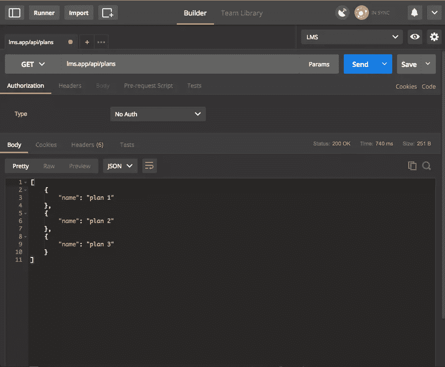

从上面的截图中，我们可以看到视图包含了不同的元素。顶栏包含请求方法(在本例中是`GET`)，紧挨着它我们指定了请求的端点。如果请求有一些参数，我们可以通过点击*参数*按钮来指定它们，这将打开一个输入它们的表格。准备好后，我们可以点击*发送*按钮来发起请求。

下一部分包含五个选项卡:

*   授权:指定如何授权请求。像`Basic Auth`、`OAuth2`等。
*   Headers:应该与请求一起发送的任何头。像`content-type`、`Authorization`等。
*   Body:请求类型的请求体，如`Post`、`PUT`等。
*   请求前脚本:在执行请求之前要执行的 JS 代码。(稍后详细介绍)
*   测试:验证响应有效负载的 JS 代码。

底部包含关于响应的所有细节(`status`、`time`和`size`)。这四个选项卡是自解释的，除了`Tests`，它包含测试结果(如果我们有测试结果的话)。

## 批准

正如我们在上面看到的，Postman 支持所有类型的授权。我们将重点关注通过头的令牌授权集。你可以在这里阅读更多关于授权的信息。

Postman 将使用的标题格式是:

```
Authorization: Bearer <TOKEN> 
```

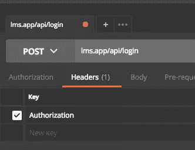

现在，我们将继续下去，并获得一个令牌，我们可以使用我们未来的请求。我正在测试我的一个开发中的应用程序，但是你可以使用你身边的任何应用程序，或者用 Laravel 快速设置一个，如这里所描述的。

*不熟悉 Laravel？试试我们的[高级课程](https://www.sitepoint.com/premium/courses/laravel-5-2930?aref=bskvorc)——这是一个全面的介绍，如果你在它的当前迭代中获得它，你将自动获得它的即将到来的更新版本！*

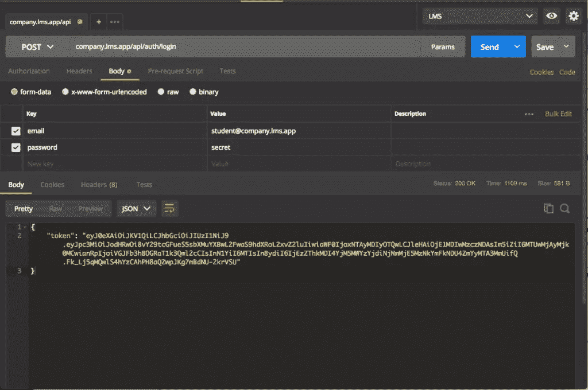

此时，我们有了一个令牌，可以作为经过身份验证的用户从 API 查询数据。然而，为每个请求复制和粘贴令牌是很繁琐的！

## 环境变量

这个漂亮的特性减轻了复制/粘贴的痛苦，并将我们的变量集中在一个地方。环境是一个执行上下文:我们可能有一个本地环境、测试、准备等。

Postman 对变量有不同的作用域:

*   全球的
*   环境
*   当地的
*   数据

除了选定的环境之外，全局变量在任何地方都可用。您可以在[文档](https://www.getpostman.com/docs/postman/environments_and_globals/variables)中了解更多信息。

我们现在至少需要三个变量:

*   `domain`:当前活动子域`company1`、`company2`等。
*   `url`:我们的 app 网址。
*   `token`:未来认证令牌。

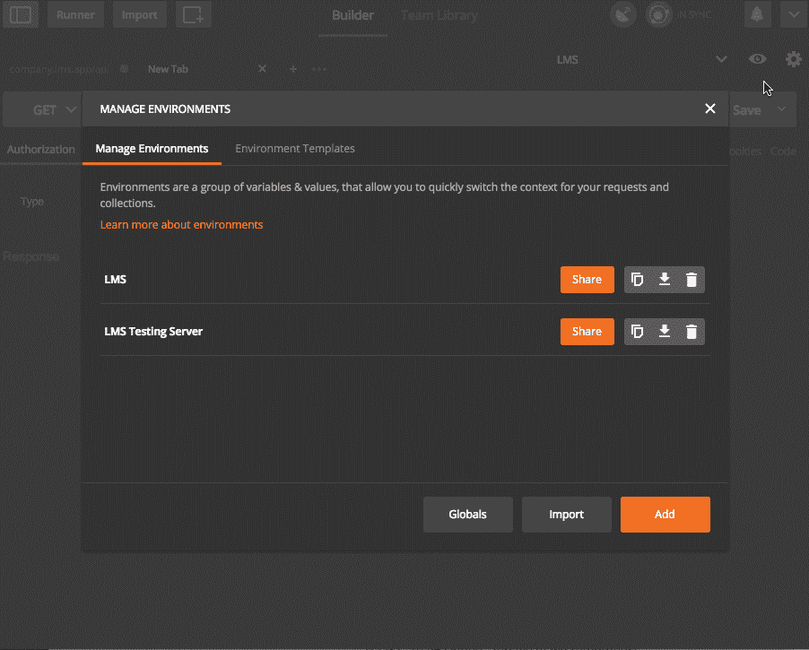

现在我们可以更新我们的登录端点来使用我们的新环境，但是首先我们需要从右上角的选择框中选择我们的环境。


我们可以在 URL、参数、测试等里面使用变量。但是我们现在如何使用我们的令牌呢？

我们有两个选择。第一种是复制令牌并将其作为令牌变量的值粘贴(这是我们试图避免的)。

第二种方法是通过请求完成后执行的代码来设置。这就是测试发挥作用的地方，让我们来看看它们是什么！

## 测试

当我们开发我们的应用程序时，我们需要确保我们在前进之前从 API 中得到正确的结果。使用测试，我们可以为我们的响应创建不同类型的验证。让我们从一些基本的断言开始。

在登录请求中，转到 tests 选项卡，键入以下代码并发送请求。

```
tests["Successful request"] = responseCode.code === 200; 
```

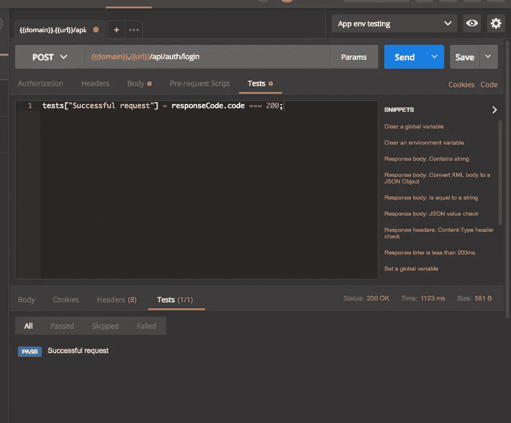

`responseCode`包含响应状态对象，所以我们用它来验证响应是一个 *200 OK* 。我们还有其他对象来验证响应体(`responseBody`)、响应头(`responseHeaders`)、响应时间(`responseTime`)。你可以在这里阅读更多关于测试脚本[的内容。](https://www.getpostman.com/docs/postman/scripts/test_scripts)

`tests`对象将保存一个布尔断言列表，该列表将用于决定一切是否按预期进行。然而，我们可以在这里添加任何我们想要的 JS 代码。例如，我们可以从响应中获取令牌，并将其设置在环境变量中！

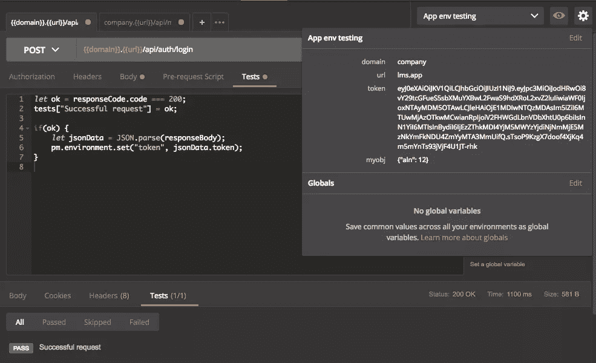

首先，我们测试状态。接下来，我们解析 JSON 的响应体并获取令牌。我们可以从环境变量视图中看到，令牌在我们的环境中设置正确。

### 使用控制台

这可能是显而易见的，但有时您需要摆弄一些对象或检查响应。您可以使用`cmd+alt+C`或`View > Show Postman Console`打开控制台。

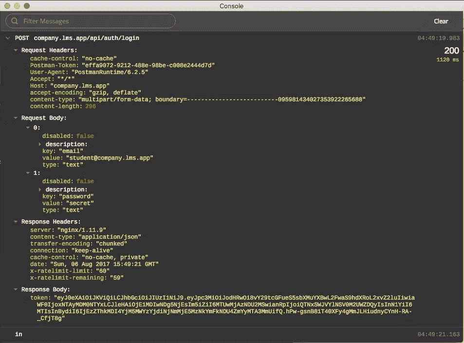

控制台记录请求和响应对象，并提供大量有助于调查问题的详细信息。

### 帮助库

从头开始用属性类型验证来验证响应和断言 JSON 结构之类的东西是很痛苦的。

Postman 包括一组有用的库，我们可以用它们来增强我们的测试。最值得注意的是 [Lodash](https://lodash.com/docs/4.17.4) 和 [tv4 JSON 模式验证器](https://github.com/geraintluff/tv4)。你可以点击查看完整名单[。](https://www.getpostman.com/docs/postman/scripts/postman_sandbox)

让我们首先继续测试登录端点，我们将做另一个复杂的例子来使它有用。

因为我们的登录端点只返回一个令牌值，所以我们可以测试该值是否在响应中设置。

```
let jsonData = JSON.parse(responseBody);
let ok = responseCode.code === 200;
tests["Successful request"] = ok;
tests["Token is set"] = _.has(jsonData, "token");

if(ok) {
    pm.environment.set("token", jsonData.token);
} 
```

一个更复杂的例子是测试资源是否被返回，因为对于这样的测试来说，这可能很快变成一场噩梦:

```
var data = JSON.parse(responseBody);
tests["Response OK"] = responseCode.code === 200;
tests["Data is OK"] = data.hasOwnProperty("data") && Object.isObject(data.data);

var requiredKeys = ["uuid", "student_number", "title", "first_name", "last_name", "email", "last_login_at"];

tests["Response structure is OK"] = _.every(requiredKeys, _.partial(_.has, data.data)); 
```

上面的测试断言资源键存在，并且响应状态正常。想象一下不得不一遍又一遍地做这件事！

这里的最佳解决方案是使用 *tv4* 来验证模式。

```
let courseSchema = {
    "title": "Course",
    "type": "object",
    "properties": {
        "name": {
            "type": "string"
        },
        "code": {
            "type": "string"
        },
        "uuid": {
            "type": "string"
        },
        "is_active": {
            "type": "boolean"
        },
        "is_free": {
            "type": "boolean"
        },
        "is_enrollable": {
            "type": "boolean"
        },
        "in_catalogue": {
            "type": "boolean"
        },
        "price": {
            "type": "integer",
            "minimum": 0
        },
        "total_duration": {
            "type": "integer",
            "minimum": 0
        },
        "cover_image": {
            "type": ["string", "null"]
        },
        "demo_video": {
            "type": ["string", "null"]
        }
    }
}

let jsonData = JSON.parse(responseBody);
tv4.addSchema("course", courseSchema);
tests["Response is valid"] = tv4.validate(jsonData.data, {
    "type": "array",
    "items": {
        "$ref": "course"
    }
}); 
```

上面的代码片段为我们的课程资源创建了一个模式。然后我们解析 JSON 响应并使用`tv4`验证器进行验证。

您可以在这里了解更多关于构建 JSON 模式的信息。

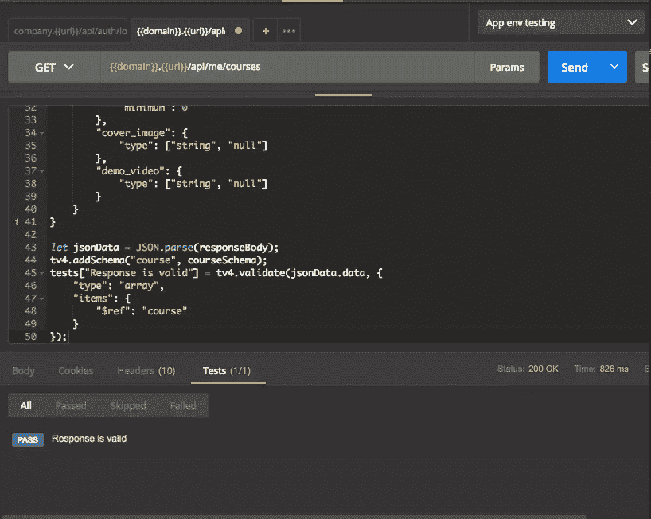

我们当前测试的问题是将模式从一个测试复制粘贴到另一个测试。为了避免这种情况，我们将模式存储在环境变量中，以便在其他地方重用。

注意:将 schema 这样的东西存储在环境变量中似乎有点奇怪。但这完全没问题，因为它们可以存储任何东西，并且不限于某些值。

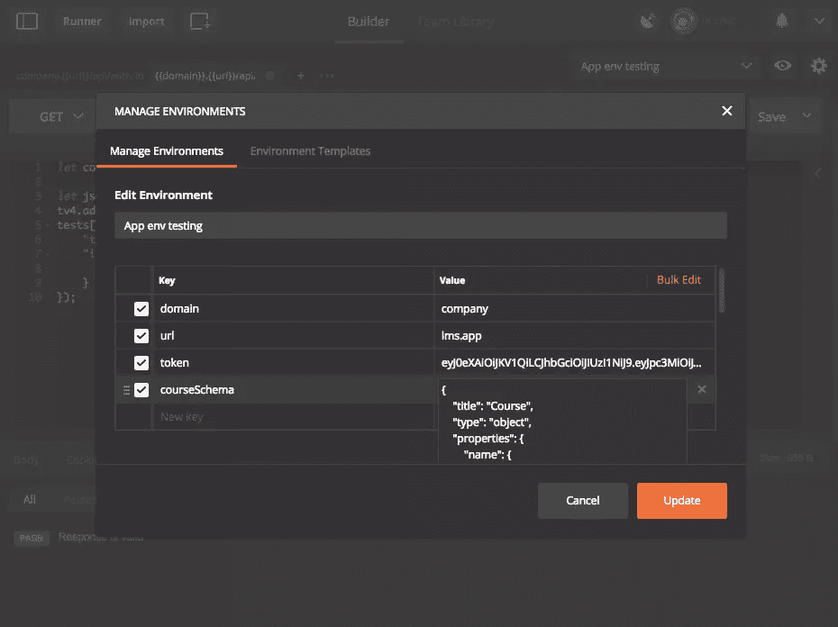

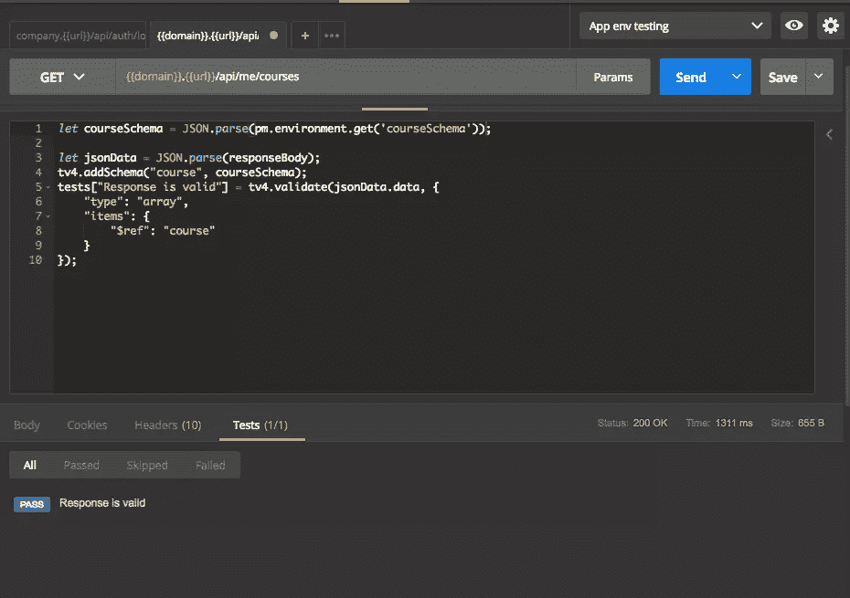

现在一切似乎都很好。然而，应用程序并不只有两三个端点！他们很容易变大，如果组织不当，将在不久的将来与我们对抗。

## 收集

收藏就像文件夹一样，用于将属于同一类型或类别的东西进行分组。[文档](https://www.getpostman.com/docs/postman/collections/creating_collections)为创建和管理集合提供了很好的解释，我们将尝试用例子做同样的事情。

我们可以通过转到左侧菜单并单击“新建文件夹”按钮来创建一个新的收藏。当提出新请求时，我们可以点击*保存*按钮，并为其选择一个文件夹。

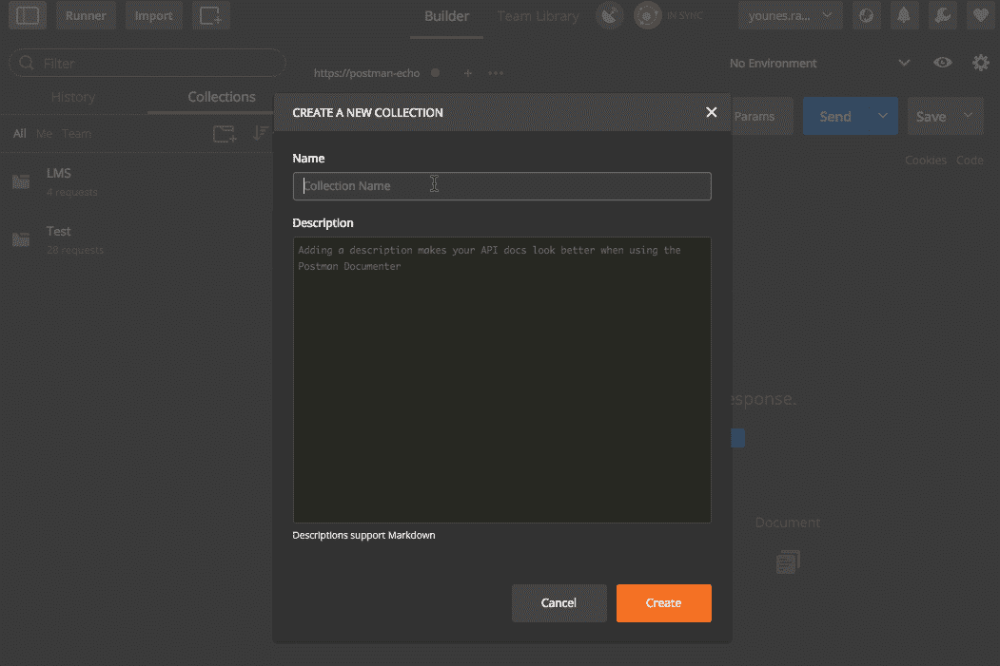

我们可能都同意简单的结构总是最好的，因为这些可以归类为集成测试，所以最好为特性创建文件夹。

在我们的应用程序中，我们有每个组织的课程列表，用户可以*注册*一门课程。然后他们应该能够在他们的课程列表中看到它。我们将为这个特性创建一个测试，并把它放在自己的文件夹中。但是我们怎样才能以正确的顺序运行这些测试来看到预期的结果呢？

### 测试集合

这是一个非常有趣的特性——它允许我们将请求和测试的执行链接起来，以实现一组良好的集成测试。这是我们的测试链:

*   获取身份验证令牌。
*   列出组织课程。
*   注册一门课程。
*   列出我的课程。

```
// Get auth token

var jsonData = JSON.parse(responseBody);

tests['Token is set'] = jsonData.hasOwnProperty('token');

pm.environment.set("token", jsonData.token);

postman.setNextRequest("List organization courses"); 
```

注意`postman.setNextRequest`方法调用。这就是我们如何告诉邮递员订购我们的测试。因此，它在获得令牌后运行“List organization courses”测试，我们可以传递 null 来结束这个链。

```
// List organization courses

let jsonData = JSON.parse(responseBody);
let courseSchema = JSON.parse(pm.environment.get('courseSchema'));

tv4.addSchema("course", courseSchema);

tests["Response OK"] = responseCode.code === 200;
tests["Data is OK"] = jsonData.hasOwnProperty("data") && Array.isArray(jsonData.data);
tests["Response is valid"] = tv4.validate(jsonData.data, {
    "type": "array",
    "items": {
        "$ref": "course"
    }
});

pm.environment.set('courseId', jsonData.data[0].uuid);

postman.setNextRequest("Enroll to a course"); 
```

`pm.environment.set('courseId', jsonData.data[0].uuid);`语句将从列表中获取第一个课程，并将其放入`enroll request`的环境变量中。

```
// Enroll to a course

tests["Response OK"] = responseCode.code === 201;

postman.setNextRequest("List my courses"); 
```

```
// List my courses

let jsonData = JSON.parse(responseBody);
let courseSchema = JSON.parse(pm.environment.get('courseSchema'));

tv4.addSchema("course", courseSchema);

tests["Response OK"] = responseCode.code === 200;
tests["Data is OK"] = jsonData.hasOwnProperty("data") && Array.isArray(jsonData.data);
tests["Response is valid"] = tv4.validate(jsonData.data, {
    "type": "array",
    "items": {
        "$ref": "course"
    }
});
tests["Enrolled course added"] = jsonData.data[0].uuid === pm.environment.get('courseId');

postman.setNextRequest(null); 
```

我们把所有的测试放在以我们的特性命名的文件夹中。

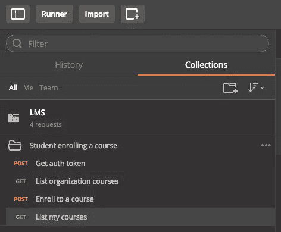

#### 运行集合

要运行我们的集合，我们转到左侧栏，单击右箭头打开菜单并选择 run。

我们可以选择运行整个集合，或者只运行一个文件夹。如果在运行测试时出错，我们可以打开 Postman dev 控制台来查看日志。你可以查看[文档](https://www.getpostman.com/docs/postman/collection_runs/starting_a_collection_run)来获得更多关于测试集合的细节。

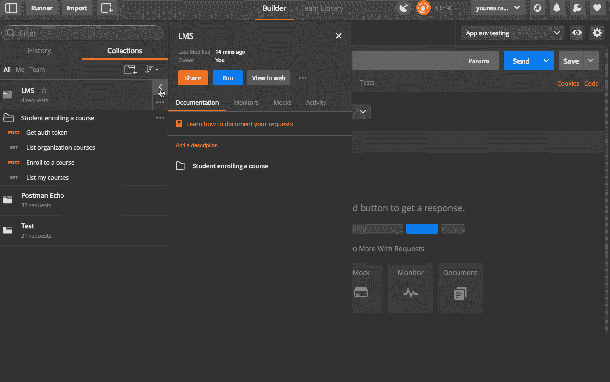

还有一个有趣的特性，可以用一些预定义的数据来运行集合。你可以在这里阅读更多关于那个[的内容。](https://www.getpostman.com/docs/postman/collection_runs/working_with_data_files)

## 证明文件

API 的一个重要部分是文档，Postman 在简化这个过程方面做得很好。

为了生成我们的文档，我们选择我们的收藏并点击`view in web`。这将打开我们的集合和请求的文档，我们可以浏览它来查看每个请求的细节——主体参数、头、方法等。你可以在这里阅读更多关于生成文档[的信息。](https://www.getpostman.com/docs/postman/api_documentation/intro_to_api_documentation)

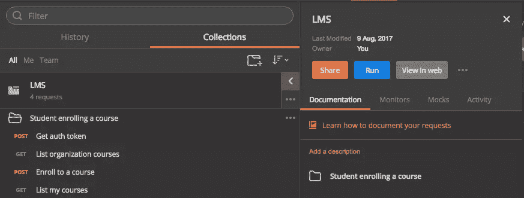

我知道您正在考虑在这里包含响应，Postman 开发人员已经想到了这一点。他们建立了在我们的文档中包含*示例*的能力。

### 使用示例

示例是响应片段，API 消费者可以包含这些片段，以查看他们从请求中获得了什么，而不必实际调用它。

当我们在 Postman 中执行一个请求时，我们可以点击`Save response`按钮并定义头、参数等。

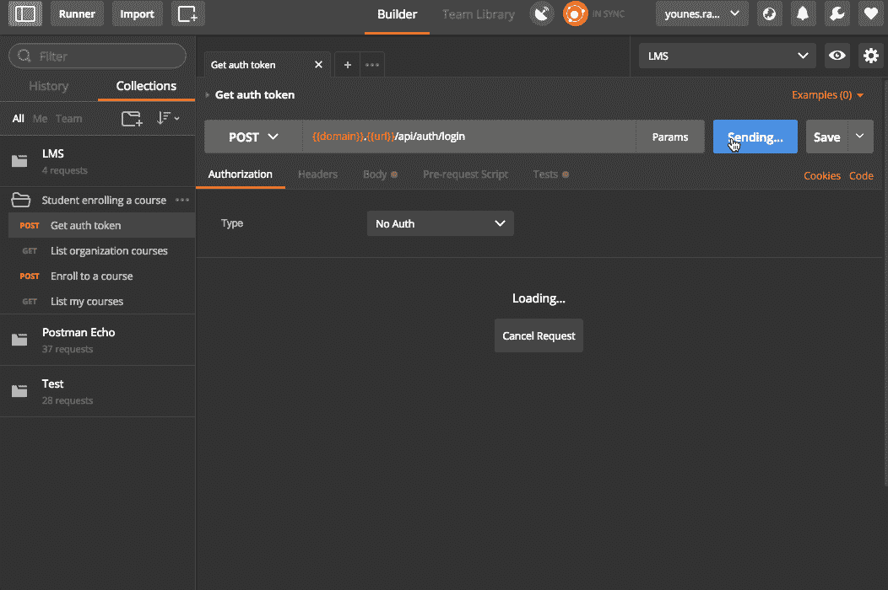

现在，我们可以回过头来查看我们在网上的文档，看看我们的例子。

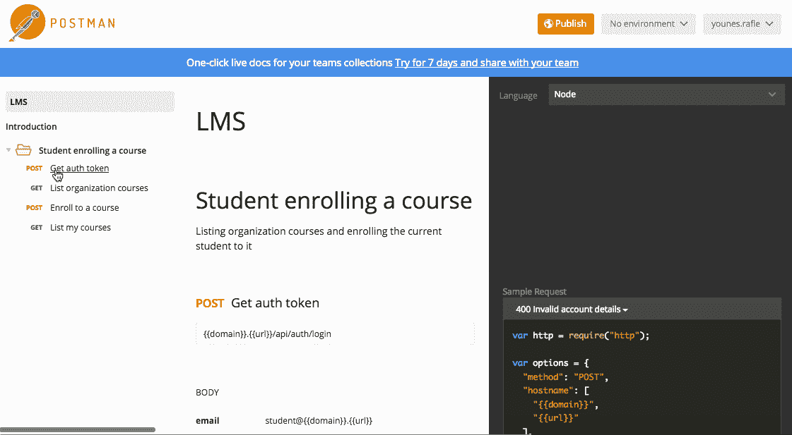

### 发布文档

文档不仅仅是我们的——它也是 API 消费者的，他们需要访问它，看看 API 的不同部分是如何工作的。Postman 有几种共享文档的方法。如果我们有一个 [pro 帐户](https://www.getpostman.com/docs/pro/what_is_pro)，我们可以共享私人文档并创建团队进行合作，但 Postman 也会生成一个共享链接，我们可以将其发送给其他人。

在查看文档页面上，我们在页面顶部有一个`Publish`按钮。

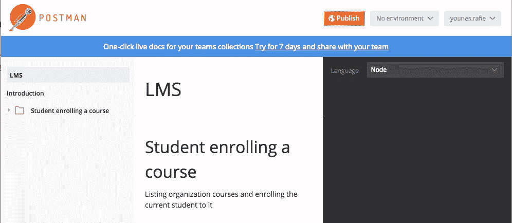

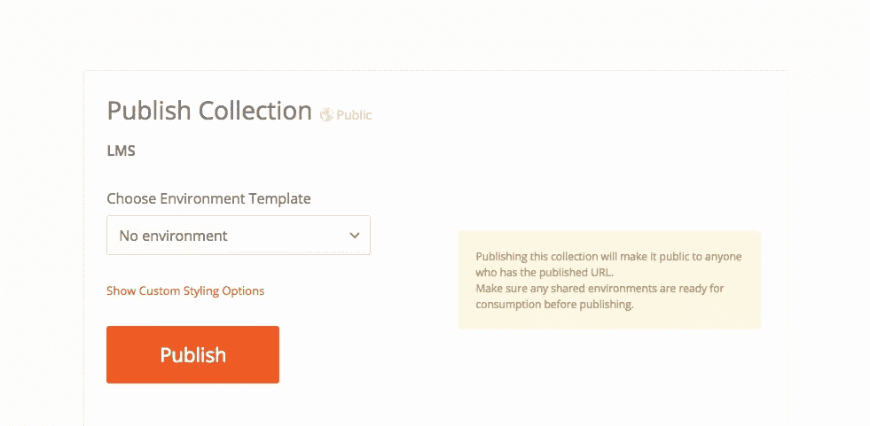

### 嘲弄的

在原型化应用程序和决定 API 结构时，模仿非常有用。对于团队来说，在就这些模拟达成一致后，每个人都可以开始各自的工作(后端、前端、移动等),并且只在一切完成后将环境切换到新的服务器。

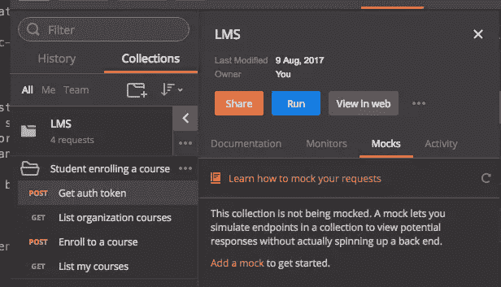
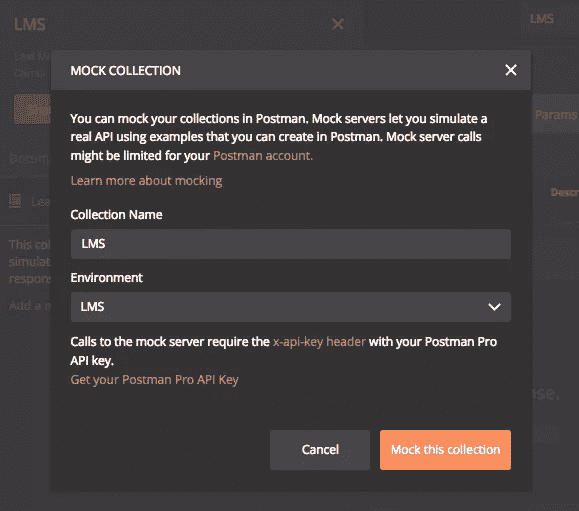


生成模拟服务器链接后，我们需要获取 Postman API 密钥进行身份验证。从第二个截图中，我们看到一个关于获取 API 密钥的*警告。所以继续点击`Get your Postman API key`链接并生成一个新的密钥。*

现在有了模拟 URL 和 API 键，我们可以像往常一样调用 API 端点。例:`<mockUrl/api/auth/login>`


嘲讽邮差是个大话题，你可以在这里阅读更多[，在这里](https://www.getpostman.com/docs/postman/mock_servers/setting_up_mock)阅读[。](https://www.getpostman.com/docs/postman/mock_servers/mocking_with_examples)

## 出口/进口

我们之前看到了如何与大学和消费者共享文档。然而，开发 API 的一个重要部分是共享环境、收集进度等。Postman 提供了导出和导入几乎所有内容的能力。

如果您有一个邮递员帐户，您可以轻松地与您的团队成员共享任何内容。然而，在测试这个工具时，我们仍然可以使用导出/导入功能来共享东西。

### 收集

要导出收藏，进入左侧栏的收藏列表，点击收藏菜单，然后点击*导出*。这将弹出一个选择导出格式的窗口，但这里建议选择`v2`。

要导入集合，请转到顶部菜单，单击`Import`，并选择要导入的 JSON 文件。

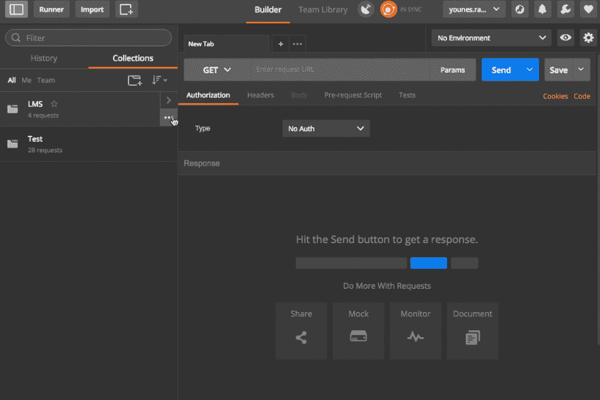

### 环境

对于集合也是一样，我们可以从`Manage Environments`菜单轻松地导出和导入我们的环境。

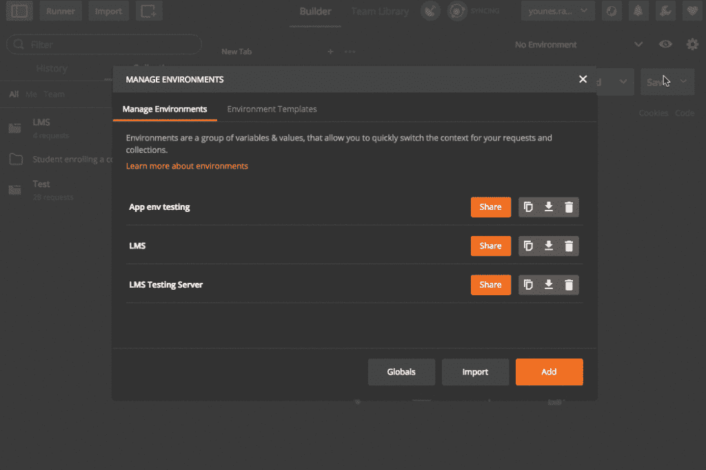

还有更多关于分享的内容我们无法在这里介绍，比如收集运行和其他你可以在[文档](https://www.getpostman.com/docs/postman/collection_runs/sharing_a_collection_run)中读到的特性。

## 有用的资源

*   https://www.getpostman.com/docs/
*   http://blog.getpostman.com/2017/07/28/api-testing-tips-from-a-postman-professional/
*   https://medium.com/@codebyjeff/using-postman-environment-variables-auth-tokens-ea9c4fe9d3d7

## 结论

我们学习了如何将 Postman 集成到我们的 API 开发工作流中，我们也探索了一些可用的特性，但是还有很多东西需要学习！一定要浏览文档看看这个工具如何帮助你进行 API 开发。

如果你有任何关于 Postman 的问题、评论或建议，请务必在下面发表。你用过邮递员吗？如果是，你最常使用的最有趣的功能是什么？

## 分享这篇文章