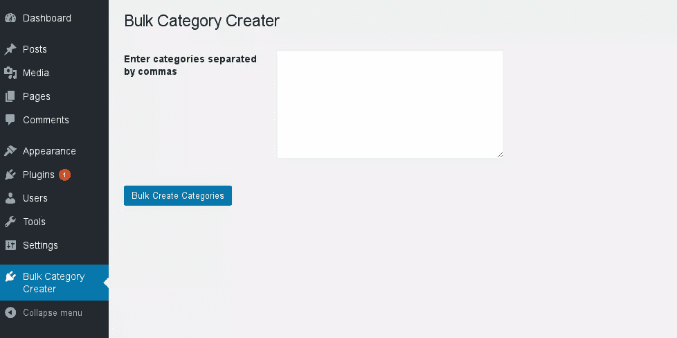
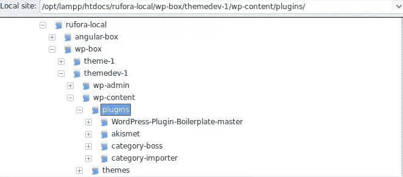
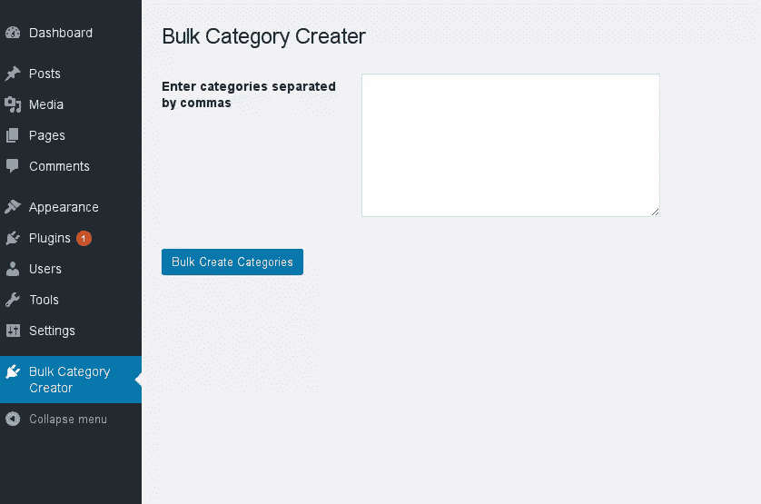
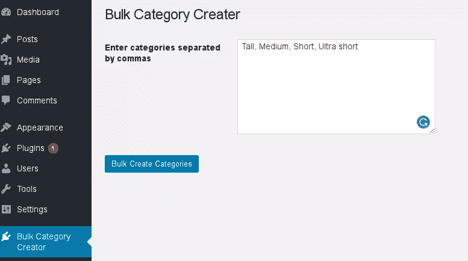
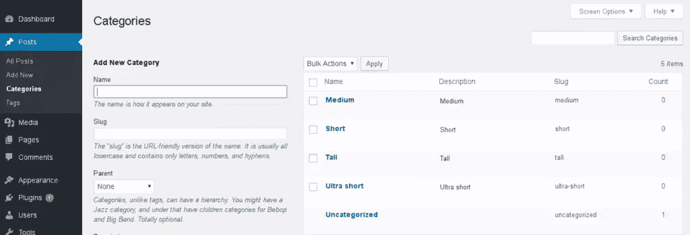

# 通过批量类别创建者学习插件开发

> 原文：<https://www.sitepoint.com/learn-plugin-development-bulk-category-creator/>

在本教程中，你将开始学习 WordPress 的插件开发。示例插件将有一个带有基本表单元素和提交按钮的管理页面，并将一次性执行创建批量类别的简单任务。

很多时候，在 WordPress 上开发网站或博客时，你需要创建很多类别。在这些情况下，一个接一个地创建类别会变得很痛苦。因此，在本教程中，你将学习构建一个插件，允许将逗号分隔的类别列表复制粘贴到文本区域。点击一个按钮，所有的类别都会一次性加载到 WordPress 类别部分。因此，这将避免需要坐下来点击添加新的类别按钮，每个类别都必须创建。

要求:

1.  你需要在本地安装 WordPress(或者某种开发服务器)
2.  你需要知道基本的 HTML 和 PHP

你要建造什么(你要创造的最后阶段的预览)



## 关于 WordPress 插件的简短说明

WordPress 中的插件基本上是 PHP 脚本，它允许你改变或添加新的特性到你现有的 WordPress 安装中。它可以是非常简单的东西，比如“Hello Dolly”插件，或者是非常高级的东西，比如 Jetpack 或 Google Analytics 插件。

那么，你为什么要构建一个插件呢？

大多数 WordPress 开发者都意识到他们不应该为了满足自己的需求而修改 WordPress 的核心文件。它会产生更新问题，并且可能不安全。但是如果修改 WordPress 的核心代码不是一个好的选择，你还能怎样给你的 WordPress 网站增加新的功能呢？答案当然是通过插件。学习如何创建插件的一个额外好处是，你可以学到更多关于 WordPress 本身的知识，以及它是如何工作的。这反过来会让你成为更好的 WordPress 开发者。

## 学习插件开发

为了创建插件，你必须为你的插件创建一个特定的文件夹结构。每个插件都有一个目录名和一个或多个 PHP 文件。

在你的 WordPress 目录结构中，你会发现一个名为`wp-content`的目录。在`wp-content`中有一个名为`plugins`的目录。

您的文件夹结构如下所示:



### 第一步–创建您的文件

创建插件的第一步是导航到 WordPress 安装的`wp-content`目录，并在目录内导航到`plugins`目录。在插件目录中创建一个名为`bulk-category-creator`的新目录。

一旦创建了目录，就创建一个名为`bulk-category-creator.php`的文件。确保目录名和 PHP 文件名相同。

现在，打开文本编辑器，将以下代码复制粘贴到其中

```
<?php
   /*
   Plugin Name: Bulk Category Creator
   Plugin URI: http://www.ruforaweb.com
   Description: A plugin to bulk-create categories in one go
   Version: 1.0
   Author: Vishnu Ajit
   Author URI: http://twitter.com/vishnuajith310
   License: GPL2
   */
```

每个插件顶部都有一个代码注释部分，包含描述、版本信息、作者姓名和许可信息。这通常可以在插件主文件的头中找到。在我们的例子中，它出现在`bulk-category-creator.php`中。
这个部分是插件的元数据。让我们一行一行地剖析示例元数据。

*   **插件名称:**这是插件的名称，我们称之为批量类别创建者
*   **插件 URI:** 这是一个链接，可以在互联网上找到该插件以供下载。它可以在 WordPress.org 档案馆或其他地方找到。
*   **描述:**这是您可以描述插件执行什么动作的部分。
*   **版本:**指定插件的版本
*   **作者:**创建这个插件的作者或开发者的名字
*   **作者 URI:** 在网上链接到作者的地址
*   **许可证:**发布这个插件的许可证

导航到您的管理仪表板>插件>已安装的插件，您应该在列表中看到您的插件。


### 代码布局–批量类别创建器插件

在开始编写我们的插件之前，让我们理解一些基本的 WordPress 钩子。基本上，在 WordPress 中有两种主要类型的钩子:动作和过滤器。因为这是一个基本的插件开发教程，我们不会涉及太多的细节，但基本上这就是它们的不同之处。

*   **动作**:当一个事件发生时，当你添加一些东西时，使用动作。例如:当一篇新文章发表后，在 tweet 上发布一篇文章的动作。
*   **过滤器**:当你必须改变一些数据或对其进行处理时，会用到过滤器。

现在你已经熟悉了基础知识，让我们开始编写插件。

```
add_action('admin_menu', 'rfr_CategoryCreatorMenu');
```

这行代码将`admin_menu`与函数`rfr_CategoryCreatorMenu`挂钩

admin_menu 函数用于添加子菜单或菜单选项到我们的 WordPress 管理仪表板。完成后，写下下一段代码。

```
<?php
   /*
   Plugin Name: Bulk Category Creator
   Plugin URI: http://www.ruforaweb.com
   Description: A plugin to bulk-create categories in one go
   Version: 1.0
   Author: Vishnu Ajit
   Author URI: http://twitter.com/vishnuajith310
   License: GPL2
   */

add_action('admin_menu', 'rfr_CategoryCreatorMenu');

function rfr_CategoryCreatorMenu()
{

    add_menu_page('Bulk Category Creator Plugin','Bulk Category Creator','administrator', __FILE__, 'rfr_CategorySettingsPage' , 'dashicons-admin-plugins');

    add_action('admin_init', 'rfr_RegisterPluginSettings');

}
```

如果您仔细观察上面的代码片段，您将会看到我们在代码中添加了一个函数`rfr_CategoryCreatorMenu`。让我们一行一行地剖析代码。

我们在代码中使用了名称`rfr_CategoryCreatorMenu`。你可能会注意到我使用的前缀`rfr_`。总是，当为 WordPress 创建自定义插件时，确保你的函数有唯一的名字。除了使代码更干净，这还解决了由于不同插件使用相同名称而产生的冲突。所以，一定要确保你的函数有一个唯一的名字作为前缀。在这种情况下，我使用`rfr_`作为我的前缀；你想用什么都可以。例如，你可以使用你名字或公司名称的前三个字母。

好了，现在在`rfr_CategoryCreatorMenu`函数中我们添加了一个`add_menu_page`函数。

`add_menu_page`功能添加一个顶级菜单页面。这个函数有许多传递给它的参数。

*   第一个参数:这是插件页面标题的内容。
*   第二个参数:这是插件在管理面板中显示的名称。在我们的例子中，它显示了批量类别创建者
*   第三个参数:这是插件的权限限制。在我们的情况下，只有管理员可以访问或使用我们的插件。
*   第四个参数:这是用来引用这个菜单的 slug
*   第五个参数:这是为了显示页面内容而应该调用的函数。
*   第六个参数:这是显示在管理面板菜单旁边的图标的 URL。在我们的例子中，我们添加了“dashicon-admin-plugin ”,它是 WordPress 附带的图标集的一部分。关于默认 WordPress 捆绑包的更多图标，请参考 https://developer.wordpress.org/resource/dashicons。

现在，如果您观察您的管理仪表板，您可以看到一个名为批量类别创建者的新菜单已经创建。


接下来，我们必须给我们的`admin_init`动作添加另一个钩子。

```
add_action(‘admin_init’, ‘rfr_RegisterPluginSettings’);
```

我们一会儿将回到它。

现在下一部分是设计管理仪表板的前端。你可能已经注意到，在`add_menu_page`函数中，我们指向了函数`rfr_CategorySettingsPage`。

让我们来定义这个函数

```
function rfr_CategorySettingsPage() {
?>
<div class="wrap">
<h1>Bulk Category Creator</h1>

<form method='post'><input type='hidden' name='form-name' value='form 1' />
    <?php settings_fields( 'rfr-bulk-category-creator-group' ); ?>
    <?php do_settings_sections( 'rfr-bulk-category-creator-group' ); ?>
    <table class="form-table">
        <tr valign="top">
        <th scope="row">Enter categories separated by commas</th>
        <td>
        <textarea cols="50" rows="8" name="options_textarea"></textarea>
        </td>
        </tr>
    </table>

    <?php submit_button('Bulk Create Categories'); ?>

</form>

<?php } ?><
```

这是我们定义插件管理页面前端的地方。

基本上，它由一个带有 textarea 的表单组成。我们将把我们的类别粘贴到这个文本区域中，并以逗号分隔列表。

这个部分只是一个基本的 HTML，其中定义了一个表单，在一个表格布局中，指定了一个 textarea。只要确保你没有忘记在表单声明的下面写上`settings_fields`和`do_settings_sections`就行了。

现在，如果您尝试导航到我们新创建的菜单“批量类别创建器”，您可以看到以下内容:



Tada！我们已经成功地创建了插件的前端。我们在插件的仪表板上添加了一个 HTML 表单元素。

现在，剩下唯一要做的事情就是编写必要的程序，允许我们一次尝试导入批量类别。

```
function rfr_RegisterPluginSettings() {
    //register our settings

    register_setting( 'rfr-bulk-category-creator-group', 'options_textarea' );

    rfr_CreateCategories();

}

function rfr_CreateCategories()
{

    $returnedStr = esc_attr($_POST['options_textarea'] );

    $trimmed = trim($returnedStr);

    $categories_array = explode(',',$trimmed);

    foreach ($categories_array as $key => $value)
    {

        $catString = $value.'';

        $term = term_exists($value,'category');
        if($term==0 || $term==null)
        {
            create_category($value);

        }

    }

}

function create_category($value)
{
    $trimmedValue = trim($value);
    $hyphenatedValue = str_replace(" ", "-", $trimmedValue);

    wp_insert_term(
        $trimmedValue,
        'category',
        array(
            'description' => $trimmedValue,
            'slug'=> $hyphenatedValue
            )
        );
}
```

上面的内容是基本的 PHP，但是让我们来详细研究一下:

```
$returnedStr = esc_attr($_POST['options_textarea'] );

$trimmed = trim($returnedStr);

$categories_array = explode(',',$trimmed);
```

`$returnedStr`接收从 form 元素内的 textarea 提交的值。

`$trimmed`修剪字符串左右两边的空白。

PHP `explode`函数用于将逗号分隔的值转换成`$categories_array`变量。

接下来，我们使用 foreach 循环来浏览`$categories_array`变量的内容。

```
foreach ($categories_array as $key => $value)
{
    $catString = $value.'';

    $term = term_exists($value,'category');
    if($term==0 || $term==null)
    {
        create_category($value);

    }
}
```

这里，我们在`$categories_array`中的每个变量内部循环

`$catString`获取`$value`的值。添加后缀`.' '`是为了确保该值是一个字符串。

在下一行`$term = term_exists($value, ‘category’);`

我们使用了一个 WordPress 钩子`term_exists`来确保现有的类别名称不会被重新添加到类别列表中。因此，例如，如果一个名为“高”的类别已经存在，如果我们尝试将“高”添加到批量类别创建器文本区，它不会被重新添加到类别列表中。

在下一行，我们使用了条件检查来确保已经存在的类别不会被重新添加到我们的类别列表中

行`if($term ==0 || $term == null)`确保。

接下来，我们将该值传递给我们的`create_category`函数:

```
function create_category($value)
{
    $trimmedValue = trim($value);
    $hyphenatedValue = str_replace(" ", "-", $trimmedValue);

    wp_insert_term(
        $trimmedValue,
        'category',
        array(
            'description' => $trimmedValue,
            'slug'=> $hyphenatedValue
            )
        );

}
```

在这个函数中，我们执行以下操作:

`$trimmedValue = trim($value);`

我们将`$value`传递给 PHP `trim`函数，从我们的值中删除空白。

我们还创建了一个用连字符连接的值，在我们的 slug 中使用:

`$hyphenatedValue = str_replace(" ", "-", $trimmedValue);`

这里，我们使用 PHP 函数`str_replace`用连字符替换单词之间的空格。例如，如果我们添加的类别是“必看”，我们会将`$hyphenatedValue`作为“必看”。

接下来，我们使用另一个 WordPress 钩子`wp_insert_term`来添加我们的修整值、分类法和一个由描述和断字字符组成的数组。

函数`wp_insert_term`有 3 个参数。

1.  第一个参数:要插入的值
2.  第二个参数:所需的分类法。在我们的例子中是“类别”
3.  第三个参数:由描述和我们的 slug 组成的数组

完整的代码如下所示

```
< ?php
   /*
   Plugin Name: Bulk Category Creator
   Plugin URI: http://www.ruforaweb.com
   Description: A plugin to bulk-create categories in one go
   Version: 1.0
   Author: Vishnu Ajit
   Author URI: http://twitter.com/vishnuajith310
   License: GPL2
   */

add_action('admin_menu', 'rfr_CategoryCreatorMenu');

function rfr_CategoryCreatorMenu()
{

    add_menu_page('Bulk Category Creator Plugin','Bulk Category Creator','administrator', __FILE__, 'rfr_CategorySettingsPage' , 'dashicons-admin-plugins');

    add_action('admin_init', 'rfr_RegisterPluginSettings');

}

function rfr_RegisterPluginSettings() {
    //register our settings

    register_setting( 'rfr-bulk-category-creator-group', 'options_textarea' );

    rfr_CreateCategories();

}

function rfr_CreateCategories()
{

        $returnedStr = esc_attr($_POST['options_textarea'] );

        $trimmed = trim($returnedStr);

        $categories_array = explode(',',$trimmed);

    foreach ($categories_array as $key => $value)
    {

        $catString = $value.'';

        $term = term_exists($value,'category');
        if($term==0 || $term==null)
        {
            create_category($value);

        }

    }

}

function create_category($value)
{
    $trimmedValue = trim($value);
    $hyphenatedValue = str_replace(" ", "-", $trimmedValue);

    wp_insert_term(
        $trimmedValue,
        'category',
        array(
            'description' => $trimmedValue,
            'slug'=> $hyphenatedValue
            )
        );

}

function rfr_CategorySettingsPage() {
?>
<div class="wrap">
<h1>Bulk Category Creator</h1>

<form method='post'><input type='hidden' name='form-name' value='form 2' />
    < ?php settings_fields( 'rfr-bulk-category-creator-group' ); ?>
    < ?php do_settings_sections( 'rfr-bulk-category-creator-group' ); ?>
    <table class="form-table">

        <tr valign="top">
        <th scope="row">Enter categories separated by commas</th>
        <td>
        <textarea cols="50" rows="8" name="options_textarea"></textarea>
        </td>
        </tr>
    </table>

    < ?php submit_button('Bulk Create Categories'); ?>

</form>
</div>
< ?php } ?> 
```

现在，导航到管理仪表板>批量类别创建者，并输入类别列表。

在这个例子中，我在文本区域中添加了高、中、矮和超短。



现在，点击批量创建类别

然后，导航到 Admin Dashboard > Posts > Categories，您可以看到我们的类别已经添加到类别列表中。



成功！我们的类别列表现在已经一次性创建完毕。请注意，在 slug 部分，我们的类别“超短”已被连字符连接为“超短”。

因此，在我们的教程中，你已经成功地创建了你的第一个 WordPress 插件，批量类别创建插件。如果你已经完成了这个教程，你现在应该有一个工作的 WordPress 插件了！

如果你想把这个插件分发给你的朋友，只需要把插件目录压缩成一个. zip 文件就可以了。

感谢您遵循本教程！如果你有任何问题或意见，请在下面的评论区留言！

## 分享这篇文章