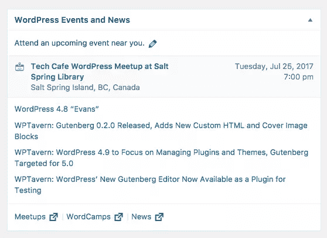
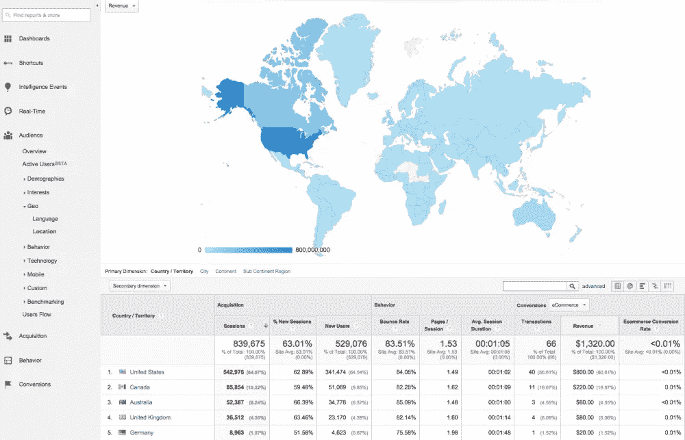
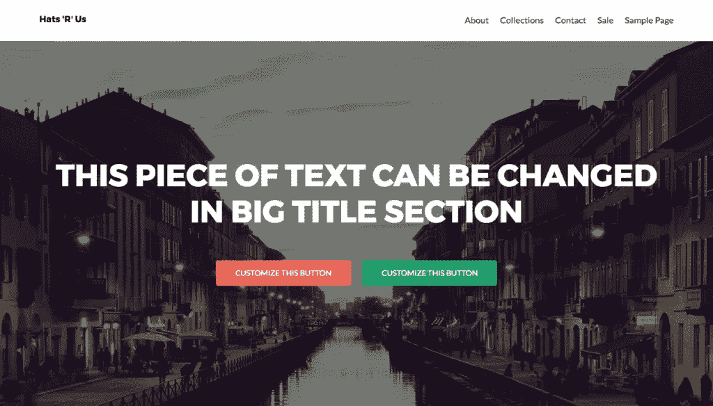
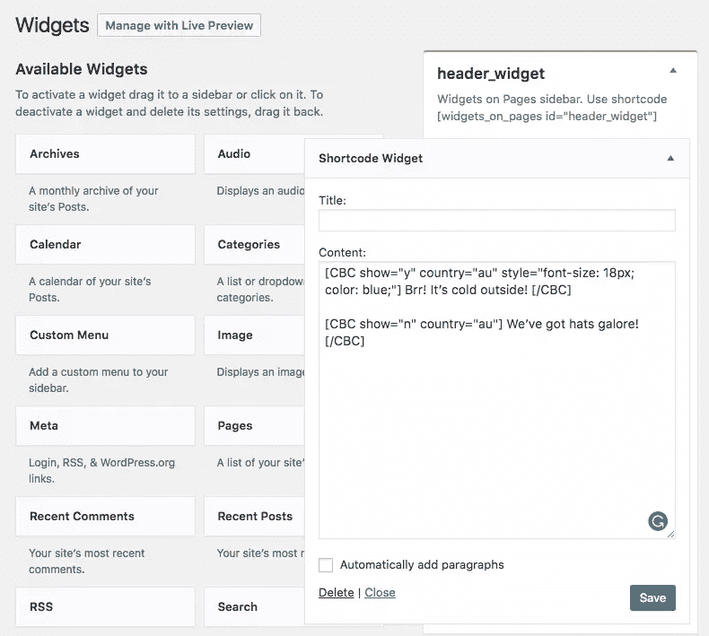
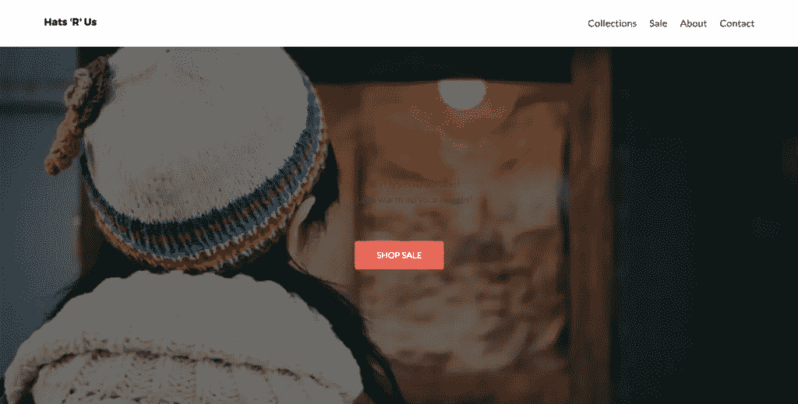
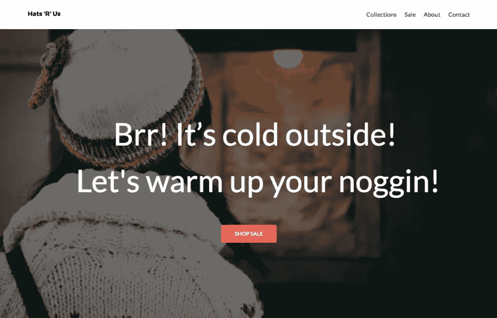

# 地理定位 WordPress 内容来个性化你的网站

> 原文：<https://www.sitepoint.com/geo-targeting-wordpress-content/>

那么这个短语是什么意思，“地理定位 WordPress 内容”？首先，让我们回顾一下一个个性化的例子。

在经历了十年持续下滑的销售后，可口可乐仅仅通过在可乐瓶上增加名字就扭转了它的命运。该公司的“分享一杯可乐”活动与消费者建立了个人联系，推动了销售。毕竟，你为什么不买印有你名字的饮料呢？

Nutella 很快跟进，通过允许顾客在罐子上添加他们自己的名字，将这个想法向前推进了一步。很快，人们争相在社交媒体上展示他们的个性化罐子。

那么可口可乐和 Nutella 和 WordPress 有什么关系呢？

这些品牌所取得的成就是个性化力量的明显例子。消费者现在希望网上的内容对他们来说是独一无二的，以至于当网站内容不个性化时，74%的顾客会感到沮丧。营销人员知道这一点—[52%的数字营销人员认为个性化网络内容的能力是他们在线战略的基础](https://econsultancy.com/blog/10194-the-roi-of-personalisation-infographic)。问题？只有 32%的人说他们的 CMS 支持个性化。

幸运的是，WordPress 不属于这些 CMS。WordPress 有很多工具和插件可以让访问者轻松地个性化内容，但是目前最简单的个性化网站内容的方法是地理定位。

## 什么是地理定位？

地理定位是网站根据访问者的地理位置向他们提供特定内容的一种方式，通常是通过他们的 IP 地址提供他们的国家或城市。

这种技术并不新鲜——它已经存在了很长时间，已经变得无处不在。谷歌根据你在世界上的位置提供定制的搜索结果，亚马逊提供推荐产品的个性化主页，易贝显示当地货币。

地理定位的一个更近的例子是 WordPress 本身。最近的 4.8 版本包括一个新的仪表盘小部件，显示根据你的地理位置定制的即将到来的 WordPress 事件。



## 使用谷歌分析来确定访问者的位置

你可以使用谷歌分析来了解更多关于你的访客和他们来自哪里。

只要登录谷歌分析。转到受众>人口统计>地理>位置。



你会看到一张世界地图，它的颜色与你的受众群体相匹配，下面是更详细的受众细分，包括他们所在的国家、会话、新用户、跳出率、交易和收入。

您可以使用此信息告知您希望如何个性化您网站上的内容。例如，根据上面 Google Analytics 个人资料中的地理数据，您可能希望:

*   将德语翻译添加到您的网站
*   投入更多时间向美国人推广内容(例如，根据美国假期量身定制促销活动)
*   告知德国访问者，您正在根据欧盟 Cookie 法收集他们的信息。
*   以适合他们所在位置的方式欢迎他们，与他们建立联系(例如，说“G'Day！”澳大利亚游客)，甚至添加幽默或特定地点的参考
*   展示来自与你的访客相同地点的顾客的评价
*   让美国、加拿大、澳大利亚、英国和德国的游客知道你送货到他们的位置

## 通过 WordPress 使用地理定位

让我们看一个简单的例子来说明如何个性化你的网站内容:向来自不同国家的访问者显示定制的欢迎信息。

### 显示欢迎信息

场景:假设你经营一家专营帽子的网店。由于夏季炎热，你的帽子正在销售，而冬天的帽子供应过剩，它们正在积灰。幸运的是，现在是澳大利亚的冬天——这是一个瞄准内地客户、抛售库存的绝佳机会。

对于这个例子，我想在我的主页上显示另一条欢迎消息，只向来自澳大利亚的访问者显示*和*。来自其他国家的访问者将会看到一个标准的欢迎广告。

#### 步骤 1:安装插件

我们将使用 WordPress 插件目录中的一些免费插件来实现这个例子，具体来说:

*   [按国家定制内容](https://wordpress.org/plugins/custom-content-by-country/)
*   [页面上的小部件](https://wordpress.org/plugins/widgets-on-pages/)
*   [短码小工具](https://wordpress.org/plugins/shortcode-widget/)

按国家定制内容是一个简单的插件，它使用短代码根据访问者的位置向他们显示或隐藏内容。我们将使用按国家定制的内容，开始按访问者的位置对 WordPress 内容进行地理定位——我们可以简单地用它来显示一个替代的欢迎信息。

我想在我的主题标题上显示替代消息，所以我使用页面上的小部件向标题添加一个小部件。

最后，Shortcode Widget 将允许我在我的站点上轻松地使用 Shortcode，而不必在我的`functions.php`文件中添加过滤器或创建子主题。

#### 步骤 2:创建自定义小部件

对于这个例子，我使用的是 Zerif Lite 主题，这是 WordPress 主题目录中一个流行的免费主题。这是新安装的样子:



我想显示我自己的定制消息，而不是 Zerif Lite 中包含的通用消息，我将使用一个定制小部件来实现这一点。

首先，我们将对主题进行一些更改:

*   替换页眉图像
*   移除绿色按钮
*   替换红色按钮文本。

现在，让我们使用页面上的小部件为标题创建一个自定义小部件。前往 Pages 上的 Pages > Turbo 边栏，然后点按“添加新的 Turbo 边栏”

给你的部件起个名字——在我的例子中是“Header Widget ”,然后点击“Update ”;然后复制提供的短代码。

在您的主题文件中，在您想要显示替换文本的地方添加短代码。在我的例子中，我希望在标题中显示文本。因此，在 Zerif Lite 主题中，我将编辑`big_title.php`并替换该行

`zerif_big_title_text_trigger();`

随着

`widgets_on_template("header_widget");`

单击“更新文件”保存您的更改。

显然，在编辑任何 WordPress 文件之前创建一个子主题是最佳实践。但是为了简单起见，我在这个例子中直接修改文件。

#### 步骤 3:向小部件添加短代码以显示自定义的欢迎消息

转到自定义内容>按国家/地区显示内容，然后单击启用第一个选项“按国家/地区显示内容”。默认情况下，此选项是禁用的，因此在继续之前检查此选项很重要。

接下来，转到外观>小部件。你会看到有一个新的“header_widget”小部件。您还会在 available widgets 部分看到一个新的 Shortcode 小部件。

将 Shortcode 小部件拖到 header_widget 上。在内容区域中，粘贴国家自定义内容小部件的短代码。这是我的例子:

```
[CBC show="y" country="au"]Brr! It’s cold outside!<br />Let’s warm up your noggin![/CBC]
[CBC show="n" country="au"]Looking for a great hat? <br />Sale on now![/CBC] 
```



为了解释，第一个短代码将显示“Brr！外面很冷！让我们温暖你的脑袋！”来自澳大利亚的游客，因为“显示”设置为“y”，这意味着“是”。

第二个短代码将显示“寻找一个伟大的帽子？现在开始销售！”给所有不在澳大利亚的访客，因为我已经将“显示”设置为“否”。

点击“保存”。

这是它在前端的样子:


不太容易看到文字。

它包含了给非澳大利亚游客的第二条信息，因为我在加拿大。如果你有一个 VPN，打开它，将你的位置设置为澳大利亚的某个地方，这就是我要做的(当然，如果你的访问者使用 VPN，他们的位置将被屏蔽，设置地理定位 WordPress 内容可能不会有太大的区别，但 VPN 后面的访问者的百分比将会很低)。



瞧啊。看起来不错！算是吧。它肯定需要一些造型。让我们解决这个问题。

#### 步骤 4:添加 CSS 样式

使用所提供的类，定制内容(按国家)插件的样式输出非常简单。

打开您的主题或子主题的 CSS 文件，并添加一些简单的样式:

```
.cbc_content {
  color:#ffffff;
  font-size:80px;
} 
```

现在刷新前端，看看是什么样子。



这是一个非常简单的例子，说明了地理定位 WordPress 内容如何与*个性化*内容协同工作，以及如何在你的网站上向来自不同国家的访问者展示不同的内容。

## 使用插件的地理定位 WordPress 内容

虽然按国家定制内容是一个很好的免费选项，但还有许多其他免费和优质插件可用于向 WordPress 添加地理定位功能。

*   Geolify(premium)–这款高级 SaaS 允许你对网站上的所有内容进行地理定位，包括重定向、链接、内容、弹出窗口、通知栏、图片、JavaScript，还可以阻止访问者返回位置。
*   GEO my WordPress (免费)–这个免费插件可以处理文章、页面和自定义文章类型。它还可以和 BuddyPress 一起使用，这样会员就可以添加他们的位置。
*   WP Geo (免费)–另一个免费选项，WP Geo 允许你设置一个帖子的物理位置，并使用谷歌地图嵌入该信息。
*   [GEO my WP](https://geomywp.com/)(premium)–这个 premium 插件为地理定位 WordPress 内容提供了许多高级选项，包括帖子类型和 BuddyPress、邻近搜索表单、Google Places 地址自动完成、附近位置和当前用户位置。
*   这个简单的免费插件提供了通过 IP 地址检测到的地理信息，你可以在主题和插件中使用。这个插件的目标是开发人员，然后可以挂钩到这些信息。
*   [GeoTargeting Lite](https://wordpress.org/plugins/geotargeting/) (免费)–类似于按国家定制内容，该插件使用短代码根据用户的地理位置向他们显示内容。
*   地理定位 WP(premium)–这个 API 服务使开发者能够在他们网站的任何部分开始地理定位 WordPress 内容，包括帖子、页面、自定义帖子类型，如 WooCommerce 产品、小工具、菜单和模板文件。

## 结论

地理定位 WordPress 内容提供了一种相对简单的方式，根据用户的位置来个性化内容。虽然本教程中的例子相当基础，但希望它向您展示了一些免费插件的潜力。我鼓励你在自己的网站上尝试地理定位，看看你能实现什么！请在下面的评论中告诉我们你在 WordPress 中地理定位的体验！

## 分享这篇文章