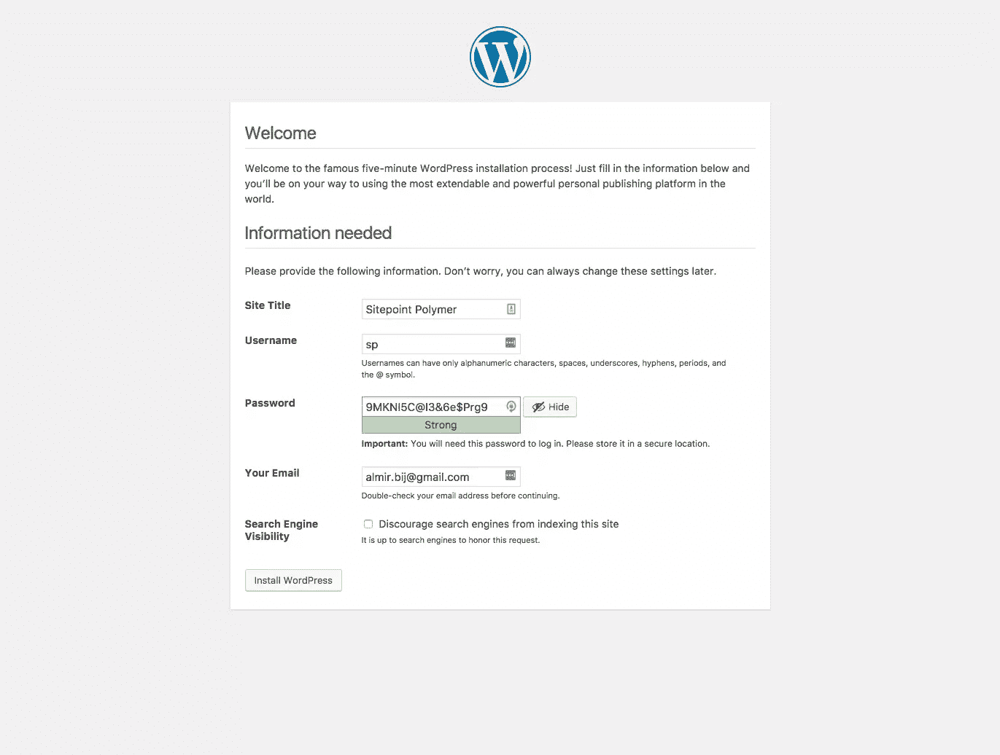
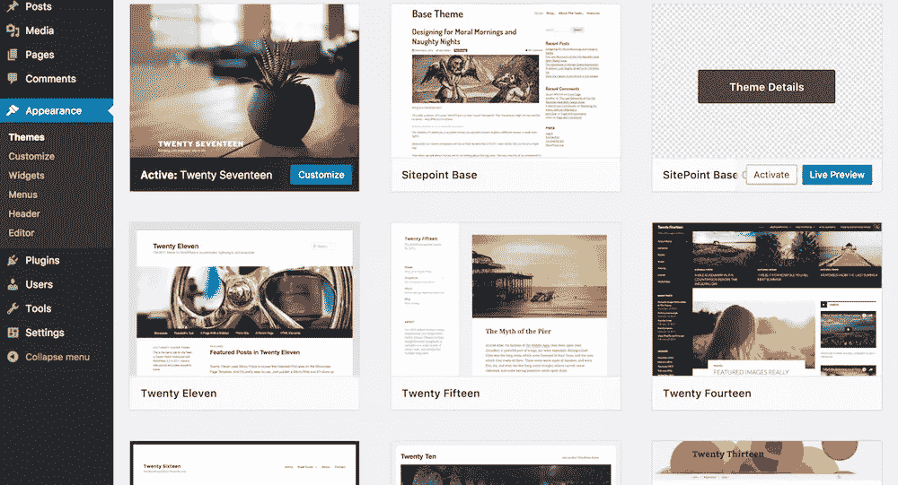
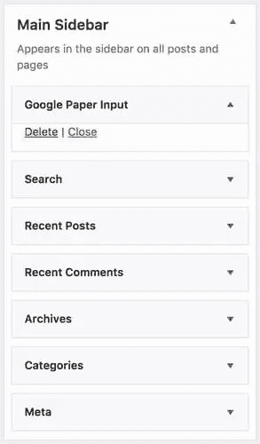
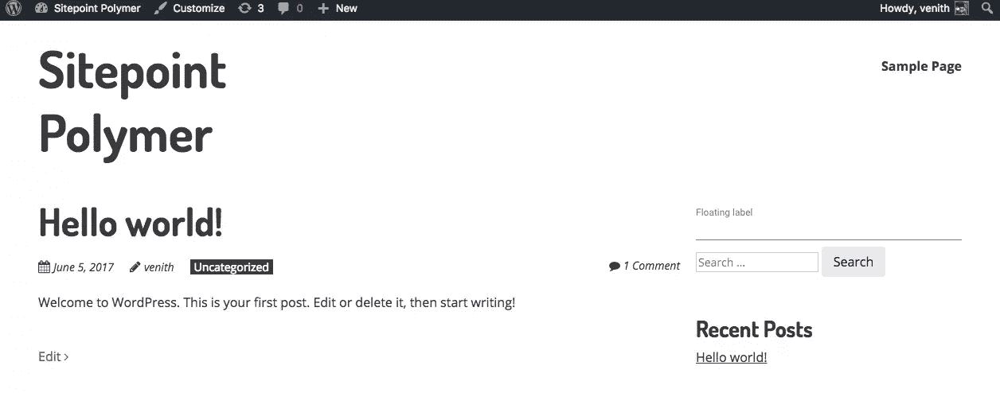
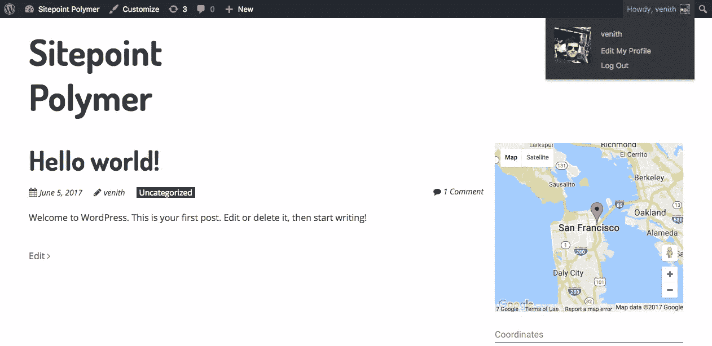

# 在 WordPress 中使用聚合体:构建一个定制的谷歌地图组件

> 原文：<https://www.sitepoint.com/polymer-wordpress-custom-component/>

Web 组件是一套创建定制的、可重用的 HTML 元素的标准。 [Polymer](https://www.polymer-project.org/) 是一个开源的 JavaScript 库，用于使用 web 组件构建 web 应用。由谷歌的那些聪明人创造的，它提供了普通 web 组件的许多附加功能，当与 polyfill 一起使用时，[支持所有主流浏览器的最新版本](https://www.polymer-project.org/2.0/docs/browsers)。

在本教程中，我将向你展示在 WordPress 中使用 web 组件和聚合物是多么容易。我将首先向你展示如何将 Polymer 集成到你的 WordPress 安装中，然后我将演示如何将一个有效的 [Google Maps 组件](https://www.webcomponents.org/element/GoogleWebComponents/google-map)添加到你网站的侧边栏中。这对于任何需要向访问者提供到他们的场所的方向的站点(例如，餐馆的站点)可能是有用的。

读完之后，你将能够在你自己的网站上使用这种技术。你将不再局限于一个谷歌地图小工具，你将能够从广泛的[预制组件](https://www.webcomponents.org/elements)中进行选择，甚至可以编写自己的组件。

与以往一样，本教程的所有代码都可以在 [GitHub 库](https://github.com/sitepoint-editors/sitepoint-base-child)中获得。

## 为什么是聚合物？

随着对 web 组件的本地支持越来越好，你可能会问 Polymer 是否仍然相关。这个问题的简短答案是肯定的！

Polymer 确实使用了各种各样的[网络组件 poly fills](https://github.com/webcomponents/webcomponentsjs)——希望有一天它会被搁置——但它远不止这些。Polymer 是一个 web 组件 API 的包装器，它允许我们以更快的速度开发和实现新的组件。它提供了超越普通 web 组件的各种附加功能，比如单向和双向数据绑定、计算属性和手势事件。它配有一个非常精致的 [CLI](https://www.polymer-project.org/2.0/docs/tools/polymer-cli) ，可以用于搭建项目、运行测试或运行本地服务器等任务，它可以利用广泛的预建元素，如备受喜爱的[材料设计元素库](https://www.webcomponents.org/collection/PolymerElements/paper-elements)。

总之聚合物还是很有关系的。这是一个强大的框架，被诸如今日美国、可口可乐和电子艺界这样的大公司用于生产。

## 设置 WordPress

在我们开始之前，我们需要设置将要运行 WordPress 的环境。对于本教程，我将使用装有一些预装工具的 [ScotchBox 流浪者虚拟机](https://box.scotch.io/)来启动你的 WordPress 安装。

> 如果你已经安装了 WordPress，或者想要使用不同的方法，你可以跳过这一步。如果你需要一些设置方面的帮助，但不想走下面描述的流浪路线，尝试谷歌"[本地安装 WordPress】"并寻找最新的教程。](https://www.google.de/search?q=install+wordpress+locally)

我们首先确保系统上安装了 [Git](https://git-scm.com/downloads) 、[流浪者](https://www.vagrantup.com/downloads.html)和[虚拟盒子](https://www.virtualbox.org/wiki/Downloads)。然后，我们可以用 ScotchBox 的预填充的流浪者文件克隆 GitHub repo。

```
git clone https://github.com/scotch-io/scotch-box sitepoint-wp-polymer 
```

现在我们准备运行`vagrant up`。在我们的机器启动后，我们必须删除默认的静态文件并安装 WordPress。

```
cd sitepoint-wp-polymer/public
rm index.php
git clone https://github.com/WordPress/WordPress.git . 
```

现在我们必须复制一份`wp-config-sample.php`文件。命名为`wp-config.php`。

```
cp wp-config-sample.php wp-config.php 
```

并编辑以下值:

```
// wp-config.php

// ...

define('DB_NAME', 'scotchbox');
define('DB_USER', 'root');
define('DB_PASSWORD', 'root');

// ... 
```

现在，您已经准备好启动浏览器并访问 http://192.168.33.10。系统将提示您输入管理员帐户凭据和站点标题。如果你觉得合适，请随意填写。



## 添加 SitePoint 基本主题

我们已经设置好了 WordPress，现在我们需要一个主题。开箱即用，这将是[2017 主题](https://wordpress.org/themes/twentyseventeen/)，但这是非常普通的，包括比你通常需要的更多。一个很好的选择是使用 [SitePoint WordPress 基本主题](https://www.sitepoint.com/premium/themes/sitepoint-base-theme)。

这个主题是为了回答“完美的 WordPress 基础主题看起来会是什么样的？”。其特点包括:

*   没有脂肪。没有蛋糕。速度快。
*   简约设计。让它变漂亮是你的工作。
*   没有你实际上从未使用过的“可爱”功能。
*   搜索引擎优化友好的核心。
*   超级移动友好。
*   100%开源，免费使用。

SitePoint WordPress 基本主题是新项目的一个很好的起点。它的移动友好，易于使用和 100%免费。为了跟随本教程的其余部分，前往主题的主页并[立即下载](https://www.sitepoint.com/premium/themes/sitepoint-base-theme)。

当你在那里的时候，你可能也想看看 SitePoint 提供的付费主题套件。这些都是建立在基础主题之上的，包括电子商务主题、餐厅主题、投资组合主题、商业主题和建筑主题。

下载完 SitePoint WordPress 基础主题后，解压并复制/粘贴到`wp-content/themes`文件夹。然后在`wp-content/themes`中创建一个名为`sitepoint-base-child`的新文件夹。在该目录下创建一个`style.css`文件和一个`functions.php`文件。

```
cd wp-content/themes/
mkdir sitepoint-base-child
cd sitepoint-base-child
touch functions.php style.css 
```

打开`style.css`并将其复制到其中:

```
/*
 Theme Name:   SitePoint Base Child
 Author:       Almir B.
 Author URI:   http://almirbijedic.rocks
 Template:     sitepoint-base
 Version:      1.0.0
 Text Domain:  ab-sitepoint-base
*/ 
```

并进入`functions.php`:

```
<?php
//functions.php

add_action( 'wp_enqueue_scripts', 'sp_theme_enqueue_styles' );
function sp_theme_enqueue_styles() {
  wp_enqueue_style( 'parent-style', get_template_directory_uri() . '/style.css' );
} 
```

这将使父主题中的基本 CSS 入队。

我们刚刚创建了一个子主题，它的作用是在基本主题之上实现功能，而不必修改基本文件。所有的定制都包含在这个儿童主题中。

最后一步是进入[管理仪表板](http://192.168.33.10/wp-admin/)，然后从主菜单进入*外观>主题*，点击*激活*下的，Sitepoint 基础子主题。



## 在 WordPress 中包含聚合物

现在完成了，我们必须安装聚合物与[鲍尔](https://bower.io/)。确保您在`public/wp-content/themes/sitepoint-base-child`文件夹中，然后运行:

```
bower init 
```

你可以用默认答案回答每一个问题。接下来，我们需要安装依赖项:

```
bower install --save Polymer/polymer#^2.0.0 PolymerElements/paper-input#2.0-preview 
```

这将安装聚合物和[纸张输入组件](https://www.webcomponents.org/element/PolymerElements/paper-input)，这样我们就可以开箱即用一种奇特的材料设计输入组件。重要的是使用`#2.0-preview`标签用于纸张输入，也用于以后的 Google Map 元素，否则它将不能与最新版本的 Polymer(2.0 版)一起工作。

为了使用 Polymer，我们必须使用 HTML 导入来包含它，我们还将包含 web 组件的 polyfill，以便支持旧的浏览器。

转到子主题中的`functions.php`文件，在现有的`enqueue`函数中添加一个`enqueue`。

```
<?php
//functions.php

add_action( 'wp_enqueue_scripts', 'sp_theme_enqueue_styles' );
function sp_theme_enqueue_styles() {
  wp_enqueue_style( 'parent-style', get_template_directory_uri() . '/style.css' );
  wp_enqueue_script( 'polymer', get_stylesheet_directory_uri() . '/bower_components/webcomponentsjs/webcomponents-lite.js' );
} 
```

WordPress 没有用于 HTML 导入入队的入队功能，但是我们可以挂钩到 [wp_head](https://codex.wordpress.org/Function_Reference/wp_head) 钩子，该钩子输出到页面的< head >元素。

```
<?php
//functions.php

add_action( 'wp_enqueue_scripts', 'sp_theme_enqueue_styles' );
function sp_theme_enqueue_styles() {
  wp_enqueue_style( 'parent-style', get_template_directory_uri() . '/style.css' );
  wp_enqueue_style( 'polymer', get_stylesheet_directory_uri() . '/bower_components/webcomponentsjs/webcomponents-lite.min.js' );
}

add_action( 'wp_head', 'include_polymer_elements' );
function include_polymer_elements() {
  ?>

  <link rel="import"
        href="<?php echo get_stylesheet_directory_uri() ?>/bower_components/polymer/polymer.html">
  <link rel="import"
        href="<?php echo get_stylesheet_directory_uri() ?>/bower_components/paper-input/paper-input.html">
  <?php
} 
```

这就是我们开始在 WordPress 中使用聚合物元素所需要的一切。现在让我们创建一个 WordPress 小部件，这样我们就可以进行测试了。

## 注册小部件

为了创建一个新的小部件，我们将从 [WP_Widget](https://developer.wordpress.org/reference/classes/wp_widget/) 类创建一个新的子类，然后用 [widgets_init](https://developer.wordpress.org/reference/hooks/widgets_init/) 钩子注册它。

在你的子主题中创建一个新文件夹，命名为`lib`，并添加一个名为`sitepoint-map-widget.php`的文件。

```
mkdir lib
cd lib
touch sitepoint-map-widget.php 
```

将以下内容复制到该文件中:

```
<?php 
// lib/sitepoint-map-widget.php

class SitepointMapWidget extends WP_Widget {

  function __construct() {
    // Instantiate the parent object
    parent::__construct( false, 'Google Paper Input' );
  }

  function widget( $args, $instance ) {
    echo '<paper-input raised always-float-label label="Floating label"></paper-input>';
  }
} 
```

我们在这里所做的就是创建一个新的子类`WP_Widet`并调用父构造函数，以便给小部件一个自定义名称。此外，`widget`函数是执行实际输出的函数。现在，我们将简单地输出一个<纸张输入>元素，它是来自[纸张输入元素](https://www.webcomponents.org/collection/PolymerElements/paper-input-elements)集合的一个元素。

最后但同样重要的是，我们需要在我们的`functions.php`文件的顶部包含这个新的 PHP 文件:

```
<?php
// functions.php
require_once( 'lib/sitepoint-map-widget.php' );

// ... 
```

然后在文件末尾注册一个小部件:

```
<?php
// functions.php

// ...

add_action( 'widgets_init', 'sp_register_widgets' );
function sp_register_widgets() {
  register_widget( 'SitepointMapWidget' );
} 
```

现在我们可以进入 WordPress 的[管理面板](http://192.168.33.10/wp-admin/)。从主菜单进入*外观>小工具*，你会在左边看到一个名为*谷歌纸输入*的小工具。

将它拖放到右侧的*主侧栏*部分，在 SitePoint 基本主题的其余默认小部件之上。



现在你可以访问主页，在搜索框的右上方，你会看到一个带有标签的材料设计输入。



因此，我们总结了聚合物的*你好，世界！*举例。我们已经覆盖了很多领域——安装 Polymer，将其与 WordPress 集成，并包含一个示例小部件，所有这些都只需要几行代码——但是在下一节中，我们将进一步实现我们的 Google Map 组件。

## Web 组件库简介

现在我们将利用在[WebComponents.org](https://www.webcomponents.org/)上提供的现成 web 组件集合。搜索“谷歌地图”会把我们带到我们需要的元素[。通过查看该页面 URL 的最后一部分，我们可以在 bower 中找到包的名称。](https://www.webcomponents.org/element/GoogleWebComponents/google-map)

确保您在`sitepoint-base-child`目录中，并运行以下命令:

```
bower install --save GoogleWebComponents/google-map#2.0-preview 
```

现在在您的`sitepoint-base-child`目录中创建一个新文件夹，并将其命名为`webcomponents`。这是我们存放所有聚合物相关材料的地方。

```
mkdir webcomponents 
```

## 创造一种新的聚合物成分

在`webcomponents`文件夹中创建一个新文件，并将其命名为`sitepoint-map.html`。

```
cd webcomponents
touch sitepoint-map.html 
```

每个聚合物组件被组织成单独的 HTML 文件，代表一个新的自定义 HTML 标签。这个 HTML 文件由三个值得注意的部分组成:

### 1.依赖项的导入

```
// sitepoint-map.html

<link rel="import" href="../bower_components/google-map/google-map.html">
<link rel="import" href="../bower_components/paper-input/paper-input.html"> 
```

这里有我们不久前安装的 Google Maps 元素，以及来自 Hello，World 的`paper-input`元素！举例。

### 2.模板

```
// sitepoint-map.html

<link rel="import" href="../bower_components/google-map/google-map.html">
<link rel="import" href="../bower_components/paper-input/paper-input.html">

<dom-module id="sitepoint-map">
  <template>
    <style> google-map {
        height: 300px;
      } </style>
    <google-map id="spMap"
                fit-to-marker
                mouse-events="true"
                on-google-map-mousemove="trackCoords"
                on-google-map-mouseout="resetCoords"
                api-key="[[clientId]]">
      <google-map-marker latitude="37.78"
                         longitude="-122.4"
                         draggable="true"></google-map-marker>
    </google-map>
    <paper-input raised id="coords" label="Coordinates"></paper-input>
  </template>
</dom-module> 
```

<dom-module>元素的 ID 是元素的实际名称——即它的标记名。最佳做法是给它起一个与文件名相同的名字。在其中我们有一个<template></template></dom-module>

元素的 ID 允许我们使用`this.$.id`语法从脚本中轻松访问它(见下一节)。在我们的例子中，我们将使用`this.$.coords`来引用输入元素。

然后，<google-map>标签上的下一个属性是两个事件，`google-map-mouseover`是当用户鼠标经过我们的小部件时触发的，而`google-map-mouseout`是当鼠标离开地图时触发的。这在这里没有太多的实际用途，而是演示了我们如何绑定到组件触发的事件。我们所要做的就是添加`on-event-name`关键字，并从我们希望被触发的组件中传递函数的名称。这是一个推荐的最佳实践，因为我们不需要仅仅为了添加事件侦听器而向元素添加 ID。你可以在这里看到[可用方法、事件和属性的完整列表](https://www.webcomponents.org/element/GoogleWebComponents/google-map/elements/google-map)。</google-map>

我们还传入了`fit-to-marker`属性，它告诉地图调整大小和重新居中，以便显示地图内的所有标记。

您还会注意到我们正在指定一个`client-id`属性。你得用你自己的客户 ID 来填这个。为了获得其中之一，请遵循[谷歌官方指示](https://developers.google.com/maps/documentation/javascript/get-api-key)。当你访问那个链接时，首先点击*获取钥匙*按钮。

1.  剧本

```
// sitepoint-map.html

<link rel="import" href="../bower_components/google-map/google-map.html">
<link rel="import" href="../bower_components/paper-input/paper-input.html">

<dom-module id="sitepoint-map">
  <template>
    ...
  </template>

  <script> class SitepointMap extends Polymer.Element {
      static get is() { return 'sitepoint-map'; }
      static get properties() {
        return {
          clientId: String
        }
      }
      trackCoords(e) { 
        this.$.coords.value = e.detail.latLng.lat() + ", " + e.detail.latLng.lng(); 
      }
      resetCoords() { this.$.coords.value = "" }
    }

    window.customElements.define(SitepointMap.is, SitepointMap); </script>
</dom-module> 
```

创建一个元素的最低要求就是这个部分:

```
class SitepointMap extends Polymer.Element {
  static get is() { return 'sitepoint-map'; }
}
window.customElements.define(SitepointMap.is, SitepointMap); 
```

其中类名应该与<dom-template>元素的 ID 相同。最佳实践是对该名称进行大小写转换，并从静态`is`函数中返回<dom-template>元素的 ID。</dom-template></dom-template>

接下来是 properties 对象，这是一个保留的函数名，用于注册元素的任何属性。这里需要注意的重要一点是，任何由多个单词组成的属性都用虚线表示，如下所示:

```
<sitepoint-map client-id="..."></sitepoint-map> 
```

将被称为`clientId`，即组件内部的驼色外壳。

我们是否使用了骆驼箱，就像这样:

```
<sitepoint-map clientId="..."></sitepoint-map> 
```

然后在组件内部，属性被展平为全部小写，因此引用将改为`clientid`。

在属性之后，我们有两个自定义方法，分别用作`mousemove`和`mouseout`事件的回调。`trackCoords`方法简单地获取鼠标在地图上的经度和纬度位置，并显示在输入中。

现在我们已经有了一个 web 组件，还有几件事情要做。

## 导入<sitepoint-map>组件</sitepoint-map>

首先让我们在`webcomponents`文件夹中创建一个`index.html`文件。这将用于导入我们所有的自定义组件。我们将这个文件入队一次，所以我们不必担心每次添加新组件时 HTML 导入的入队。相反，我们可以将它导入到`index.html`文件中，这是一种比用 PHP 将其回显到`wp_head`更方便的语法。

然后，将它粘贴到新创建的 index.html 文件中:

```
// webcomponents/index.html

<link rel="import" href="sitepoint-map.html"> 
```

回到`functions.php`文件，我们在文件头中包含了纸按钮和聚合物 HTML 导入。我们不再需要纸按钮导入，所以删除它，然后从`webcomponents`目录中包含`index.html`:

```
<?php
// functions.php

add_action( 'wp_head', 'include_polymer_elements' );
function include_polymer_elements() {
  ?>
  <link rel="import"
        href="<?php echo get_stylesheet_directory_uri() ?>/bower_components/polymer/polymer.html">
  <link rel="import"
        href="<?php echo get_stylesheet_directory_uri() ?>/webcomponents/index.html">
  <?php
} 
```

从现在开始，您可以将所有自定义组件添加到`index.html`中。例如，如果我们也有一个自定义的谷歌日历组件，或者只是必须使用一个开箱即用的组件，如[纸进展](https://www.webcomponents.org/element/PolymerElements/paper-progress)，我们会这样做

```
// webcomponents/index.html

<link rel="import" href="sitepoint-map.html">
<link rel="import" href="sitepoint-calendar.html">
<link rel="import" href="../bower_components/paper-progress/paper-progress.html"> 
```

不要照搬，这只是一个例子。

## 输出一个 <sitepoint-map>HTML 标签</sitepoint-map>

现在我们需要输出一个 <sitepoint-map>HTML 标签来代替我们之前使用的纸张输入。</sitepoint-map>

```
<?php
// lib/sitepoint-map-widget.php

class SitepointMapWidget extends WP_Widget {

  function __construct() {
    // Instantiate the parent object
    parent::__construct( false, 'Google Map' );
  }

  function widget( $args, $instance ) {
    echo '<sitepoint-map client-id="' . GOOGLE_MAP_API_KEY . '"></sitepoint-map>';
  }
} 
```

另外，不要忘记定义自己的`GOOGLE_MAP_API_KEY`常数。最好的地方是在我们的子主题中的`functions.php`文件的顶部。

```
<?php
// functions.php

require_once( 'lib/sitepoint-map-widget.php' );
define('GOOGLE_MAP_API_KEY', '<your-key-here>'); 
```

瞧啊。我们现在有了一个全功能的 WordPress 谷歌地图小部件。通常提供这种功能的插件可以包含几百行 PHP 代码。这里，我们在`webcomponents`文件夹中有一个非常好的设置，所有的东西都集中在这里，可以轻松地扩展和定制。



## 结论

就这样，我们来到了教程的结尾。现在你应该知道如何将 Polymer 集成到你的 WordPress 安装程序中，以及如何添加一个自定义组件。如果你希望进一步提高你的技能，我们的 Google Maps 组件的下一步将是把 WordPress 小部件属性映射到组件的属性。这样，您就可以传入诸如标记位置、客户 ID 等参数。从*外观>微件*配置画面。为什么不试着自己实现它，并让我知道你的进展如何。

同时，请花些时间深入 web 组件的美丽世界，[浏览库](https://webcomponents.org)并找到一些有趣的东西集成到 WordPress 中。请在下面的评论中与我们分享你的发现。我会注意的！

*这篇文章由[西蒙·科灵顿](https://www.sitepoint.com/author/scodrington)进行了同行评审。感谢 SitePoint 的所有同行评审员使 SitePoint 的内容尽可能做到最好！[/特殊]*

## 分享这篇文章