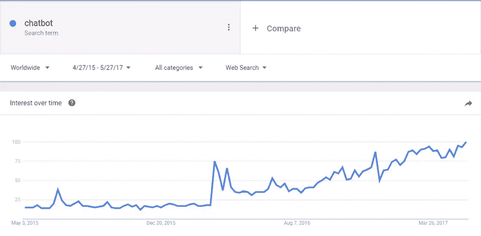
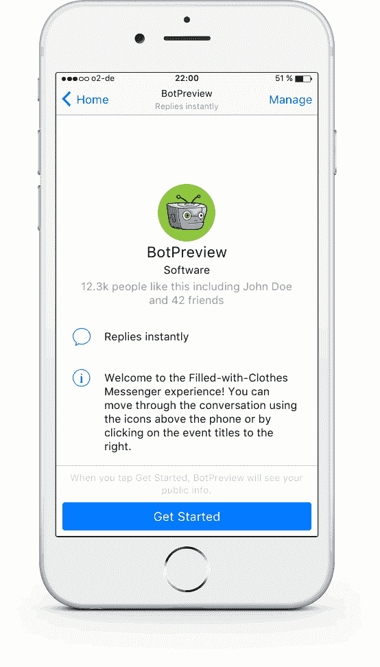
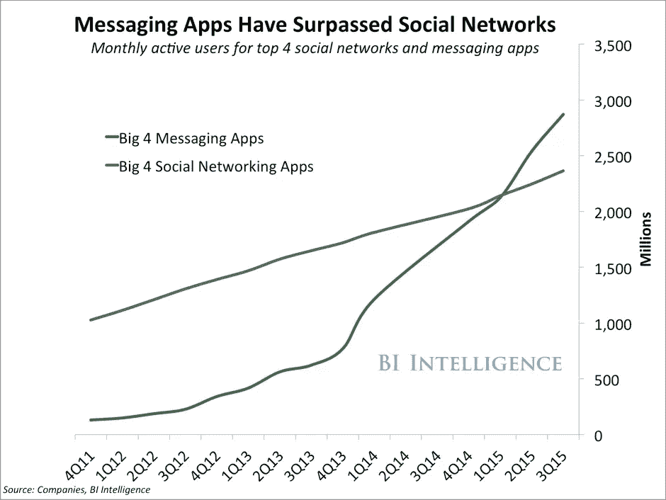
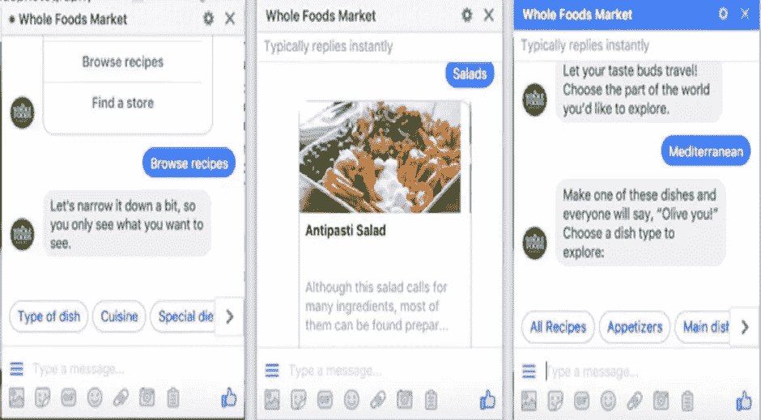
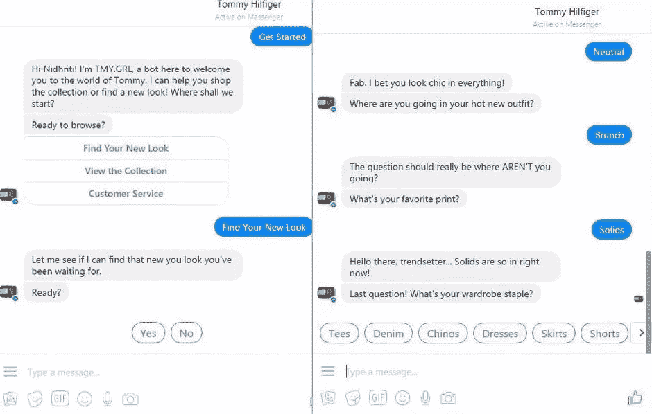
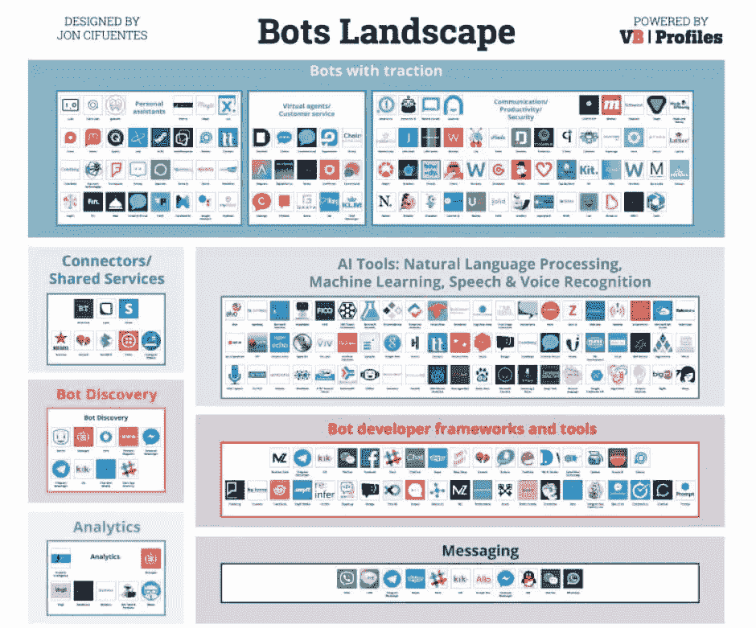

# 聊天机器人和网络发展的未来

> 原文：<https://www.sitepoint.com/chat-bots-and-the-future-of-web-development/>

自从脸书在 2016 年为机器人开发者举办了他们的年度 F8 会议[，微软也紧随其后，围绕聊天机器人有很多炒作、兴奋和猜测。微软首席执行官塞特亚·纳德拉表示，](http://www.mondo.com/facebooks-f8-developer-conference-bots/)[聊天机器人将“从根本上改变计算体验”](https://venturebeat.com/2016/07/11/microsoft-ceo-chatbots-will-fundamentally-revolutionize-computing/)，改变内容和服务在网络上创建和消费的方式。

目前仅 Messenger 网络上就有超过 [10 万个机器人](https://venturebeat.com/2017/04/18/facebook-messenger-hits-100000-bots/)和开发者。超过 [10，000 家企业](https://techcrunch.com/2016/05/10/facebook-chatbot-analytics/)已经在使用或开发自己的机器人，到 2020 年 [80%的企业希望拥有聊天机器人](http://www.businessinsider.com/80-of-businesses-want-chatbots-by-2020-2016-12?IR=T)与客户互动。

在这篇文章中，我将介绍什么是聊天机器人，它们的突然流行，它们如何显著改变我们浏览网页和与网页互动的方式，为什么网页开发人员和设计人员应该关注这种范式的转变，以及他们可以做些什么来跟上这种转变。

## 什么是聊天机器人

这张谷歌趋势图显示，随着时间的推移，人们对“聊天机器人”的搜索兴趣呈指数级增长:

根据定义，聊天机器人是由机器学习和自然语言处理(NLP)驱动的计算机程序，任何人都可以与之交互以完成任务或找到信息和服务。它们主要存在于 Facebook Messenger、Kik、Telegram、Slack、Skype 和微信等信使平台上，这些平台都有现有的用户群。

聊天机器人是智能的、自动化的对话身份，使得点击下拉菜单按钮、选择搜索功能和浏览网站页面变得多余。它们以流畅的对话形式提供即时、具体的结果。

## 机器人将如何改变网络互动

当前的网络交互通常涉及大量的谷歌搜索，得到一堆搜索结果，仔细检查每一个直到我们找到我们要找的东西，最后采取某种行动。

另一方面，使用机器人，浏览和导航元素被简单的问答式对话所取代。

为了更好地理解 web 交互将如何改变，让我们以任何电子商务网站为例。你的最终目标:你想为一次会议买一件漂亮的蓝色衬衫，但不想花费超过 30 美元。

通常，你可能会去一个电子商务网站(比如 filled with weathers . com):你悬停在最上面的类别上，选择男士/女士衬衫，然后被带到另一个登录页面……这还不到一半。

现在，在产品列表页面上，您可以设置一些过滤器来适应您的预算和颜色偏好，也可以跳过这些过滤器，立即开始浏览衬衫。

这是你需要时间和耐心去完成所有的选择并找到你喜欢的。你会查看尺码表，也许，仅仅是也许，决定购买。在此之后，结帐和支付将引导您进行另一系列操作，直到您最终完成下单。

### 用对话代替浏览和导航

现在想象一下，同一个电子商务网站决定获得一个聊天机器人(就像 H&M、汤米·席尔菲格、博柏利和丝芙兰等无数其他品牌所做的那样)。我们叫它衣服机器人吧。理想情况下，他们会将机器人放在受众所在的地方，这很可能是 Facebook Messenger 或他们的网站登录页面。

这是一个与衣服机器人互动的模型:

作为一个用户，你可以和这个机器人聊天，从脸书聊天本身找到产品，就像你给朋友发信息一样。

在我深入解释开发人员和设计人员可以做些什么来成为 bot 革命的一部分之前，我将回顾一下为什么他们首先应该关心，以及在开发和设计方面会有哪些具体的变化。

### 开发者和设计师为什么要关心 bot 时代？

截至目前，所有的大玩家，如谷歌、微软、脸书、IBM 和亚马逊，都发布了大量开源的机器人构建工具和框架来帮助开发者创建机器人。他们还与亚马逊、推特、苹果、英特尔和百度等公司成立了一个[人工智能倡议](https://techcrunch.com/2017/01/27/apple-joins-amazon-facebook-google-ibm-and-microsoft-in-ai-initiative/)，以解决开发和规模扩大阶段可能出现的道德和隐私问题。

每天有 12 亿人使用 Facebook Messenger，引入机器人来帮助企业在同一窗口内进行互动、营销和向客户销售，这比应用程序第一次出现时的范围更大。

用户不需要下载应用程序，而是可以使用一个伞式应用程序，如脸书、Kik、Telegram 或任何其他基于聊天的独立平台，那里有无数的机器人可供人们搜索和交谈。

Kik 拥有一个机器人商店，里面有各种各样的机器人供用户搜索和交流。Slack 向其所有公司账户提供了一份[优秀机器人](https://slack.com/apps/category/At0EFT6813-brilliant-bots)列表，以提高生产率和更快完成任务。这样的例子不胜枚举。

从本质上讲，普通网络用户可以从他们的本地 messenger 应用程序或网络上搜索品牌/公司/服务，并开始与他们的机器人聊天，就像他们在 Messenger 上与朋友聊天一样。

技术领域的早期采用者正在支持机器人革命。值得考虑这对开发者和设计者意味着什么。未来几年网络会是什么样子，机器人会如何塑造它？

## 这会是 Web 3.0 吗？

从移动应用到令人上瘾的社交网络，“Web 2.0”见证了一些标志性的发展，如视频分享网站(YouTube)、博客、维基和 RSS 订阅源(Feedly)、[协作消费平台](https://en.wikipedia.org/wiki/Online_platforms_for_collaborative_consumption#Definition)(优步 Craigslist)。然而，目前两个交叉的趋势使得聊天机器人的兴起成为网络的下一个阶段:

*   **手机 app 疲劳。**大量智能手机用户每月很少或根本不下载应用程序。这两个应用商店有超过 300 万个应用，企业越来越难开发独特的应用，更难在竞争中脱颖而出。

*   信使平台的流行。[有史以来第一次，四大 messenger 应用的月活跃用户数超过了四大社交网络平台](http://www.businessinsider.com/the-messaging-app-report-2015-11?IR=T):

    

    用户显然更喜欢即时的交互式界面。对于寻找目标客户的企业来说，活跃在基于聊天的平台上是有意义的。他们可以将所有基本功能带入聊天环境本身，而不是要求客户从一个登录页面跳到另一个。

以下概述了作为平台的**对话**将如何改变最终用户界面的不同元素:

**设计含义**

| 2017 年网络应用 | 2020 年的网络应用 |
| --- | --- |
| 网页 | Bot URLs |
| 图形用户界面(GUI) | 对话式用户界面(CUI) |
| 网站被组织成多个部分，以便于导航 | 问答布局提供用户特定的结果，使导航变得多余 |
| 下拉菜单 | 聊天中集成的建议或推荐按钮 |
| 弹出窗口和实时聊天服务 | 一体式机器人小部件 |
| 网页内容和博客文章 | 丰富的微内容卡片 |
| 电子商务产品页面 | 对话中的产品目录传送带 |

**发展影响**

| 2017 年网络应用 | 2020 年的网络应用 |
| --- | --- |
| JavaScript，HTML，CSS，后端 | 自然语言处理、自然语言理解和人工智能原理。理解神经网络和回归模式 |
| 基于关键字搜索 | 基于上下文的交互 |
| 独立应用程序开发 | 与多种消息平台集成 |
| 静态用户体验 | 实时体验 |

### (对话式)图形用户界面

混合界面将<abbr title="conversational user interfaces">Cui</abbr>和<abbr title="graphic user interfaces">GUI</abbr>的精华融入一个界面——来自对话模块的即时、个性化的对话，来自图形模块的丰富 UX。

比如看[微信](http://a16z.com/2015/08/06/wechat-china-mobile-first/)。微信每月约有 8 亿活跃用户，它已经将从电子商务到社交网络的所有信息门户和迷你应用程序转变为一个聊天窗口。

简而言之，人们不仅可以用它与人和企业聊天，还可以在不离开聊天的情况下做一些事情，如订购出租车、预订电影票、玩互动游戏、观看新闻、获取股票更新等。

我们现在看到的是对话作为一个平台，品牌和企业正在创造性地试验机器人的营销、销售、参与和支持策略。例如，汤米·席尔菲格、H 和 T2 的丝芙兰在信使(脸书、Kik 和 Telegram)上使用聊天机器人发起与时尚相关的对话，并根据用户的好恶推荐产品。像[优步](https://newsroom.uber.com/messengerlaunch/)、[多米诺骨牌](https://www.digitaltrends.com/social-media/dominos-facebook-chatbot/)和 [1800-flowers](https://www.astutesolutions.com/media/20109/flowers-bot.jpg) 这样的企业通过聊天(脸书)接受订单和付款，而[网飞](https://thepitch.fm/wp-content/uploads/And-Chill-Netflix-Movie-Recommendations-Bot.jpg)、 [TechCrunch](https://techcrunch.com/2016/04/19/all-your-bots-are-belong-to-us/) 和 Casper 正在使用机器人让他们的粉丝参与到随意的对话中，提供电影建议、新闻更新和有用的见解——所有这些都基于用户行为。

这是一个与 Wholefoods 机器人互动的例子，它抛弃了传统的带有图形按钮和问答的菜单:

更具体地说，每个机器人响应本身可能是简单的文本或微应用程序。这给开发者和设计者创造丰富的卡片的机会，展示文本、图像、产品传送带、支付网关、双人游戏、音乐播放器——你能想到的。

鉴于聊天窗口的局限性，开发者不仅需要关注基础设施的建设，还需要关注整体体验本身。

### 个性化和即时的结果将主导传统的浏览

有了导航菜单和许多登录页面或屏幕，网站和应用程序在提供具体答案方面就落后了。搜索字段？肯定不是切！

另一方面，机器人用超级相关的卡片来回答问题，为询问提供具体的答案。例如，你可以告诉机器人你喜欢的艺术家或流派，而不是你需要从一个屏幕跳到另一个屏幕的音乐应用程序或网站，机器人会返回超级相关的歌曲来播放。

一个更好的[用例是电子商务网站](https://www.api2cart.com/blog/chatbots-in-ecommerce-leverage-shopping-cart-integration/),在那里浏览产品页面绝对是一个客户难题，可以用一个简单的聊天机器人来解决。

在机器人世界里，问一个聊天机器人“你有没有很酷的太阳镜？”可能会触发机器人问用户一些相反的问题，比如“你想把它用在什么场合？”或者“有没有你特别喜欢的颜色？”

根据用户的回答，机器人可以返回一个可用太阳镜的文本列表，或者一个带有转盘的丰富卡来滚动搜索结果，每个结果上都有一个购买按钮，可以立即触发支付网关。

这里有一个与汤米·席尔菲格的机器人互动的例子，它将用户带到了一条对话的道路上:

## 对开发者和设计者的启示

从头开始创建一个机器人与创建一个网站或应用程序有着本质的不同。

如果开发人员和设计人员想赶上这股浪潮，他们必须改变他们的工作流程、工具集和整体方法。

首先，他们将不再有一张空白的样板代码来开始。相反，他们必须在聊天窗口中进行设计，并关注基础设施和最终用户的期望。

Bot 框架、实体模型工具、bot 原型工具、测试环境、对话流设计器和分析将是关键(详见下文)。

想要感受一下聊天机器人平台是什么样子的，可以使用一个免费但功能强大的平台，比如 Bottr(by your truly ),它可以让你在登陆页面上嵌入自己的聊天机器人插件,与访客互动。

让我们看看设计师和开发人员保持领先的一些方法…

### 熟悉 bot 框架和库

虽然开发人员可以选择从头开始编写机器人，但机器人框架提供了一个画布，通过让他们访问机器人构建器 SDK、机器人连接器、开发人员门户、机器人目录和仿真器，减少了开发人员必须做的编码量。

它们允许开发人员分配字符、意图、检索模式、响应集等。他们创造的机器人。最流行的框架包括:

*   **微软 Bot 框架。**一个伟大的工具，带有两个模块:机器人连接器和一个 NLU 组件，LUIS(语言理解智能服务)。

    这篇[简单的操作方法文章](https://medium.com/the-node-js-collection/bots-are-banging-getting-started-with-the-microsoft-bot-framework-node-js-b16ccb96b32f)将带您在 node.js 中为 Facebook Messenger 开发和部署一个 bot。

    

    Bot 框架、工具和平台。([来源](https://venturebeat.com/wp-content/uploads/2016/08/Bots-Landscape-v2-final.jpg?fit=780%2C671&strip=all))

*   **Api.ai.** 建立在代理、实体、意图、动作、上下文等核心元素之上。阅读这个[信息资源库](https://docs.api.ai/)，复习关键概念，或者查看 SitePoint 的热门文章“[如何使用 Api.ai](https://www.sitepoint.com/how-to-build-your-own-ai-assistant-using-api-ai/) 构建自己的人工智能助手”。

*   Wit.ai. 通过将样本对话输入知识库来创建机器人。了解 CreativeWorkline 如何让机器人使用 wit.ai 来回复传入的 Messenger 聊天。

*   **Bottr.me.** 端到端解决方案和[聊天机器人创建工具](https://bottr.me/ "Simple and powerful chatbot platform")任何人都可以创建一个机器人，训练它使它变得更聪明(通过对话)，将其部署在现有的社交网络上，并在一个界面下获得机器人对话的分析。

### 了解自然语言处理和机器学习

当从零开始创建智能机器人时，对各种人工智能概念和最佳实践的深入理解是必须的。机器学习的核心在于机器学习、识别模式、理解自然语言并做出相应反应的能力。

设计[智能 NLP 聊天机器人](https://stanfy.com/blog/advanced-natural-language-processing-tools-for-bot-makers/)需要你理解并实现标记化、实体识别、规范化、语音标注、依存解析、意图和情感分析。

作为一名机器人开发者，你将比以往任何时候都需要理解神经网络的概念、[信息检索模型](http://www.wildml.com/2016/04/deep-learning-for-chatbots-part-1-introduction/)、[机器学习算法的类型](https://www.analyticsvidhya.com/blog/2015/06/machine-learning-basics/)、序列到序列架构、子模型、感知位置、锚、元模型等等。

### 开发对话式用户界面

与依赖图形元素的网站相比，对话界面依赖于流畅的对话——脚本和图形上的对话流。

让机器人变得友好、迷人和智能(而不是机器人化、难以理解或令人沮丧)是开发者面临的真正挑战。

作为一名机器人开发者，你必须学会对非线性人类互动背后的意图和情感进行分类。在 CUI 上验证用户输入并对其进行分类比标准 GUI 更复杂，分类器肯定是优先考虑的。

你的聊天机器人对不同用户输入的区分越好，它的对话就越智能。

我建议你在开始之前阅读这些重要的对话式设计技巧。

在“[对话式用户界面原则——设计一个网站聊天机器人的完整过程](https://medium.com/swlh/conversational-ui-principles-complete-process-of-designing-a-website-chatbot-d0c2a5fee376)”中，UX 机构 TheRectangles 的创始人 Leszek Zawadski 详细介绍了最佳对话式用户界面原则以及如何将它们付诸实践。

### 广泛的用户研究和实施的重要性

机器人是新的，机器人是新鲜的，它们才刚刚开始获得疯狂的牵引力。

考虑到人工智能和机器人只是刚刚起步，整个市场的统计数据可能很难找到，尽管不同平台的原始数据提供了关于他们每月活跃用户和参与率的详细报告。有[聊天机器人商店](https://bottr.me/)和目录可以从中获取灵感。有数以千计的[企业和品牌](http://www.topbots.com/100-best-bots-brands-businesses/)可以通过聊天机器人聊天。

在你开始制作一个机器人之前，通过自己与机器人对话来研究用户是如何与他们互动的是一个好主意。

### 机器人模型和流程设计

默认情况下，聊天机器人需要针对聊天窗口进行构建和优化，这与网站或应用程序相反，它们是建立在由 HTML 和 CSS 驱动的空白纸上的。

因此，对于设计师来说，在实际实施之前，使用机器人原型和模型工具来测试他们的想法可能是一个好主意。

一些这样的工具是 BotSociety.io、Botframe 和 Walkie，它们允许设计师在实际部署机器人之前轻松创建和测试用户对话流。

### 以不同的方式分析用户体验

对于网站和移动应用，你可能习惯于考虑参与度指标，如平均会话持续时间、跳出率、点击率、停留时间等，以决定什么可行，什么不可行。

对于机器人，你必须考虑一些因素，如机器人收到的消息数量、对话数量、聊天持续时间、smalltalk 分数、对话漏斗、意图分析、情感分析、用户生命周期等等。

这不再仅仅是月活跃用户的问题；每个机器人会议的有效性和相关性将计算在内。

如果您正在使用一个框架(比如 Watson 或 wit.ai)来构建一个机器人，并将其部署在第三方最终用户平台(任何消息平台)上，Dashbot 和 bot analytics 等机器人分析工具可以非常方便地获得深入的参与和保留报告。

另一方面，使用像我自己的 Bottr 这样的端到端解决方案肯定有它的优势。它带有详细的见解和通知，告诉你人们是如何与你的机器人互动的。

## 结果

机器人革命已经到来，只有时间能告诉我们它会走多远。聊天机器人社区、会议、讨论、开源网络都在增长，每天都有大批开发者加入这一潮流。

所有的机器人框架都有自己的讨论社区，比如 IBM 的[沃森开发者云](https://www.ibm.com/watson/developercloud/)。

许多会议更深入地探讨人工智能和机器人。你可以在这里找到 2017 年[的完整名单](https://blog.standuply.com/best-ai-and-chatbot-conferences-in-2017-55f020acb782)。

像 [Botness](https://www.botness.org/) 、 [UXDesign](https://uxdesign.cc/) 、 [Slack Developer Hangout](http://dev4slack.xoxco.com/) 和 [Open Chatbot](http://www.program-o.com/) 这样的社区对于开发者、设计师和爱好者来说是很好的交流和交流关于人工智能和机器人的想法的地方。

### 帮助您入门的其他资源

由 GitHub 上的 BootCube 提供的关于 bot 播客、原型工具、平台、SDK 等的全方位综合列表。

从本教程中获得灵感，在 Node.js 中创建一个简单的 Twitter 机器人。

看看 Adrian Zumbrunnen 是如何将自动聊天整合到他的网站中的。

为了从其他开发者那里获得灵感，你必须阅读 Joyce Echesssa 如何使用 Node 和 Heroku 创建了一个脸书机器人来响应电影查询，以及 Android Advance 如何使用 Python 和 Watson 框架创建了一个简历机器人。

希望在读完这篇文章后，你对作为网页开发者和设计者如何构建机器人并成为人工智能革命的一部分有了更好的了解。

所以，来吧，卷起袖子[现在就试着创造一个机器人](https://blog.bottr.me/creating-chat-bot/)！

* * *

**在聊天机器人上寻找更多信息？看看这些伟大的链接:**

*   课程:[用 MS Bots 创建一个 Skype Bot](https://www.sitepoint.com/premium/courses/ms-bots-2939)
*   文章:[阅读上述课程](https://www.sitepoint.com/introducing-mini-courses-with-chatbots/)
*   文章:[用 Node 和 Heroku 构建一个脸书聊天机器人](https://www.sitepoint.com/building-facebook-chat-bot-node-heroku/)
*   文章:[用电子制作 Skype 机器人&微软机器人框架](https://www.sitepoint.com/skype-bot-electron-microsoft-bot-framework/)

查看 [SitePoint Premium](https://www.sitepoint.com/premium/paths) 获取更多书籍、课程和免费视频。

* * *

## 分享这篇文章