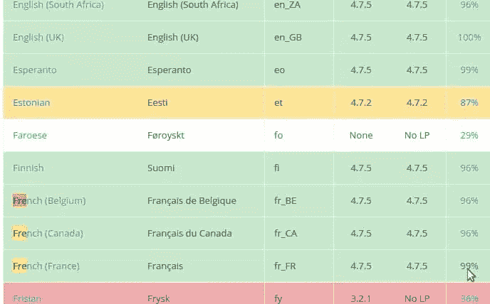
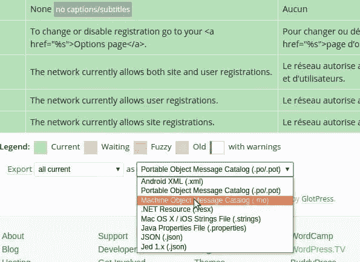
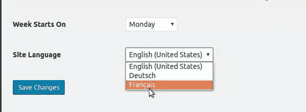
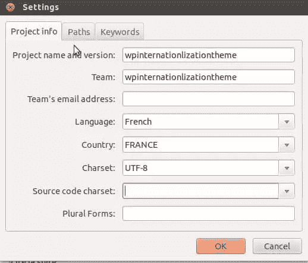
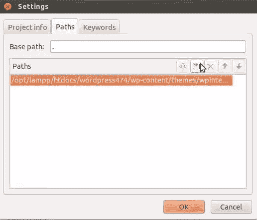
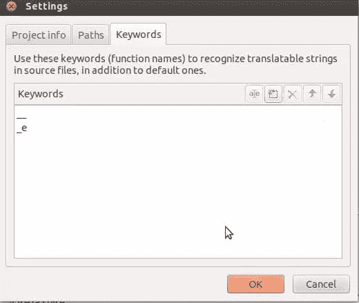
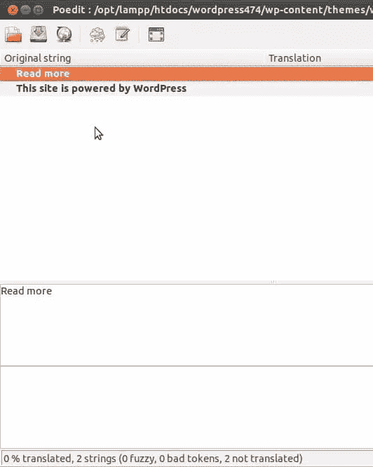

# 你的 WordPress 主题的国际化

> 原文：<https://www.sitepoint.com/internationalization-wordpress-theme/>

WordPress 用于创建各种类型的网站。当构建一个 WordPress 主题时，你应该为尽可能多的受众构建。这个目标也意味着你的主题应该为不同语言的站点做好准备。WordPress 提供了一个简单的 API，您可以在主题中使用它来为主题提供国际化。在本文中，您将看到如何让您的主题为不同的语言做好准备。

## 如何为不同的语言配置 WordPress

你可以在你的 WordPress 网站上添加不同的语言。为此，你可以从 WordPress 翻译团队的[博客下载翻译文件。在这个页面上，您可以看到各种语言的翻译，以及翻译完成的百分比。假设我想下载法语。我将转到法语行，然后单击百分比，如下图所示。](https://make.wordpress.org/polyglots/teams/)



然后，你可以点击 WordPress 版本，并导出如下图所示的`.mo`文件



一旦你下载了`.mo`文件，你必须把它上传到你的 WordPress 安装的`wp-content/languages`文件夹中。然后你可以在你的 WordPress admin 中进入设置- >常规。在那里你应该可以看到你放在`wp-content/languages`文件夹中的语言选项，如下图所示。请选择您希望将网站更改为的语言，然后单击“保存更改”



## 在你的主题中加载文本域

主题国际化的第一步是*创建*主题。在本例中，您可以从创建主题 twenty thinking 的子主题开始。要创建子主题，首先创建一个文件夹`wp-content/themes/wpinternationlizationtheme`。在该文件夹中添加包含以下内容的文件`style.css`:

```
/*
 Theme Name:   wpinternationlizationtheme
 Description:  Twenty Seventeen Child Theme.
 Author:       Abbas Suterwala
 Author URI:   http://example.com
 Template:     twentyseventeen
 Version:      1.0.0
 Text Domain:  wpinternationlizationtheme
*/ 
```

该文件定义了一个名为 wpinternationlizationtheme 的子主题。这是 217 的儿童主题。在上面，每个字段都是我们为子主题定义的标准字段。字段 Text Domain 是为该主题的文本域定义唯一名称的字段。这个主题应该使用这个键作为唯一标识符来加载翻译文件。

用下面的代码创建一个`functions.php`

```
<?php
function wpinternationlizationtheme_enqueue_styles() {

    $parent_style = 'parent-style'; 

    wp_enqueue_style( $parent_style, get_template_directory_uri() . '/style.css' );
    wp_enqueue_style( 'child-style',
        get_stylesheet_directory_uri() . '/style.css',
        array( $parent_style ),
        wp_get_theme()->get('Version')
    );
}
add_action( 'wp_enqueue_scripts', 'wpinternationlizationtheme_enqueue_styles' );

?> 
```

上面的代码加载父主题(在本例中是 217 个)样式。然后加载子主题中的样式。

这允许子主题样式是最后加载的样式，并且可以根据子主题的需要进行定制。现在你需要加载文本域，这意味着指明 WordPress 将在哪里搜索这个主题的翻译。你可以使用 WordPress 函数 [load_theme_textdomain 来加载主题的文本域。](https://codex.wordpress.org/Function_Reference/load_theme_textdomain)

为此，将以下代码添加到您的`functions.php`中:

```
function wpinternationlizationtheme_setup(){
    $domain = 'wpinternationlizationtheme';
    // wp-content/languages/wpinternationlizationtheme/de_DE.mo
    load_theme_textdomain( $domain, trailingslashit( WP_LANG_DIR ) . $domain );
    // wp-content/themes/wpinternationlizationtheme/languages/de_DE.mo
    load_theme_textdomain( $domain, get_stylesheet_directory() . '/languages' );
    // wp-content/themes/wpinternationlizationtheme/languages/de_DE.mo
    load_theme_textdomain( $domain, get_template_directory() . '/languages' );
}
add_action( 'after_setup_theme', 'wpinternationlizationtheme_setup' ); 
```

上面的代码与`after_setup_theme`动作挂钩。在这个操作中，您加载了主题的文本域。这是使用函数`load_theme_textdomain`完成的。该功能设置为在以下目录中查找`.mo`文件:

```
- Languages directory
- Child theme directory 
- Parent theme directory 
```

## 国际化的 WordPress 函数

一旦你设置了文本域，看看你可以在 WordPress 中使用的国际化函数。您主要可以使用两个功能。第一个是 [__](https://developer.wordpress.org/reference/functions/__/) 。这个函数有两个参数，第一个是字符串，第二个是域。然后，该函数根据所选语言返回适当的本地化字符串。

因此，如果您想在每篇文章的末尾添加一些文本，而且还想根据所选的语言进行本地化，请将以下代码添加到您的`functions.php`中:

```
function wpinternationlizationtheme_after($content) {
    return $content . __('Read more', 'wpinternationlizationtheme');
}
add_filter('the_content', 'wpinternationlizationtheme_after'); 
```

另一个功能是 [_e](https://developer.wordpress.org/reference/functions/_e/) 。这采用了与`__`相同的两个参数。这个函数直接在页面上显示本地化的文本，而不仅仅是返回它。

因此，例如，如果您想要添加一个应该显示本地化的页脚消息，那么您应该创建一个包含以下内容的`footer.php`:

```
<?php
_e('This site is powered by WordPress','wpinternationlizationtheme');
?> 
```

## 创建。维护对象文件

一旦创建了国际化所需的代码，您将需要创建本地化文件。有许多工具可以用来创建`.mo`文件。在这篇文章中，你将看到其中一个流行的， [poedit](https://poedit.net/) 。你可以从 https://poedit.net/download 为你的操作系统下载 poedit。

下载完 poedit 后，您可以选择“文件->新目录”来查看以下屏幕:



在此屏幕中，您可以输入项目的基本信息。下一个选项卡给出了需要被解析以找到需要被本地化的字符串的代码的路径，如下所示:



下一个选项卡允许您输入需要搜索的关键字，以获得所有需要本地化的字符串。因为您已经在上面的例子中使用了两个函数`__`和`_e`，所以在这个选项卡上添加这两个函数。



完成后，该工具将搜索所有需要本地化的字符串，如下图所示。



您现在可以为每个字符串添加本地化，然后单击“保存”在`wp-content/themes/wpinternationlizationtheme/languages/fr_FR.mo`保存文件

现在，最后，如果您将语言更改为“法语”,您应该会在主站点上看到本地化为法语的字符串。

## 结论

WordPress 是最流行的 CMS 平台之一。你可以相对容易地了解 WordPress 主题开发。基于 WordPress 主题的网站用户数量庞大，种类繁多。因此，你的主题迫切需要有多种可用的语言。在许多行业中，你的 WordPress 站点能够迎合不同地区和国家的受众是绝对必要的。

让你的主题为国际化做好准备是成功的关键因素。用于国际化的 WordPress API 很容易使用。它使得本地化你的主题变得非常容易，而不需要改变任何代码文件。所以，祝你的下一个 WordPress 主题国际化愉快，并在下面的评论中告诉我们你的经历！

## 分享这篇文章