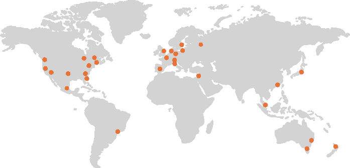
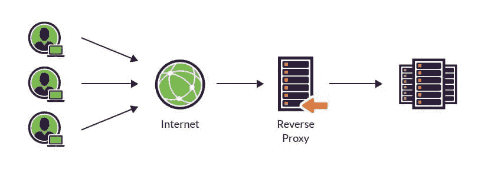
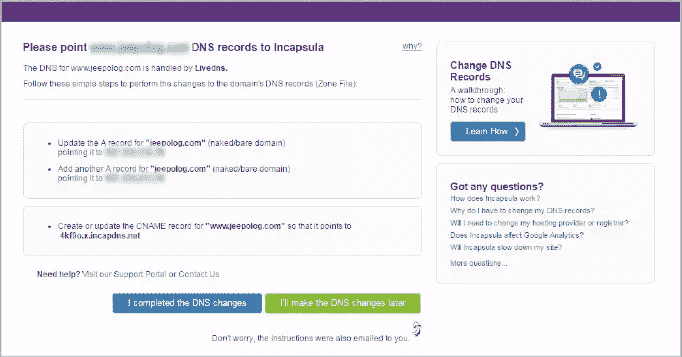

# WordPress 使用 CDN 的 4 个理由

> 原文：<https://www.sitepoint.com/4-reasons-cdn-for-wordpress/>

*在这个 SitePoint 高级课程中，你可以学习如何[使用 CloudFlare CDN](https://www.sitepoint.com/premium/courses/wordpress-security-2954/lesson/1/step/2) 保护 WordPress 站点(需要高级订阅)。*

互联网需要速度；这是每个人都知道的。但是为什么这对你的 WordPress 站点如此重要，为什么你应该使用一个用于 WordPress 的 CDN 来帮助你站点的加载时间呢？

你可能已经看过 [3 秒加载时间图](https://www.soasta.com/blog/mobile-web-performance-monitoring-conversion-rate/)很多次了。它，还有无数和它一样的图表，无处不在。

这是有原因的——页面加载时间会影响转化率。就这么简单。大多数 WordPress 网站的最终目标是什么？我知道我的网站都专注于赚钱。无论他们是联盟网站还是基于服务的网站，他们都旨在转化。

如果加载时间影响转化率，那么关注速度是一件好事！

看看你可能想为你建立或管理的 WordPress 站点使用 CDN 的四个原因。

## 1.有了 CDN，你的网站会加载得更快

这是为 WordPress 建立 CDN 的最强卖点之一。

你的网站最大的速度杀手之一是*距离*。具体来说，你的主机服务器和访问者的浏览器之间的距离。虽然你的页面大小确实很重要，但是内容需要经过的距离绝对是网站加载速度的最大瓶颈。

理想情况下，你的访客需要尽可能靠近托管服务器。

不幸的是，在离任何一个特定访问者很近的地方建立一个托管服务器几乎是不可能的——除非你正在建立一个 CDN。

内容交付网络(CDN)的理念正是如此。CDN 的主要目的是在不同的地理位置设置尽可能多的服务器，以便任何访问该服务的人在物理上尽可能靠近其中一个位置。

看看下面这张来自于 [Incapsula CDN](https://www.incapsula.com/cdn-content-delivery-network/) (我最喜欢的服务之一)的图片，它完美地解释了这个概念。

可以看到有很多 CDN 服务器点。以这种方式，世界上任何位置的所有访问者总是从离他们(相对而言)近的位置获得内容。

在 CDN 网络上托管静态内容是最接近于为你的网站创建一个全球托管设置的方式。

## 2.有了 CDN，你的网站会更安全

CDN 对你的网站至关重要的另一个原因是安全性。

你知道超过 51%的网络流量实际上来自于机器人而不是人类吗？

当我第一次看到这份报告时，我完全被吓了一跳:

上面更可怕的统计数据是，29%的网络流量来自恶意机器人。

这意味着你的网站经常受到大量不良机器人流量的影响。如果你曾经看过分析数据，或者使用过像 [WordFence](https://wordpress.org/plugins/wordfence/) 这样的安全插件，你就已经知道这个事实了。

这些机器人不断探测你的网站的漏洞。如果你在安全方面稍有疏忽，如果你没有[选择一个好的 WordPress 主机](http://www.wpbeginner.com/wordpress-hosting/)，或者如果你错过了一个 [WordPress 安全更新](https://www.sitepoint.com/head-slapping-wordpress-security-with-expert-chris-burgess/)或者一个插件更新，请放心，你的网站将很快遭受后果。

大多数 CDN 能够快速识别和阻止不良机器人，使您的网站在插入 CDN 时更加安全。通过网络获得的集体知识可用于防止对您自己网站的攻击。

## 3.使用 CDN 保护您的站点免受基于流量的攻击

我相信你一生中至少遇到过几次交通堵塞。我知道我有。堵车是对生产时间和金钱的浪费。

同样的概念也适用于你的网站。

然而，更糟糕的是有人故意给你的网站发送大量的流量。

在分布式拒绝服务(DDoS)攻击中，一大群受威胁的 web 服务器或计算机(甚至物联网设备)被招募来向您的网站发送如此多的流量，以至于您的合法用户无法访问它。

如果你的网站是你业务的生命线，DDoS 攻击可以让你的业务陷入停顿。不管你是在共享主机服务器上还是在专用服务器上，你的网站都无法跟上流量的洪流。

CDN 用来使你的网站快速的相同概念，也可以通过吸收你网站前面的全球服务器网络上的恶意流量而对你有利。

大多数 CDN 实现使用反向代理的概念来服务您的网站。反向代理将是 CDN 服务器网络。

这意味着您网站的访问者(包括良性和恶意的)将在访问您网站的实际服务器之前访问离他们最近的 CDN 服务器。

通过这种方式，任何恶意流量都会在实际到达您的服务器之前被拦截。cdn 拥有智能算法，能够识别恶意 DDoS 流量并将其杀死。

Incapsula、MaxCDN、KeyCDN 和大多数顶级玩家都支持减轻基于流量的攻击。

## 4.更快的网页设计和开发

当你创建一个完全优化性能的 WordPress 站点时，你必须执行一些额外的实现步骤。

你将寻找一个图像优化插件，一个内容缩小和组合插件，一个静态和动态内容缓存插件，以及其他工具来全面优化 WordPress 网站。虽然有可能一两个插件实际上能够满足你的大部分优化需求，但是你仍然需要执行额外的测试来确保插件能够正确运行。

就我个人而言，我发现用各种插件进行优化是一场巨大的噩梦。

cdn 实际上能够一举完成上述所有优化。图像优化、动态文件压缩、静态和动态内容缓存都内置在 CDN 中。

除此之外，还有其他优化，如自定义内容缓存规则，以修复网站上特定插件的任何问题。

这些性能优化中的大部分很难用你典型的 WordPress 插件来实现。

诸如会话重用优化(特别是对于 HTTPS 网站)，TCP 连接预池和快速清除都提高了优化。

其他改进，如[改进 SSL/TLS 握手过程](https://www.incapsula.com/cdn-guide/cdn-and-ssl-tls.html)，不是典型的开发人员自己能够优化的。让 CDN 完全处理这件事会带来显著的提升，尤其是对 HTTPS 的网站，不幸的是，当启用 HTTPS 时，这些网站的性能会受到影响。

所有这些优化都减少了网站的设计和开发时间，同时尽可能提高性能。

满足上述所有需求的 CDN 将大大减少优化时间。

## 如何为 WordPress 实际建立一个 CDN

如果你选择一个反向代理支持的 CDN，它的设置是绝对简单的，只需要对你的 DNS 设置做一些改变。这些变化将立即通过 CDN 路由流量，并立即部署该 CDN 的所有优势。

虽然你可能已经看到很多文章提到需要安装一个 CDN 插件来提供来自 CDN 的静态内容和图像，但我已经在其他地方写过典型的 CDN 插件是如何工作的(例如，通过重写你的站点的源代码来引用 CDN 的 URL，而不是你的站点的 URL)。然而，这只有在您使用上传 CDN 时才有必要。如果你正在寻找一个 WordPress CDN 插件，在 WordPress 插件目录中有很多选择。

虽然安装一个 CDN 插件会让你的网站更快，但是你的网站不会从你在这篇文章中学到的大部分优势中受益。相反，你应该像其他非 WordPress 网站一样使用反向代理 CDN 来实现 CDN。

## 结论

速度通常是使用 CDN 最明显的好处，人们会反复提到这一点。

虽然网站加载速度是一个关键因素，也是建立 CDN 的必要理由，但这不应该是唯一的卖点。

提到的其他点，特别是性能、安全性、保护和更好的优化与网站加载速度一样重要。

你在你的 WordPress 站点上设置了 CDN，或者使用了 CDN 插件吗？请在下面的评论中告诉我们你的经历！

## 分享这篇文章