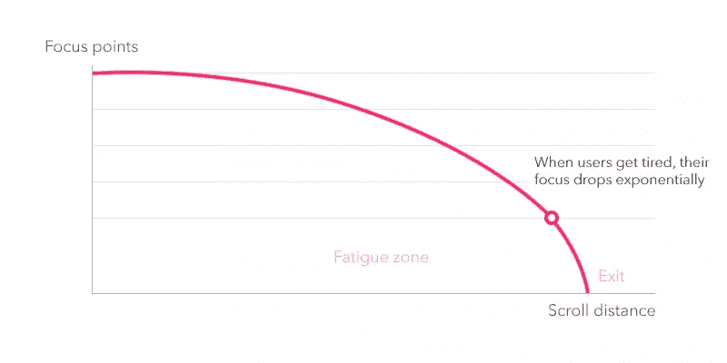
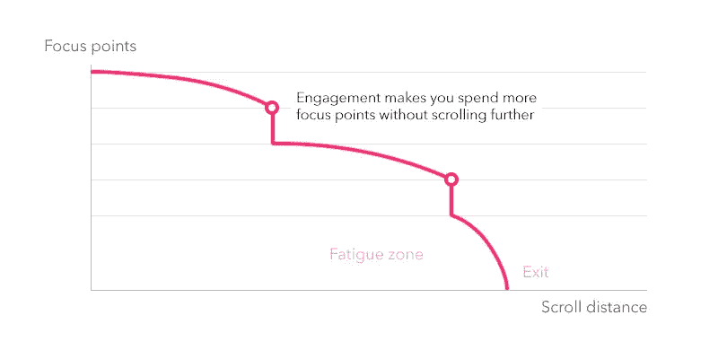
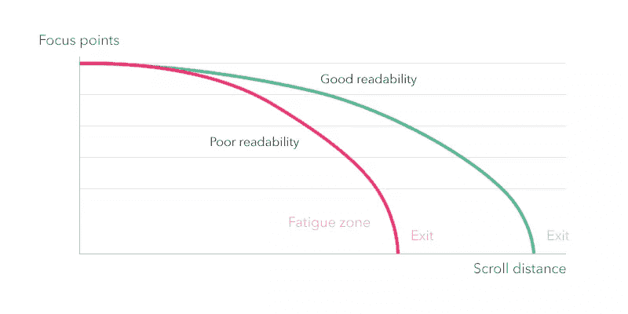
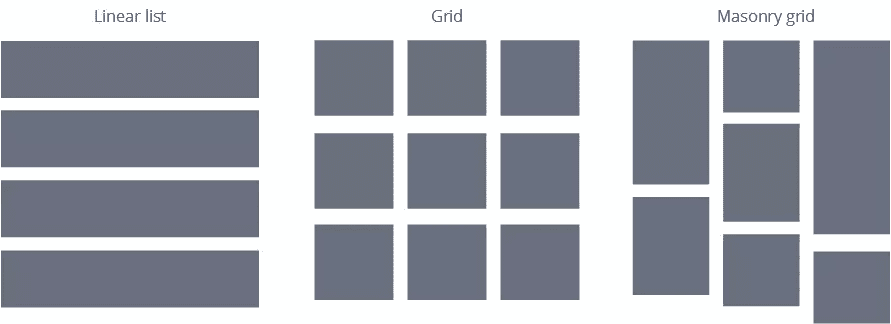
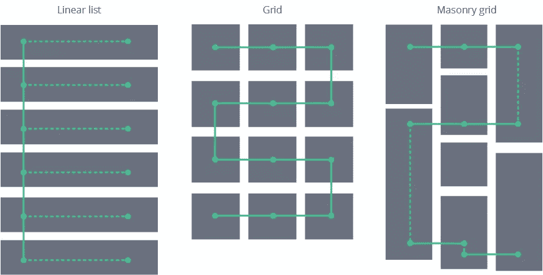
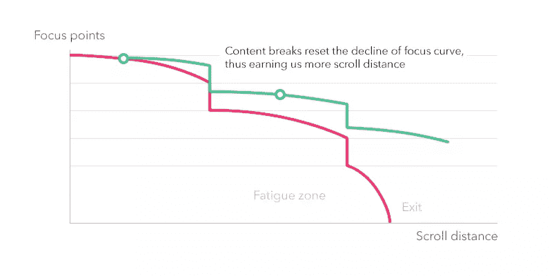
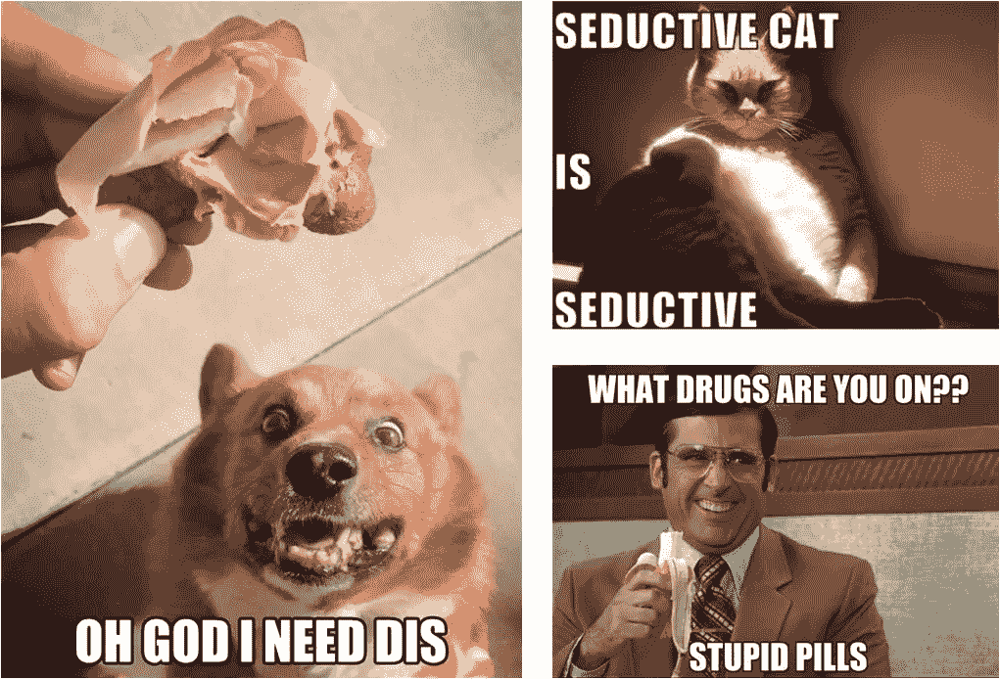
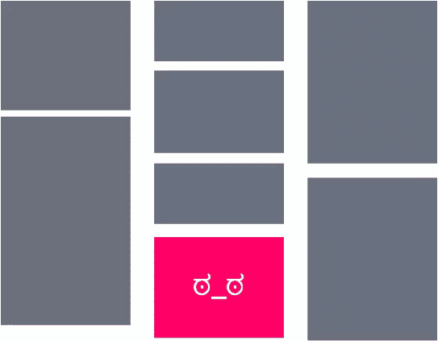
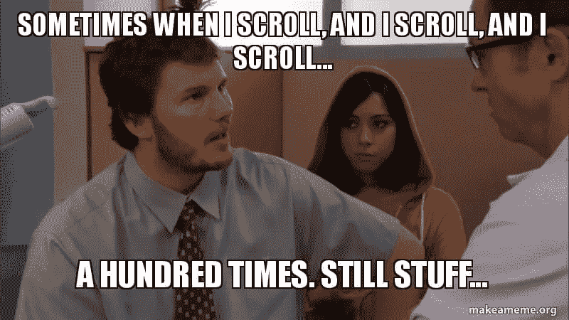

# 僵尸滚动条的 UX(以及如何治愈它)

> 原文：<https://www.sitepoint.com/the-ux-of-zombie-scrollers-and-how-to-cure-it/>

如果你在网上工作，你可能已经明白大多数读者不会用心阅读你内容的每一个字。相反，他们几乎是无意识地扫描它——就像你扫描超市过道里经过的食品标签一样。

## 我们为什么要扫描？

简单。我们扫描是因为它需要更少的精神努力，我们更喜欢把注意力放在重要的事情上。我们“浏览”内容，直到我们找到真正吸引注意力的东西——当我们激活我们的“[慢速思维](https://en.wikipedia.org/wiki/Thinking,_Fast_and_Slow)”时。

超市是我们扫描的一个典型例子。我们的眼睛可能会在没有正确阅读任何标签的情况下摄入 50 种不同的意大利面酱。

然而，当我们开启“缓慢、专注的思考”——也许是阅读酱罐上的成分——我们的大脑开始消耗更多的精神能量——这是一种有限的资源。

有兴趣了解伟大原型的秘密吗？看看[设计 UX:原型](https://www.sitepoint.com/premium/books/designing-ux-prototyping)——一本来自本·科尔曼&丹·古德温的新书。

### 介绍“焦点”

所以，让我们把这个想法游戏化，把这种大脑能量叫做**‘焦点(FP)’**。我们花费的焦点越多，我们就越感到疲劳，我们的思考力就越弱。

当用户浏览一个长页面的内容时，每次他们注意到他们感兴趣的内容时，他们都在花费这些“焦点”。他们滚动的时间越长，就越疲劳。

当然，这意味着他们在页面下方发现的内容较少受到关注。就像试图用一个塞满东西的手推车来吸引购物者一样，他们只剩下更少的“食物”可以花了。因此，即使是高质量的内容选项也变得不那么显眼和吸引人。我们把这种现象称为**滚动疲劳**。

让我们画一些线来形象化所有这些焦点经济。如果你在浏览一个内容时没有付出任何努力，你只是在逐渐燃烧你的注意力，直到你累了并最终放弃。

图表:焦点与滚动距离。平稳的下降。

然而，如果你在没有任何“回报”的情况下参与内容，你只是在一个点上花了一堆关注点。例如，如果你积极参与社交媒体的每个故事，你的大脑会在几次有意义的互动后关闭。

图表:焦点与滚动距离。互动需要精神能量。

### 可读性和重点

你应该记住的另一个因素是可读性。如果你的内容很难阅读，它需要更多的努力来消化，燃烧焦点更快。所以除非你有意伤害你的用户，否则不要让你的列表变得困难，只暴露必要的信息。你真的需要出版日期吗？你需要每个列表上都有这个主题吗？

图表:焦点与滚动距离。可读性提高意味着平均滚动时间更长。

### 愤怒-退出和僵尸

非常长的滚动页面对你不好。

一般来说，随着用户进入滚动疲劳区，他们的大脑变得不太容易受到标准挂钩和奖励机制的影响(焦点曲线呈指数下降)。这自然会降低任何努力消化信息的动力，最终他们会放弃。

这就好像疲惫的滚动用户变成了僵尸。为了避免这种情况，我们必须尽量减少焦点的消耗。

### 疲劳如何影响不同类型的内容集合

如果你正在设计一个具有大滚动范围的大型内容集合，你也会面临疲劳问题。你必须展示尽可能多的内容，同时让你的用户有足够的意识来参与其中。

要理解如何处理这个问题，您应该知道用户如何扫描不同的列表布局。让我们实际一点。如今，有三种主要类型的内容列表:

三种网格类型

#### 线性列表

显示大块内容的最自然、最常见的方式是将它们排成行。谷歌搜索结果和易贝列表符合这一经典模式。线性列表是最容易扫描的，很难错过任何内容项目，用户可以并排比较项目，因为它们都对齐在一起。

线性表的缺点主要是美观。通常它们会占用更多的空间，视觉上可能会令人厌烦*(我这里不是在说 Excel】。*

#### 经典网格

第二个最常见的选择是把你的项目放在 2D 网格中。这是一种将更多内容压缩到视窗中的绝妙方法——尤其是如果您的内容更多地是图形而不是文本。图片库和购物网站喜欢这种模式。

这很好——直到你需要你的用户关注每一个项目。由于扫描网格模式比线性列表要求高得多，你会更快地烧穿用户的焦点。此外，过不了多久，用户通常会开始跳过大块的内容，网格的可用性就会下降。

#### 砖石网格

砖石网格是传统网格的变体，但单位尺寸的变化要大得多。许多人会认为砖石网格是显示图形内容最具美感的方式。它允许您平铺整个视口，并使每个内容项目具有不同的大小。Pinterest 可能是最著名的砖石网格布局，但你会发现砖石广泛用于情绪板和橱窗。

但是，不好的一面是纯粹的视觉混乱。没有明显的视觉秩序，没有清晰的眼导图案。因此，如果你试图用砖石来表示某种 IA 结构，你很可能会让你的用户感到困惑。

## 每个网格的扫描模式

请记住，新鲜的用户有更多的关注点来消费。他们的滚动行为是一致的，有序的，就像一个警察搜索队。

扫描刷新用户的特征码。

但是在每种情况下，当用户进入“疲劳区”时会发生什么呢？简而言之，他们切换到僵尸自动驾驶模式，他们的扫描模式变得更加混乱。

扫描模式:疲惫的用户开始像僵尸一样东倒西歪。

## 聚焦增强概念

那么，这是否意味着试图影响筋疲力尽的用户是徒劳的？不完全是。

还记得我提到过疲劳用户在自动驾驶模式下滚动吗？事实证明，我们可以“黑掉”这个自动驾驶仪，并利用它为自己谋利。

当处于自动驾驶模式时，我们的大脑具有自动机制，仍然会受到外部刺激的影响。这与帮助我们的史前祖先避免危险的机制相同，被称为 [*无意识选择性注意*](https://www.scientificamerican.com/article/your-hidden-censor-what-your-mind-will-not-let-you-see/) 。

基本上，这个过程允许我们的大脑在休眠模式下巡航，但同时保持一只眼睛(或一只耳朵)关注意想不到的事情。当意想不到的事情发生时，它会引发一种反应，迫使我们慢慢思考。如果你曾经用眼角发现过一只蜘蛛，你就知道这是怎么回事了。

## 好吧，这和内容列表和滚动有什么关系？

这种意想不到的反应正是我们的目标——超越自动驾驶仪。通过在单调的列表中创建*意想不到的内容中断*，我们可以让用户停止滚动，重新聚焦一毫秒。这种休息为我们提供了一个号召行动或将用户的注意力集中在想要的亮点上的机会。

### 重新激发我们的关注点

内容分隔符还有另一个有用的副作用。它们提高了用户的注意力水平，降低了滚动疲劳的阈值。简单地说，如果你不让你的用户慢慢进入完全自动驾驶模式，他们会在你的列表上停留更长时间。

图表:焦点与滚动距离。休息时间允许用户刷新他们的“焦点”。

## 实际应用

我们希望应用内容中断来保持用户的积极性，并消化/吸引更多的内容。在这里，我给你一些实际的例子，告诉你如何在现实世界中使用它们。

1.  #### 食物、性和危险

    让我们从本能导向的触发器开始。他们不需要改变你的内容格式，只需要改变内容本身。这些触发器都是针对人类最基本的本能: ***性******食物*** 和 ***危险/进攻*** 。注入一些包含这些主题的内容应该会给你带来一些非常有趣的结果。

    

    食物、性和危险打破了用户的自动驾驶仪。

2.  #### 奖励系统

    针对用户奖励反应的触发器也很有效。尤其是当你想达成某种约定的时候。要做到这一点，你需要加入一个独特的行动号召，提供奖励和必要的承诺。这将产生一种暂时的幸福感，为你的用户进一步滚动提供动力。

    

3.  #### 视觉变化

    另一类是布局或图形中意想不到的视觉变化。比如应用明亮的颜色或者改变列数。这使得用户打破他们的扫描模式，重新建立他们的焦点。然而，值得注意的是，这通常不是良好可用性的特征，所以你不应该在较短的列表或列表的开头使用这样的分隔符。

    

4.  #### 短暂的休息

    你知道，当你滚动和滚动…然后你进入滚动的势头，你无意中忽略了所有的内容旋转过去？如果你有一个无限卷轴，这是一个相当普遍的行为模式。

    要打破这种行为，让用户回到现实世界，你需要阻止他们。我的意思是停止加载和滚动。放一个“加载更多”按钮，甚至一个假的预加载器，让他们思考接下来会发生什么，并重新集中注意力。当然，在这之后，有可能你的用户会转向…但是，你不需要一个僵尸浏览你的网站；)

    

关于一些更实用的技巧，你可以去 Abbas 的 5 分钟阅读网站[看看 6 种改进可滚动内容的方法](https://www.sitepoint.com/6-ways-to-improve-long-scroll-mobile-websites/)。

### 大外卖呢？

正如你可能猜到的，不能保证所有这些实践对你都有效。这很大程度上取决于你的商业案例、目标和目标受众。然而，实验是找出答案的最好方法。所以，不要害怕在你的列表中引入内容间断，如果你有机会，尝试一下。

如果你只是滚动到这里的底部，这里有一个 TLTR 版本来总结一切:

*   用户的“焦点资源”有限
*   当滚动长列表时，所有用户逐渐失去焦点和注意力
*   当用户感到疲劳时，他们会停止参与，不可避免地退出
*   疲劳也会让用户错过重要的相关内容
*   用户确实会对内容中的意外变化(内容中断)做出反应
*   你可以在你的内容中添加人工触发器，让你的用户脱离“僵尸模式”
*   尝试内容分隔
*   干杯！

## 分享这篇文章