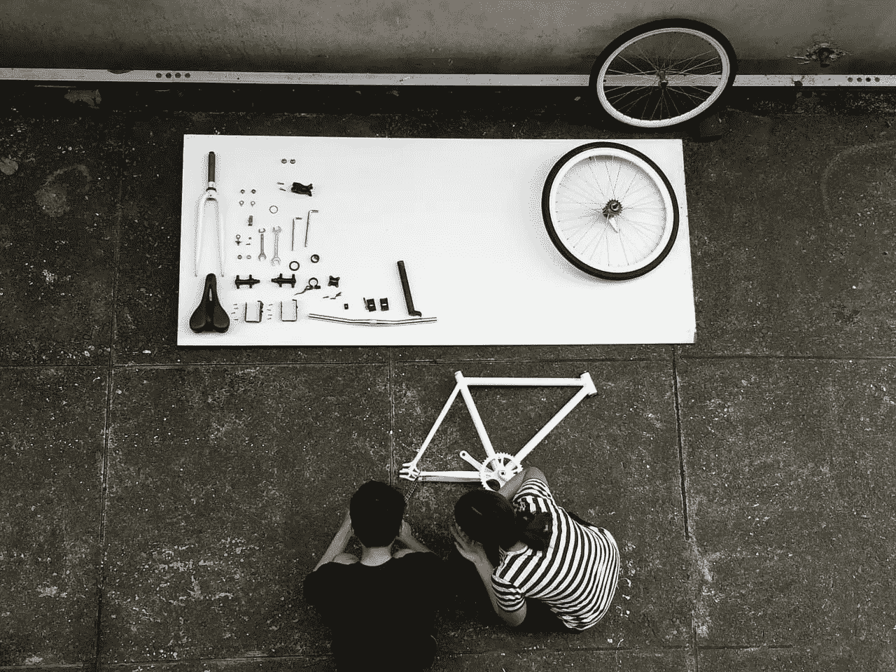
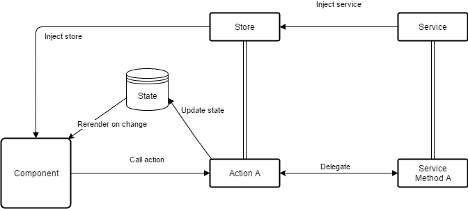

# 用高阶组件管理 Aurelia 中的状态

> 原文：<https://www.sitepoint.com/state-aurelia-higher-order-components/>

这篇文章最初是由 Aurelia 核心团队成员 Vildan Softic 在 practical Coder 上发表的。如果你喜欢这个，为什么不去那里看看他的其他作品。此外，如果你有兴趣了解与奥雷利亚相关的最新消息，你可以在这里[注册他们的官方通讯](http://bluespire.us5.list-manage1.com/subscribe?u=a04965e8575a4982c87caaa12&id=11ccaca293)。



我们不能忽视不断增长的改变范例的重要性，无论我们谈论的是社会、政治还是软件开发问题。最近，前端 web 开发对[可预测状态容器](https://hashnode.com/post/how-do-you-explain-the-term-predictable-state-container-in-simple-words-ciizdac5300wege53dogz8aqk/answer/ciizmyxy300yaeb53599h31al)越来越感兴趣，这是由 [Flux](https://facebook.github.io/flux/) 等概念引入的，并因 [Redux](http://redux.js.org/) 而变得流行。与此同时，更加函数化的编程风格——尤其是组件组合——已经改变了我们构建应用程序的方式。

乍看之下，这两个想法都不太重要，也不会改变世界，但是把它们放在一起，可以提供一个很好的开发者体验。与众所周知的概念如 [MVVM](https://en.wikipedia.org/wiki/Model%E2%80%93view%E2%80%93viewmodel) 和经典服务相比，我不会判断这是否是一个更好的方法。相反，我想分享一种方法，帮助你结合这两个概念，从而获得两个世界的最佳。

这篇文章谈到了理论，实际代码和完整的例子可以在 GitHub 找到。包括模板在内的资源被充分注释以解释设计选择，回购的自述文件包含一个[推荐的查看示例的方式](https://github.com/zewa666/aurelia-hoc-store#recommended-way-to-review-the-example)。因此，我们不会在实现细节上浪费时间，比如 RxJS 的使用，而是直接理解核心概念。

## 现代发展方法

现代开发方法利用单个存储，它充当应用程序的基础。这个想法是，这个存储保存组成您的应用程序的所有数据。存储的内容是应用程序的状态，即特定时刻应用程序数据的快照。从函数的角度来说，如果我们用一个函数`renderApp`来表示整个应用程序，那么状态就是我们传入的参数。

```
function renderApp(state): RenderedApplication 
```

如果我们只想生成没有任何交互的静态站点，我们已经做得很好了，可以停止工作了。然而，今天的大多数应用程序提供了过多的交互。因此，如果状态是特定时间点的快照，则事件可以被视为将我们的状态从当前状态更改为新状态的触发器。这样的用户交互可以比作一个缩减器，它通过应用来自某个动作的指令来修改当前状态。

```
function userInteraction(oldState, ...actionInstructions): NewState 
```

尽管修改是一个危险的游戏。如果我们改变原始源，我们将如何知道新旧状态之间的区别？因此,[不变性](https://www.sitepoint.com/immutability-javascript/)是现代方法的一个关键方面，因为它维护原始源并创建新状态的修改副本。所以当前状态变成旧状态，交互创建下一个当前状态。

```
 CURRENT STATE           --> USER INTERACTION                  
 --> NEW STATE 

 renderApp(currentState) --> userInteraction(currentState, ...)
 --> renderApp(newState) 
```

过去、现在和未来是一定数量的动作之后的状态快照。记住这一点，我们可以将当前状态向后移动，通过反转动作并回到先前的状态。

```
 NEW (aka CURRENT STATE)  --> USER INTERACTION * -1         
 --> CURRENT (aka OLD STATE)

 renderApp(newState)      --> userInteraction(newState, ...)
 --> renderApp(currentState) 
```

这里有趣的一点是函数调用序列不会改变——只有它们的输入会改变。因此，我们可以得出结论，一个状态只受行动的影响，给定一个特定的输入，我们总是可以期待相同的输出。这反映了纯组件的性质。

## 单一受控商店

单个受控商店开始变得有意义，因为如果我们可以将所有更改限制在一个地方，我们就可以保持对结果的控制，从而呈现我们的应用程序。那是我们的商店。像 Redux 这样的解决方案迫使您以僵化的方式设计和创建应用程序，这可能最终不符合您的设计目标。

另一件要记住的重要事情是，虽然人们不愿意改变行为和适应新的范式，但这对于公司企业来说更是如此。因此，对现有的软件应用一种完全不同的开发方法是一场艰难的斗争。

与 Aurelia 一起工作的开发人员通常对 MVVM 模式有着深刻的理解，这种模式在大多数时候将服务作为一种最佳实践来推广，以保持业务逻辑与 UI 逻辑的分离。结合 Aurelia 的依赖注入，我们得到了单例实例处理动作。然而，没有存储的约束，因为服务本身并没有规定应该在哪里以及如何访问和修改数据。服务保持状态吗？您是否只允许使用 setters 修改它并通过 getters 访问它？这种灵活性既是福也是祸，因为它意味着您可以按照自己的意愿构建应用程序，除非您既没有时间也没有兴趣去考虑它:)

## 将服务方法用作商店活动

使用服务方法作为存储操作是一种通过服务维护数据访问的方式，而不必改变现有的应用程序体系结构。你注入的不是服务，而是商店。您不是访问服务方法，而是订阅单个状态的更改并触发存储上的操作。然后它们自己调用服务方法，更新状态，从而触发重绘。



*组件如何与商店互动*

## 使用组件呈现应用程序

这是在 Aurelia 中通过使用自定义元素来完成的。类似于 React 和其他面向功能反应式编程(FRP)的框架，这有助于组件组合。处理单个状态会让你突然接受哑元对智能元和高阶元(HOC)的概念。为什么？好吧，让我们从特设开始。它的唯一目的是引用和同步单个状态，并通过输入将自身或其动作和部分数据传播给其子组件。

在 Aurelia 中，这意味着您将使用一个定制元素，它注入存储并创建对其更改的订阅[(特设 VM 示例)](https://github.com/zewa666/aurelia-hoc-store/blob/master/src/developer/developer-overview.ts)。然后，通过可能的动作[(特设视图示例)](https://github.com/zewa666/aurelia-hoc-store/blob/master/src/developer/developer-overview.html)，状态引用被传递给智能元素，部分数据被传递给非智能元素。

智能和非智能组件/元素之间的区别取决于它是否了解商店，或者是否与应用程序的其余部分完全隔离，并通过输入/属性将所有数据传递给它。

哑组件与其环境分离，因此可以更容易地重用。根据经验，如果您想要创建简单的表示组件，只呈现提供给它们的数据并传递给给定动作的回调，那么您应该使用哑组件。另一方面，如果一个组件不能在其他地方重用，并且需要处理更复杂的 UI 状态，那么您可能希望使用智能组件。不过，要让它们的数量尽可能少。

我们已经谈了很多了。现在，我建议看看 GitHub 上的[示例代码。如果你有问题或意见，我很乐意在下面的讨论中听到。](https://github.com/zewa666/aurelia-hoc-store)

*图片来源: [ihuikhh:通过](https://pixabay.com/photo-1727903/) [Pixabay](https://pixabay.com) [(牌照)](https://creativecommons.org/publicdomain/zero/1.0/deed.de)* 组装自行车

## 分享这篇文章