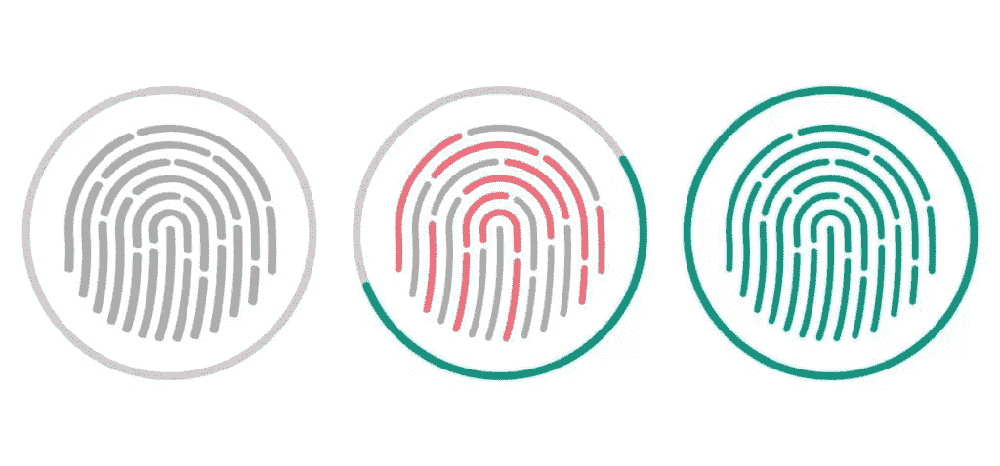
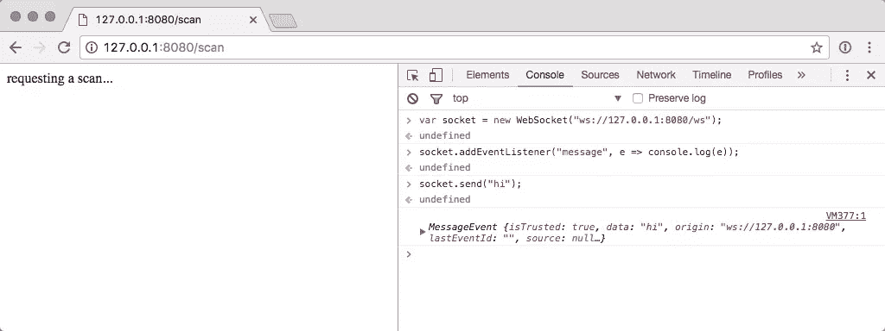
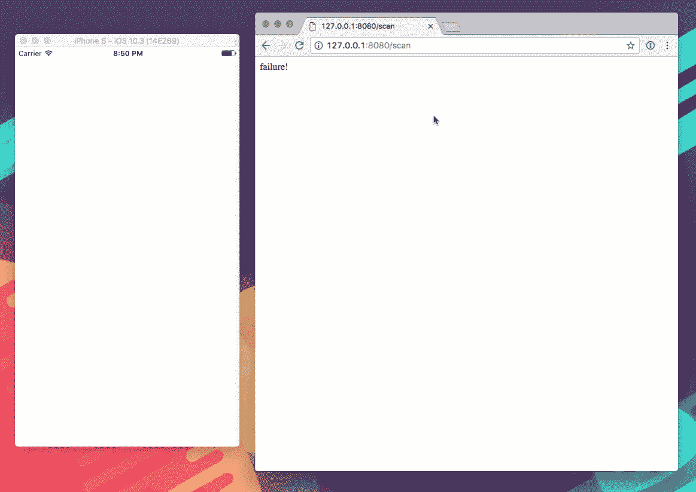

# 如何用异步 PHP 扫描指纹并反应原生

> 原文：<https://www.sitepoint.com/scan-fingerprints-async-php-react-native/>

*这篇文章由[阿德达约·阿德尼伊](https://www.sitepoint.com/author/daydah/)同行评审。感谢 SitePoint 的所有同行评审员使 SitePoint 的内容尽可能做到最好！*

* * *

我们生活在有趣的时代。不久前，一家名为 OfferZen 的公司发布了一种新的可编程信用卡。我已经很久没有这么兴奋地拿到一件科技产品了。从那以后，我的脑子里充满了各种想法。

所以，我决定写其中的一个！

我将描述为所有事务构建自定义多因素身份认证的过程。我不想做通常的(本身也很无聊的)短信或推送通知一次性密码的事情。我想在我的手机里安装一个指纹扫描仪。



在本教程中，我们将看看如何使用 [React](https://www.sitepoint.com/premium/courses/react-tips-2959?aref=bskvorc) Native 设置一个简单的 iOS 应用程序。我们还将设置一个异步 HTTP 服务器，通过 web 套接字连接到应用程序。

我们将继续在应用程序中添加指纹扫描功能，并从 HTTP 服务器请求这些指纹扫描。然后，我们将构建一个端点，GET 请求可以通过该端点请求指纹扫描，并等待指纹扫描的发生。

有很多内容需要介绍，所以我选择将信用卡编程留给另一个教程。本教程本身是有用的，但是和下一个一起会更好！

> 你可以在这里找到这个教程的代码[，在这里](https://github.com/assertchris-tutorials/fingerprint-server)找到[。我已经用 PHP `7.1`和最新版本的谷歌 Chrome 进行了测试。](https://github.com/assertchris-tutorials/fingerprint-app)

## 什么是 React Native？

如果你建立网站已经有一段时间了，那么你可能已经听过这个名字了。这是一个界面构建器库(除了别的以外)。它向前端开发领域引入了许多新的有趣的想法。其中之一是，当你一次把接口看成一个独立的组件时，它更容易构建。有点像一只“[一口一口吃掉一头大象](http://corymiller.com/how-to-eat-an-elephant-or-tackle-most-any-big-huge-enormous-project/)。

React Native 将这些想法推进了一步，它提供了一个构建链来将前端技术(如 HTML、Javascript 和 CSS)编译到原生 iOS 和 Android 应用程序中。

> 是的，您可以构建本教程示例的 Android 版本。不幸的是，我只有时间关注 iOS，而你可能必须自己寻找 Android 专用的第三方库(特别是指纹扫描库)。

使用 React Native，可以编写与 web 项目非常相似的代码，并让它完美地为大多数智能手机用户工作。那么为什么我们要在 PHP 频道中谈论它呢？正如您将看到的，这个平台是如此的方便，以至于少量的 Javascript 知识就足以构建一些有用的东西。我们不需要了解 Java 或者 Objective-C 或者 Swift！

### React Native 入门

我不打算解释在每个平台上安装 React Native 的步骤。已经有[篇优秀的文档介绍如何做这件事](https://facebook.github.io/react-native/docs/getting-started.html)。出于本练习的目的，您需要安装 XCode、NodeJS 和`react-native`命令行工具。

> 如果你有时间和/或想要运行 Android 模拟器，[同样的文档](https://facebook.github.io/react-native/docs/getting-started.html)就足够了。

这些文档包括创建新项目并在模拟器中运行它的步骤。如果您不能让新的应用程序运行，那么在这一点上继续下去就没有意义了。如果是这样的话，[在 Twitter](https://twitter.com/assertchris) 或者评论里跟我说说。

### 安装 TouchID

人们很容易认为 React Native 只安装了一个通用的 Javascript API 来使用，但事实并非如此。它最好的特性之一(在我看来)是强大的本机模块支持。

在指纹扫描的情况下，没有原生的 Javascript API。但是有太多的本机模块提供了这种功能。我在谷歌上搜索了“反应原生 ios 指纹”,第一个匹配似乎非常有效:

```
yarn add react-native-touch-id
react-native link 
```

> 你需要退出模拟器并重新运行`react-native run-ios`，新的应用程序才能访问本机模块。

默认的`index.ios.js`文件有点乱，但是尝试 TouchID 基本足够了。经过一点整理后，它应该看起来像这样:

```
import React, { Component } from "react";
import { AppRegistry } from "react-native"
import TouchID  from "react-native-touch-id"

class Fingerprints extends Component {
  componentDidMount() {
    TouchID.authenticate("Trying TouchID")
      .then(success => {
        alert("Success")
      })
      .catch(error => {
        alert("Failure")
      })
  }

  render() {
    return null
  }
}

AppRegistry.registerComponent("Fingerprints", () => Fingerprints) 
```

> 这是来自`index.ios.js`，在应用程序项目中

如果你不确定它的总体结构，现在可能是复习 React 开发的好时机。关于这个主题有[很多很棒的课程](https://egghead.io/courses/react-fundamentals)，我们的[包括](https://www.sitepoint.com/premium/courses/react-tips-2959?aref=bskvorc)。

除了 React 原生样板文件，我们正在导入我们安装的`TouchID`库。我们添加了一个`componentDidMount`方法，这个方法会在组件呈现时自动调用。在里面，我们添加了一个对`TouchID.authenticate`的调用。

默认情况下，这将自动失败。默认情况下，模拟器设置为不登记指纹。当您使用这个新代码打开应用程序时，您应该会看到失败消息。

要改变这一点，进入“硬件”菜单，选择“触控 ID”→“切换注册状态”。一旦你刷新(你可以用⌘ + R)，你应该会看到提示扫描你的指纹。由于模拟器没有办法做到这一点，回到同一个“触控 ID”菜单，并选择“匹配触摸”。然后，您应该会看到成功消息。

> 我发现玩这个很有趣！您可以在 XCode 中打开`ios/Fingerprints.xcodeproj`，并在连接的 iPhone 上运行它来查看真实的扫描。只需记住将`Fingerprints`重命名为 React 本地应用程序的名称。

## 创建服务器

就其本身而言，这还没有用。我们可以模拟指纹扫描，但它是自动发生的，而不是在需要的时候。我们应该创建一个服务器，以便可以请求指纹。

我最喜欢的 PHP 服务器是异步 PHP 服务器。我之前已经写了很多次了，所以请随意查看关于该主题的更详细的解释:[用 ReactJS 和 PHP 开发游戏](https://www.sitepoint.com/game-development-with-reactjs-and-php-how-compatible-are-they)和[用 ReactJS、PHP 和 Websockets](https://www.sitepoint.com/procedurally-generated-game-terrain-reactjs-php-websockets) 程序化生成游戏地形。

我不会深入探究事情是如何进行的，但是可以随意地[钻研本教程的代码](https://github.com/assertchris-tutorials/fingerprint-server)来了解我在这里没有提到的事情。

首先，让我们安装 Aerys。我们的`composer.json`文件可能看起来像这样:

```
{
  "scripts": {
    "dev": "vendor/bin/aerys -d -c loader.php",
    "prod": "vendor/bin/aerys -c loader.php"
  },
  "require": {
    "amphp/aerys": "dev-amp_v2",
    "pre/kitchen-sink": "^0.1.0"
  },
  "autoload": {
    "psr-4": {
      "App\\": "app"
    }
  },
  "config": {
    "process-timeout": 0
  },
  "minimum-stability": "dev",
  "prefer-stable": true
} 
```

> 这是来自服务器项目中的`composer.json`

我们还可以为请求扫描设置一个占位符，以及一个 HTTP GET 路由:

```
namespace App\Action;

use Aerys\Request;
use Aerys\Response;

class ScanAction
{
  public function __invoke(Request $request, Response $response)
  {
    $response->end("requesting a scan...");
  }
} 
```

> 这是来自服务器项目中的`app/Action/ScanAction.pre`

```
use Aerys\Router;
use App\Action\ScanAction;

return (Router $router) => {
  $router->route(
    "GET", "/scan", new ScanAction
  );
}; 
```

> 这是来自服务器项目中的`routes/web.pre`

我们可以使用服务器配置文件和预处理器加载程序脚本启动服务器:

```
$port = 8080;

$host = new Aerys\Host();
$host->expose("*", $port);

$host->use($router = Aerys\router());

$web = process .."/routes/web.pre";
$web($router);

exec("echo 'http://127.0.0.1:{$port}' | pbcopy"); 
```

> 这是来自服务器项目中的`config.pre`

```
return Pre\processAndRequire(__DIR__ . "/config.pre"); 
```

> 这是来自服务器项目中的`loader.php`

`loader.php`应用[预处理器宏](https://preprocess.io)并要求`config.pre`。`config.pre`创建一个新的异步 Aerys 服务器，并加载路由文件。routes 文件向 ScanAction 类注册一个 GET 路由。

> 如果您想知道这种语法是否是标准的 PHP:它不是。这些是我提到的预处理器宏，它们做一些简单的事情，比如将`.."/routes/web.pre"`转换为`__DIR__ . "/routes/web.pre"`。只需查看像`config.php`和`routes/web.php`这样的文件，就可以看到生成的有效 PHP 语法…

现在，当我们转到`http://127.0.0.1:8080/scan`时，我们应该会看到消息“请求扫描…”。这很好。让我们为我们的服务器添加 web 套接字:

```
namespace App\Socket;

use Aerys\Request;
use Aerys\Response;
use Aerys\Websocket;
use Aerys\Websocket\Endpoint;
use Aerys\Websocket\Message;

class FingerprintSocket implements Websocket
{
  private $endpoint;
  private $connections = [];

  public function onStart(Endpoint $endpoint)
  {
    $this->endpoint = $endpoint;
  }

  public function onHandshake(Request $request,
    Response $response)
  {
    // $origin = $request->getHeader("origin");
    //
    // if ($origin !== "http://127.0.0.1:8080") {
    //   $response->setStatus(403);
    //   $response->end("origin not allowed");
    //   return null;
    // }

    $info = $request->getConnectionInfo();

    return $info["client_addr"];
  }

  public function onOpen(int $clientId, $address)
  {
    $this->connections[$clientId] = $address;
  }

  public function onData(int $clientId, Message $message)
  {
    $body = yield $message;

    yield $this->endpoint->send(
      $payload, $clientId
    );
  }

  public function onClose(int $clientId,
    int $code, string $reason)
  {
    unset($this->connections[$clientId]);
  }

  public function onStop()
  {
    // nothing to see here...
  }
} 
```

> 这是来自服务器项目中的`app/Socket/FingerprintSocket.pre`

```
use Aerys\Router;
use App\Action\ScanAction;
use App\Socket\FingerprintSocket;

return (Router $router) => {
  $router->route(
    "GET", "/scan", new ScanAction
  );

  $router->route(
    "GET", "/ws", Aerys\websocket(new FingerprintSocket)
  );
}; 
```

> 这是来自服务器项目中的`routes/web.pre`

我们刚刚注册了一个新的路由，它将响应 web socket 连接并回显消息。使用 Chrome 开发人员控制台，在同一个`/scan`端点，我们可以测试一下:



## 连接到 React Native

因为我们可以通过网络套接字回显消息，所以现在可能是尝试从我们的应用程序连接的好时机。React 自带 web socket 支持，因此我们可以向同一个`componentDidMount`方法添加类似的代码:

```
componentDidMount() {
  // TouchID.authenticate("Trying TouchID")
  //   .then(success => {
  //     alert("Success")
  //   })
  //   .catch(error => {
  //     alert("Failure")
  //   })

  const socket = new WebSocket("ws://127.0.0.1:8080/ws")
  socket.addEventListener("message", e => console.log(e.data))
  socket.addEventListener("open", e => socket.send("hi"))
} 
```

> 这是来自 app 项目中的`index.ios.js`

要查看这些控制台消息，您需要启用远程调试。

### 如何启用远程调试

按下`⌘` + `D`，选择“调试远程 JS”。这将打开一个新的 Chrome 标签。打开这个新标签的开发者工具面板，然后刷新应用程序。这应该会导致在控制台中看到“hi ”,因为它是从服务器回显的。

## 请求指纹

让我们定制 React 本机代码来监听扫描指纹的请求:

```
componentDidMount() {
  const socket = new WebSocket("ws://127.0.0.1:8080/ws")

  socket.addEventListener("message", (e) => {
    const data = JSON.parse(e.data)

    if (data.type === "scan") {
      TouchID.authenticate("Trying TouchID")
        .then(success => {
          // alert("Success")

          socket.send(JSON.stringify({
            "type": "success",
            "data": success,
            "promise": data.promise
          }))
        })
        .catch(error => {
          // alert("Failure")

          socket.send(JSON.stringify({
            "type": "error",
            "data": error,
            "promise": data.promise
          }))
        })
    }
  })

  // socket.addEventListener("open", e => socket.send("hi"))
} 
```

> 这是来自 app 项目中的`index.ios.js`

当消息到达时，我们将其解析成 JSON。如果类型是`scan`，我们请求指纹扫描。无论指纹扫描是否成功完成，我们都会发送一个序列化的 JSON 对象，其中包含事件的详细信息。

我们还需要调整服务器来处理这种新的消息:

```
use Aerys\Router;
use App\Action\ScanAction;
use App\Socket\FingerprintSocket;

$socket = new FingerprintSocket;

return (Router $router) => {
  $router->route(
    "GET", "/scan", new ScanAction($socket)
  );

  $router->route(
    "GET", "/ws", Aerys\websocket($socket)
  );
}; 
```

> 这是来自服务器项目中的`routes/web.pre`

我们向 action 类提供了对 socket 类的引用。这意味着我们可以调用 socket 类上的方法来响应 HTTP 请求:

```
namespace App\Action;

use Aerys\Request;
use Aerys\Response;
use App\Socket\FingerprintSocket;

class ScanAction
{
  private $socket;

  public function __construct(FingerprintSocket $socket)
  {
    $this->socket = $socket;
  }

  public function __invoke(Request $request, Response $response)
  {
    try {
      yield $this->socket->requestScan();
      $response->end("success!");
    } catch ($e) {
      $response->end("failure!");
    }
  }
} 
```

> 这是来自服务器项目中的`app/Action/ScanAction.pre`

当调用`/scan`路由时，我们向 socket 类请求新的指纹扫描。这是一个延迟的操作(因为应用程序必须提示并等待扫描)，所以我们可以预期使用承诺:

```
private $id = 0;
private $promises = [];

public async function requestScan()
{
  $deferred = new Deferred;
  $this->promises["_{$this->id}"] = $deferred;

  $body = json_encode([
    "type" => "scan",
    "promise" => "_{$this->id}"
  ]);

  $this->id += 1;
  $this->endpoint->broadcast($body);

  return $deferred->promise();
}

public function onData(int $clientId, Message $message)
{
  $body = yield $message;
  $data = json_decode($body);

  $promise = $this->promises[$data->promise];

  if ($data->type === "success") {
    $promise->resolve($data->data);
  } else {
    $promise->fail(
      new \Exception($data->data->message)
    );
  }

  unset($this->promises["_{$this->id}"]);

  // yield $this->endpoint->send(
  //   $body, $clientId
  // );
} 
```

> 这是来自服务器项目中的`app/Socket/FingerprintSocket.pre`

`requestScan`方法是异步的。它返回一个延迟的对象(类似于一个承诺，使用`resolve`和`fail`方法)。我们存储一个对延迟对象的引用，并将它的身份(和扫描请求)广播给所有连接的 web socket 客户端。

我们返回延迟的引用，这样动作将一直等到它被解决(多亏了`yield`关键字)。然后，我们收听来自应用程序的`success`或`fail`消息。我们找到相关的延迟对象，并适当地解决或失败它。

在这一点上，行动的让步声明解决，我们可以响应，无论成功与否。综合起来，它看起来是这样的:



## 摘要

考虑到我们需要编写的 JavaScript 是如此之少，以及 iOS 和异步 PHP 服务器之间的交互性是如此之酷，我认为这是一个巨大的成功。我们已经创建了一种通过简单的 HTTP GET 请求来请求指纹扫描的方法。这本身就很庞大，但是现在想想我们如何在信用卡授权步骤中集成它！

后续将有更多相关内容——在此之前，请在下面的评论区告诉我们你的想法！

## 分享这篇文章