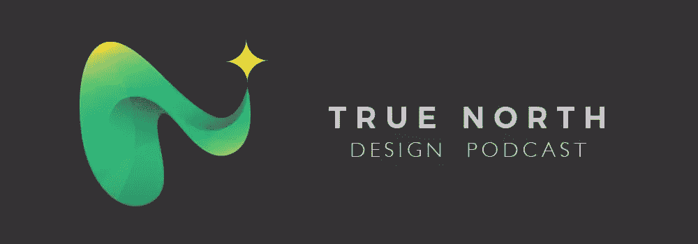
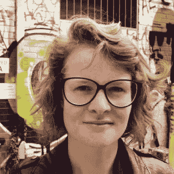

# 新播客:# Ep1–规模化设计:Atlassian 设计团队内部

> 原文：<https://www.sitepoint.com/new-podcast-ep1-designing-for-scale-inside-atlassians-design-teams/>

SitePoint 与[真北](https://www.truenorthpodcast.com/)播客合作，推出他们精彩的第二季。在这第一集里，本·牛顿与 Atlassian 设计团队谈论设计——以及设计背后的团队——如何成功扩展。

如果你像我一样，当你想到像谷歌、T2、脸书、T4 和优步这样的公司时，你通常不会想到公司内部的人。也许你会想到他们著名的创始人，并把他们的性格特征投射到想象中的公司形象上。

但在很大程度上，这是我们想象的品牌。

### 亚特兰蒂斯的故事是什么？

Alastair Simpson——高级设计师

如果你不知道公司名称，你可能知道他们的产品。他们的 [BitBucket](https://bitbucket.org) 产品是 Github 最大的直接竞争对手。他们的[吉拉](https://www.atlassian.com/software/jira)软件管理系统是易贝、Airbnb 和 Spotify 等公司用于敏捷团队的项目管理工具。

他们的产品线还包括 [Confluence](https://www.atlassian.com/software/confluence) 和 [HipChat](https://www.hipchat.com) ，旨在简化团队内部的分享和协作。发生了很多事。

Atlassian 拥有十种主要产品、数百万用户和 2015 年的 IPO，公司估值超过 40 亿美元，面对不可避免的增长，Atlassian 不断面临发展和适应的挑战。

用户群在增长，团队在成长，收入在飙升，但一切都需要扩展以满足需求，并继续为客户提供高水平的服务。这是一个好问题。

[https://w.soundcloud.com/player/?url=https%3A//api.soundcloud.com/tracks/323318304%3Fsecret_token%3Ds-LfxoG&color=0066cc&auto_play=false&hide_related=false&show_comments=true&show_user=true&show_reposts=false](https://w.soundcloud.com/player/?url=https%3A//api.soundcloud.com/tracks/323318304%3Fsecret_token%3Ds-LfxoG&color=0066cc&auto_play=false&hide_related=false&show_comments=true&show_user=true&show_reposts=false)

### 问题:你是如何在 4 年内从 6 名设计师发展到 120 名设计师的？

乔治·博顿利——UX 高级研究员

从 2012 年到 2016 年的 4 年时间里，Atlassian 的设计团队从 6 名设计师发展到 120 多名，这是 Atlassian 快速发展的最好例子。不言而喻，适用于 6 名设计师的方法可能不太适用于 120 名设计师。添加另一个设计者比添加另一个 web 服务器更复杂。

Atlassian 的设计领导面临着几个挑战。第一个问题是如何最好地将设计师整合到他们现有的生态系统中，这在孤立的情况下是一个重要的任务。但除此之外，还有物流方面的挑战，因为团队分散在三个地点——悉尼、旧金山和奥斯汀——以及三个不同的时区。

亚特兰蒂斯人问自己的问题是:"*我们如何确保知识和信息在团队中顺畅自然地共享？*”。

在这一集的[真北](https://www.truenorthpodcast.com/)中，我们走进亚特兰蒂斯设计团队，看看他们如何与其他团队、产品、地点和时区合作。

我们听取了不同团队成员的意见，了解他们如何确保设计、发展、用户研究和信息体验紧密合作，并确保为用户解决正确的问题。

有趣的是，虽然 Atlassian 建立了一些机制来帮助他们的团队，但他们并不强迫他们采用特定的方法，而是允许他们去适应。找到自己的方式，提出问题，保持谦逊是设计团队的核心。

### 什么是正北播客？

《真北》可以在 iTunes 或 truenorthpodcast.com 找到，你可以在那里找到以前的剧集，比如植入物的 UX，减少生病儿童焦虑的设计，或者设计教育有什么问题。我们还采访了来自谷歌、SAP、Mailchimp、Saleforce 等公司的 UX 领导。

我们会在几周内带着第二集回来。感谢您的倾听。

了解你的用户永远是大 UX 的出发点。卢克·海伊的研究 UX 是一个完美的介绍。

## 分享这篇文章