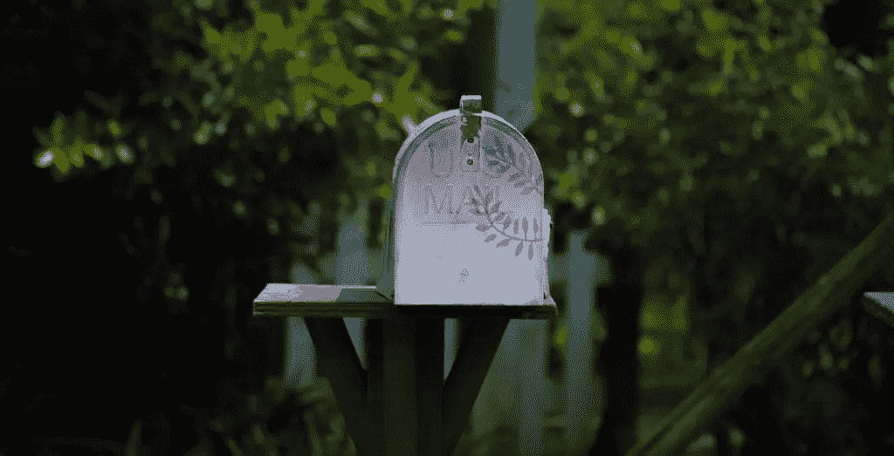

# 如何像专业人士一样进行冷冰冰的邮件外联

> 原文：<https://www.sitepoint.com/cold-email-outreach/>

在营销的大计划中，电子邮件很难不被认为是一种过时的模式。但是想想这个——每天每分钟都有超过 3 亿封电子邮件被发送出去。根据 Marketing Sherpa 的调查，91%的被调查者表示他们喜欢收到与他们有业务往来的公司的促销邮件。这足以证明，电子邮件不仅还活着，而且还在发挥作用，而且从各种迹象来看，在可预见的未来，它将继续如此。

也就是说，传统的电子邮件营销和冷邮件营销有很大的区别，前者是通过一个表格收集某人的电子邮件，后者是向某人发送一封没有选择加入的电子邮件。

如果操作正确，感冒邮件就不是垃圾邮件。

一封经过深思熟虑、有针对性的冷邮件发送给合适的人不仅能收到效果，而且就成本效益而言，它胜过大多数营销渠道。在过去的两年里，我一直是一名全职的自由营销顾问和内容作家，在我被雇佣之前，我已经兼职了四年多。我一直完全依靠冰冷的电子邮件来获得客户，我可以毫无疑问地告诉你，这只是简单的工作！我会这样做…

## 正确的心态

当谈到冷邮件(甚至是冷电话)时，人们通常会有两种截然不同的想法。要么他们一想到要联系不认识的人就畏缩，回避这个想法。或者，他们无耻地向每个人发送垃圾邮件，丝毫不顾收件人的隐私或利益。两者都是误解的产物。

首先，如果你的服务能为他们的业务增加价值，那么联系他们并没有错。事实上，你的潜在客户会感谢你为他们省去自己寻找解决方案的麻烦。然而，一次又一次地纠缠你的潜在客户会让你的邮件很快在他们的垃圾邮件文件夹中获得一席之地。

要想让冷邮件奏效，你需要了解你的收件人。花时间看看他们的工作。他们写了一篇你喜欢读的文章吗？他们刚刚升职了吗？他们公司的新产品成功了吗？他们在社交媒体上留下了有趣的引用或帖子吗？不要只是告诉他们你所有的优点，而是找个理由和他们联系，开始一段对话。然后从那里开始。

## 寻找销售线索

首先，你需要决定你想联系谁。首先，列出你想瞄准的行业、工作简介和国家。例如，作为一名对房地产有经验和兴趣的开发人员，您可能会创建这样的概要文件…

**行业:**房地产
**职位简介:**首席技术官、网站管理员
**国家:**美国/澳洲/英国

既然知道了目标是谁，那就出去找合适的人吧！

谷歌搜索是一个很好的起点。只需输入“[地名]的房地产公司”，并注明公司名称及其网站。如果你的目标是其他国家的公司，谷歌通常会显示当地的结果，而不是你想要的地方的结果。你可以使用 proxysite.com 的代理服务或者 T2 HMA 的虚拟专用网来帮助你。

接下来，去每个网站寻找符合职位描述的人。通常，这可以在他们的“关于我们”或“我们的团队”页面中找到。通常，一个人的联系方式不会在他们的网站上找到。在这种情况下，你可以在 LinkedIn 上查找。作为一个专业的社交网络，几乎每个被雇佣的人都有自己的个人资料，大多数公司也是如此。如果他们有个人资料，请考虑先将他们添加为连接。如果你把信息个性化给收件人，你会得到更好的回应，所以试试吧。

你也可以使用诸如[猎人](https://hunter.io/)、[露莎](https://www.lusha.co/)和 [Voila Norbert](https://www.voilanorbert.com/) 等服务来查找电子邮件地址。在 [Hunter search](https://hunter.io/search) 中输入公司网站，它会显示该域名所有公开列出的电子邮件地址。

最后，避免使用普通的邮件标识，如 info@、hello@等，或者网站上的联系方式。寄给他们的邮件要么被拒绝，要么回复率很低。只在万不得已时才使用它们。

## 打破僵局:写你的第一封邮件

既然你已经准备好了联系人名单，是时候接近他们了。写你的第一封邮件不需要花费你一夜的睡眠。如果你从一次非正式的谈话开始，并且先熟悉这个人，拓展会变得容易得多。

在社交媒体上关注你的潜在客户，看看他们发布了什么。这比立即发送一个项目要花更多的时间，但这是值得的。此外，密切关注客户方与你的职业相关的任何事情。如果你是一个网站开发者，那么注意他们网站的外观和功能。你能做些什么来增加企业的价值吗？

假设我的潜在客户 John 是一家中型房地产投资公司的营销经理，他在公司博客上发表了一篇我喜欢的文章。我会发出这样的信息…

**主题:**快速提问

你好，约翰，
我很喜欢在贵公司的博客上阅读你的文章< <文章名称> >。您对< <特别观察> >的看法特别有意思，因为< <为什么有意思> >。

我是一名营销顾问和内容作家，对房地产有浓厚的兴趣。事实上，我对你的博客有一些想法。如果你想要我把它们送给你，请告诉我。

我也是<<authority sites="">>的一名撰稿人，并与该领域的一些知名人士合作过，比如<<business names="">>。</business></authority>

我写的一些关于房地产的文章，你可能会感兴趣…

<<sample article="" links="">></sample>

我擅长创建博客帖子、长篇文章、网站内容、新闻发布、白皮书和针对房地产的电子书。请让我知道你是否想要我发送我的价格或更多的样品。

本周晚些时候，您是否有空打一个 10 分钟的简短电话，以便我可以与您分享我的一些想法？

感谢您的宝贵时间！

亲切问候，帕思·米斯拉

现在，可以理解的是，有不同信仰和技能的人，他们中的大多数人不能使用这种邮件。然而，你只需要改变一些句子来适应你的背景——结构可以保持不变。

例如，网站开发者可以在网站上指出一个有趣的特征，而不是一篇文章。除了样本文章，还可以添加你参与过的项目的链接。

告诉他们你的技能如何能为他们的业务增加价值，以及升级他们的网站如何能使其反应更快、用户更友好或功能更强。如果你发现他们网站上有你可以改进的地方，在邮件中指出来，然后附上你的解决方案。

最后，一定要确保你的邮件是以行动号召结尾的。这可以大大提高你的回复率。

## 跟进！

冷邮不起作用的真正原因不是因为人们第一封信寄错了，而是因为他们第一次尝试后就放弃了。当你发邮件时，太多的事情可能会出错——你的邮件可能会被其他邮件淹没，你的潜在客户可能会忘记回复，或者你的邮件可能会被发送到垃圾邮件文件夹。如果这些情景中的任何一个出现，跟进有助于提醒自己。

负责的[作家的 Bamidele Onibalusi 建议一个 3-7-7 公式，在你第一封邮件的 3 天后，你发送第一封跟进邮件，然后间隔 7 天再发送 2 封提醒邮件。我一直在使用这个公式，可以保证它的有效性。](https://www.writersincharge.com)

这些信息不需要花里胡哨，只要问他们是否收到了你的邮件，或者他们是否有机会阅读它。这里有一个样本…

嗨，<<first name="">>，
我只是想就我上次的邮件和你联系一下。我想和你确认一下，看看你是否收到了。</first>

谢谢！

亲切问候，帕思·米斯拉

大多数对我邮件的回复都是在第二或第三封邮件上，所以我可以根据经验告诉你，跟进是至关重要的！

## 处理回复

大多数回答属于以下类别之一…

1.  感兴趣的请发费率/我们来聊聊。
2.  不在办公室，会在<<date>>前回来。</date>
3.  不是现在，也许将来。
4.  谢谢，但不感兴趣。

虽然对第一种情况的回应非常直接(跟进你的价格并打电话)，但在第二种情况下，在提到的日期发送一封邮件，告诉他们你在他们不在的时候联系了他们。

情况 c 和 d 是不同的故事。人们很容易认为，如果有人拒绝了，你就应该放弃。然而，仅仅因为你的潜在客户现在不感兴趣，并不意味着他们可能永远不需要你的服务。此外，我们不能指望人们仅仅因为我们给他们寄了几次信就记住我们。

因此，如果一个潜在客户现在说不/不，不要忘记他们，而是发一封邮件感谢他们的时间，并询问你是否可以将他们添加为 LinkedIn、脸书或 Twitter 上的联系人。

通过在社交媒体上与他们联系，你可以通过在那里发布有趣的相关内容来保持对他们的关注。当需求突然出现时，你很有可能会从他们那里得到消息。这是一封我会用来回复 c 和 d 的邮件…

嗨<<first name="">>，
我完全理解，无论如何感谢你的时间。如果您将来有任何内容开发需求，请务必让我知道——我很乐意为您服务。</first>

另外，如果你在 LinkedIn 上，你介意我把你加为联系人吗？我很想和你保持联系！

亲切问候，帕思·米斯拉

## 最后的想法

虽然一个策略可以极大地增加收到积极反馈的几率，但冷邮件仍然是一个数字游戏。为了得到结果，你必须每天花一两个小时发邮件。把它变成一种练习，如果你尝试了几次后没有得到回应，不要放弃。请记住，通过冰冷的电子邮件，我们试图与潜在客户展开对话，而不是达成交易。坚持下去，很快你就会有比你能处理的更多的工作！

要了解更多关于经营一个成功的自由职业者的事情，请查阅我们的书《成功自由职业者的原则》。

## 分享这篇文章