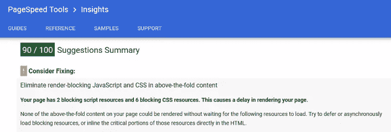

# 为快速渲染网站处理渲染阻塞 CSS

> 原文：<https://www.sitepoint.com/critical-rendering-path-css-fast-loading-website/>


*本文是与 [SiteGround](https://www.siteground.com/go/render-blocking) 合作创作的系列文章的一部分。感谢您对使 SitePoint 成为可能的合作伙伴的支持。*

我一直认为决定如何以及何时加载 CSS 文件是最好留给浏览器去做的事情。他们通过设计来处理这种事情。为什么开发人员除了在文档的`<head>`部分添加一个带有`rel="stylesheet"`和`href="style.css"`的链接元素之外还要做其他事情，然后把它忘掉呢？

显然，这在今天可能还不够，至少如果你关心网站速度和快速渲染网页的话。考虑到这两个因素对用户体验和网站成功的影响，你可能一直在寻找方法来控制浏览器处理下载样式表的默认方式。

在这篇文章中，我将谈到浏览器加载 CSS 文件的方式可能存在的问题，并讨论解决该问题的可能方法，您可以在自己的网站上尝试这些方法。

## 问题:CSS 呈现阻塞

如果你曾经使用过 [Google Page Speed Insights](https://developers.google.com/speed/pagespeed/insights/) 来测试网站性能，你可能会遇到这样一条消息:



在这里，Google Page Insights 指出了这个问题，并提供了一个应对策略。

让我们先试着更好地理解这个问题。

浏览器使用 DOM(文档对象模型)和 CSSOM (CSS 对象模型)来显示网页。DOM 是一种 HTML 模型，浏览器需要它来呈现网页的结构和内容。CSSOM 是 CSS 的映射，浏览器用它来设计网页的样式。

CSS 位于[关键呈现路径](https://developers.google.com/web/fundamentals/performance/critical-rendering-path/render-tree-construction)上意味着浏览器停止呈现网页，直到所有的 HTML 和样式信息都被下载和处理。这解释了为什么 HTML 和 CSS 文件都被认为是**渲染阻塞**。外部样式表尤其涉及浏览器和服务器之间的多次往返。这可能会导致 HTML 下载时间和页面在屏幕上呈现时间之间的延迟。

问题在于这种延迟，在此期间，用户可能会盯着一个空白屏幕几毫秒。不是第一次登陆网站时的最佳体验。

## 关键 CSS 的概念

虽然 HTML 对于页面呈现是必不可少的，否则就没有什么可呈现的了，我们能对 CSS 说同样的话吗？

当然，非样式化的 web 页面对用户来说并不友好，从这个角度来看，浏览器在呈现页面之前等待 CSS 被下载和解析是有意义的。另一方面，你可以争辩说，并不是所有的样式信息对于构建一个可用的页面都是至关重要的。用户直接感兴趣的是页面 fold 部分上方的**，也就是用户不需要滚动就可以消费的那部分。**

这种思想是当今解决这个问题的主流方法的基础，包括上面报道的来自 Google Page Insights 的消息中包含的建议。有趣的是:

> 尝试延迟或异步加载阻塞资源，或者在 HTML 中直接内联这些资源的关键部分。

但是你如何*推迟*或者*在你的网站上异步加载*样式表呢？

没有听起来那么简单。你不能在 link 元素上添加一个`async`属性，就好像它是一个`<script>` 标签一样。

下面是开发人员解决这个问题的几种方法。

## 利用媒体类型和媒体查询来最小化渲染阻塞

伊利亚·格里戈利克展示了一种最小化页面渲染块的简单方法，包括两个阶段:

*   根据媒体类型和媒体查询将外部 CSS 的内容分成不同的文件，从而避免下载时间较长的大型 CSS 文档
*   在 link 元素中引用每个具有适当媒体类型和媒体查询的文件。如果不满足媒体类型或媒体查询设置的条件，这样做可以防止某些样式表文件被呈现阻塞。

例如，文档的`<head>`部分中对外部 CSS 文件的引用可能如下所示:

```
<link href="style.css" rel="stylesheet">
<link href="print.css" rel="stylesheet" media="print">
<link href="other.css" rel="stylesheet" media="(min-width: 40em)">
```

上面片段中的第一个链接没有使用任何媒体类型或媒体查询。浏览器认为它匹配所有情况，因此在获取和处理资源时，它总是延迟页面呈现。

第二个链接有一个`media="print"`属性，这是告诉浏览器的一种方式:“您好，浏览器，如果要打印页面，请确保只应用这个样式表**和**”。在页面只是在屏幕上显示的情况下，浏览器知道不需要样式表，因此不会阻止页面呈现来下载它。

最后，第三个链接包含`media="(min-width: 40em)"`，这意味着只有当媒体查询所声明的条件匹配时，链接中引用的样式表才是呈现阻塞的，例如，视窗的宽度至少为 40em。在所有其他情况下，资源不会呈现阻塞。

另外，请注意浏览器将总是下载所有的样式表，但是将给予非阻塞的样式表较低的优先级。

总之，这种方法并没有完全消除问题，但是可以大大减少浏览器阻塞页面呈现的时间。

## 在链接元素上使用*预载*指令

当浏览器获取外部样式表时，你可以利用一个前沿特性来抵消网页的阻塞，这就是基于标准的指令。

作为开发人员，我们可以告诉浏览器获取特定的资源，因为我们知道页面很快就会需要这些资源。

Scott Jehl 是灯丝组的设计师和开发人员，他被认为是第一个提出这个想法的人。

这是你需要做的。

将`preload`添加到引用样式表的链接中，使用链接的`onload`事件添加一点 JavaScript 魔法，结果就像在标记中直接异步加载样式表:

```
<link rel="preload" as="style" href="style.css" onload="this.rel='stylesheet'">
```

上面的代码片段让浏览器以非阻塞的方式获取`style.css`。资源加载完成后，即链接的`onload`事件触发后，脚本用`stylesheet`替换`rel`属性的`preload`值，并将样式应用于页面。

目前[浏览器对`preload`](http://caniuse.com/#search=preload) 的支持仅限于 Chrome 和 Opera。但不用担心，由 Filament Group 提供的 polyfill 就在眼前。

下一节将详细介绍这一点。

## Filament Group 的解决方案:从内嵌 CSS 到 HTTP/2 服务器推送

长期以来，解决因获取关键资源而导致的页面渲染延迟问题一直是 Filament Group 的首要任务，Filament Group 是一家总部位于波士顿的屡获殊荣的设计和开发机构:

> 在交付过程中，我们的最高优先级是在 HTML 到达浏览器后立即开始呈现。

关于优化网页交付的最新更新概述了他们从内联关键 CSS 到超高效 HTTP/2 服务器推送的进展。

总体策略如下所示:

> 任何对呈现我们页面的第一屏至关重要的资产都应该包含在服务器的 HTML 响应中。*   Any assets that are not important to the first rendering should be delivered in a non-blocking, asynchronous way.

在 HTTP/2 服务器推送之前，实现#1 包括选择关键的 CSS 规则，即默认样式和无缝呈现网页折叠部分所需的规则，并将它们塞进页面`<head>`部分的`<style>`元素中。Filament Group 的开发人员设计了一个很酷的 JavaScript 插件 [Critical](https://github.com/filamentgroup/criticalCSS) ，来自动执行提取关键 CSS 的任务。

随着最近采用 HTTP/2 服务器推送，Filament Group 已经超越了内联关键 CSS。

什么是服务器推送？有什么好处？

> 服务器推送允许你在用户请求之前就把站点资产发送给他们。…
> 
> 服务器推送允许服务器先发制人地将网站资源“推送”到客户端，而无需用户明确请求。如果小心使用，我们可以发送我们知道用户需要的页面信息。
> 
> 杰里米·瓦格纳

换句话说，当浏览器请求一个特定的页面时，比如说`index.html`，页面依赖的所有资产都会包含在响应中，例如`style.css`、`main.js`等。，在页面渲染速度上有巨大的优化提升。

实践#2，非关键 CSS 的异步加载，是通过结合使用上一节讨论的`preload`指令技术和 [LoadCSS](https://github.com/filamentgroup/loadCSS) 完成的，后者是一个 film 组的 JavaScript 库，包括一个 polyfill，用于那些不支持`preload`的浏览器。

使用 LoadCSS 需要将这个代码片段添加到文档的`<head>`部分:

```
<link rel="preload" href="mystylesheet.css" as="style" onload="this.rel='stylesheet'">
<!-- for browsers without JavaScript enabled -->
<noscript><link rel="stylesheet" href="mystylesheet.css">
</noscript>
```

注意像往常一样引用样式表文件的`<noscript>`块，以适应 JavaScript 出错或被禁用的情况。

在`<noscript>`标签下，将 LoadCSS 和[load CSS rel = preload polyfill script](https://github.com/filamentgroup/loadCSS/blob/master/src/cssrelpreload.js)包含在`<script>`标签内:

```
<script> /*! loadCSS. [c]2017 Filament Group, Inc. MIT License */
(function(){ ... }());
/*! loadCSS rel=preload polyfill. [c]2017 Filament Group, Inc. MIT License */
(function(){ ... }()); </script>
```

您可以在该项目的 GitHub repo 中找到使用 LoadCSS 的详细说明，并在这个[现场演示](https://master-origin-loadcss.fgview.com/test/preload.html)中看到它的实际操作。

我倾向于这种方法:它有一个渐进的增强前景，它是干净的和开发人员友好的。

## 将样式表文件的链接放在文档正文中

根据 Jake Archibald 的说法，之前方法的一个缺点是它依赖于一个关于你或我可以认为是关键 CSS 的主要假设。很明显，应用于页面折叠部分的所有样式都是至关重要的。然而，折叠之上的确切构成几乎是显而易见的，因为视口尺寸的变化会影响用户无需滚动即可访问的内容量。所以，一刀切并不总是靠谱的猜测。

[杰克·阿奇博尔德提出了一个不同的解决方案](https://jakearchibald.com/2016/link-in-body/)，内容如下:

```
<head>
</head>
<body>
<!-- HTTP/2 push this resource, or inline it -->
<link rel="stylesheet" href="/site-header.css">
<header>…</header>

<link rel="stylesheet" href="/article.css">
<main>…</main>

<link rel="stylesheet" href="/comment.css">
<section class="comments">…</section>

<link rel="stylesheet" href="/about-me.css">
<section class="about-me">…</section>

<link rel="stylesheet" href="/site-footer.css">
<footer>…</footer>
</body>
```

如您所见，对外部样式表的引用没有放在`<head>`部分，而是放在文档的`<body>`中。

此外，无论是内联的还是使用 HTTP/2 服务器推送的，页面立即呈现的唯一样式是应用于页面上部的样式。所有其他外部样式表都放在它们所应用的 HTML 内容块的前面:`article.css`放在`<main>`之前，`site-footer.css`放在`<footer>`之前，等等。

这种技术的目标是:

> 计划是让每个<link rel="”stylesheet”/">在样式表加载时阻止后续内容的呈现，但允许呈现之前的内容。样式表是并行加载的，但是它们是串行应用的。
> 
> …这为您提供了页面的顺序呈现。你不需要决定什么是“折叠之上”，只需要在组件的第一个实例之前包含一个页面组件的 CSS。

所有浏览器似乎都允许在文档的`<body>`中放置`<link>`标签，尽管它们的行为方式并不完全相同。也就是说，这种技术在很大程度上实现了它的目标。

你可以在杰克·阿奇博尔德的帖子中找到所有细节，并在这个现场演示中查看结果。

## 结论

浏览器下载样式表的方式的问题是页面呈现被阻塞，直到所有文件都被获取。这意味着用户第一次登陆网页时的体验可能会受到影响，尤其是那些网络连接不稳定的用户。

在这里，我介绍了一些旨在解决这个问题的方法。我不确定拥有相对较少且结构良好的 CSS 的小网站，如果在下载样式表时让浏览器自行其是，情况会不会更糟。

你怎么看，延迟加载样式表，或者它们的顺序应用(杰克·阿奇博尔德的提议)，是提高你的网站页面渲染速度的一种方式吗？你认为最有效的技巧是什么？

**点击下方评论框分享**

## 分享这篇文章