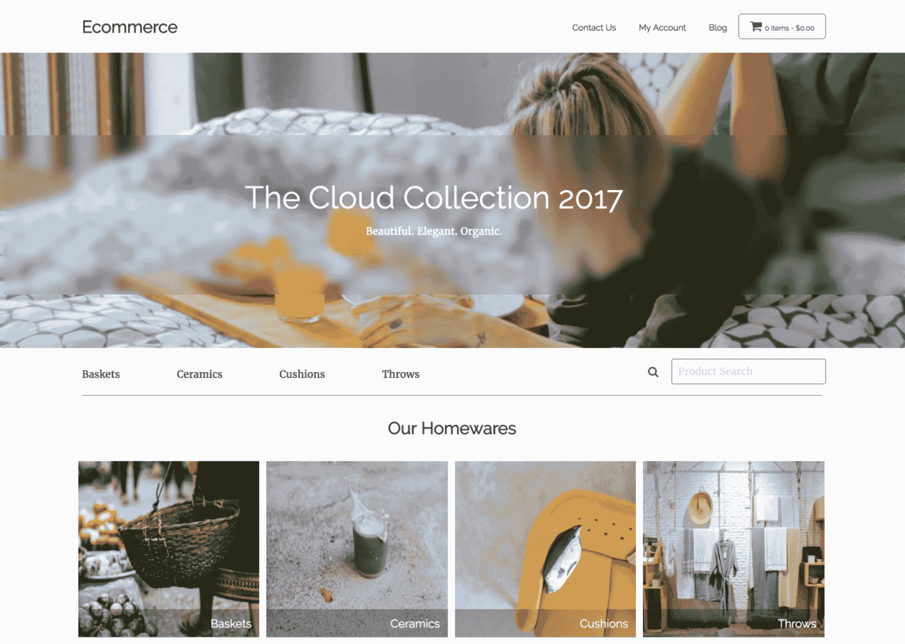
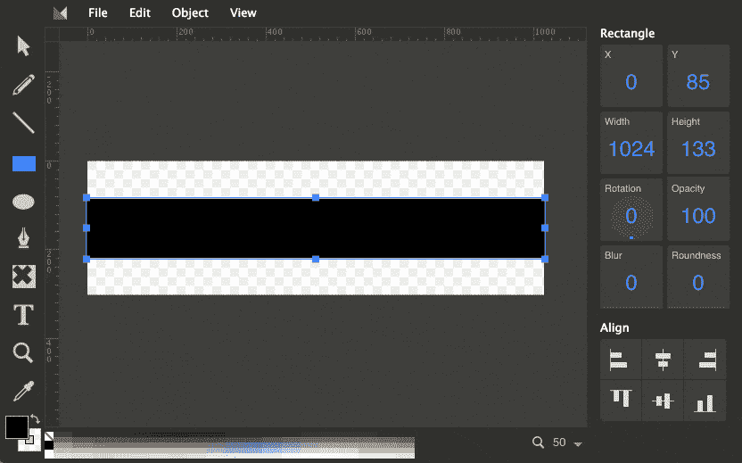
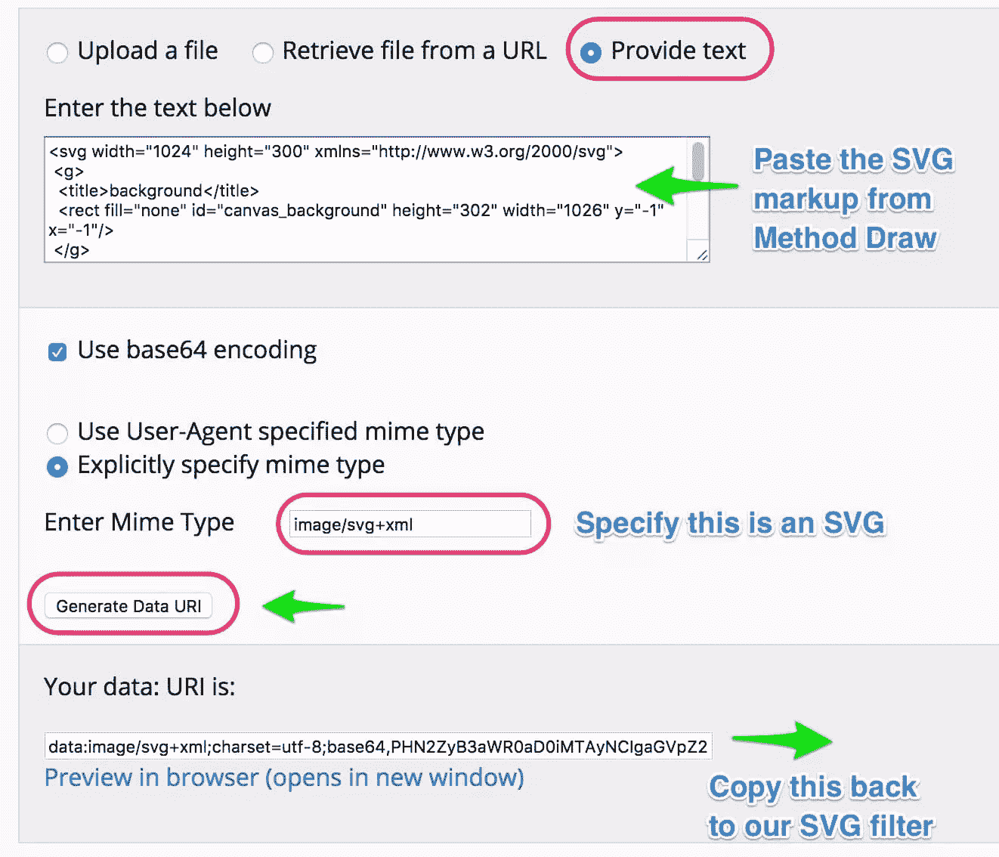

# SVG 滤镜的设计技巧:蒙版模糊效果

> 原文：<https://www.sitepoint.com/design-tricks-with-svg-filters-a-masked-blur-effect/>

上周，我们发布了新的 WordPress 电子商务主题，收到了很多关于横幅图片上使用的蒙版模糊效果的问题。这是一个现场效果，可以应用到你给它的任何图像。

我认为这是一种很好的处理方式，更重要的是，这种通用技术为狡猾的设计师提供了许多可能性。我将向你介绍一下我今天学到的东西。



简而言之，上面的“蒙版模糊效果”:

*   用作单个图像
*   是非破坏性的(即，它不会永久改变您的原始 JPEG 或 PNG)
*   可以通过一行文本来应用或删除
*   可以通过实际上任何形状的掩模来应用。
*   在现代浏览器中得到相对较好的支持——尽管遮罩定位可能比较棘手。

首先，SVG 是这项技术的关键。虽然我们都知道 SVG 是一种矢量格式——盒子上是这么说的——但讽刺的是，SVG 有一堆基于像素的技巧，这是巴新和 JPG 只能梦想的。

## SVG Filters 101

让我们从最基本和最简单的滤波器开始。设置一个基本的 SVG 过滤器就像创建一组过滤器标签并用一个引用 ID 命名过滤器一样简单——在我们的例子中，我们把我们的过滤器称为“myblurlayer”。

将下面的 SVG 片段添加到您的页面不会在屏幕上呈现任何内容，但是它创建了一个新的过滤器，您可以将其应用到任何页面元素——图像、文本、面板等等。增加`stdDeviation`会增加模糊度。

```
<svg xmlns="https://www.w3.org/2000/svg" version="1.1" height="0">
  <filter id="myblurfilter" width="110%" height="100%">
  	<feGaussianBlur stdDeviation="2" result="blur" />
  </filter>
</svg>
```

在这个例子中，我们使用了一个简单的 SVG 模糊效果(即`feGaussianBlur`)，但是我们也可以使用[许多其他的滤镜效果](https://www.w3.org/TR/SVG/filters.html)。最常见的是，我们使用 CSS 来应用过滤器。

```
.blurme { 
-webkikt-filter: url('#myblurfilter'); 
filter: url('#myblurfilter'); }
```

```

```

(旁注:是的，我知道有更简单的模糊方法，如果这就是你所需要的)

现在，这种 CSS 类方法可以在大多数浏览器中很好地实现简单的过滤效果。不幸的是，随着你的过滤器变得越来越雄心勃勃，Safari 中的 bug 使这变得不可靠。

我发现，通过将基本图像(JPG 或 PNG) ***放在它们自己的 SVG 元素*** 中，你通常会得到更一致的结果——而不是标准的 HTML IMG 标签。所以，你的图像看起来像这样:

```
<svg xmlns="https://www.w3.org/2000/svg" xmlns:xlink="https://www.w3.org/1999/xlink"> 
<image x="0" width="100%" height="100%" xlink:href="https://www.sitepoint.com/themes/ecommerce/wp-content/uploads/sites/4/ecom-banner-2-1_1020x304_acf_cropped-1.jpg"/> 
</svg>
```

在浏览器中，这看起来和普通的 IMG 标签没什么不同。稍后，我们将直接对那个`<image>`元素应用我们的过滤器。

## 向滤镜添加遮罩

SVG 提供了一种叫做`<feImage>`的便捷滤镜效果，可以将图像转换成 SVG 可以处理的对象——在我们的例子中，用作遮罩。看起来是这样的。

```
<feImage id="feimage" xlink:href="our-mask-will-go-here" x="0" y="0"  height="300px" result="mask" preserveAspectRatio="none"/>
```

从技术上讲，我们的`xlink:href`可以接受一个指向外部文件的链接(例如，‘*mask . SVG*’)，但是我很难让它在不同的浏览器上保持一致。相反，我们将把 SVG 掩码直接编码到过滤器中。

## 创建您的遮罩形状

在我们写更多的 SVG 之前，我们需要创建我们想要使用的遮罩。我打算做一个非常简单的矩形“信箱”效果，但是没有什么可以阻止你使用任何你喜欢的矢量形状——尽管我建议保持你的蒙版相对简单。

为此，我将使用[一个叫做 Method-Draw](http://editor.method.ac/) 的在线 SVG 编辑器。这很简单，也是免费的，应该会鼓励你保持你的面具简单。如果你喜欢 Illustrator，那也可以。



方法绘制编辑器

当你创建了一个简单的黑白形状后，点击'*查看* ' - > ' *来源*，并将 SVG 标记复制到你的剪贴板上。

为了将这个掩码引入到我们的过滤器中，我们需要将它转换成一个'[数据 URI](https://en.wikipedia.org/wiki/Data_URI_scheme)'——基本上只是我们的 SVG 标记的一个编码版本，易于浏览器使用，但对我们来说看起来像是完全的天书。

在一个新标签页中打开这个[数据 URI 转换器](https://dopiaza.org/tools/datauri/index.php)，点击“提供文本”选项，然后将您的 SVG 标记粘贴到文本字段中。



数据 URI 转换器

我们需要告诉转换器我们给它一个 SVG，所以在 Enter Mime Type 字段中输入`image/svg+xml`。当你点击“**生成数据 URI** ，你会得到一长串看起来很随机的字符——这就是我们转换后的掩码。

将它复制到您的剪贴板，切换回您的 SVG 过滤器代码，并将其粘贴到我们的`<feImage>`的`xlink:href=`部分。

到目前为止，我们的过滤器应该是这样的:

```
<svg xmlns="https://www.w3.org/2000/svg" xmlns:xlink="https://www.w3.org/1999/xlink">
<defs>
          <filter id="blurlayer" width="110%" height="100%">
			<feGaussianBlur  stdDeviation="4" result="blur"/>
				<feImage id="feimage" xlink:href="" x="0" y="0"  height="300px" result="mask" />
            ... <!--more to come here -->
          </filter>
        </defs>
</svg>
```

好，你还听得见我吗？

## SVG 三明治

SVG 最酷的特性之一是能够将多种效果“夹在一起”到一个图像处理中。我们需要做的第一件事是将蒙版和模糊滤镜合并成一个实体。这有点像给你的电视插入不同的输入。我们对此使用`<feComposite>`。

```
<feComposite in2="mask" in="blur" operator="in" result="comp" />
```

正如你所看到的，我们从遮罩(`result="mask"`)和模糊滤镜(`result="blur"`)中提取输出，并使用(`in2="mask"`)和(`in="blur"`)将它们结合起来。我们称这个结果为“ *comp* ”。

## 组合滤波器和图像源

现在，我们只需要告诉过滤器如何处理这种蒙版模糊——当然，这是为了将它应用到我们给它的任何图像。为此，我们可以使用`<feMerge>`来合并我们的蒙版模糊效果和我们给它的任何图像。幸运的是，SVG 理解“SourceGraphic”的概念，所以我们可以告诉它合并“SourceGraphic”和“comp”。

看起来是这样的。

```
<feMerge result="merge">
      <feMergeNode in="SourceGraphic" />
      <feMergeNode in="comp" />
</feMerge>
```

我们的过滤器准备好了。我们只需要把它应用到图像上。

为了演示，我将我的源图形——JPG——嵌入到一个单独的 SVG 元素中，并用`filter="url(#blurlayer)"`应用我们的过滤器

```
<image filter="url(#blurlayer)" x="0" y="0" width="100%" height="300px"   xlink:href="https://www.sitepoint.com/themes/ecommerce/wp-content/uploads/sites/4/ecom-banner-2-1_1020x304_acf_cropped-1.jpg"/>
</svg>
```

将所有这些放在一起，这是一个结果演示:

在 [CodePen](http://codepen.io) 上通过 SitePoint ( [@SitePoint](http://codepen.io/SitePoint) )查看钢笔[蒙版模糊效果 SVG–无颜色变化](http://codepen.io/SitePoint/pen/PpgRYX/)。