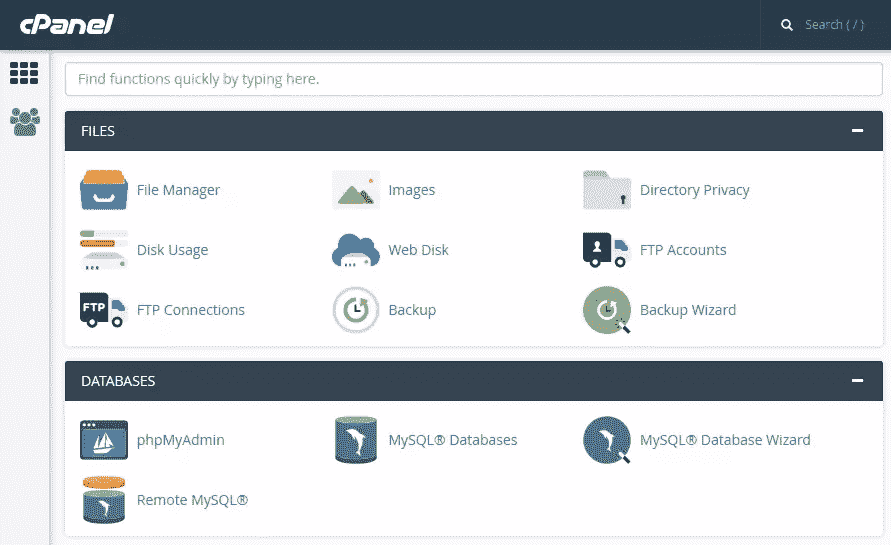
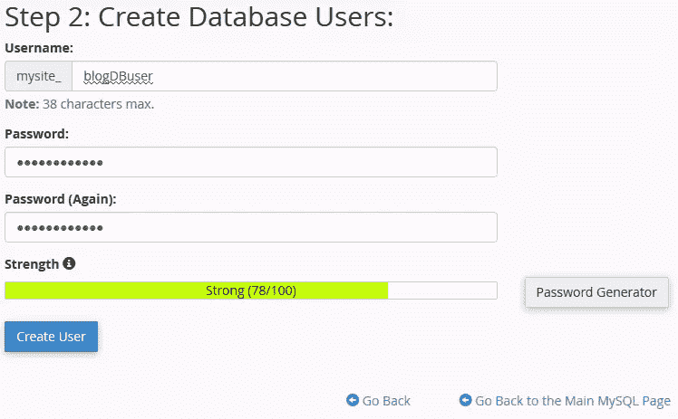
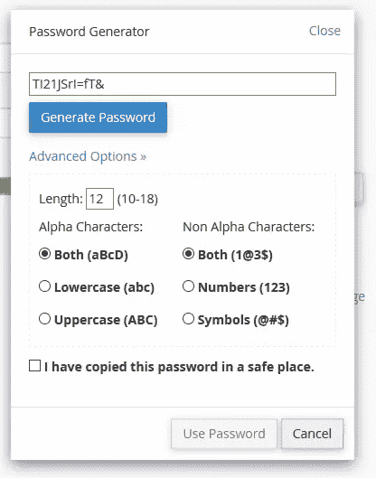
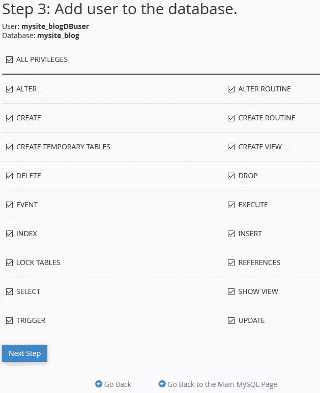
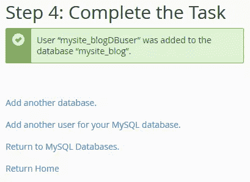
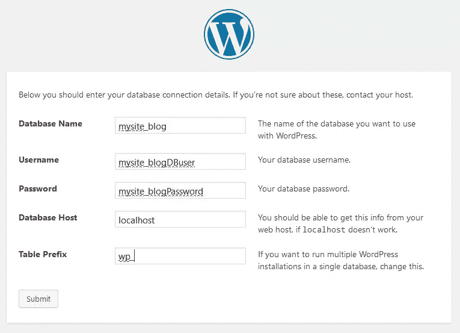
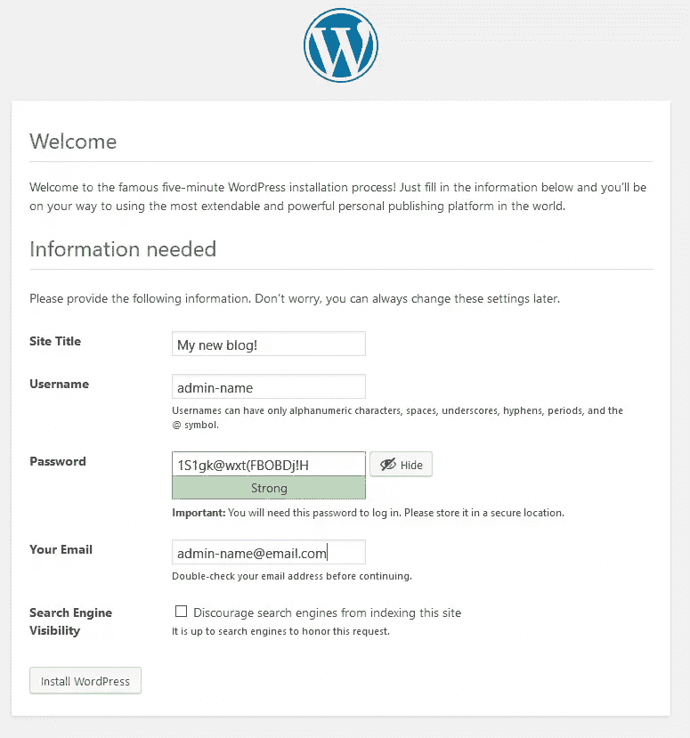

# 如何在 cPanel 上创建 WordPress MySQL 数据库

> 原文：<https://www.sitepoint.com/how-to-create-wordpress-mysql-databases-on-cpanel/>

*本文是与 [SiteGround](https://www.siteground.com/go/article-sp) 合作创作的系列文章的一部分。感谢您对使 SitePoint 成为可能的合作伙伴的支持。*

WordPress 的成功很大程度上归功于它快速简单的五分钟安装程序。然而，MySQL 数据库仍然给许多人带来困惑。

本教程描述了如何使用 [cPanel](https://cpanel.com/) 创建数据库，cPanel 是许多 web 主机提供的一个流行的平台管理工具。我们还将讨论如何在 WordPress 安装过程中使用这个数据库。任何需要 MySQL 的 web 应用程序都可以使用这些技术。

让我们从基础和术语开始…

## 什么是数据库？

数据库是有组织的数据的集合。就是这样。WordPress 将其所有的页面、文章、类别和用户数据存储在一个数据库中。

MySQL 是一个数据库管理系统(DBMS)。它是一个允许你在数据库中创建、更新、读取和删除数据的软件。一个 MySQL 安装可以管理任意数量的独立数据库。你可以有一个 WordPress，一个 Magento，其他的 Drupal 或者任何你需要的东西。

有很多选择，但是 MySQL 变得流行有几个原因:

*   它是免费的开源软件。它现在归甲骨文所有，但也有开放的 MySQL 兼容选项，如 [MariaDB](https://mariadb.org/) 。
*   它成了 PHP 的同义词——网络上最常用的语言/运行时，为 WordPress 提供了动力。PHP 和 MySQL 都出现在 20 世纪 90 年代中期，当时 web 开发还处于起步阶段。
*   它采用结构化查询语言(SQL)——一种用于创建数据结构和数据的标准语言。
*   它速度快，安装简单，有许多第三方开发工具。

## 应用程序如何访问数据库？

WordPress 等应用程序通过数据库连接访问数据。就 MySQL 而言，WordPress 的 PHP 代码只有在知道以下情况时才能建立连接:

*   MySQL 的安装地址
*   它需要访问的数据库的名称
*   访问该数据库所需的用户 ID 和密码

必须为 WordPress 的使用定义一个数据库“用户”帐户。它可以有非常强的密码，并设置适当的数据库权限。

## 数据是如何存储的？

MySQL 和其他 SQL 数据库将数据存储在关系表中。

例如，您可能有一组文章帖子。每篇文章都有独特的数据，如标题和正文。它还将包含其他帖子中使用的数据，如类别和作者详细信息。我们不是一次又一次地重复相同的数据，而是创建单独的表:

*   一个包含 ID、作者姓名和其他细节的`author`表
*   一个包含 ID 和类别名称的`category`表
*   一个包含文章标题和正文的`post`表。它会通过引用相关的 ID 号来指向作者和类别。

SQL 数据库实施安全措施来保证数据完整性。你不能引用一个不存在的作者 ID，也不能删除一篇或多篇文章使用的类别。

这些表定义和规则形成了数据库*模式*。在 WordPress 安装过程中执行一组 SQL 命令来创建这个模式。只有这样，表才准备好存储数据。

## 如何创建数据库

使用 cPanel 的 Web 主机提供一个 web 地址(如[https://site.com/cpanel](https://site.com/cpanel))，以及一个用户 ID 和密码来获得访问权。保护好这些细节。不要将它们与数据库或 WordPress 用户凭证混淆！

如果你正在寻找一个支持 cPanel 的主机，试试我们选择的网络主机 [SiteGround](https://www.siteground.com/go/article-sp) 。所有的计划都支持 cPanel，他们已经重新设计了仪表板，以更友好的方式组织一切。

您的视图可能看起来有点不同，但找到数据库部分或在搜索框中输入“MySQL”。

点击 **MySQL 数据库向导**并遵循以下步骤:

### 步骤 1:选择数据库名称

您的数据库需要一个名称:

该名称可能应用了前缀，如`mysite_`。输入适当的名称，如`blog`或`wordpress`，并点击**进入下一步**。

### 步骤 2:创建数据库用户

你现在必须定义 WordPress 用来访问你的数据库的 MySQL 用户帐号:

注意，用户名也可能应用了相同的前缀(`mysite_`)。在这个截图中，我们的用户 ID 是`mysite_blogDBuser`。

cPanel 将确保您输入强密码。密码可能很复杂；在 WordPress 安装过程中，您将只使用它一次。我推荐随机的**密码生成器**:

确保在点击**创建用户**之前，将用户 ID 和密码复制到文本文件或其他安全的地方。

### 步骤 3:设置数据库用户权限

上面创建的用户需要在 WordPress 安装过程中完全访问数据库。它运行脚本来创建表并用初始数据填充它们。

检查**所有权限**然后点击**下一步**:

cPanel 将确认 MySQL 数据库和用户的创建。

## MySQL 数据库面板

你可以使用 **MySQL 数据库**面板来代替向导。它仍然允许您创建一个数据库和一个用户，但是您需要将该用户添加到数据库中。

它还提供更新、修复和删除数据库和用户的工具。

## 如何安装 WordPress

您的 cPanel 可能会提供 WordPress 和其他应用程序安装程序。可能没有必要遵循上面的步骤，因为脚本会为您创建一个数据库。

如果手动安装是必要的或首选的，下载 WordPress 并解压文件。你可以通过 SSH 在你的服务器上实现，但是 FTP/SFTP 也是受支持的。

打开浏览器，导航到你复制 WordPress 的域/路径，(即[http://mysite.com/](http://mysite.com/))。这将启动安装:

您必须输入:

*   在步骤 1 中创建的 MySQL **数据库名称**
*   在步骤 2 中创建的 MySQL 数据库**用户名**
*   在步骤 2 中创建的 MySQL 数据库用户的**密码**
*   **数据库主机**。这是 MySQL 运行的服务器的地址。它通常是`localhost`或`127.0.0.1`,因为 MySQL 运行在你的站点所在的服务器上。你的主人会告诉你这是否不同。

**表前缀**在所有表名的开头添加一个短字符串。在以下情况下更改它:

1.  你想安装许多指向同一个数据库的 WordPress 副本，和/或
2.  您希望通过使表名不那么明显来使您的安装更加安全。

点击**提交**，WordPress 将在继续安装前验证你的证书。

### 创建 WordPress 用户

WordPress 提示输入 WordPress 管理员的 ID、密码和电子邮件地址。这是负责管理 WordPress 的人。它不同于 MySQL 数据库和 cPanel 凭证！

点击 **Install WordPress** 几秒钟后仪表盘就会出现。

## 额外的安全步骤

我们授予数据库用户安装 WordPress 的完全权限。您可以在安装后降级这些权限以提高安全性。

下列权利应该足够了:

*   挑选
*   插入
*   更新
*   删除
*   改变
*   创建表格
*   翻桌
*   指数

一些插件可能需要额外的权限，因此如果遇到问题，请启用**所有权限**。

## 分享这篇文章