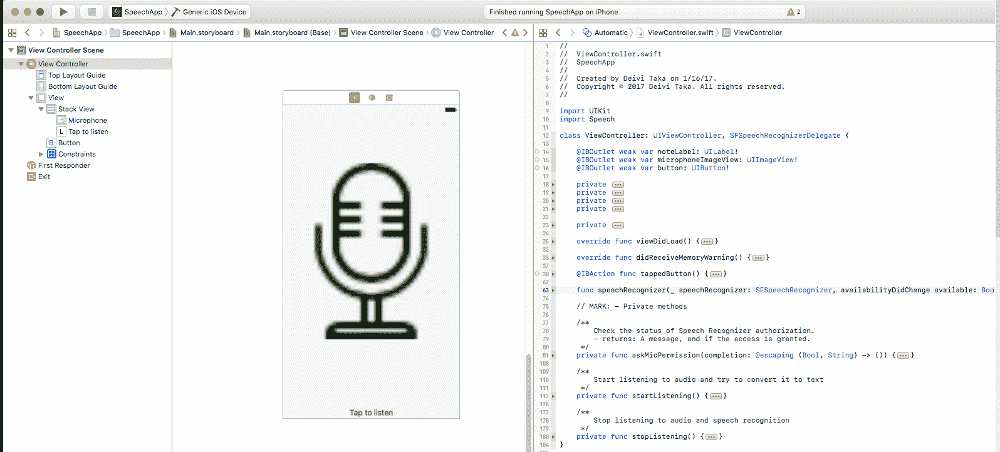
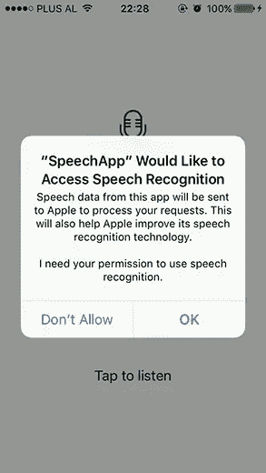
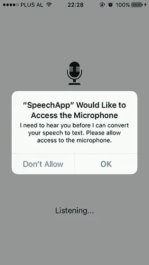

# iOS 语音 API 教程

> 原文：<https://www.sitepoint.com/ios-speech-apis-tutorial/>

随着 iOS 10 的推出，开发者可以使用一个新的令人兴奋的 API: *语音识别*。用户和开发者都知道将音频翻译成文本的概念。iOS 已经通过 *Siri* 和之前版本中的键盘听写按钮提供了这一功能。然而，正如您很快会发现的那样，新框架有更多的好处，并且易于实现。

这篇文章的代码可以在 [*GitHub*](https://github.com/sitepoint-editors/SpeechApp) 下载。

## 有什么新鲜事？

听写很难操作，因为它有局限性。只能通过默认键盘或支持 *TextKit* 的元素来访问它。如果键盘语言不被支持，对你来说太糟糕了！识别只能在现场音频上进行，而你得到的回报是纯文本。对于某些应用来说，这已经足够了，但是你可能还想做得更多一点。

API 为开发者提供了更多的功能。它允许他们在应用程序的任何地方使用框架，而不需要键盘。音频可以作为来自预先录制的文件或现场直播源的输入。在这两种情况下，您都可以控制何时开始和停止操作，这在以前是不可能的。此外，可以设置语言，而不考虑系统语言。你可以在 50 多种语言中进行选择。

## UI 设置

让我们体验一下 API 并构建一个简单的应用程序。对于 UI，我只使用了几个视图:一个用于麦克风图标的`UIImageView`，一个用于输出的`UILabel`。整个视图可以通过一个`UIButton`触摸。

所有三个视图都在 *ViewController.swift* 中声明为 outlets。

```
@IBOutlet weak var noteLabel: UILabel!
@IBOutlet weak var microphoneImageView: UIImageView!
@IBOutlet weak var button: UIButton! 
```

`button`的动作中触摸的*追加如下。*

```
@IBAction func tappedButton() {

} 
```

要连接`IBOutlets`和`IBAction`，只需*点击左边圆圈上的*，*拖动*到相应的视图。这将在下面演示。



> 反过来也可以用来连接插座。按住 *Ctrl* 和*拖动*视图到你想要添加参数的代码行。

## 请求权限

识别过程的繁重工作是在苹果服务器上完成的，除了一些较新的设备，这些设备一直支持语音识别。由于音频数据会离开设备，因此用户必须在使用服务前表明同意。

让我们在*“view controller . swift”*中添加一个使用`SFSpeechRecognizer`的新函数。这需要导入`Speech`框架。

```
import Speech 
```

该函数将要求用户授权使用语音识别器，并返回一个*元组*。*元组*包含一个当许可被授予时为真的`boolean`和一个带有结果注释的`string`。

```
private func askMicPermission(completion: @escaping (Bool, String) -> ()) {
    SFSpeechRecognizer.requestAuthorization { status in

    }
} 
```

函数`requestAuthorization`返回类型`SFSpeechRecognizerAuthorizationStatus`的枚举。切换可能的值，并为每个值设置一条消息。在`requestAuthorization`的主体中添加以下代码。

```
let message: String
var granted = false

switch status {
    case .authorized:
        message = "Listening..."
        granted = true
        break
    case .denied:
        message = "Access to speech recognition is denied by the user."
        break
    case .restricted:
        message = "Speech recognition is restricted."
        break
    case .notDetermined:
        message = "Speech recognition has not been authorized, yet."
        break
} 
```

最后，让我们用所需的*元组*调用`completion`。

```
completion(granted, message) 
```

当试图开始或停止监听音频数据时，将调用我们编写的函数。监听器已经就位。

```
@IBAction func tappedButton() { 
    askMicPermission(completion: { (granted, message) in

    })
} 
```

如果在这种状态下运行项目，当点击视图时，项目将会失败。iOS 10 要求在*中添加描述字符串。每个访问请求的 plist* 文件。这些字符串应该有助于用户理解您为什么需要权限，或者您打算如何使用它。

打开*“info . plist”*，在主词典*标签*里面添加下面的`key`。

```
 <key>NSSpeechRecognitionUsageDescription</key>
    <string>I need your permission to use speech recognition.</string> 
```

执行同样的操作来请求访问麦克风，我们稍后会用到它。

```
 <key>NSMicrophoneUsageDescription</key>
    <string>I need to hear you before I can convert your speech to text. Please allow access to the microphone.</string>
</dict> 
```

下面的截图显示了它的样子。请注意苹果是如何通知用户语音数据将被发送到其服务器的。

 

## 实现 API

`ViewController`类应该*使*符合`SFSpeechRecognizerDelegate`协议来跟踪语音识别器的可用性。

```
class ViewController: UIViewController, SFSpeechRecognizerDelegate { 
```

这些是我们需要的变量。在`ViewController`类中全局声明它们。

```
private var listening = false
private var speechRecognizer: SFSpeechRecognizer?
private var recognitionRequest: SFSpeechAudioBufferRecognitionRequest?
private var recognitionTask: SFSpeechRecognitionTask?

private let audioEngine = AVAudioEngine() 
```

初始化`speechRecognizer`需要一个*地区标识符*，我已经将其设置为阿尔巴尼亚语…

```
speechRecognizer = SFSpeechRecognizer(locale: Locale.init(identifier: "sq-AL"))
speechRecognizer?.delegate = self 
```

…但是，这当然不起作用。

> 无法为 sq-AL 创建识别器。支持的区域设置标识符有..

这是为了强调关注*地区*的重要性，并确保 API 支持它。将标识符更改为“en-US”。

现在让我们编写一个函数来执行实际的工作。我们将逐步填充这个函数的主体。

```
private func startListening() {

} 
```

检查是否有一个*识别任务*正在运行，并取消它以开始一个新的识别任务。

```
if recognitionTask != nil {
    recognitionTask?.cancel()
    recognitionTask = nil
} 
```

尝试激活*音频会话*。

```
let audioSession = AVAudioSession.sharedInstance()
do {
    try audioSession.setCategory(AVAudioSessionCategoryRecord)
    try audioSession.setMode(AVAudioSessionModeMeasurement)
    try audioSession.setActive(true, with: .notifyOthersOnDeactivation)
} catch let error {
    noteLabel.text = "An error occurred when starting audio session. \(error.localizedDescription)"
    return
} 
```

创建一个*识别请求*，它将把一个*音频缓冲区*作为输入。然后检查*音频引擎输入节点*。如果没有*输入节点*，则意味着设备没有麦克风来获取音频。

```
recognitionRequest = SFSpeechAudioBufferRecognitionRequest()

guard let inputNode = audioEngine.inputNode else {
    fatalError("No input node detected")
}

guard let recognitionRequest = recognitionRequest else {
    fatalError("Unable to create an SFSpeechAudioBufferRecognitionRequest object")
} 
```

接下来，开始*识别任务*。从结果中，我们可以得到一个可能的转录列表。否则，继续使用`bestTranscription`并将其添加到`noteLabel`中。*完成处理程序*可能会被多次调用。我们从`result.isFinal`值开始检查用户是否已经完成记录。如果是这种情况，或者识别过程出现错误，则*音频引擎*停止。然后将任务设置为`nil`来释放资源。

```
recognitionTask = speechRecognizer?.recognitionTask(with: recognitionRequest, resultHandler: { (result, error) in

    var isFinal = false

    if result != nil {
        self.noteLabel.text = result?.bestTranscription.formattedString
        isFinal = result!.isFinal
    }

    if error != nil || isFinal {
        self.audioEngine.stop()
        inputNode.removeTap(onBus: 0)

        self.recognitionRequest = nil
        self.recognitionTask = nil

        self.noteLabel.text = "Tap to listen"
    }
}) 
```

当从麦克风获取音频时，它被添加到内存中的一个*缓冲区*。这被传递给`recognitionRequest`。

```
let recordingFormat = inputNode.outputFormat(forBus: 0)
inputNode.installTap(onBus: 0, bufferSize: 1024, format: recordingFormat) { (buffer, when) in
    self.recognitionRequest?.append(buffer)
} 
```

最后，准备启动`AVAudioEngine`。

```
audioEngine.prepare()

do {
    try audioEngine.start()
} catch let error {
    noteLabel.text = "An error occurred starting audio engine. \(error.localizedDescription)"
} 
```

下面的函数是一个“紧急按钮”,用来停止一切运行。当用户再次点击视图，应用程序进入后台或类似场景时，这很有帮助。

```
private func stopListening() {
    self.audioEngine.stop()
    self.recognitionRequest?.endAudio()
} 
```

让我们更新`tappedButton`函数来执行正确的操作。代码在主线程中执行。根据`listening`的值，麦克风图像和标签文本发生变化。然后，如果用户已经授予许可，应用程序开始或停止监听*音频输入*。

```
DispatchQueue.main.async {
    if self.listening {
        self.listening = false
        self.microphoneImageView.image = UIImage(named: "Microphone")

        if granted {
            self.stopListening()
        }
    } else {
        self.listening = true
        self.microphoneImageView.image = UIImage(named: "Microphone Filled")
        self.noteLabel.text = message

        if granted {
            self.startListening()
        }
    }
} 
```

识别器变得不可用有多种原因。失去网络连接，或者在*设置*中更改权限就是其中两种。添加一个侦听器来处理这种情况。当识别器变得不可用时，`button`禁用并显示一条消息。当再次可用时，`button`和标签文本被重置为默认状态。

```
func speechRecognizer(_ speechRecognizer: SFSpeechRecognizer, availabilityDidChange available: Bool) {
    button.isEnabled = available
    if available {
        listening = true
        noteLabel.text = "Tap to listen"
        tappedButton()
    } else {
        noteLabel.text = "Recognition is not available."
    }
} 
```

## 演讲时间到了

我们终于可以看到我们的应用程序在运行了。*模拟器*在这种情况下没有帮助，我们需要一个运行 iOS 10 的真实设备。运行项目后，点击手机屏幕，将出现“正在收听…”消息。在选择说什么的时候有点创造力是很有趣的。我坚持简单的问候。


我每天都不使用*语音转文本*或语音命令。加上我的母语不是英语，这个应用程序一开始很难给出正确的输出。然而，它变得越来越好，你越来越多地使用它，其准确性是可以接受的。

## 限制

除了*语音 API* 的优点之外，它还有一些限制。这些限制与音频的持续时间和 API 的可用性有关。对于 iOS 10，音频时长限制为一分钟。

在可用性方面，设备受限于它们每天可以执行的识别次数。这也适用于每个应用程序的识别。Apple 建议，如果经常达到此限制，请联系寻求支持。

另一件要注意的事情是对电池消耗和网络流量的高度影响。所以最好留意一下*长会话*，以及*移动数据使用*。

## 最佳实践

为了确保最佳的用户体验，需要考虑一些事情。

*   我想说的第一点是确保用户知道正在发生什么。与用户互动，让他知道正在进行识别，或者他正在被记录。
*   使用语音识别来输入密码、信用卡号或其他敏感数据是一个糟糕的选择。
*   为任何情况做好准备。该过程可能由于许多原因而失败。从达到极限开始，到失去互联网连接，到用户中止操作。用适当的信息处理这些情况。

## 结论

*语音框架*是 iOS 10 的一大补充，使用了与 *Siri* 和*听写*相同的技术。它无需收集用户数据即可提供结果，并且易于实现。它提供了更多的结果背景:时间信息，信心水平和替代解释。

在您的应用程序中享受使用这个 API 的乐趣吧！

愿*码*与你同在！

### 参考

*   [文档](https://developer.apple.com/reference/speech)
*   [WWDC 2016 第 509 场:语音识别 API](https://developer.apple.com/videos/play/wwdc2016/509/) 

## 分享这篇文章