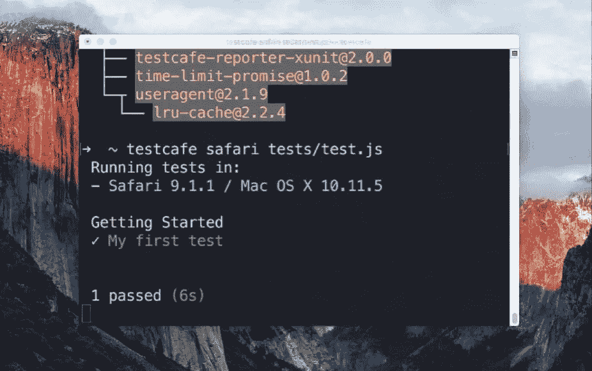
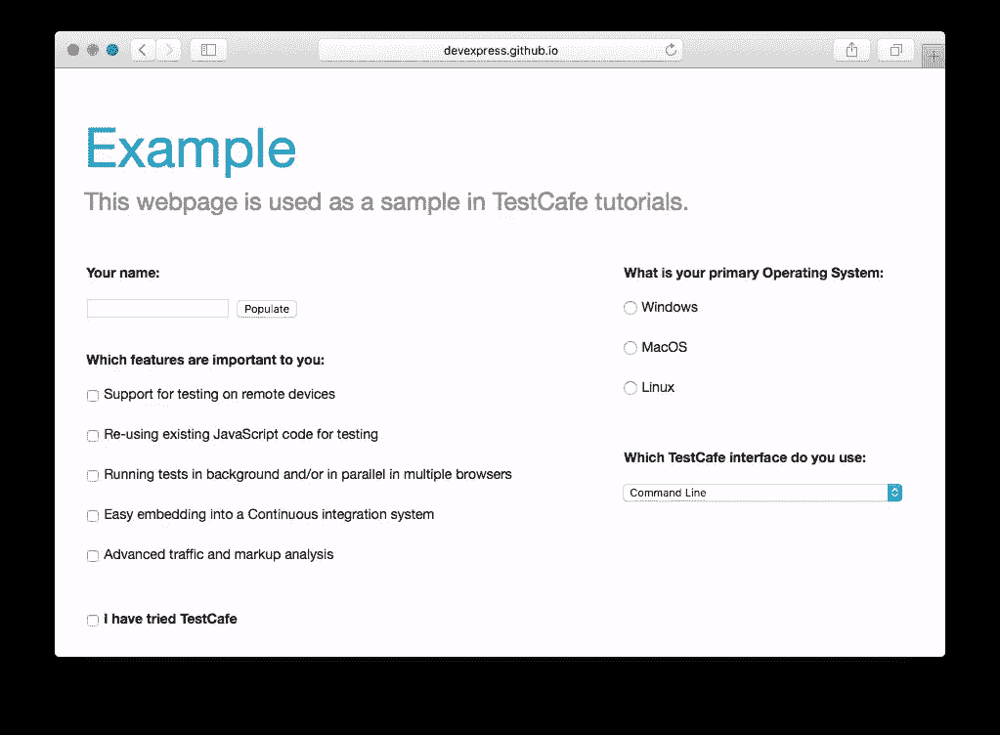
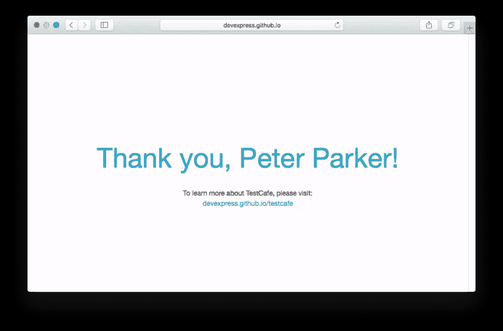
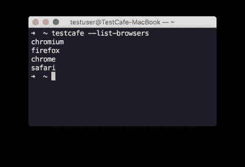
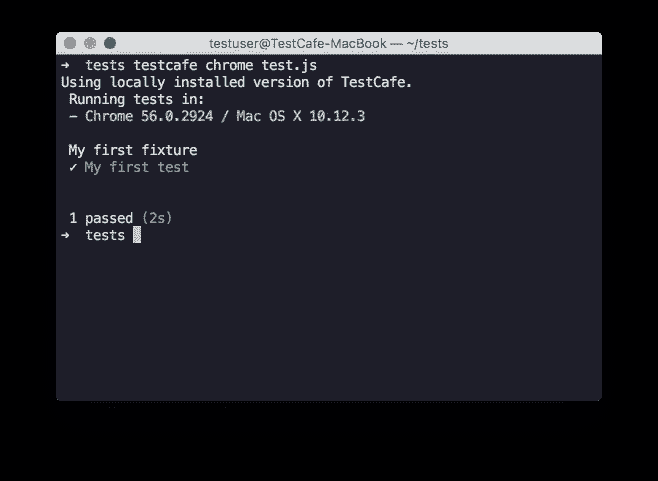
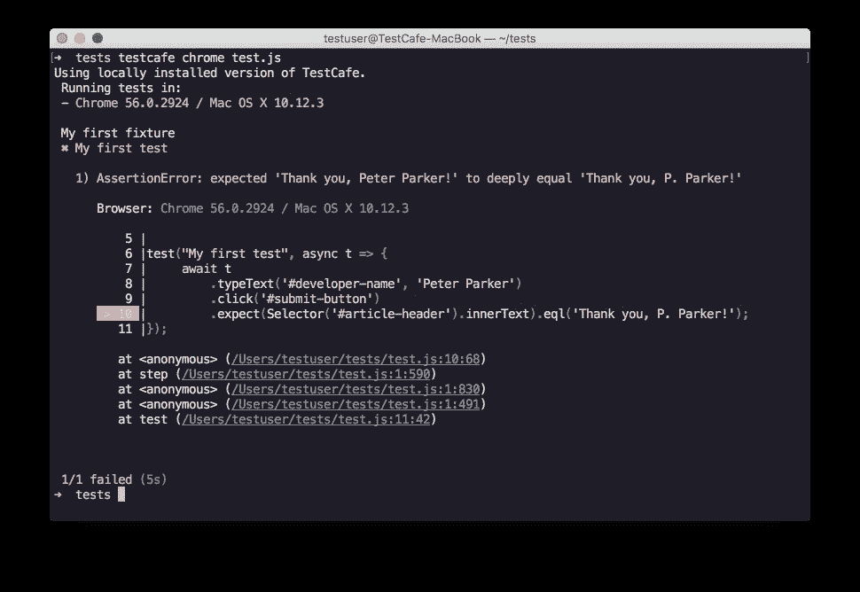
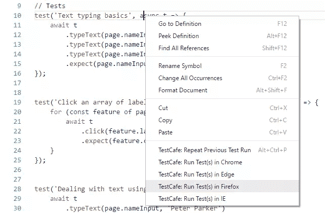

# TestCafe:使用 Node.js 进行更简单的端到端 Web 应用测试

> 原文：<https://www.sitepoint.com/testcafe-easier-end-end-web-app-testing-node-js/>



在本文中，TestCafe 团队成员 Vasily Strelyaev 解释了这种新的基于 Node.js 的应用测试框架的好处。

前端 web 开发人员知道为 web 应用程序设置自动化测试有多困难。甚至安装一个测试框架也是一个挑战。许多现有的解决方案需要 Selenium，它带来了浏览器插件和 JDK。

在开始测试之前，您还需要设置一个测试工具，这意味着处理配置文件。稍后，您会发现这个工具的某些部分——比如报告——丢失了，您需要单独找到并安装它们。

TestCafe 是一个新的、开源的、基于 Node.js 的 web 应用端到端测试框架。

它负责所有的测试阶段:启动浏览器、运行测试、收集测试结果以及生成报告。它既不需要浏览器插件，也没有其他依赖:它只是开箱即用。

在本文中，我将展示如何

*   编写您的第一个测试
*   在您的本地机器和云测试服务中运行它
*   为任务运行者创建测试任务

## 安装 TestCafe

首先，您需要在您的机器上安装 Node.js。如果你没有，去[它的网站](https://nodejs.org/en/)下载，或者考虑用一个[版本管理器比如 nvm](https://www.sitepoint.com/quick-tip-multiple-versions-node-nvm/) 。

一旦完成 Node.js，安装 TestCafe 就是一个命令的事情:

```
npm install -g testcafe 
```

如果你在 Linux/Mac 上，你发现自己需要添加`sudo`，你应该考虑[修复你的 npm 权限](https://docs.npmjs.com/getting-started/fixing-npm-permissions)。

## 编写测试

我们将为 [TestCafe 演示页面](http://devexpress.github.io/testcafe/example/)编写一个测试。



打开您选择的代码编辑器，创建一个新的`test.js`文件。

首先，添加一个 fixture 声明，它指向位于[http://devexpress.github.io/testcafe/example/](http://devexpress.github.io/testcafe/example/)的演示 web 页面:

```
fixture `My first fixture`
    .page `https://devexpress.github.io/testcafe/example`; 
```

然后，添加一个测试:

```
fixture `My first fixture`
    .page `https://devexpress.github.io/testcafe/example`;

test('My first test', async t => {
    // We will add test code later
}); 
```

现在让我们将测试类型文本输入到开发人员姓名输入中，并单击 Submit 按钮:

```
fixture `My first fixture`
    .page `https://devexpress.github.io/testcafe/example`;

test('My first test', async t => {
    await t
        .typeText('#developer-name', 'Peter Parker')
        .click('#submit-button');
}); 
```

这里我们使用了[类型文本](https://devexpress.github.io/testcafe/documentation/test-api/actions/type-text.html)和[点击](https://devexpress.github.io/testcafe/documentation/test-api/actions/click.html)测试动作。TestCafe 为[提供了其中的十几个](https://devexpress.github.io/testcafe/documentation/test-api/actions/)，从[悬停](https://devexpress.github.io/testcafe/documentation/test-api/actions/hover.html)到[文件上传](https://devexpress.github.io/testcafe/documentation/test-api/actions/upload.html)。

让我们回到我们的测试。“提交”按钮会将您重定向到一个页面，上面写着“谢谢，%username%！”。



我们将检查该页面上的文本是否包含正确的名称:

```
import { Selector } from 'testcafe';

fixture `My first fixture`
    .page `https://devexpress.github.io/testcafe/example`;

const articleHeader = Selector('#article-header');

test('My first test', async t => {
    await t
        .typeText('#developer-name', 'Peter Parker')
        .click('#submit-button')
        .expect(articleHeader.innerText).eql('Thank you, Peter Parker!');
}); 
```

为此，我们创建了一个标识文章标题的选择器。在测试动作之后，我们添加一个断言来检查文本是否说‘谢谢你，彼得·帕克！’

### 页面对象

TestCafe 团队鼓励[在测试中使用页面对象模式](https://devexpress.github.io/testcafe/documentation/recipes/using-page-model.html)。使用这种模式，您可以引入被测试页面的对象表示，并在测试代码中使用它。让我们看看我们是如何做到这一点的。

创建一个新的`page-object.js`文件并声明一个页面类:

```
export default class Page {
    constructor () {
    }
} 
```

到目前为止，我们的测试与三个页面元素交互:开发者姓名输入、提交按钮和“谢谢”标题。因此，我们向 Page 类添加了三个选择器:

```
import { Selector } from 'testcafe';

export default class Page {
    constructor () {
        this.nameInput     = Selector('#developer-name');
        this.submitButton  = Selector('#submit-button');
        this.articleHeader = Selector('#article-header');
    }
} 
```

在测试文件中，引用`page-object.js`，创建 Page 类的一个实例，并在测试动作中使用它的字段:

```
import Page from './page-object';

fixture `My first fixture`
    .page `https://devexpress.github.io/testcafe/example`;

const page = new Page();

test('My first test', async t => {
    await t
        .typeText(page.nameInput, 'Peter Parker')
        .click(page.submitButton)
        .expect(page.articleHeader.innerText).eql('Thank you, Peter Parker!');
}); 
```

使用页面对象模式，您可以将所有选择器放在一个地方。当测试的网页发生变化时，您只需要更新一个文件— `page-object.js`。

## 在本地运行测试

要在本地机器上运行这个测试，您只需要一个命令:

```
testcafe chrome test.js 
```

TestCafe 会自动找到并启动谷歌 Chrome，运行测试。

同样，您可以在 Safari 或 Firefox 中运行这个测试，只需指定它们的名称。

您可以使用`testcafe --list-browsers`命令来查看 TestCafe 在您的机器上检测到的浏览器列表:



### 测试运行报告

测试完成后，TestCafe 向控制台输出一个报告:



如果测试失败，TestCafe 会提供一个带有 callstack 的调用站点，显示错误发生的位置:



您可以从五种[内置报告格式](https://devexpress.github.io/testcafe/documentation/using-testcafe/common-concepts/reporters.html)中进行选择，或者搜索一个添加不同格式支持的插件。

### 从 IDE 启动测试

你可以从流行的 ide 中运行 TestCafe 测试，比如使用专用插件的 [VS Code](https://github.com/romanresh/vscode-testcafe) 或 [SublimeText](https://github.com/churkin/testcafe-sublimetext) :



## 在云测试服务中运行测试

虽然 TestCafe 可以在任何流行的现代桌面或移动浏览器上运行测试，但它也有一个插件的[生态系统，可以与云测试服务、headless 和其他非常规浏览器一起工作。](https://github.com/DevExpress/testcafe/#browser-providers)

在这一部分，我们将在一个流行的自动化测试云上运行测试。它托管了数百台使用不同操作系统和浏览器的虚拟机。

要在 SauceLabs 上运行测试，您需要一个 SauceLabs 帐户。如果您没有帐户，请访问[https://saucelabs.com/](https://saucelabs.com/)并创建一个新帐户。您将获得必要的凭证:用户名和访问密钥。

现在您需要安装与 SauceLabs 一起工作的 TestCafe 插件:

```
npm install --save-dev testcafe-browser-provider-saucelabs 
```

因为这个插件安装在本地目录中，所以您还需要在本地安装 TestCafe:

```
npm install --save-dev testcafe 
```

在使用 SauceLabs 插件之前，按照 [SauceLabs 文档](https://wiki.saucelabs.com/display/DOCS/Best+Practice%3A+Use+Environment+Variables+for+Authentication+Credentials)中的描述，保存环境变量`SAUCE_USERNAME`和`SAUCE_ACCESS_KEY`的用户名和访问密钥。

现在，您可以在云中的 SauceLabs 虚拟机上运行您的测试:

```
testcafe "saucelabs:Chrome@beta:Windows 10" test.js 
```

您可以通过运行以下命令来查看 SauceLabs 上可用的浏览器和虚拟机的完整列表

```
testcafe -b saucelabs 
```

## 将任务添加到任务运行器

当您需要自动化开发工作流程中的常规任务时，任务运行器非常有用。

与任务运行器集成是在开发时运行 TestCafe 测试的一个很好的解决方案。这就是为什么 TestCafe 社区开发了[插件](https://github.com/DevExpress/testcafe#plugins-for-task-runners)，将
it 与最流行的 Node.js 任务运行器集成在一起。

在本教程中，我们将使用 [Gulp.js](http://gulpjs.com/) 。

如果您的计算机上没有安装 Gulp.js，请使用以下命令将其全局和本地安装到项目中:

```
npm install -g gulp
npm install --save-dev gulp 
```

安装一个整合了 TestCafe 和 Gulp.js 的 Gulp 插件:

```
npm install --save-dev gulp-testcafe 
```

如果您的项目中有一个`Gulpfile.js`文件，那么向它添加下面的任务。否则，用这个任务创建一个新的`Gulpfile.js`:

```
const gulp     = require('gulp');
const testcafe = require('gulp-testcafe');

gulp.task('run-testcafe-tests', () => {
    return gulp
        .src('test.js')
        .pipe(testcafe({ browsers: ['chrome', 'firefox'] }));
}); 
```

该任务从 Chrome 和 Firefox 中的`test.js`文件运行测试。要了解更多关于 Gulp 插件 API 的信息，请查看其 GitHub 页面。

现在，您可以从命令行运行此任务，如下所示:

```
gulp run-testcafe-tests 
```

## 在持续集成平台上测试

TestCafe 提供了强大的[命令行](https://devexpress.github.io/testcafe/documentation/using-testcafe/command-line-interface.html)和[编程](https://devexpress.github.io/testcafe/documentation/using-testcafe/programming-interface/)接口，使得与大多数现代 CI 系统一起工作变得容易。

测试运行报告可以以大多数流行的 CI 系统理解的 [JSON](https://github.com/DevExpress/testcafe-reporter-json) 、 [xUnit](https://github.com/DevExpress/testcafe-reporter-xunit) 和 [NUnit](https://github.com/AndreyBelym/testcafe-reporter-nunit) 格式呈现。

TestCafe 文档包含一个[菜谱](https://devexpress.github.io/testcafe/documentation/recipes/running-tests-using-travis-ci-and-sauce-labs.html)，它描述了如何在 Travis CI 上为 GitHub 项目设置测试。

## 摘要

在本文中，我已经展示了如何从您的第一个 TestCafe 测试开始，并最终将 e2e 测试集成到您的项目工作流中。您可以亲眼看到用 TestCafe 测试 web 应用程序是多么容易。

如果你对 TestCafe 有任何疑问，请在下面发表评论，在[论坛](https://testcafe-discuss.devexpress.com/)提问，或者访问 [GitHub 页面](https://github.com/DevExpress/testcafe/)。

## 分享这篇文章