# 速成班:使用信号量 CI 的持续部署

> 原文：<https://www.sitepoint.com/crash-course-continuous-deployment-semaphore-ci/>

软件在各行各业的公司竞争中扮演着越来越重要的角色。大型组织发现，他们当前管理软件的方法限制了他们按照业务要求快速响应的能力。*连续交货*对此有所帮助。


理解连续交付，一个现在已经存在很久的时髦词，不是问题，但是以正确的方式实现它对我们中的许多人来说是一个挑战，我们将在这篇文章中讨论这个问题。

## 入门指南

我们可以使用像 Filezilla 这样的开源桌面客户端轻松地将文件上传到服务器。使用过这种方法的人都知道，这种方法既麻烦又烦人，因为它不允许我们自动化部署过程，而且我们最终总是不得不上传整个项目，即使我们只修改了其中的一部分。或者，我们可以在服务器上做一个`git pull`,我们的应用程序立即处于它的最新状态，但是这个工作流程在今天的世界是行不通的，我们必须*持续地将*软件无错误地交付给我们的最终用户。

在本文中，我们将介绍使用[信号量](https://semaphoreci.com/)通过连续交付管道在数字海洋服务器上部署 [Laravel](https://laravel.com) 应用程序的过程。该应用的源代码出现在 [Github](https://github.com/sitepoint-editors/semaphore-ci-example) 上。

## 在信号量上建立一个项目

[首先创建一个信号量账号](https://semaphoreci.com/)。注册后，我们会看到一个创建新项目的页面。

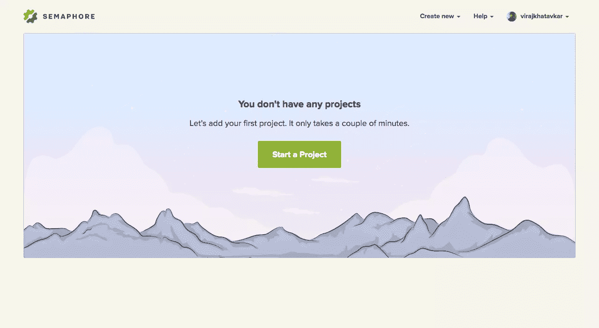

然后，我们必须选择存储库所在的帐户。如果您还没有用 Semaphore 连接您的源代码库提供者，您可以在这个步骤中这样做。Semaphore 原生支持 Bitbucket 和 Github。

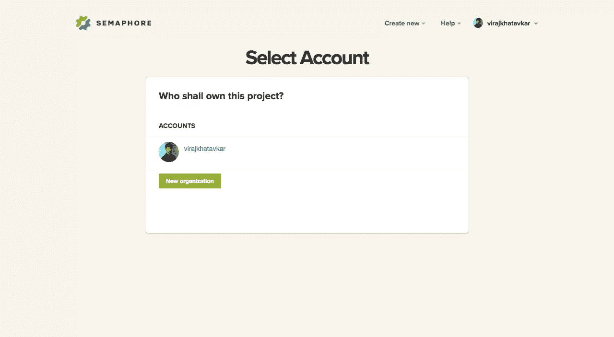

如果您分叉了上述回购，您可以在此步骤中选择它:

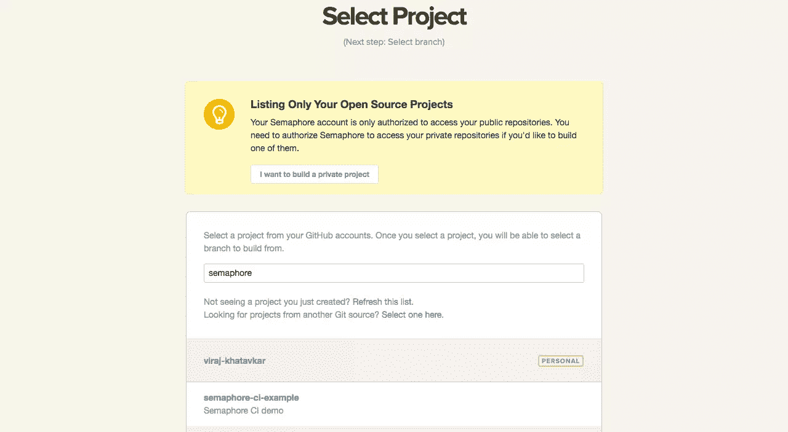

我们将为我们的案例选择`master`分支:

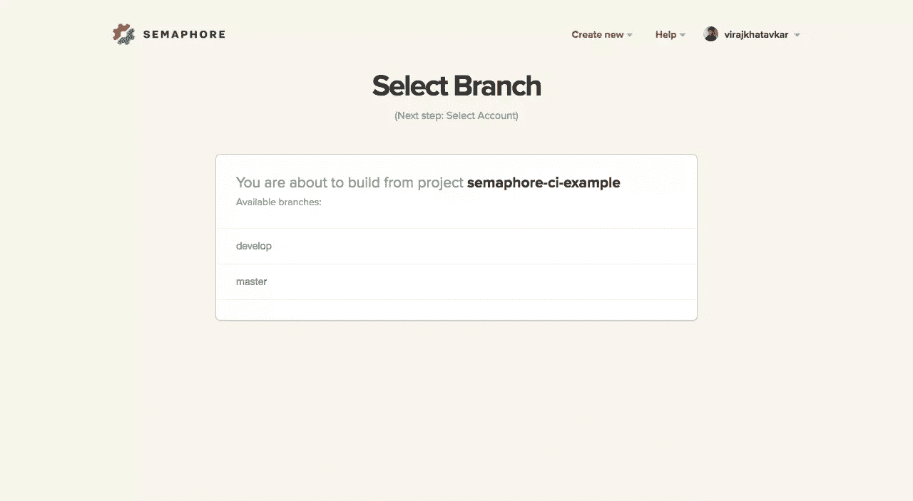

一旦我们选择了一个分支，Semaphore 就会开始分析这个项目。

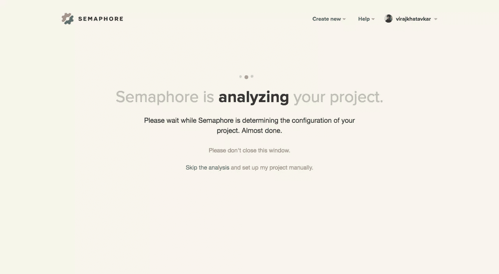

Semaphore 将尝试在他们的服务器上克隆存储库，并获取一些元信息来开始。对于我们的示例项目，确定了以下元信息:

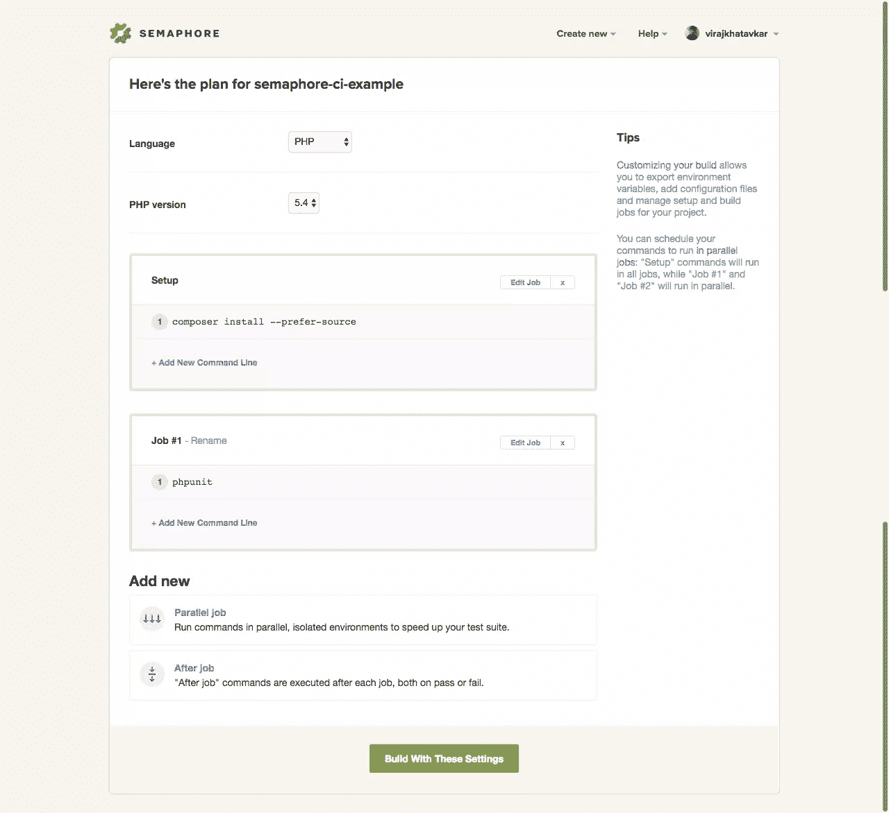

我们将选择 PHP 版本 7 作为我们首选的 PHP 版本，然后继续。

## 配置版本

我们将修改上述设置，以最适合我们的项目。请在继续构建之前彻底检查设置，以避免错误。

### 我们的第一次建造

配置好适当的设置后，我们可以在上面的屏幕中点击 **Build** 。构建的进度将打印在屏幕上。

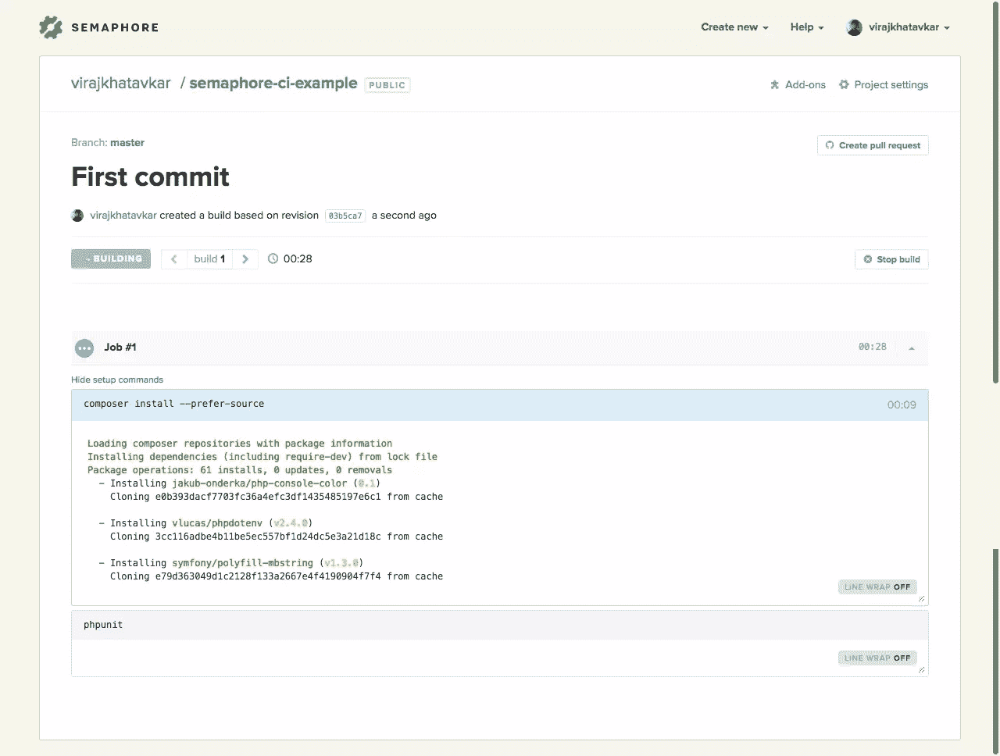

哎呀！我们的构建由于测试失败而失败。这表明我们的代码有问题。

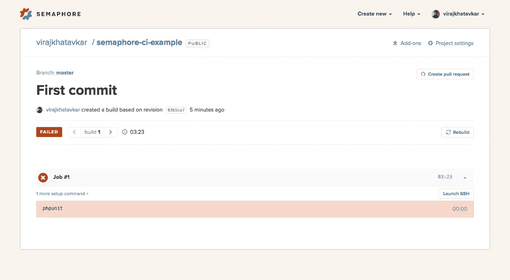

在这种情况下，问题出在我们构建的配置上。一个典型的 [Laravel](https://laravel.com) 应用程序需要在其根目录下有一个环境文件，其中包含必要的配置参数。我们还没有在项目中配置这个文件。让我们在项目的根目录下创建一个环境文件。

转到**项目设置- >配置文件**，为我们的项目创建环境文件，如下所示:

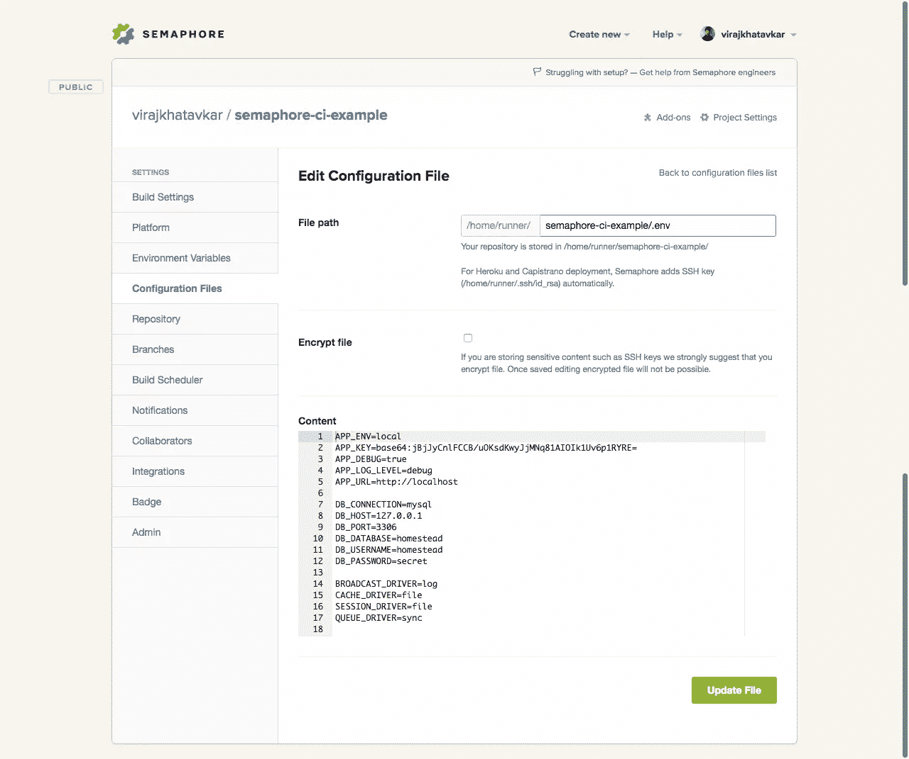

我们可以推送到主分支，或者从信号量 UI 本身重新构建，重新开始我们的构建过程。现在，我们将通过单击最后一个失败构建右侧的 rebuild 按钮，从 UI 本身启动一个重建。

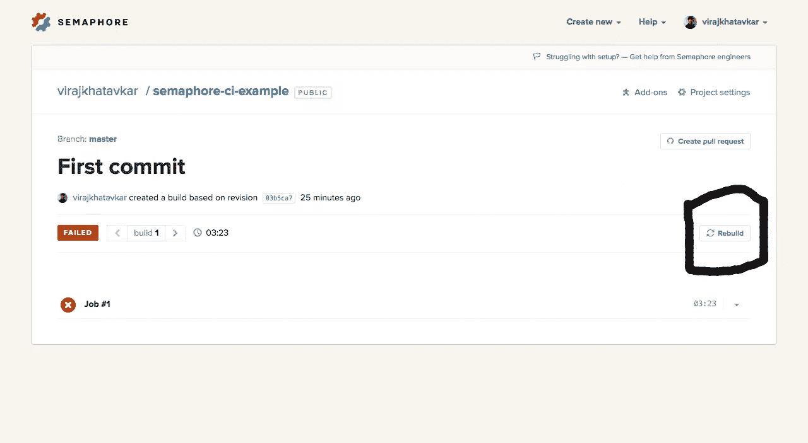

Semaphore 将通过安装必要的依赖项并使用`PHPUnit`运行测试来开始重建我们的存储库。我们可以看到我们的构建成功地通过了。

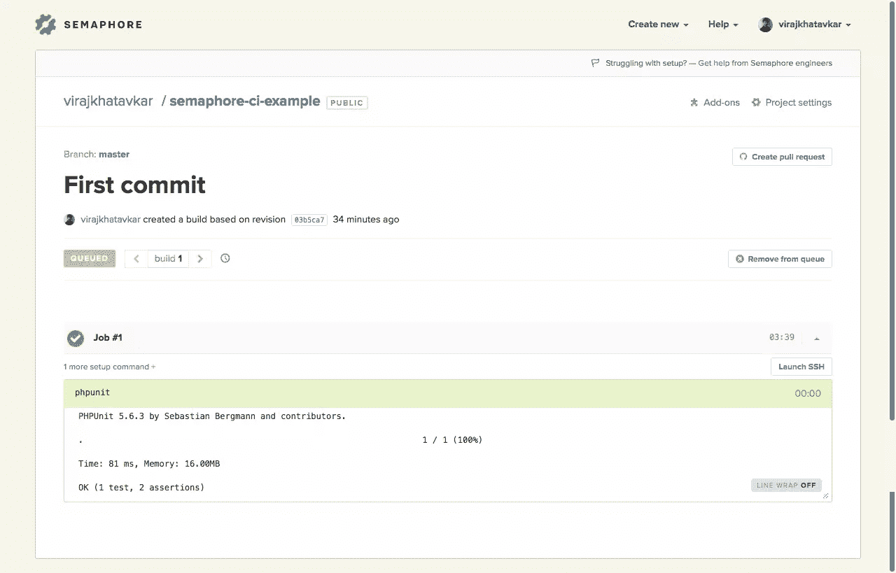

### 并行化您的构建

大规模的测试组是任何高于平均规模的项目的事实。拥有如此令人印象深刻的测试覆盖率的缺点是，运行构建需要大量的时间。在这种情况下，并行是必不可少的。

并行化背后的基础是将我们的测试套件分成可以并行运行的更小的组。您可以根据相似的功能需求或独立的服务或任何其他最适合您的项目的逻辑参数来分组。我更愿意将这些归类到相似的功能需求中。

在我们的应用程序中，我为*登录页面*和*注册页面*编写了两个简单的测试类。让我们在信号量中运行并行测试构建。下面是这两个测试的代码:

```
#LoginTest.php

class LoginTest extends TestCase
{
    /**
     * A basic functional test example.
     *
     * @return void
     */
    public function testLoginPage()
    {
        $this->visit('/login')
             ->see('Login Now');
    }
} 
```

```
//RegisterTest.php

class RegisterTest extends TestCase
{
    /**
     * A basic functional test example.
     *
     * @return void
     */
    public function testRegisterPage()
    {
        $this->visit('/register')
             ->see('Register Now');
    }
} 
```

现在，我们可以在构建设置中配置一个并行作业来分别运行这两个测试。您可以在 [Semaphore 的文档](https://semaphoreci.com/docs/running-tests-in-parallel.html)中了解更多关于并行测试配置的信息。

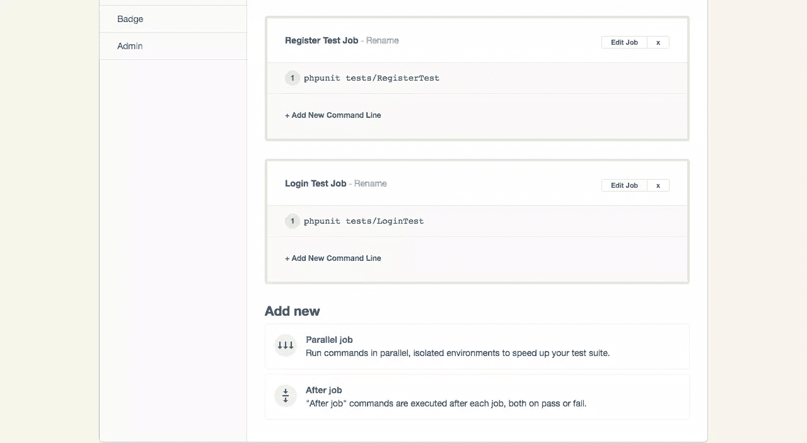

让我们按下`master branch`来触发构建过程。

```
git push origin master 
```

一旦我们推送到 master，Semaphore 将自动检测到变化，并触发我们的并行作业构建。

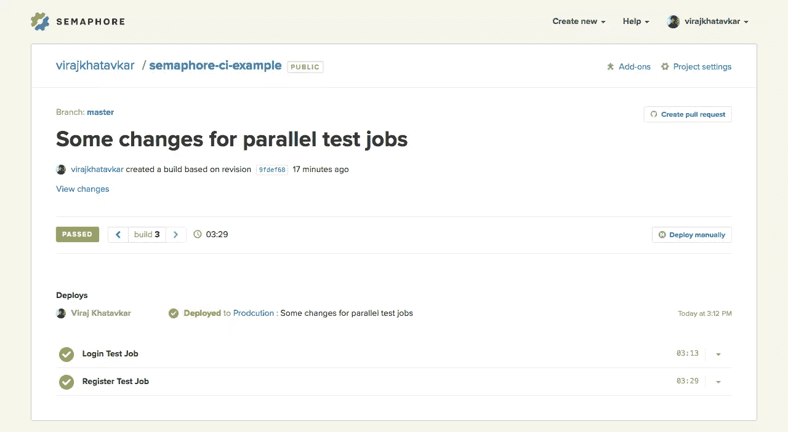

我们的测试是并行执行的，如上面的截图所示。

## 持续部署

最后，让我们为我们的项目设置部署过程。我们将把我们的存储库部署到一个数字海洋服务器上(在继续之前，请确保您设置了一个 Droplet，并且服务器指向了`home/USER/default`——好教程[这里](https://www.digitalocean.com/community/tutorials/how-to-install-linux-apache-mysql-php-lamp-stack-on-ubuntu-16-04))。让我们来看一下每个步骤:

我们将选择一个**通用部署**选项，因为我们将运行我们自己的定制命令来进行部署。

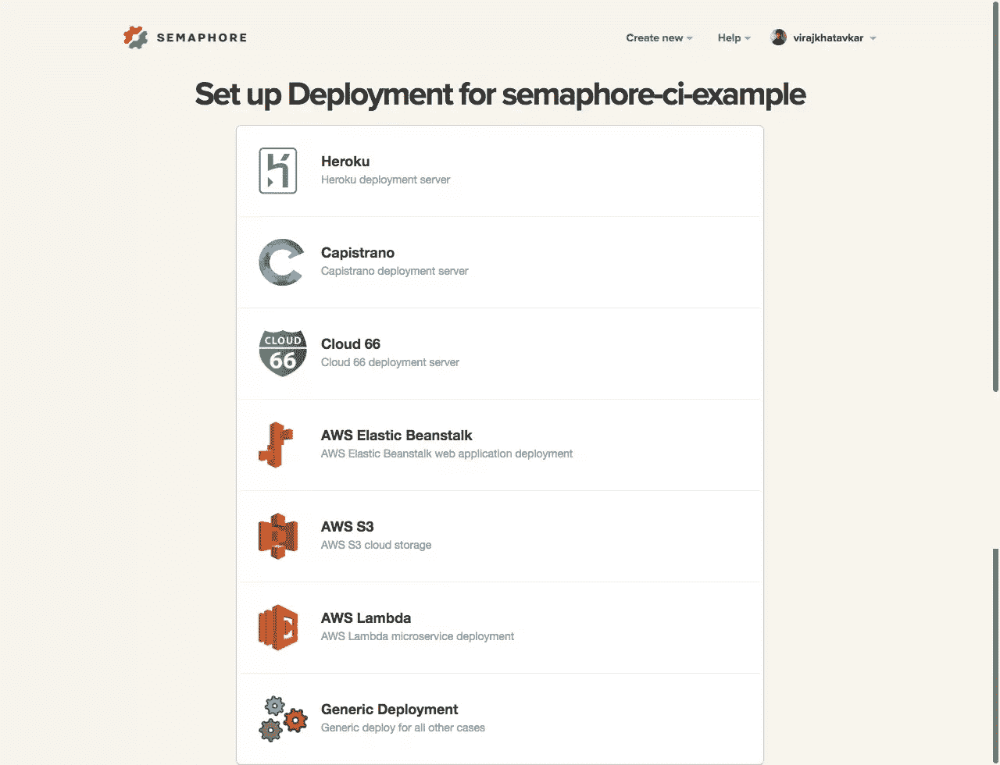

对于部署策略，我们可以选择“自动”或“手动”。我们将选择“自动部署”。每当我们推进到我们的`master`分支并且构建通过时，这将触发一个自动部署。

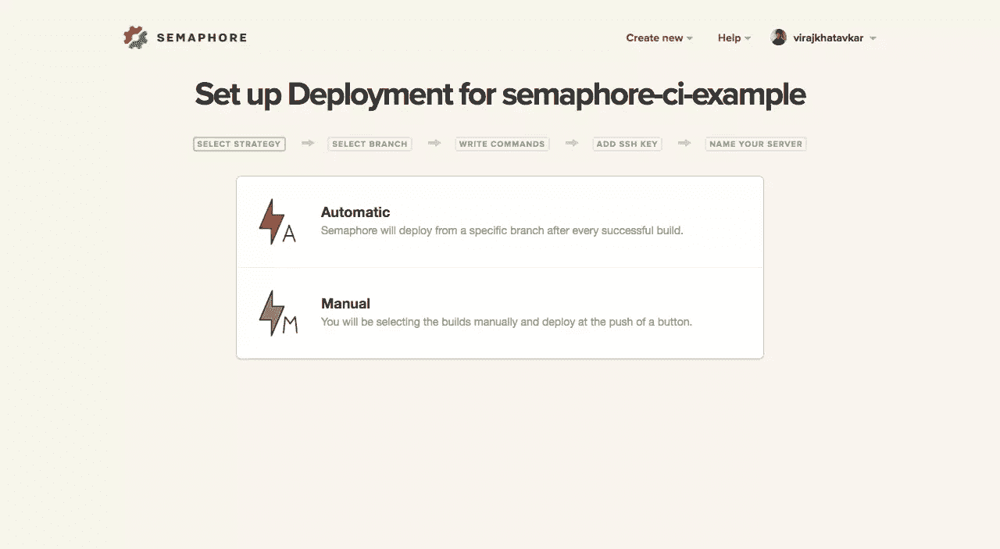

这里，我们需要选择我们希望部署的分支。我们将选择`master`分支。

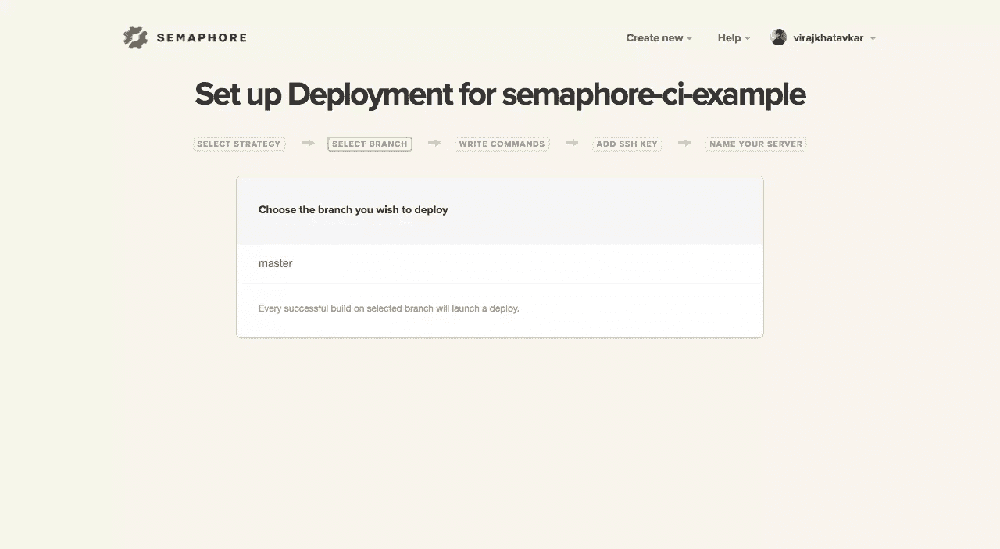

我们将输入我们希望 Semaphore 为我们执行的自定义部署命令。第一个命令收集服务器的公共 SSH 主机密钥，以避免部署期间出现授权提示。

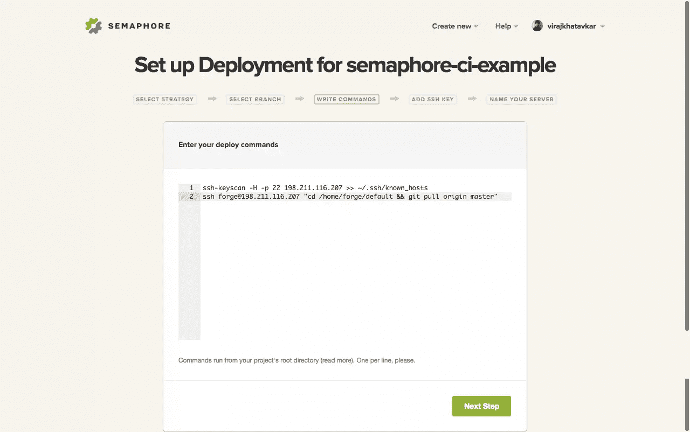

将您的部署用户的私钥粘贴到下面给出的文本区域中。这将允许 Semaphore 访问我们的数字海洋服务器并执行部署命令。

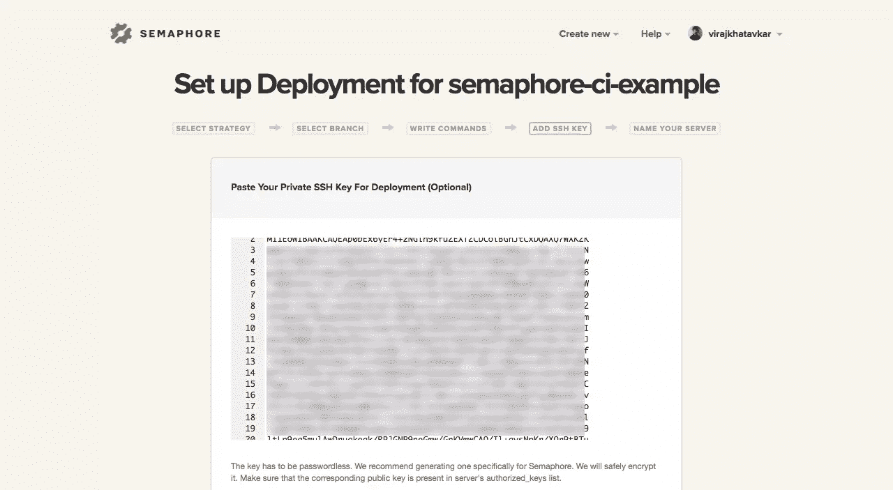

输入您想要的服务器名称并继续:

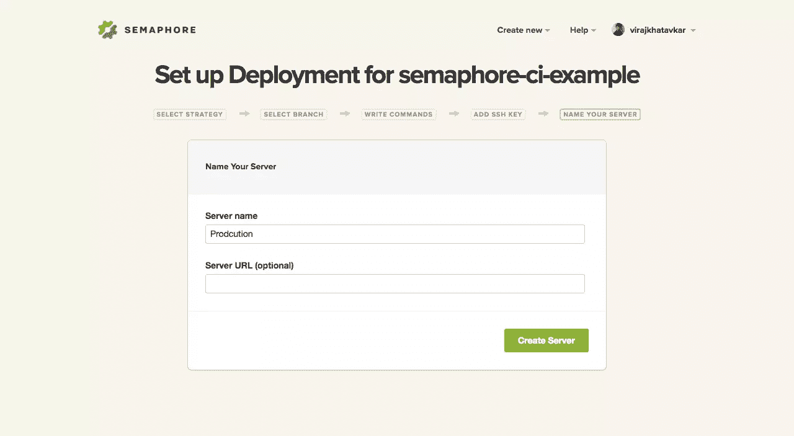

我们已经成功设置了部署服务器。让我们启动一次手动部署，以确保一切顺利运行。

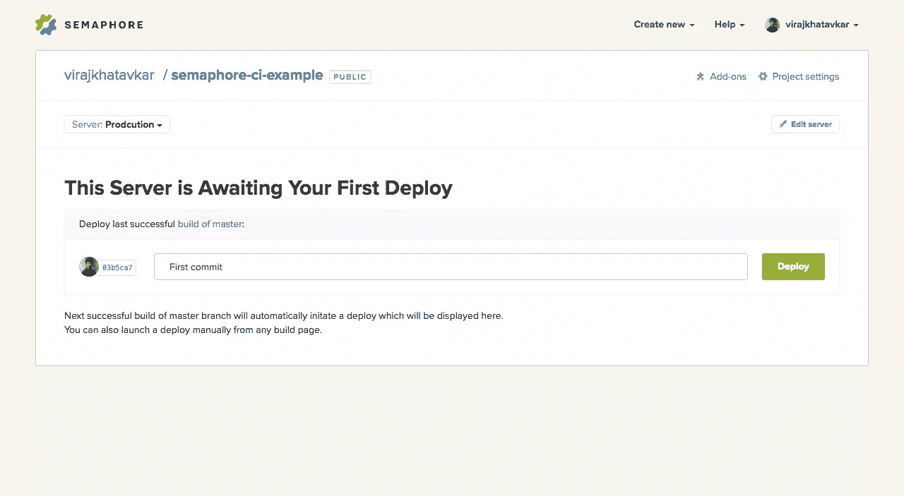

恭喜你！第一次部署已经完成，没有任何错误。

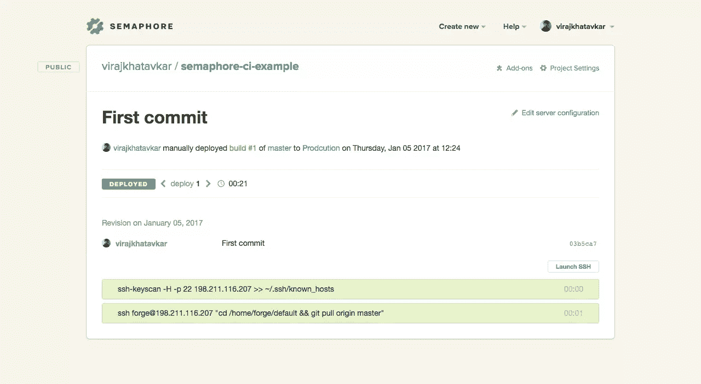

如果我们转到实际的网站，我们可以看到应用程序已经部署:

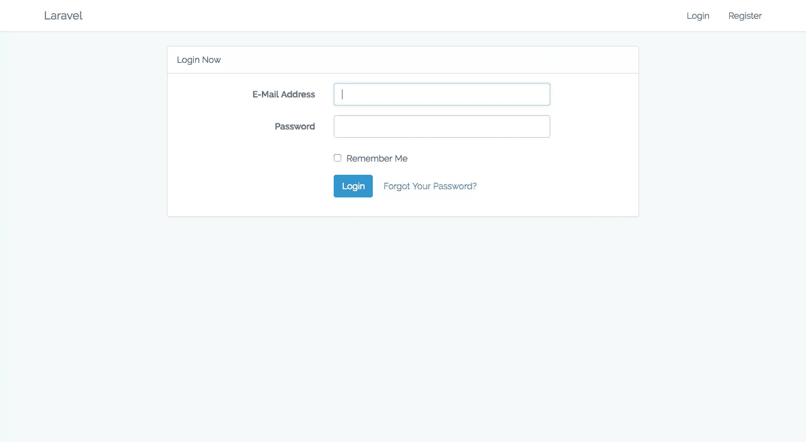

**注意**:如果您的构建失败，那么任何配置为在您的服务器上运行的部署都不会被触发。只有在成功构建之后才会触发部署。

从今以后，每当你推进到你的主分支，Semaphore 将自动构建你的项目，运行你的测试并部署。我们来做一个测试推送，看看流程。

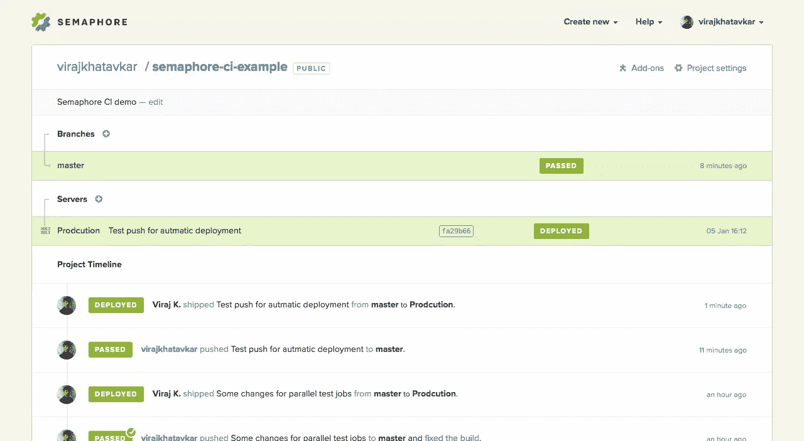

我们的项目成功构建并部署到我们的服务器上。

## 开源替代方案

Semaphore 是一项付费服务，但是它给你带来了很好的回报。如果购买 CD 不在你的预算之内，Gitlab 是信号量平台的一个开源替代品。功能或多或少是相同的，缺点是您必须手动设置一切，并且性能可能是一个严重的问题。

## 结论

我们现在有了一个部署到数字海洋服务器的 PHP 应用程序，并且有了一个连续的交付管道。每当您推送到一个特定的分支或者有人发送一个 pull 请求时，构建将被自动触发。Semaphore 将为您处理所有的麻烦，并让您知道您的构建状态。

*请注意，这只是上述概念的一个简单速成课程——构建 JS 和 CSS 等资产，零停机部署也可以通过信号量和定制解决方案实现，我们将在未来的帖子中对此进行介绍。与此同时，你可以看看我们过去关于[部署者](https://www.sitepoint.com/deploying-php-applications-with-deployer/)的教程——一个可以帮助上述堆栈实现这一目标的工具。*

你如何部署你的 PHP 项目？你用过旗语吗？你对此有何感想？使用任何其他免费或付费的替代品？让我们知道！

## 分享这篇文章