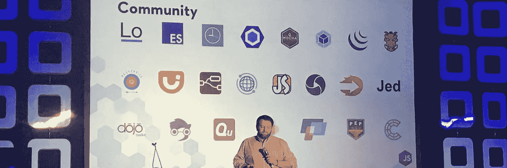

# 专访 JS 基金会执行董事 Kris Borchers

> 原文：<https://www.sitepoint.com/interview-kris-borchers-js-foundation/>

作为 2016 年开源周的一部分，我们带[参观了 JS 基金会](https://www.sitepoint.com/the-js-foundation/)，该组织的使命是为开源 JavaScript 生态系统创建一个重心。在 IBM 和三星这样的大公司的支持下，他们为 ESLint、jQuery、Lodash 和 Webpack 等许多知名项目提供技术治理和指导。

最近，我们有幸采访了 JS 基金会的执行董事克里斯·博彻斯。我们向克里斯询问了基金会的所有情况、内部运作以及人们如何参与其中。尽情享受吧！

**Elio:** 感谢克里斯今天的参与！

克里斯:我的荣幸。

对于那些可能不认识你的人，你能介绍一下你自己吗？

克里斯:当然可以。我以应用计算机科学学士学位开始了我的职业生涯，由于科技泡沫刚刚破裂，我无法在大学毕业后直接找到工作。在自学了 web 开发并在一些小公司从事 web 咨询技术支持工作后，我决定去一所大学工作，在那里我还获得了应用计算机科学硕士和 MBA 学位。从那里，我接管了一所社区大学的外部网站、内部网网站和应用程序，并在那里开始为 jQuery 项目做贡献，这是我第一次不仅仅是消费开源软件。我最终加入了 jQuery UI 团队，一段时间后，在 Red Hat 的一个移动团队中担任 JavaScript 主管时，我被邀请加入 jQuery Foundation 的董事会。最终，当时的执行董事找到了另一个机会，我参加了面试并被录用了。然后，在去年 10 月，我指导 jQuery Foundation 完成了向 JS Foundation 的过渡，这就是我们的今天。

**Elio:** 哇。相当长的旅程。你能告诉我们更多关于 jQuery Foundation 如何过渡到 JS Foundation 的信息吗？你在这个过程中扮演了什么角色？

克里斯:JS 基础是 jQuery 基础的下一步自然发展。我作为执行董事管理 jQuery 基金会大约 3 年了。随着我们所服务的项目数量和类型的增长，以及我们所关心的其他计划的增长，我们的名称、品牌和组织结构的更新变得越来越明显。在过去的 1.5-2 年里，我一直在推动这个过程，让我们完全过渡到这个新组织。

那么，基金会试图为 JS 社区/生态系统做些什么呢？

**Kris:** 我们正在努力为整个 JavaScript 生态系统的创新和协作创建一个重心和焦点。

你能详细说明这是什么意思以及你打算怎么做吗？

克里斯:我们一直在谈论的一个主要想法是共同创新的想法，这个想法有三个支柱:社区、协作和连续性。通过围绕 JS 基金会的项目培养一个大而健康的 JavaScript 社区，我们提供了一个位置和机制来鼓励这些项目内部和之间以及与 JS 社区其他部分的协作。然后，我们为该社区和单个项目社区提供原则和指南，以促进更大、更多样化的贡献者基础。这将导致项目的长期稳定性和可持续性，或者连续性，因为让它们都以“C”开头看起来和听起来都更好。

**Elio:** 我明白了。你打算如何鼓励 JavaScript 的进一步创新使用？

我们真正开始看到 JavaScript 日益增长的兴趣和惊人用例的一个领域是物联网领域。我们目前有两个项目在这个领域真正取得进展，分别是 [JerryScript](http://jerryscript.net/) 和 [Node-RED](https://nodered.org/) 。

JerryScript 最初由 Samsung 创建，是一个符合 ECMA 5.1 标准的全功能 JavaScript 引擎，适用于内存受限的设备。这允许您编写 JavaScript 并在 RAM 少于 64kb、ROM 少于 200kb 的小型微控制器上运行，并且可以直接访问设备 API，这非常令人惊讶。

Node-RED 最初由 IBM 创建，是一个基于流的编程环境，构建在 Node.js 上，通常用于物联网领域，旨在创建事件驱动的应用程序，可以轻松集成 API 和服务。

在这两个项目以及我们的许多其他项目和合作伙伴关系之间，我们将继续推动 JavaScript 更深入地进入物联网和其他技术领域。

**Elio:** 对于 JS 基金会采用的项目意味着什么？有优先考虑的项目吗？

**Kris:** 当一个项目被 JS 基金会接受时，他们会得到一位导师，帮助他们努力建立和实施我前面提到的政策和原则，以发展和维持一个庞大的、多样化的贡献者群体。项目的优先级仅取决于他们对扩大贡献者基础和维护者核心的兴趣和承诺，以及他们对实施 JSF 提出的建议以实现该目标的渴望和能力。

Elio: 我打赌有很多项目想加入这个基金会。有什么计划让他们更多地参与进来？这样做是否有开放/标准化的流程？

**Kris:** 任何项目都可以通过阅读我们在 GitHub 上的[技术咨询委员会(TAC)报告中的技术治理流程和文档来申请加入 JS 基金会。在项目生命周期文档中，定义了一个应用程序流程，它基本上只是要求代表项目的人员向 TAC repo 发送一个 pull 请求，告诉我们有关项目的信息。我们引进新项目的唯一真正限制是资金和导师。只要我们的预算不会因为引进一个项目而受到很大的影响，并且我们有可以指导这个项目的人，我们很可能会接受。很明显，我们不可能支持所有的 JavaScript 项目，但是我们会尽最大努力支持任何需要它的项目，并且被伟大的 JavaScript 社区所依赖。](https://github.com/JSFoundation/TAC)

促进社区协作本身就是一种艺术形式。在这方面你将采取什么方法？

克里斯:围绕促进合作，我们有许多计划正在进行或正在敲定。从提供差旅资金到召集项目进行不定期的面对面会议，到围绕我们项目的影响和重要性及其需求资助营销活动，再到主持和参与开发人员活动。目前还没有正式宣布任何消息，但是很快就会有更多的消息。

**Elio:** 你打算如何帮助推动基金会项目的采用？

这确实与你最后提出的关于促进合作的问题密切相关。通过营销、活动、演讲活动和合作伙伴关系提高我们项目的知名度，我们希望在促进合作的同时推动我们项目的进一步采用。由于项目被认为得到了很好的支持，并拥有一个繁荣的社区和扩展的生态系统，这鼓励了个人和组织相信该项目会在他们需要时出现，并将其纳入他们的开发堆栈。

**Elio:** 基金会是否为非基金会项目提供任何帮助或支持？

**Kris:** 我们的首要目标是支持整个 JavaScript 生态系统，从开发工具到测试框架到客户端库再到物联网。不属于 JS 基金会的项目目前不太可能获得任何形式的资金或其他支持。我们现在有 23 个项目，其他人正在探索加入的想法，所以我们的重点将放在他们身上。也就是说，通过支持一些已经是 JS 基金会一部分的项目，我们间接地帮助和支持了更广泛的 JS 生态系统。

以我们的两个项目 [Lodash](https://lodash.com/) 和 [Mocha](https://mochajs.org/) 为例。Lodash 是一个 JavaScript 实用程序库，基于依赖计数，它是 npm 上最依赖的包。Mocha，一个 JavaScript 测试框架，也被广泛使用，尽管它并不直接依赖于 npm 上的许多包，但是如果你考虑依赖 Mocha 的代码库，你可以说它也是 JavaScript 工具之一，如果不是最依赖的话。无论是哪种情况，通过支持这些项目和 JS 基金会的所有其他项目，我们的支持影响到依赖这些核心项目的整个 JavaScript 生态系统。

**Elio:**JS 基金会是否会促成一些活动？之前有 jQuery 开发者峰会。

克里斯:虽然我们现在还没有具体的活动计划，但这肯定是 JS 基金会的目标，我们正在讨论我们的选择。我们既考虑 JS 范围内的事件，也考虑针对我们项目的个人或团队的事件。我们也在考虑如何支持一些已经存在的令人惊叹的以 JavaScript 为中心的事件。

我注意到你在网站上有一套行为准则。这是会在成员项目中强制执行的吗？基金会是否打算介入社区政治？

**Kris:**《JS 基金会行为准则》适用于我们的项目、工作组、委员会、活动等，并将在所有互动中强制执行。我们的《行为准则》为我们项目中的领导层提供了如何独立处理各种情况的指导方针，但如有必要，行为准则委员会以及在极少数情况下，JS 基金会董事会或法律团队可能会参与其中。

此外，当一个项目加入 JS 基金会时，我们的指导方针规定，他们必须采用 JSF 行为准则，或者有一个与我们的行为准则一致的行为准则，并得到行为委员会和董事会的批准。这确保了与 JS 基金会和我们的项目的所有互动都将发生在对每个人都友好和安全的环境中。

JavaScript 开发者有机会参与其中，或者以任何方式支持基金会吗？

克里斯:绝对的！我们的每一个项目都是开放的，需要贡献，这不仅仅意味着写代码，当然这总是受欢迎的。我们的项目有很多需求，包括图形/网页设计，bug 分类，论坛和聊天支持，测试，文档等等。开发者和其他对 JavaScript 感兴趣的人应该查看我们网站上的[项目页面，找到一个他们感兴趣的项目并投入其中！](https://js.foundation/projects/)

如果某人有一个项目，他们希望我们考虑作为 JS 基金会的一部分予以支持，但希望在发送公共公关申请之前与某人私下讨论，他们应该联系 [projects@js.foundation](mailto:projects@js.foundation) 。

最后，我看到有很多赞助商支持 JS 基金会？成为其中一员的过程是怎样的？

克里斯:现在最好的办法是发电子邮件给 [membership@js.foundation](mailto:membership@js.foundation) ，直接发给我。我很乐意与感兴趣的组织讨论会员的不同级别和每个级别的好处、我们的项目、我们的计划，以及他们如何最大化我们的项目从他们的会员资格中获得的价值，以及他们通过投资 JS 基金会获得的价值。

克里斯，非常感谢你抽出时间。继续基金会的惊人工作——我将饶有兴趣地关注你的进展。

* * *

你觉得怎么样？JavaScript 生态系统需要重心吗？你有兴趣参与吗？你还有什么想告诉克里斯的吗？请在下面的评论中告诉我们。

## 分享这篇文章