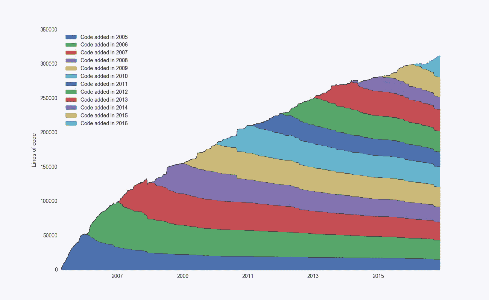

# Git 更好！了解别名、设置、工具、背景

> 原文：<https://www.sitepoint.com/git-better-learn-aliases-settings-tools-background/>

这是我们每隔一周的周五发出的 SitePoint Java Channel 时事通讯的社论。[在此订阅！](https://www.sitepoint.com/newsletter/)

有可能你在工作中，在家里，甚至在厨房都在使用 Git。(是的，流行已经成为*。)随着越来越多的人使用它，有很多很棒的内容在讨论它。在本周的社论中，我想分享一些我发现特别有趣的事情。*

## 根据您的需求定制 Git

首先，每个 Git 帖子都是由 Linus 自己授权的，他列出了几个作者认为会启发读者的很棒的[别名](https://git-scm.com/book/en/v2/Git-Basics-Git-Aliases)。以下是我的(直接来自`~.gitconfig`):

```
[alias]
    st = status --branch --short
    wat = log --graph --decorate --oneline -15
    cd = checkout
    patch = add --patch
    unstage = reset HEAD --
    unstage-patch = reset HEAD --patch
    com = commit -m
    amend = commit --amend --no-edit
    follow = log --follow -p 
```

我使用`git st`来获得一个不那么混乱的状态版本，使用`git wat`来查看一个丰富多彩的、树状的、无差异的日志输出，它帮助我记住在休息之前我在哪里。事实上，我经常使用它们，以至于我有了一个 bash 别名`g`，叫做`git st; echo ''; git wat -5`。

接下来是`git cd`，这是我创建的，因为我经常改变分支。一旦我完成了更改，我试图让世界相信我知道我在做什么，所以我用`git patch`逐个更改文件并创建单独的提交。如果一些不该上演的东西上演了，我会用`git unstage`，尤其是`git unstage-patch`来退场——要么一次全部上演，要么一个接一个地上演。

键入`git commit -m`变得太长，所以我将其缩短为`git com`，因为我经常忘记新文件(`git patch`没有列出它们)，所以我创建了`git amend`来用最新的更改修改最后的提交。

列表的最后一个是`git follow`，它显示了与特定文件相关的所有更改。不幸的是，我没有找到一种方法只看到提交而没有该死的差异，因为我经常不关心它们。

当然，我不是唯一一个可以使用化名和提供建议的人。以下是其他一些例子:

*   [去亲提示](https://adaptechsolutions.net/git-pro-tips/)
*   [鲜为人知的 Git 命令](https://hackernoon.com/lesser-known-git-commands-151a1918a60#.bbiiooav5)
*   [16 个牛逼 Git 别名](http://codersopinion.com/blog/16-awesome-git-aliases-that-you-will-love/)

[](https://github.com/erikbern/git-of-theseus#readme)

如果你经常使用 GitHub，你可能会对让 Git 用类似`git checkout pr/999`–[的东西来检查拉请求感兴趣。而](https://gist.github.com/piscisaureus/3342247)[这个提示](https://twitter.com/kisielk/status/793133952542191616)可以让你克隆`git clone gh:<repo>`。(顺便说一句，10 月 GitHub 无意中暴露了一些私人存储库的数据——[事件报告](https://github.com/blog/2273-incident-report-inadvertent-private-repository-disclosure)非常有趣。)

一个很好的可视化 Git 回购如何随时间演变的工具是 Theseus 的 Git。有了它，你可以堆叠图的总行数(右)或代码行存活率。

如果你对统计感兴趣，比如每个作者或每个月的提交量，或者甚至想给评论者一个建议，试试 [git quick statistics](https://github.com/arzzen/git-quick-stats) 。

另外，如果你写了很多 gitignore 文件，你可能想用 to [gitignore.io](https://www.gitignore.io/docs) 来帮你做这件事。那么写一个`.gitignore`所需要的就是`gi intellij,eclipse,gradle > .gitignore`。

## 可用性

知道 Git 很棒，但是学习 Git 可能很难。特别是对于那些不会从投入大量时间学习内部工作原理中获益的兼职用户。不幸的是，Git 是更容易泄漏的抽象之一，即使简单，在协作环境中的日常使用也需要相当多的命令和对正在发生的事情的良好理解。

这也不仅仅是一个人的观点。麻省理工学院的计算机科学家 Santiago Perez De Rosso 和 Daniel Jackson 发表了关于这个主题的论文，其中两篇 Adrian Colye 在他的博客 [the morning paper](https://blog.acolyer.org/) 中进行了总结:

*   [Git 怎么了？概念设计分析](https://blog.acolyer.org/2016/10/24/whats-wrong-with-git-a-conceptual-design-analysis/)
*   [Git 的目的、概念、缺陷和重新设计](https://blog.acolyer.org/2016/10/25/purposes-concepts-misfits-and-a-redesign-of-git/)

但是 Git 就是这样，所以如果你 *do* 有问题怎么办？


## 证明文件

Git 是一个很好的文档，如果你知道如何提问，几乎每个问题都是很好的建议。但是有一个来源需要特别注意:git-scm.com 的官方文件，它有两个分支。

第一个是[git-scm.com/docs](https://git-scm.com/docs)，是参考文献。说得好听点，并不是最好的入门资源。例如，让我们检查[的`git tag`参考](https://git-scm.com/docs/git-tag)——描述如下开始:

> 在`refs/tags/`中添加一个标签引用，除非给出`-d` / `-l` / `-v`来删除、列出或验证标签。
> 
> 除非给出了`-f`,否则命名标签必须还不存在。
> 
> 如果通过了`-a`、`-s`或`-u <keyid>`中的一个，该命令将创建一个标记对象，并需要一个标记消息。除非给出`-m <msg>`或`-F <file>`，否则将启动一个编辑器供用户输入标签信息。

没错，WTF？！虽然这也是我的反应，但这有点不公平。作为参考，它应该精确而简洁，而不是说教式的公园漫步。如果你正在寻找后者，git-scm.com/book 的免费 Pro Git 书是你的朋友。这是[关于标记](https://git-scm.com/book/en/v2/Git-Basics-Tagging)的文章开头是:

> 像大多数 VCS 一样，Git 能够将历史中的特定点标记为重要点。通常人们使用这个功能来标记发布点(1.0 版等等)。

好多了。因此，如果你登陆了一个看似不可理解的网站，但它并不能真正帮助你查看网址。如果是从[git-scm.com/docs](https://git-scm.com/docs)开始，你最好去[git-scm.com/book](https://git-scm.com/book)寻找你的问题。

或者，当你不着急的时候，你可以挑战一下自己，看看你对这个参考有多少理解。相信我，每次你这样做，你都会带着更多的知识回来。

## 最后的话

如果你有兴趣听听 Linus 个人的看法，他在 2007 年的 Google 上做了一个很棒的演讲:

[https://www.youtube.com/embed/4XpnKHJAok8?feature=oembed](https://www.youtube.com/embed/4XpnKHJAok8?feature=oembed)

这就是本周的全部内容，希望你玩得开心！

再见…尼古拉

PS:别忘了[订阅](https://www.sitepoint.com/newsletter/)。:)

## 分享这篇文章