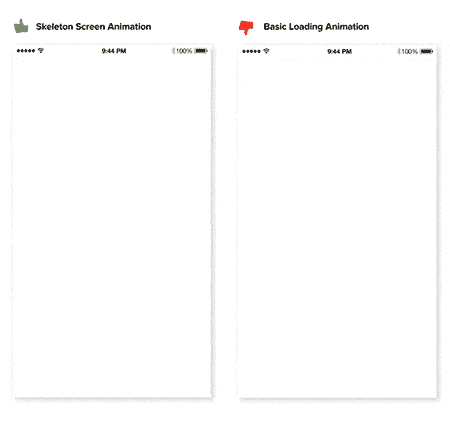
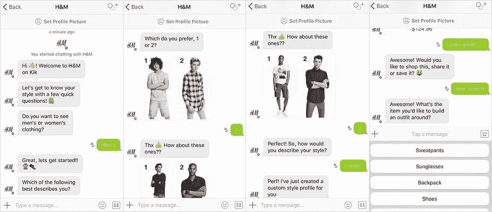
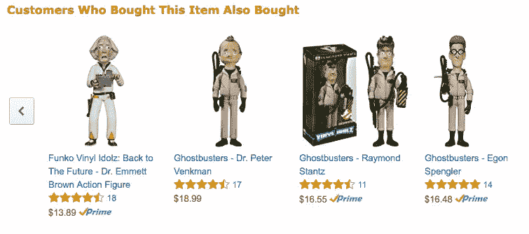
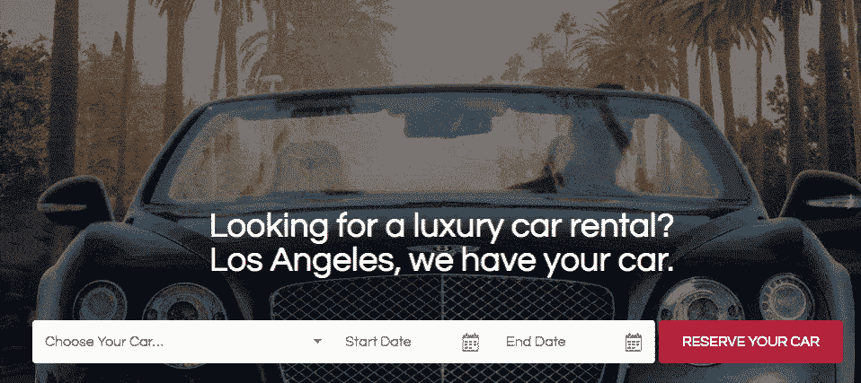
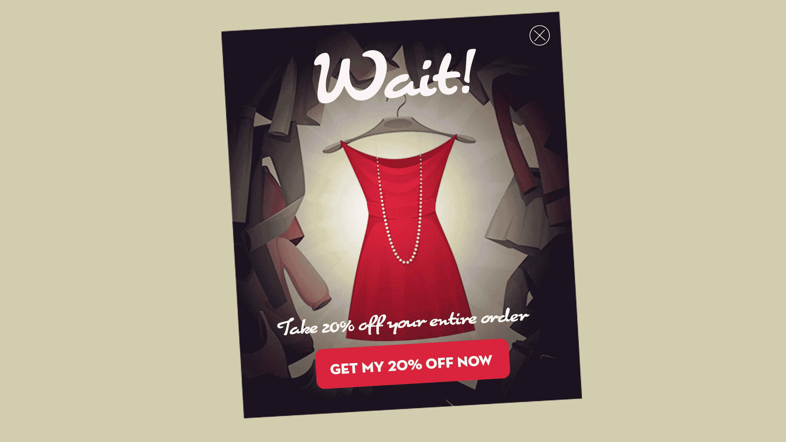
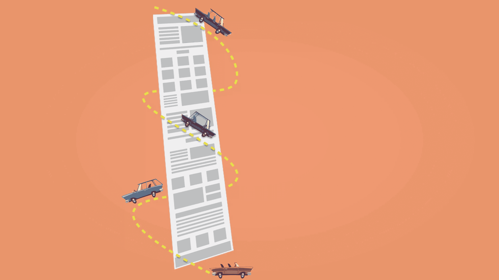

# 2017 年 10 大网页设计和 UX 趋势可以提高转化率

> 原文：<https://www.sitepoint.com/10-web-design-ux-trends-2017-can-boost-conversions/>

新的一年带来新的机遇。对于网页设计师来说，采用最新的视觉趋势和用户体验策略既是机遇也是挑战。

但是任何一个网络专业人士都知道，网页设计不仅仅是好看，UX 是转化过程中必不可少的一部分。这就是为什么我们的机构 The Deep End 想要确定哪些新兴趋势实际上可以为我们的客户带来积极的影响——也就是说，哪些新趋势可以用来帮助提高转化率？

通过为客户提供工具，让他们在新的一年里能够获得更多的销售线索或实现更多的销售，你将带来真正的价值。那种你可以收取溢价的价值。

为此，这里有 10 个策略，你可以在新的一年及以后使用，既帮助客户，也通过自己的网站赢得更多新客户。

## 1:响应年龄的设计

**转变原因:**无论你是想接触 X 代、Y 代(千禧一代)、Z 代(新生代)还是婴儿潮一代，这种策略都有强大的力量。它认为每一代人都会对针对他们的图像和美学做出最好的反应。

通过采用登陆页面策略(见第 9 条)，你不必把你的整个网站都献给一个特定的人群。相反，你可以在社交媒体营销和登录页面中使用特定代的图像和“感觉”,引导你选择的一个或多个群体接受你的产品。

## 2:骨架屏幕

**转变原因:**每个人都想要速度，而且理由充分。仅仅一秒钟就能决定是否留住一个网站访问者(这是转化的第一步)。

有很多方法可以提高页面加载时间，但是[框架屏幕](https://www.sitepoint.com/how-to-speed-up-your-ux-with-skeleton-screens/)提供了一个额外的选择，因为不耐烦的用户会觉得页面的速度比时钟显示的还要快。

用户体验很大程度上与网页加载速度有关，但心理学研究表明，细微之处也会影响人们。当主屏幕加载时，观众可以预测内容。这减少了不耐烦，所以跳出率较低。

## 3:订婚机器人

**转变原因:**聊天机器人并不新鲜，但它们的用途已经扩大，几乎可以整合到任何网站中，以自动回答客户的问题，并保持销售过程全天候进行。

你能用订婚机器人做什么？把它们想象成一个有回应的 FAQ 部分。在继续之前，您的客户可能会有什么问题？让你的机器人全天候回答这些问题，你就有望获得更多的转化。

## 4:购物车营销

**转变原因:**顶级在线零售商使用购物车营销来推广类似产品或追加销售是有原因的。研究表明，这种促销可以增加 10%到 30%的电子商务收入。

因此，如果你直接销售，提供捆绑销售的相关产品是有意义的——甚至是可能吸引顾客的无关产品。

## 5:动画号召按钮

**转换原因:**突出的 CTA 按钮是进行转换不可或缺的。顶级设计师会考虑页面的大小、形状和位置。但一个新趋势是在 CTA 按钮上添加微妙的动画——只要足以吸引注意力，而不会从产品或其他重要的视觉效果上转移开。

保持动画的品味并与网站的视觉外观和感觉保持一致是很重要的——这种运动只是提高可见性的另一种方式。

## 6: Cinemagraph 英雄形象

**转换原因:** [电影](https://www.sitepoint.com/how-to-hack-brains-with-cinemagraphs/)很迷人。在一幅静止的图像中，有一些微妙的运动吸引了人们的注意。这是让忙碌的网站访问者停下来并引起注意的第一步。

此外，对于你的营销预算来说，你在 cinemagraphs 上的投资也可以用于社交媒体。华尔街日报报道称，使用 cinemagraphs 的脸书广告点击率比静态广告高出 60%。

## 7: ~~讲解者~~说服者视频

[https://www.youtube.com/embed/dT5CoztbZQk](https://www.youtube.com/embed/dT5CoztbZQk)

*https://www.youtube.com/watch?v=dT5CoztbZQk*

**转变原因:**你可能对 explainer 视频很熟悉——它们是我能想到的所有网络初创公司的标志。但是这些视频已经进化到了全力以赴*劝说*的更高目的。

使用真实的人(记住第一条中年龄响应设计的优势)来称赞你的产品和服务，以从这种策略中获得最大收益。

真实的视频将社会证明与突出特色和优势的机会相结合，帮助您克服异议，并促使您的访问者进行转换。

## 8:基于价值的出口覆盖

**他们转变的原因:**实体店的优势在于能够从顾客那里获得社交暗示。如果销售人员感觉到顾客即将离开，他们可以做出回应，提高报价的价值。基于价值的退出覆盖为在线营销者提供了类似的优势。

无论你是追求直接销售还是潜在客户，你都不会立刻赢得每个网站访问者的青睐。但是如果，就在他们准备离开你的网站的时候，你可以做最后一搏呢？也许这是一个赠品，一个折扣，或免费送货。无论是什么，你都需要提供它，不附带任何条件，以增加客户的信任(并有另一个转化的机会)。

## 9:主页的死亡

**转换原因:**在 2017 年及以后，主页与你的营销的相关性远不如登陆页面，因为你可以根据年龄人口统计、位置或其他指标来锁定特定群体。

一个有效的登陆页面就像是网站访问者的路线图。如果你还没有使用登录页面，现在是时候升级你的游戏了，使用一站式策略，在一个页面上提供转换所需的一切(或非常有限的导航)。

## 滚动胜过导航

**转换原因:**老派的逻辑会告诉你，你需要在你的网站上把基本的网页设计元素放在“文件夹之上”。

部分由于移动设备使用的增加，滚动已经被广泛接受，甚至超过了预期。这种趋势允许你在一个页面上整合这里描述的许多其他策略。通过这种方式，你可以用一个页面讲述一个引人入胜的故事，克服异议，从而提高转化率。

这是一种更有效的吸引转化的方式，而不是让网站访问者自己漫无目的地从一个页面漫游到另一个页面。

## 包扎

互联网随着用户行为的变化而不断发展，了解转化是如何发生的非常重要。在 2017 年，网站必须具有吸引力和高功能，UX 战略设计，以实现目标。

在你的网站设计中使用一个或多个这样的技巧来保持数字营销的领先优势，这当然意味着提高你的转化率。

如果你想看完整的信息图，你可以在这里查看: [2017 年网页设计& UX 趋势提升转化率](http://thedeependdesign.com/2017-web-design-trends-infographic/)

## 分享这篇文章