# 如何使用 AppGini 快速构建 Web 应用原型

> 原文：<https://www.sitepoint.com/prototype-web-apps-quickly-appgini/>

*本文由 [AppGini](https://bigprof.com/appgini/) 赞助。感谢您对使 SitePoint 成为可能的合作伙伴的支持。*

老实说，我想不出有多少可能的原因会让你需要一个数据库，尤其是在今天。所以让我们假设一下，你是一名正在接受培训的网站开发人员。

这已经是一个相当对抗的世界了。你至少要学习 HTML、CSS 和 JavaScript。然后你可能需要选择一个 JavaScript 库，比如 jQuery、React、Angular，或者任何你感兴趣的东西，更有可能是某种服务器端技术，比如 PHP、Ruby、node . js……你明白了吧。

我可以肯定地说，即使你的最终目标是成为最好的前端开发人员，你也绝对需要掌握一些数据库技能。即使您正在与一个令人惊奇的 ORM 一起工作，了解其内部发生了什么也是对您有益的。

想象一下，您想尝试构建某种 web 应用程序。你需要数据，对吗？如果你刚刚开始使用 API，你可能想从一个简单的天气应用程序开始，但是如果你想尝试更复杂的东西，你可能只需要自己创建一个数据库。

试图一次学习太多技能已经成为许多伟人的败笔。

将数据库加入其中足以让某人超负荷工作。即使 SQL 语法不太复杂，试图理解关系数据库是如何组合在一起的也是一件非常困难的事情，尤其是在设计、播种和优化关系数据库的时候。

## 你为什么这么想？

每一个支持使用发电机制造东西的理由，都有更多的反对理由。但是使用像 AppGini 这样的工具当然有它的优点，我相信有几个很好的用例。

AppGini 使创建数据库变得非常容易，这样您就可以在几分钟内创建并运行一个数据库——当然，更复杂的数据库需要更长的时间。对于 SQL 或关系数据库管理系统知识有限的人，或者希望在有限的时间内构建一个想法的原型的人来说，这是非常好的，但是您也可以使用它来高效地构建一个生产就绪的数据库。

## 如何开始使用 AppGini

要开始，你需要[下载 AppGini](https://bigprof.com/appgini/ "Download AppGini") 并安装它，尽管这里需要注意的是它只能在 Windows 上运行。Linux 用户可以按照[这些指令](https://bigprof.com/appgini/tips-and-tutorials/install-appgini-on-ubuntu-linux)来虚拟化 AppGini。

一旦安装完毕，你还需要确保你的机器上运行着 PHP 和 MySQL，推荐的最低版本分别是 5.2 和 4。

如果你现在还没有在你的机器上安装 PHP 和 MySQL，有很多方法可以做到——然而，对于本教程，我选择使用 PHP 5.5 和 MySQL 5 的 XAMPP，你可以在这里下载。安装完成后，启动 Apache 和 MySQL 服务器，并在浏览器中打开 http://localhost 来验证它们是否正常工作。你的 XAMPP 控制面板应该是这样的:

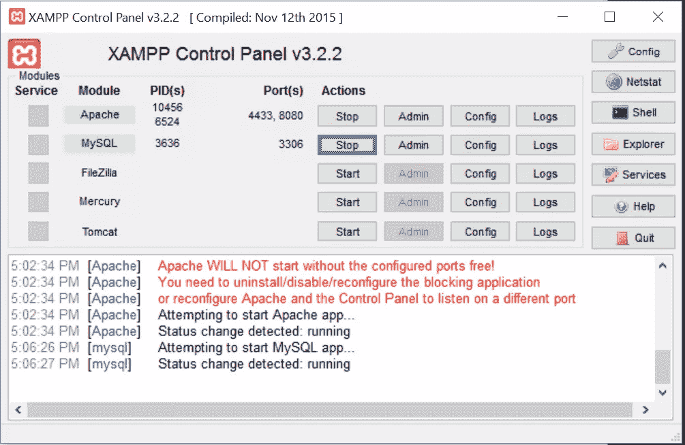

## 我们要用 AppGini 建造什么

我们将构建一个数据库，您可能希望它用于一个非常简单的内容管理系统。为此，我们需要制作三个包含不同字段的表。

1.  用户(ID、用户名、用户电子邮件、用户账号、用户图像)
2.  类别(ID、类别 ID、类别名称)
3.  帖子(ID，AuthorID[FK]，postTitle，postContent，postPublishDate，categoryID[FK])

当我们创建它的时候，我将解释我们正在使用的一些数据类型，以及 AppGini 如何处理具有特殊名称的字段。

## 在 AppGini 中创建数据库

当你打开 AppGini 时，它会问你想如何开始。我们将选择“开始新项目”,然后单击“确定”。

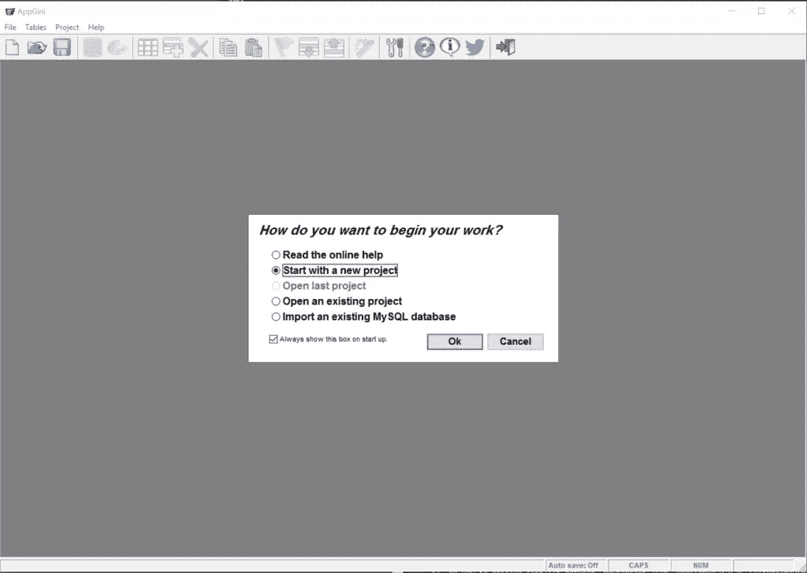

AppGini 将为您启动项目，只需选择一个数据库名称`new_db`。在这里，你想点击`new_db`并随意更改名称——我把它改为`content`。

在主窗格中，您可以随意修改外观，但我想在这里重点介绍的是本地化设置。我想将日期格式改为`Year, Month, Day`，并将字符编码设置为`UTF-8`，尽管这应该已经是默认设置了。值得注意的是，AppGini 确实支持从右到左的语言，因此您可以安全地使用阿拉伯语、希伯来语等等。

在我们继续之前，这是我正在看的。

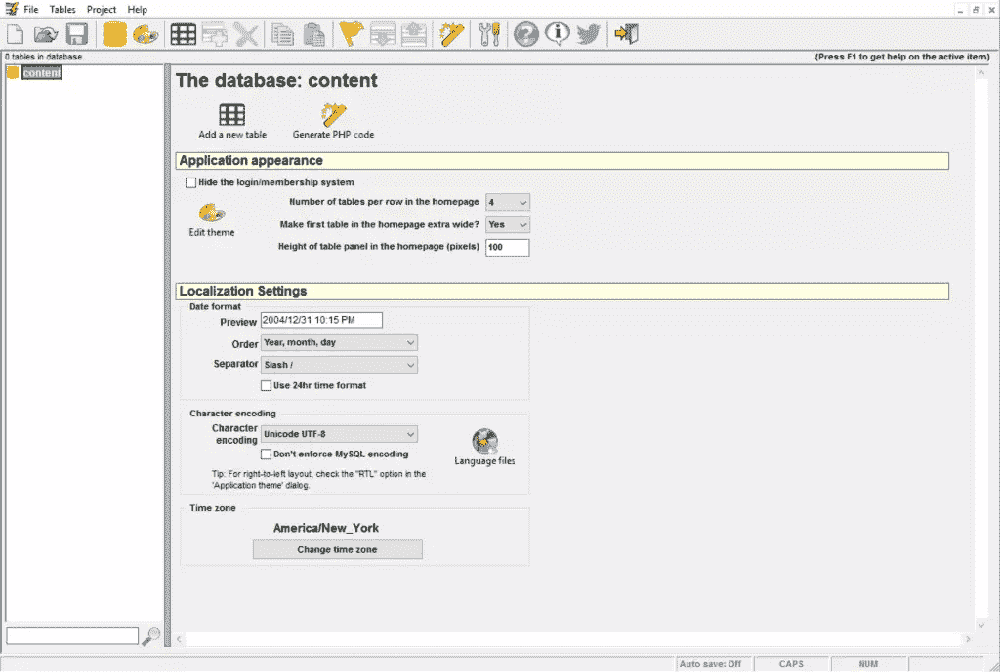

## 在我们的数据库中创建表

我们要创建的第一个表是`users`，我们只需点击“Add a new table”即可——您可以在前面的屏幕截图中看到这一点，它位于顶部菜单和数据库名称下的主窗格中。

一旦你添加了一个新的表，AppGini 就会设置光标，这样你就可以更改这个表的名称，所以我们自然会把这个表叫做 users。我将添加一个描述，说明该表包含的内容，稍后将在 AppGini 生成的仪表板上看到。

根据您要使用的数据，您可能希望将表格视图模板从水平更改为其他选项之一，例如垂直，如下图所示，但是我发现默认设置很好。

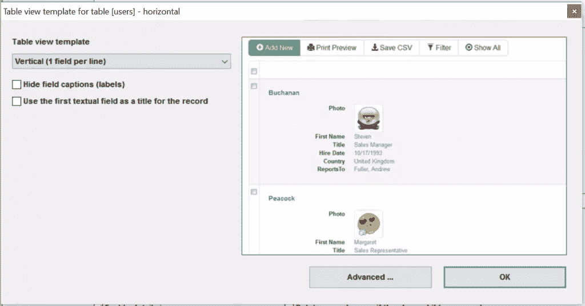

现在我们需要向表中添加一些字段。您可以点击菜单中“添加表格”右侧的“添加字段”来完成此操作。

当您这样做时，AppGini 会自动将光标放在左窗格中的字段名称上。我们将把第一个字段称为`ID`，它在 AppGini 中被特殊处理。当您命名一个字段 ID 时，它会自动将其设置为表的主键，使其自动递增，并在表视图中隐藏它。在 RDBMS(如 SQL)中，主键是每一行的唯一标识符，由数据库引擎在您添加记录时自动设置。它的值自动递增意味着每个新行的主键都有一个前+ 1 的值。我们将它隐藏在表视图中，因为我们不需要看到它。

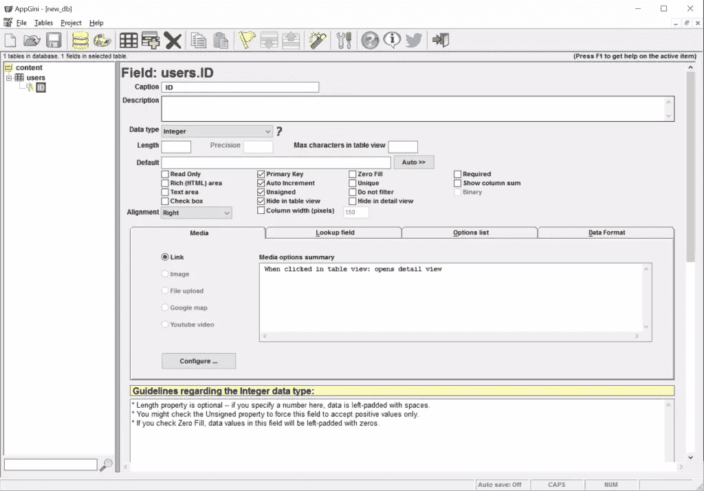

我们的下一步是添加另一个名为`userName`的字段。它不需要特殊的配置，将被创建为一个最多 40 个字符的字符字段。

接下来我们将添加另一个字段，这次是`userEmail`——但是在添加它时，我们将只称它为`email`。电子邮件是 AppGini 中的另一个特殊单词，它将为将要生成的前端设置某些属性，基本上是将值设置为有一个`mailto`链接，如下所示。


为自动生成的属性命名为 email 后，单击该名称并更新为`userEmail`。

现在我们要添加另一个字段。我们想称它为`userDob`，但我们首先要称它为`date`，因为这是 AppGini 中的另一个特殊单词，它会自动设置一些属性。在这种情况下，该字段的数据类型将自动设置为类型`Date`。创建完成后，点击字段名称并将其更改为`userDob`，然后将“标题”字段更改为“出生日期”。

我们在这个表中的最后一个字段将是`userImage`，尽管我们再次将它命名为不同的名称——这次它将以`image`开始，为前端设置某些属性，包括一个预填充的描述，所以创建它，然后将其重命名为`userImage`。下面您可以看到媒体选项摘要。


完成`users`表后，我们将创建一个新表，这次名为`categories`。在创建了`users`表之后，这个应该非常简单。我们想要创建两个字段。

1.  `categoryId` —将其命名为`id`开始，然后重命名为`categoryId`，并且
2.  虽然我建议将“标题”字段改为“类别名称”，但我们并不需要对其做任何特殊处理

最后，我们创建第三个也是最后一个表，名为`posts`。首先在这个表中创建一个名为`id`的字段，然后将其重命名为`postId`，这样我们就可以利用 AppGini 的行为，以最少的努力获得最好的结果。

为这个表创建的第二个字段将被称为`authorID`。我们希望它使用另一个表中的数据，而不是为每个添加的帖子手动填写，因此我们将单击“查找字段”选项卡，选择一个父表`users`，然后将标题字段设置为`ID`和`userName`，如下图所示。


我们将基本上再次做同样的事情，但这一次是针对名为`categoryId`的字段，我们将进入“查找字段”并将标题字段分别设置为`categoryId`和`categoryName`，如下图所示。


为什么我们要使用查找？数据完整性。在我们的表中使用查找时，我们实际做的是将字段的值设置为外键，这只是另一个表的主键，有三个主要好处:

1.  该表中某个项目所需的数据可以从另一个项目中提取，从而防止数据重复
2.  几乎不可能在该特定字段中插入无效数据
3.  理论上来说，数据是被保护的，不会被意外删除，如果不先删除他们的帖子，你就不能删除一个有 10 篇帖子的用户。

现在创建另一个表，这次名为`postTitle`。默认值很可能就足够了，尽管字符限制是 40，您可能希望将其更改得更大。我还建议将“标题”字段改为“文章标题”。

接下来，我们将创建`postContent`表。因为这将存储构成文章的文本，我们需要给它更多的移动空间。因此，我们希望将数据类型更改为`Text`，这是一个可以容纳略多于 20 亿个字符的字段。我还会建议将“标题”改为“文章内容”。我们还想将字段的前端显示类型更改为`Rich (HTML) area`，以便可以根据需要添加格式，如下图所示:

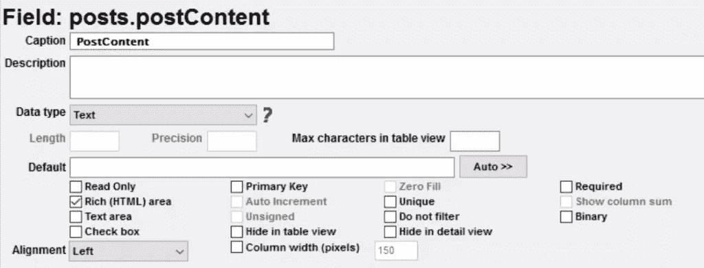

现在是时候创建我们的最终表了，这次称为`postPublishDate`，我们将数据类型设置为`DateTime`，因为我们希望帖子不仅有发布日期，还有时间。对于该字段，我们希望点击自动菜单并选择`Creation date and time`,以便自动填充，但是，这也会将该字段设置为只读。当然，我建议将“标题”改为对用户更友好的名称，在这里是“出版日期”。

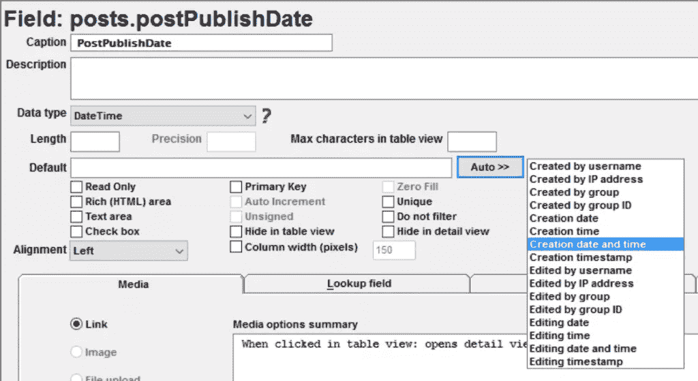

如果您希望能够跟踪它何时被更改，您可以创建另一个字段，并将其数据类型设置为`DateTime`并在 Auto choose `Editing date and time`下。否则，如果你一直这样做，这就是你的 AppGini 的样子。

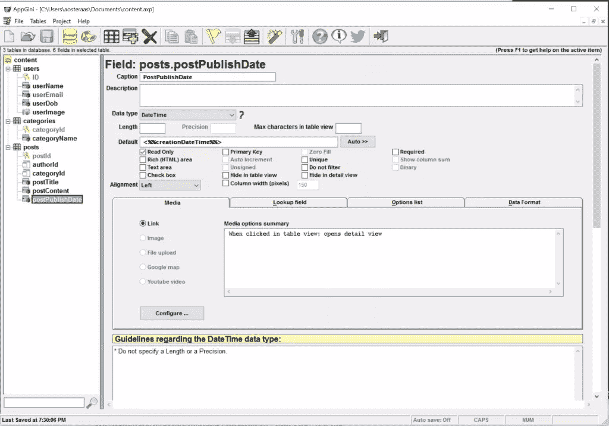

## 部署我们的数据库

好吧！我们已经为数据库创建了结构，所以现在是部署的时候了。默认情况下，AppGini 将部署一个标准的引导前端，但是您可以通过点击左侧窗格中的数据库，然后选择 Edit theme 来轻松地更改它。

在这里你可以预览一下默认情况下的样子。使用下拉菜单，你可以将主题更改为另一个基于 Bootstrap 的模板，其中一些我相信读者会从 [Bootswatch](https://bootswatch.com/) 中认出来。下面你可以看到我选择了平面，预览也相应地更新了。

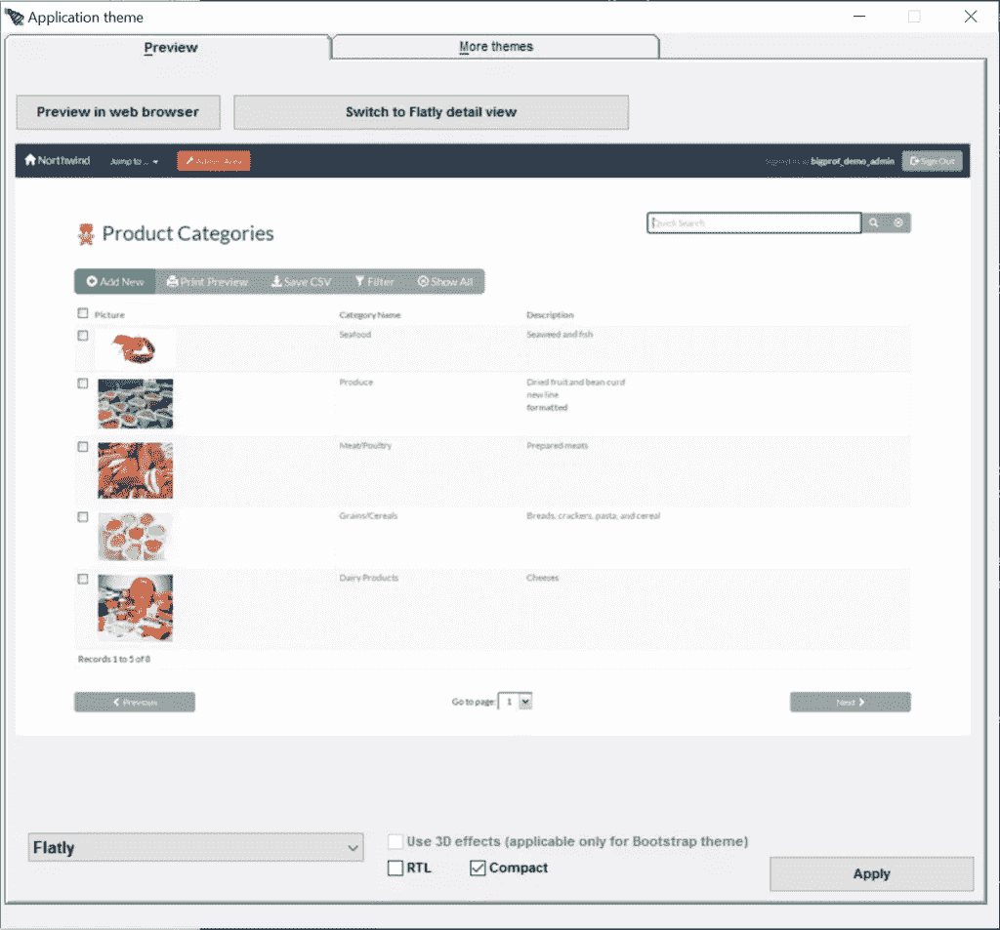

需要的话记得打`RTL`！

现在是时候点击生成 PHP 代码了，之后你需要告诉 AppGini 在哪里部署实际的代码。如果你使用的是 XAMPP，并遵循默认安装，那么你会想把它放在`C:\xampp\htdocs\foldername`中，我们会用`content`替换`foldername`。假设一切顺利，您应该会看到类似这样的输出窗口。

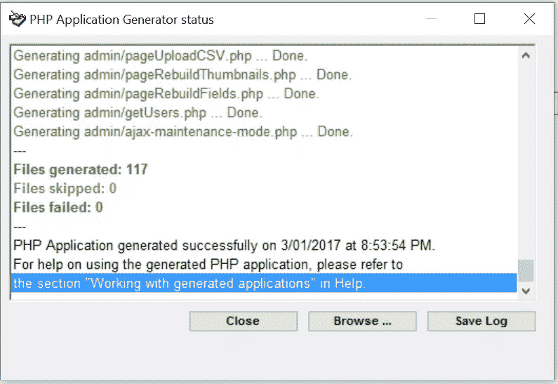

我想在这里强调的是，如果你愿意，你可以对你的数据库做任何数量的修改，并再次运行 PHP 生成器，而不用担心丢失数据。

否则，是时候在浏览器中打开我们的项目了，对于大多数人来说，浏览器是 http://localhost/content。您将看到一条消息，说没有配置文件，但不用担心:只需单击 continue，您将看到另一条消息，指出您需要知道数据库服务器、名称、用户名和密码。如果您使用 XAMPP 的绝对默认配置，您的详细信息如下:

*   服务器:本地主机
*   数据库名称:内容(不需要先创建数据库)
*   用户名:root
*   密码:空白

这都是下图，但是你还需要设置一个管理员用户名，电子邮件和密码。请注意，这些与我们已经创建的`content`数据库无关——这些是为了登录到 AppGini 生成的仪表板。

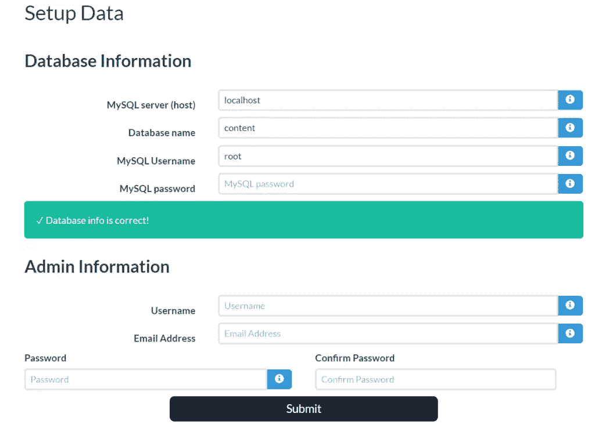

如果一切按计划进行，您将看到一条成功消息，从中您可以导航到开始添加数据、从 CSV 导入或转到管理主页来修改应用程序设置。我们将直接进入正题，开始添加数据。

## 将信息输入我们的数据库

首先，我们将把用户数据添加到 users 表中。如果你还没有，点击“开始添加数据”,然后点击“用户”,这会立即显示表格中的所有内容(很明显，什么也没有)。


当然，我们将单击“添加新项”并开始。为了简单起见，我将在数据库中添加一个虚拟用户，如下图所示。

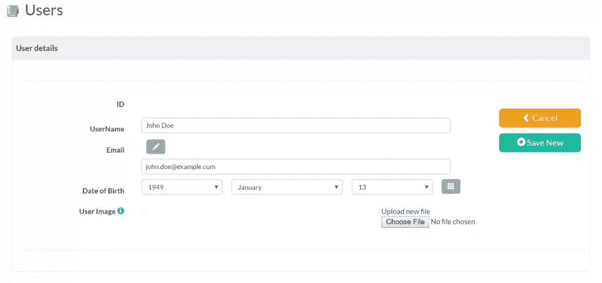

按要求填写，完成后点击“保存新的”。您将看到类似这样的内容，我们可以看到刚刚输入的所有用户数据，并在需要时进行更改:

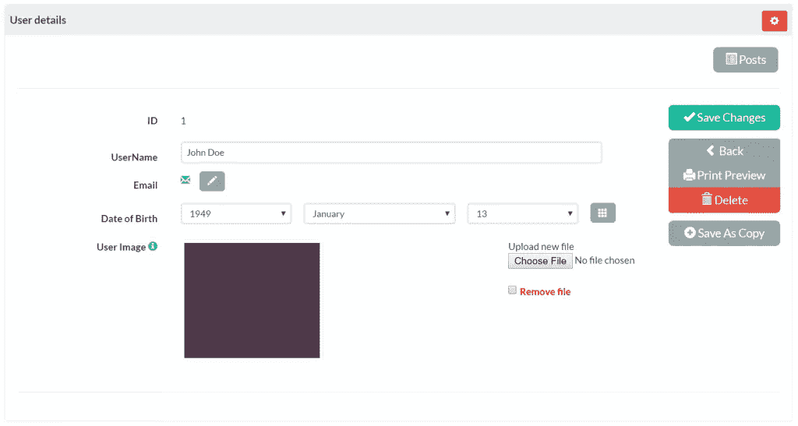

如果您要单击图中的红色轮齿(只有当用户以管理员身份登录时才会显示)，您会收到一个小对话框，您可以在其中看到记录所有者、更改所述所有者、向用户发送电子邮件等等。

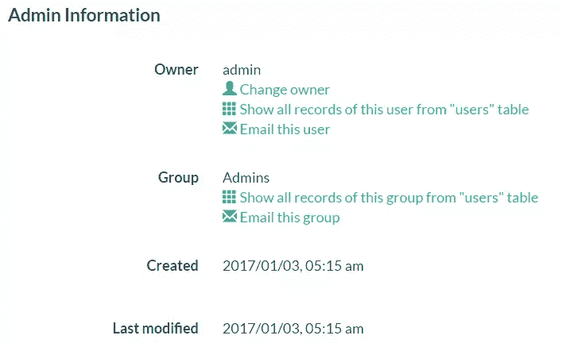

从顶部菜单中，我们选择*跳转到……*，导航到我们的`Categories`表，我们将再次添加一条新记录。由于该表的范围有限，我们唯一可以输入的值是类别名称，所以我将通过“新闻”来调用我的类别。

当你完成后，再次使用*跳转到…* 菜单，但这一次进入文章并点击“添加新的”。

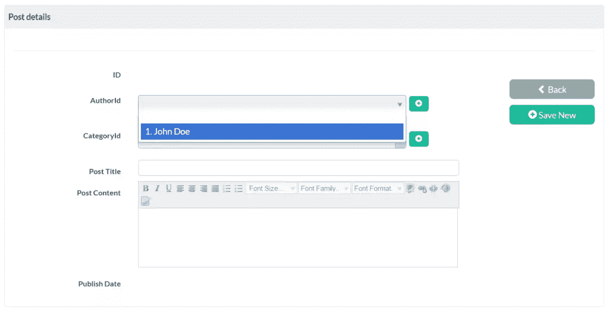

在这里你可以看到我们有了一个更有趣的工作视角。自然，我们不能改变文章的 ID 或发布日期，因为它们是由数据库管理的，至于作者 ID 和类别 ID，它们只限于下拉列表中的内容。然而，后两个按钮旁边有+按钮，如果你点击它们，你可以在创建文章的同时添加新的用户和类别记录。

我不会这样做，而是选择设置一个文章标题，然后将一些经典的 lorem ipsum 粘贴到 WYSIWYG 编辑器中，尽管我会将其更改为 Comic Sans，因为我是一个优雅的人。完成后点击 save，然后导航回 posts 表，您应该会看到类似这样的内容。

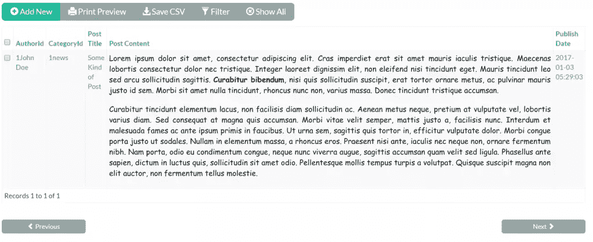

嗯，基本上就是这样。这就是如何在 AppGini 中创建数据库，并通过生成的前端输入数据。

## 导出到 CSV

当您的表格中有一些数据时，如果您想随时备份这些数据，您只需导航到有问题的表格，然后单击“Save CSV ”,它会自动将一个 CSV 文件下载到以该表格命名的计算机中。


## 管理区

生成的应用程序带有一个管理区，在底部给你一个数据库的概述。但是，您可以执行三个主要任务:

1.  组管理员
2.  成员管理
3.  公用事业

我们将重点关注组和成员管理，因此从顶部的“组”菜单项中，选择“查看组”，您将看到以下内容:


如果您使用 AppGini 构建某种公司仪表板，这种区域会很方便，因为这需要许多具有不同权限的用户。记住这一点，让我们点击“添加组”。

您至少需要定义一个组名，但是除此之外，您还可以设置一个描述，您希望如何添加用户，例如只能由管理员添加，加入需要管理员批准，或者用户可以在没有批准的情况下加入。

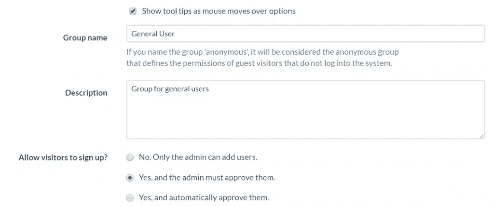

接下来，也是最重要的，是权限。显然，如何定义由您自己决定，但我已经修改了权限，以便该组中的用户可以向帖子表添加帖子，查看所有帖子，但只能编辑和删除他们自己创建的帖子。

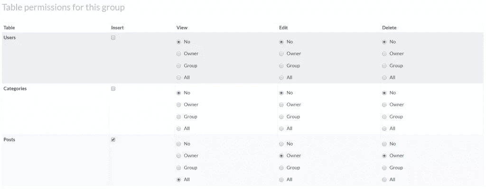

点击“保存”后，您将会看到一个新的子菜单，我们只需在其中向该组添加一名新成员，就这么办吧。


当向系统添加新用户时，您将看到一种表单，您可以在其中设置用户名、密码等。

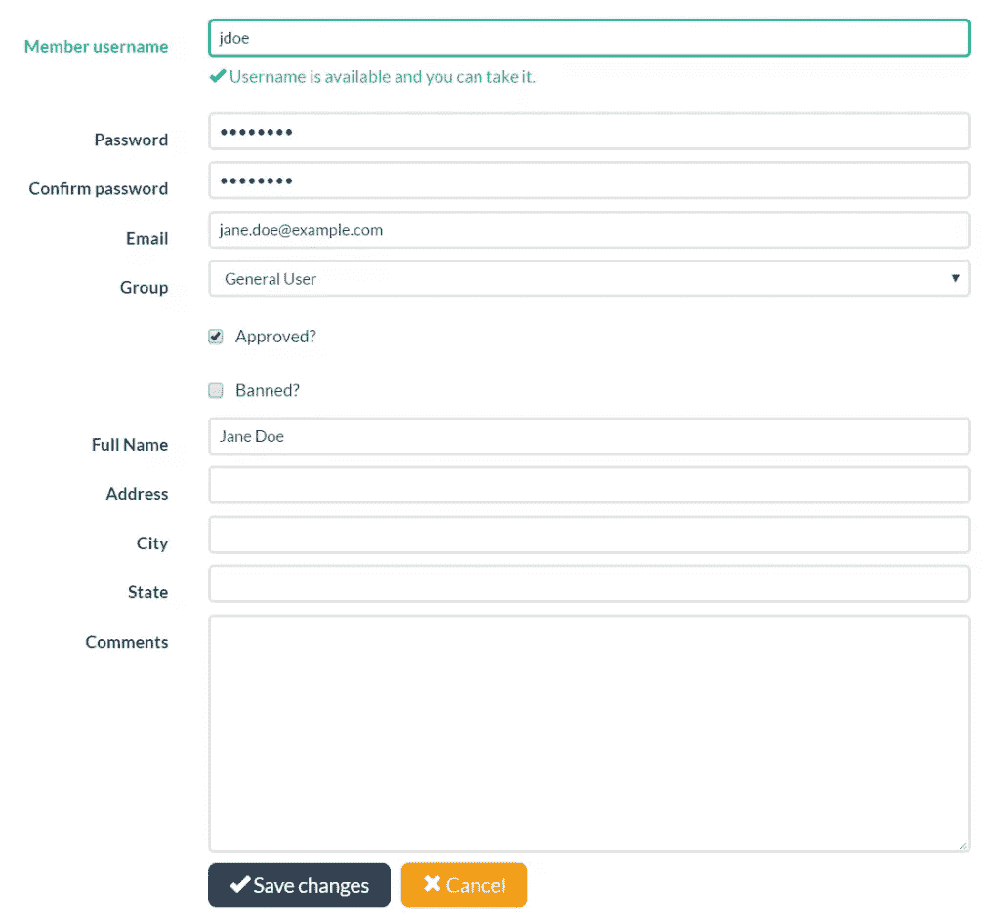

当然，默认情况下，用户将继承他们所属的组的权限，但是能够基于每个帐户设置用户的权限。这可以通过在管理区域导航到成员，编辑有问题的用户，然后点击“为此用户设置特殊权限”来随时完成

## 定制代码

你还会发现定制 AppGini 的外观和行为真的很容易。在您部署到的文件夹中——同样，在本例中是`C:\xampp\htdocs\content` —您会发现另一个名为`hooks`的文件夹，在那里有两个注释文件，`footer-extras.php`和`header-extras.php`。你可以在这些文件中添加任何 HTML、CSS 和 JavaScript，它将应用于用户视图中的所有**页面。**

例如，因为我知道主题是用 Bootstrap 构建的，所以我可以将以下内容添加到`footer-extras.php`

```
<div class="container">
    <div class="row">
        <div class="col-md-6">
            <h4>Column on the left</h4>
        </div>
        <div class="col-md-6">
            <h4>Column on the right</h4>
        </div>
    </div>
</div> 
```

它会像您预期的那样出现在前端:


最重要的是，如果您以后需要重新生成应用程序，对这些文件所做的更改不会被 AppGini 覆盖。

## 即将发布:分组报告

在即将推出的插件 AppGini 的分组报告——中，你将能够轻松地从你的数据库中生成报告。只需添加将被评估的 AppGini 项目文件，然后选择要从中生成报告的表，然后只需选择列。一旦你选择了一些列，AppGini 将生成一个报告预览，让你知道你会收到什么。

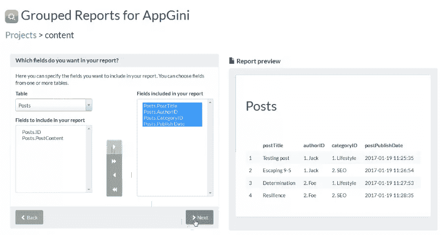

您还可以非常轻松地选择对报告中的数据进行分组。在本例中，您可以看到我们选择了按 AuthorID 分组。

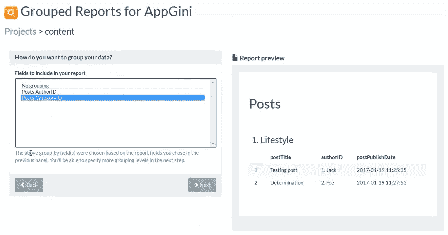

## 结论

希望这已经提供了 AppGini 如何工作的概述，并为您提供了一些如何使用它来提高开发人员的生产力或创建易于使用的应用程序的想法。你可以在[应用的网站](https://bigprof.com/appgini/)上找到更多关于 AppGini 的信息。

## 分享这篇文章