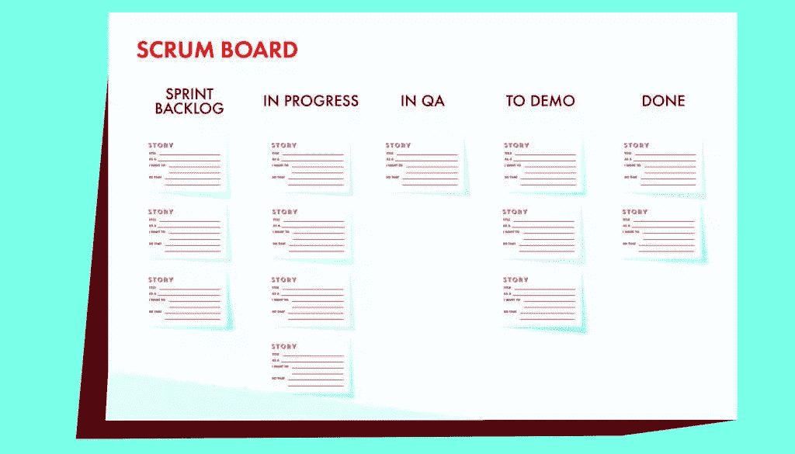

# Scrum 工件:Scrum 板

> 原文：<https://www.sitepoint.com/scrum-artifacts-scrum-board/>

以下是摘自我们的书《Scrum:新手到忍者，作者是 M. David Green。世界各地的商店都有出售，或者你可以在这里买到电子书。

墙上由索引卡制成的物理 scrum 板容易受到滥用、忽视和可能的恶作剧。人们可以擦过黑板，把索引卡敲下来。清洁人员可能会不小心重新排列电路板。而且一天到下一天的变化可能很难发现。如果你打算使用一个物理 scrum 板，最好每天给它拍照，并把这些照片发布到每个人都能看到的地方。这种方法并不完美，但如果主板在正常业务过程中被破坏，它可以提供一个恢复系统。

除了使用物理板，许多公司还开发了电子工具和服务，旨在帮助团队在从一个状态转移到另一个状态时捕捉和管理故事。其中一些工具包括跟踪点、生成标准报告，甚至设置访问和隐私级别的能力。有一些工具允许团队通过更新故事来触发持续集成中的自动化构建过程。一些工具与各行各业普遍使用的 bug 跟踪系统相结合，促进了与客户和用户的沟通。其他工具可能只是支持电子跟踪一个故事作为一张卡片，同时允许每个人看到一切，并作出任何改变。

当前最流行的在线 scrum 板管理工具允许共享故事管理，并跟踪每个故事的进度、速度和各种状态，这些工具包括:

*   [枢轴跟踪器](https://www.pivotaltracker.com/)

*   [吉拉敏捷](https://www.atlassian.com/software/jira/)

*   [特雷罗](http://www.trello.com)(带 [scrum 插件](http://scrumfortrello.com/))

一些团队更喜欢电子跟踪工具，这样他们可以远程在线访问，或者显示在团队可以看到的大显示器上。可能的工具领域在不断发展，随着新玩家进入这个快速发展的领域，任何具体的推荐都会很快变得过时。此外，开发这些工具的公司对于 scrum 应该如何工作有不同的理念。这些理念反映在工具的设计方式上。

改变工具可能是一个困难的过程，并且很少有工具会以一种竞争工具可以直接导入的格式支持直接导出。由每个团队决定哪个工具的理念最符合他们自己的方法，并找到一个他们可以坚持的。一个好的 scrum 大师应该熟悉与不同选项相关的权衡。

## 分享这篇文章