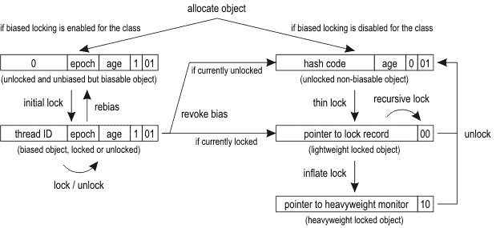

# 默认的 hashCode()是如何工作的？

> 原文：<https://www.sitepoint.com/how-does-the-default-hashcode-work/>

### 目录 

*   [一个微不足道的谜](#a-trivial-mystery)
*   [hashCode()的默认实现是什么？](#what-is-the-default-implementation-of-hashcode)
*   [请真正的 hashCode()站起来](#will-the-real-hashcode-please-stand-up)
*   [实际身份哈希生成](#the-actual-identity-hash-generation)
*   [对象头和同步](#object-headers-and-synchronization)
*   [偏置锁定](#biased-locking)
*   [为什么保持有偏锁状态和保持身份哈希码会冲突？](#why-does-keeping-biased-locking-state-conflict-with-keeping-the-identity-hash-code)
*   [重述](#recap)
*   [基准](#benchmarks)
*   [参考文献](#references)
*   [评论](#comments)

这篇文章最初由发表在 [Galo 的博客](https://srvaroa.github.io)上。我们把它放在这里是因为它是好奇心和技术卓越的一个很好的例子。这也很好地配合了我们对[如何正确实现`hashCode`](https://www.sitepoint.com/how-to-implement-javas-hashcode-correctly/)的详尽解释。

*中，触及`hashCode()`的表面会导致通过 JVM 源到达对象布局的洞穴探索之旅，有偏见的锁定，以及依赖默认`hashCode()`的令人惊讶的性能含义。*

*非常感谢 [Gil Tene](https://twitter.com/giltene) 和 [Duarte Nunes](https://twitter.com/duarte_nunes) 审阅本文的草稿，以及他们非常有价值的见解、建议和编辑。任何遗留的错误都是我自己的。*

## 微不足道的秘密

上周在工作中，我向一个类提交了一个微小的改变，一个`toString()`的实现，这样日志就有意义了。令我惊讶的是，这一变化导致班级覆盖率下降了 5%。我知道所有的新代码都被现有的单元测试覆盖了，那么会有什么问题呢？通过比较覆盖报告，一位更敏锐的同事注意到`hashCode()`的实现在变更之前被覆盖，而不是之后。当然，这是有道理的:默认的`toString()`调用`hashCode()`:

```
public String toString() {
    return getClass().getName() + "@" + Integer.toHexString(hashCode());
} 
```

在覆盖了`toString()`之后，我们的自定义`hashCode()`不再被调用。我们错过了一次测试。

每个人都知道默认`toString()`但是…

## `hashCode()`的默认实现是什么？

由`hashCode()`的默认实现返回的值被称为**身份散列码**，所以从现在起我将使用这个术语来区分它和由`hashCode()`的重写实现提供的散列。仅供参考:即使一个类覆盖了`hashCode()`，你也可以通过调用`System.identityHashCode(o)`得到一个对象的身份散列码`o`。

常识是，身份哈希代码使用内存地址的整数表示。这也是 Object.hashCode() 的 J2SE JavaDocs 的含义:

> …通常通过将对象的内部地址转换成整数来实现，但是 Java 编程语言并不要求这种实现技术。

然而，这似乎有问题，因为方法契约要求:

> 在一个 Java 应用程序的执行过程中，只要对同一个对象调用 hashCode 方法不止一次，它就必须始终返回同一个整数。

假设 JVM 将重新定位对象(例如，在由于提升或压缩而导致的垃圾收集周期期间)，在我们计算出对象的身份散列之后，我们必须能够以一种在对象重新定位后仍然存在的方式保留它。

一种可能是在第一次调用`hashCode()`时获取对象的当前内存位置，并将其与对象一起保存在某个地方，比如对象的头。这样，如果对象被移动到不同的内存位置，它将携带原始散列。这个方法的一个警告是，它不会阻止两个对象拥有相同的身份散列，但是这是被[规范](https://docs.oracle.com/javase/8/docs/api/java/lang/Object.html#hashCode--)所允许的。

最好的确认就是去看看源头。不幸的是，默认的`java.lang.Object::hashCode()` [是一个本地函数](http://hg.openjdk.java.net/jdk8u/jdk8u/jdk/file/a71d26266469/src/share/classes/java/lang/Object.java#l100):

```
public native int hashCode();
```

戴上头盔。

## 请真正的`hashCode()`站起来

注意身份`hashCode()`的实现**依赖于 JVM** 。因为我将只查看 OpenJDK 源代码，所以每当我谈到 JVM 时，您都应该假设这个特定的实现。所有的链接都指向[热点树](http://hg.openjdk.java.net/jdk8/jdk8/hotspot)的[变更集 5820:87ee5ee27509](http://hg.openjdk.java.net/jdk8u/jdk8u/hotspot/file/87ee5ee27509) ，我假设其中的大部分也适用于 Oracle 的 JVM，但是在其他地方事情可能(事实上)是不同的(稍后会有更多的介绍。)

OpenJDK 在`src/share/vm/prims/jvm.h`和`src/share/vm/prims/jvm.cpp`定义了`hashCode()`的入口点。后者有:

```
508 JVM_ENTRY(jint, JVM_IHashCode(JNIEnv* env, jobject handle))
509   JVMWrapper("JVM_IHashCode");
510   // as implemented in the classic virtual machine; return 0 if object is NULL
511   return handle == NULL ? 0 : ObjectSynchronizer::FastHashCode (THREAD, JNIHandles::resolve_non_null(handle)) ;
512 JVM_END 
```

[object synchronizer::fast hashcode()](http://hg.openjdk.java.net/jdk8u/jdk8u/hotspot/file/87ee5ee27509/src/share/vm/runtime/synchronizer.cpp#l601)也是从`identity_hash_value_for`调用的，它是从其他几个调用站点(例如:`System.identityHashCode()`)使用的

```
708 intptr_t ObjectSynchronizer::identity_hash_value_for(Handle obj) {
709   return FastHashCode (Thread::current(), obj()) ;
710 } 
```

人们可能会天真地认为[object synchronizer::fast hashcode()](http://hg.openjdk.java.net/jdk8u/jdk8u/hotspot/file/87ee5ee27509/src/share/vm/runtime/synchronizer.cpp#l601)会做类似这样的事情:

```
if (obj.hash() == 0) {
    obj.set_hash(generate_new_hash());
}
return obj.hash(); 
```

但结果是一个看起来复杂得多的一百行函数。至少我们可以发现几个“如果不存在”生成的块，如:

```
685   mark = monitor->header();
...
687   hash = mark->hash();
688   if (hash == 0) {
689     hash = get_next_hash(Self, obj);
...
701   }
...
703   return hash; 
```

这似乎证实了我们的假设。现在让我们忽略那个`monitor`,满足于它给了我们对象头。它被保存在`mark`，一个指向[标记](http://hg.openjdk.java.net/jdk8u/jdk8u/hotspot/file/87ee5ee27509/src/share/vm/oops/markOop.hpp)实例的指针，它代表属于对象头低位的[标记字](http://openjdk.java.net/groups/hotspot/docs/HotSpotGlossary.html#markWord)。因此，尝试在标记字中获取哈希。如果不存在，就使用`get_next_hash`生成、保存并返回。

## 实际的身份哈希生成

正如我们所见，这发生在 [get_next_hash](http://hg.openjdk.java.net/jdk8u/jdk8u/hotspot/file/87ee5ee27509/src/share/vm/runtime/synchronizer.cpp#l555) 。该函数根据某个`hashCode`变量的值提供了六种方法。

```
0. A randomly generated number.
1. A function of memory address of the object.
2. A hardcoded 1 (used for sensitivity testing.)
3. A sequence.
4. The memory address of the object, cast to int.
5. Thread state combined with xorshift (https://en.wikipedia.org/wiki/Xorshift) 
```

那么默认的方法是什么呢？根据 [globals.hpp](http://hg.openjdk.java.net/jdk8u/jdk8u/hotspot/file/87ee5ee27509/src/share/vm/runtime/globals.hpp#l1127) ，OpenJDK 8 似乎默认为 5:

```
1127   product(intx, hashCode, 5,                                                \
1128           "(Unstable) select hashCode generation algorithm")                \ 
```

OpenJDK 9 [保持默认](http://hg.openjdk.java.net/jdk9/jdk9/hotspot/file/fc7e94cb7485/src/share/vm/runtime/globals.hpp#l1198)不变。纵观之前的版本， [OpenJDK 7](http://hg.openjdk.java.net/jdk7u/jdk7u/hotspot/file/5b9a416a5632/src/share/vm/runtime/globals.hpp#l1100) 和 [OpenJDK 6](http://hg.openjdk.java.net/jdk6/jdk6/hotspot/file/5cec449cc409/src/share/vm/runtime/globals.hpp#l1128) 都使用了第一种方法，一个[随机数生成器](http://hg.openjdk.java.net/jdk8u/jdk8u/hotspot/file/87ee5ee27509/src/share/vm/runtime/os.cpp#l814)。

所以，除非我看错了地方**，否则 OpenJDK 中的默认 hashCode 实现与内存地址**无关，至少从版本 6 开始是这样。


## 对象头和同步

让我们回顾一下我们没有检查的几点。首先，[object synchronizer::fast hashcode()](http://hg.openjdk.java.net/jdk8u/jdk8u/hotspot/file/87ee5ee27509/src/share/vm/runtime/synchronizer.cpp#l601)似乎过于复杂，需要 100 多行代码来执行我们认为是微不足道的获取或生成操作。第二，这个`monitor`是谁，为什么会有我们对象的头？

标记词的结构是开始进步的好地方。在 OpenJDK 中，看起来[是这样的](http://hg.openjdk.java.net/jdk8u/jdk8u/hotspot/file/87ee5ee27509/src/share/vm/oops/markOop.hpp#l37):

```
30 // The markOop describes the header of an object.
31 //
32 // Note that the mark is not a real oop but just a word.
33 // It is placed in the oop hierarchy for historical reasons.
34 //
35 // Bit-format of an object header (most significant first, big endian layout below):
36 //
37 //  32 bits:
38 //  --------
39 //             hash:25 ------------>| age:4    biased_lock:1 lock:2 (normal object)
40 //             JavaThread*:23 epoch:2 age:4    biased_lock:1 lock:2 (biased object)
41 //             size:32 ------------------------------------------>| (CMS free block)
42 //             PromotedObject*:29 ---------->| promo_bits:3 ----->| (CMS promoted object)
43 //
44 //  64 bits:
45 //  --------
46 //  unused:25 hash:31 -->| unused:1   age:4    biased_lock:1 lock:2 (normal object)
47 //  JavaThread*:54 epoch:2 unused:1   age:4    biased_lock:1 lock:2 (biased object)
48 //  PromotedObject*:61 --------------------->| promo_bits:3 ----->| (CMS promoted object)
49 //  size:64 ----------------------------------------------------->| (CMS free block)
50 //
51 //  unused:25 hash:31 -->| cms_free:1 age:4    biased_lock:1 lock:2 (COOPs && normal object)
52 //  JavaThread*:54 epoch:2 cms_free:1 age:4    biased_lock:1 lock:2 (COOPs && biased object)
53 //  narrowOop:32 unused:24 cms_free:1 unused:4 promo_bits:3 ----->| (COOPs && CMS promoted object)
54 //  unused:21 size:35 -->| cms_free:1 unused:7 ------------------>| (COOPs && CMS free block) 
```

32 位和 64 位的格式略有不同。根据[压缩对象
指针](https://wiki.openjdk.java.net/display/HotSpot/CompressedOops)是否启用，后者有两种变体。Oracle 和 OpenJDK 8 **都默认做**。

因此，对象头可以与自由块或实际对象相关，在这种情况下，有多种可能的状态。在最简单的情况下(“普通对象”)，身份散列直接存储在报头的低位地址中。

但是在其他状态下，我们会找到一个指向`JavaThread`或`PromotedObject`的指针。情节变厚了:如果我们把身份哈希放在一个“正常对象”里，会有人把它拿走吗？在哪里？如果对象是有偏差的，我们可以在哪里获取/设置哈希？什么是有偏见的对象？

让我们试着回答这些问题。

## 偏置锁定

因[偏置锁定](https://blogs.oracle.com/dave/entry/biased_locking_in_hotspot)而出现偏置对象。一([专利](https://www.google.com/patents/US7814488)！)HotSpot 6 默认启用的特性，试图减少锁定对象的成本。这样的操作是昂贵的，因为它们的实现通常依赖于原子 CPU 指令( [CAS](https://en.wikipedia.org/wiki/Compare-and-swap) )，以便安全地处理来自不同线程的对对象的锁定/解锁请求。据观察，在大多数应用程序中，大多数对象只被一个线程锁定，因此支付原子操作的成本通常是一种浪费。为了避免这种情况，带有偏置锁定的 JVM 允许线程尝试将一个对象“偏置”给自己。当对象被偏置时，幸运线程可以锁定/解锁对象，而无需原子指令。只要没有线程争夺同一个对象，我们就能获得性能。

头中的`biased_lock`位表示一个对象是否被`JavaThread*`所指向的线程所偏向。`lock`位表示对象是否被锁定。

正是因为 OpenJDK 的偏置锁定实现需要在标记字中写入指针，所以它还需要重新定位真正的标记字(包含身份哈希。)

这可以解释`FastHashCode`中额外的复杂性。标头不仅包含身份哈希代码，还包含锁定状态(就像指向锁的所有者线程的指针)。因此，我们需要考虑所有情况，并找到身份哈希所在的位置。

我们去看`FastHashCode`。我们发现的第一件事是:

```
601 intptr_t ObjectSynchronizer::FastHashCode (Thread * Self, oop obj) {
602   if (UseBiasedLocking) {
610     if (obj->mark()->has_bias_pattern()) {
          ...
617       BiasedLocking::revoke_and_rebias(hobj, false, JavaThread::current());
          ...
619       assert(!obj->mark()->has_bias_pattern(), "biases should be revoked by now");
620     }
621   } 
```

等等。它只是**撤销了现有的偏置，并禁用了对对象**的偏置锁定(`false`的意思是“不要尝试重新偏置”)。几行下来，这确实是一个不变量:

```
637   // object should remain ineligible for biased locking
638   assert (!mark->has_bias_pattern(), "invariant") ; 
```

如果我理解正确的话，这意味着**简单地请求一个对象的身份散列码将禁用偏向锁定**，这反过来迫使任何锁定该对象的尝试使用昂贵的原子指令。即使只有一个线程。

哦天啊。

## 为什么保持有偏向的锁定状态与保持身份哈希代码冲突？

要回答这个问题，我们必须了解根据对象的锁状态，标记字(包含标识散列)的可能位置。这张图展示了来自[热点
维基](https://wiki.openjdk.java.net/display/HotSpot/Synchronization)的转变:



我的(易错的)推理如下。

对于图顶部的 4 种状态，OpenJDK 将能够使用“瘦”锁表示。在最简单的情况下(没有锁),这意味着将标识散列和其他数据直接放在标记字的对象空间中:

```
46 //  unused:25 hash:31 -->| unused:1   age:4    biased_lock:1 lock:2 (normal object) 
```

在更复杂的情况下，它需要这个空间来保存一个指向“锁记录”的指针。因此，标记词将被“替换”并放在其他地方。

虽然我们只有一个线程试图锁定该对象，但该指针实际上会指向线程自己的堆栈中的一个内存位置。这有两个好处:它更快(没有争用或协调来访问那个内存位置)，它足以让线程识别它拥有锁(因为内存位置指向它自己的堆栈。)

但这并不是在所有情况下都行得通。如果我们有竞争的对象(例如，在许多线程遍历的同步语句中使用的对象)，我们将需要一个更复杂的结构，它不仅适合对象头的副本(再次，“位移”)，还适合等待者的[列表。如果一个线程执行`object.wait()`，类似地需要一个等待者列表。](http://hg.openjdk.java.net/jdk8u/jdk8u/hotspot/file/87ee5ee27509/src/share/vm/runtime/objectMonitor.hpp#l126)

这个更丰富的数据结构是 [ObjectMonitor](http://hg.openjdk.java.net/jdk8u/jdk8u/hotspot/file/87ee5ee27509/src/share/vm/runtime/objectMonitor.hpp) ，它在图中被称为“重量级”监视器。留在对象头中的值不再指向一个“移位的标记字”，而是指向一个实际的对象(监视器)。访问身份散列码现在需要“膨胀监视器”:追踪一个指向对象的指针，并读取/改变任何包含被替换的标记字的字段。这更昂贵并且需要协调。

确实有工作要做。

第[行 L640](http://hg.openjdk.java.net/jdk8u/jdk8u/hotspot/file/87ee5ee27509/src/share/vm/runtime/synchronizer.cpp#l640) 到[行 L680](http://hg.openjdk.java.net/jdk8u/jdk8u/hotspot/file/87ee5ee27509/src/share/vm/runtime/synchronizer.cpp#l680) 处理寻找报头和检查缓存的身份散列。我相信这是一条快速的途径，可以探测到不需要充气监视器的病例。

从 [L682](http://hg.openjdk.java.net/jdk8u/jdk8u/hotspot/file/87ee5ee27509/src/share/vm/runtime/synchronizer.cpp#l682) 它需要咬紧牙关:

```
682   // Inflate the monitor to set hash code
683   monitor = ObjectSynchronizer::inflate(Self, obj);

684   // Load displaced header and check it has hash code
685   mark = monitor->header();
...
687   hash = mark->hash(); 
```

此时，如果 id。hash 在那里(`hash != 0`)，JVM 可以返回。否则，我们将从`get_next_hash`中获取一个，并将其安全地存储在由`ObjectMonitor`保存的替换头中。

这似乎提供了一个合理的解释，为什么在一个没有覆盖默认实现的类的对象上调用`hashCode()`会使该对象没有资格进行偏向锁定:

*   为了在重定位后保持对象的标识哈希一致，我们需要将哈希存储在对象的头中。
*   请求身份散列的线程可能甚至不关心对象的锁定，但实际上它们将共享锁定机制使用的数据结构。这本身就是一头复杂的野兽，它不仅可能变异，还可能**移动**(替换)标题内容。
*   偏置锁定有助于在没有原子操作的情况下执行锁定/解锁操作，只要只有一个线程锁定对象，这就很有效，因为我们可以将锁定状态保存在标记字中。我在这里不能 100%确定，但是我知道，由于其他线程可能会请求身份散列，**即使有一个线程对锁**感兴趣，头字也会被竞争，并且需要正确处理原子操作。这就否定了偏置锁定的全部意义。

## 概述

*   默认的`hashCode()`实现(身份哈希码)**与对象的内存地址**无关，至少在 OpenJDK 中是这样。在版本 6 和 7 中，它是一个随机生成的数字。在 8 和现在的 9 中，它是一个基于线程状态的数字。[这里的](https://stackoverflow.com/questions/1961146/memory-address-of-variables-in-java/20680667#20680667)是一个产生相同结论的测试。
    *   证明“依赖于实现”的警告是不美观的: [Azul 的 Zing](https://www.azul.com/products/zing/virtual-machine/)**从对象的内存地址生成标识散列。**

***   在 HotSpot 中，身份哈希生成的结果只生成一次，并缓存在对象头的**标记字**中。
    *   Zing 使用一种不同的解决方案来保持一致性，尽管在对象重定位时，它们会延迟存储 id。哈希直到对象重定位。在这一点上，它存储在一个“预头”*   在 HotSpot 中，调用默认的`hashCode()`或`System.identityHashCode()`将使对象不符合偏向锁定的条件。
    *   这意味着**如果你在没有竞争的对象上同步，你最好覆盖默认的`hashCode()`实现**，否则你将错过 JVM 优化。*   [可以](https://blogs.oracle.com/dave/entry/biased_locking_in_hotspot)基于每个对象禁用热点中的偏置锁定。
    *   这可能非常有用。我看到过在竞争的生产者/消费者队列中应用程序非常多，有偏向的锁定带来的麻烦多于好处，所以我们完全禁用了这个特性。事实证明，我们只需要对特定的对象/类调用 System.identityHashCode()就可以做到这一点。*   我发现没有允许改变默认生成器的 HotSpot 标志，所以尝试其他选项可能需要从源代码编译。**

 **## 基准

我编写了一个简单的 JMH 工具来验证这些结论。

基准( [source](https://gist.github.com/srvaroa/aa1f6c273ea6ae215bbf43e481f7689e) )做的事情与此相当:

```
object.hashCode();
while(true) {
    synchronized(object) {
        counter++;
    }
} 
```

一个配置(`withIdHash`)在一个使用身份散列的对象上同步，所以我们期望一旦`hashCode()`被调用，偏向锁定将被禁用。第二种配置(`withoutIdHash`)实现了一个定制的哈希代码，因此不应该禁用偏置锁定。每个配置首先用一个线程运行，然后用两个线程运行(这两个线程都有后缀“争用”)。)

顺便说一下，我们必须启用`-XX:BiasedLockingStartupDelay=0`,否则 JVM 将需要 4s 来触发优化，从而扭曲结果。

第一次执行:

```
Benchmark                                       Mode  Cnt       Score      Error   Units
BiasedLockingBenchmark.withIdHash              thrpt  100   35168,021 ±  230,252  ops/ms
BiasedLockingBenchmark.withoutIdHash           thrpt  100  173742,468 ± 4364,491  ops/ms
BiasedLockingBenchmark.withIdHashContended     thrpt  100   22478,109 ± 1650,649  ops/ms
BiasedLockingBenchmark.withoutIdHashContended  thrpt  100   20061,973 ±  786,021  ops/ms 
```

我们可以看到，使用自定义哈希代码使锁定/解锁循环的工作速度比使用身份哈希代码的快 4 倍(身份哈希代码禁用偏向锁定。)当两个线程争用锁时，无论如何都会禁用偏置锁定，因此两种哈希方法之间没有明显的区别。

第二次运行禁用所有配置中的偏置锁定(`-XX:-UseBiasedLocking`)。

```
Benchmark                                       Mode  Cnt      Score      Error   Units
BiasedLockingBenchmark.withIdHash              thrpt  100  37374,774 ±  204,795  ops/ms
BiasedLockingBenchmark.withoutIdHash           thrpt  100  36961,826 ±  214,083  ops/ms
BiasedLockingBenchmark.withIdHashContended     thrpt  100  18349,906 ± 1246,372  ops/ms
BiasedLockingBenchmark.withoutIdHashContended  thrpt  100  18262,290 ± 1371,588  ops/ms 
```

哈希方法不再有任何影响，`withoutIdHash`也失去了优势。

(所有性能指标评测均在 2,7 GHz 英特尔酷睿 i5 处理器上运行。)

## 参考

我试图理解 JVM 源代码，但这并不是疯狂的猜测，而是将各种关于布局、有偏见的锁定等的源代码拼凑在一起。主要的如下:

*   [https://blogs . Oracle . com/Dave/entry/biased _ locking _ in _ hotspot](https://blogs.oracle.com/dave/entry/biased_locking_in_hotspot)
*   [http://fuseyism.com/openjdk/cvmi/java2vm.xhtml](http://fuseyism.com/openjdk/cvmi/java2vm.xhtml)
*   [http://www . DCS . gla . AC . uk/~ jsinger/pdf/sicsa _ open JDK/openjdkarchitecture . pdf](http://www.dcs.gla.ac.uk/~jsinger/pdfs/sicsa_openjdk/OpenJDKArchitecture.pdf)
*   [https://www.infoq.com/articles/Introduction-to-HotSpot](https://www.infoq.com/articles/Introduction-to-HotSpot)
*   [http://blog . taki pi . com/5-things-you-not-know-about-synchron ization-in-Java-and-Scala/# comment-1006598967](http://blog.takipi.com/5-things-you-didnt-know-about-synchronization-in-java-and-scala/#comment-1006598967)
*   [http://www . Azul systems . com/blog/cliff/2010-01-09-biased-locking](http://www.azulsystems.com/blog/cliff/2010-01-09-biased-locking)
*   [https://dzone . com/articles/why-you-should-care-about-equals-and-hashcode](https://dzone.com/articles/why-should-you-care-about-equals-and-hashcode)
*   [https://wiki . open JDK . Java . net/display/HotSpot/synchron ization](https://wiki.openjdk.java.net/display/HotSpot/Synchronization)
*   [https://mechanical-同情. blogspot . com . es/2011/11/biased-locking-osr-and-benchmark-fun . html](https://mechanical-sympathy.blogspot.com.es/2011/11/biased-locking-osr-and-benchmarking-fun.html):

## 分享这篇文章**