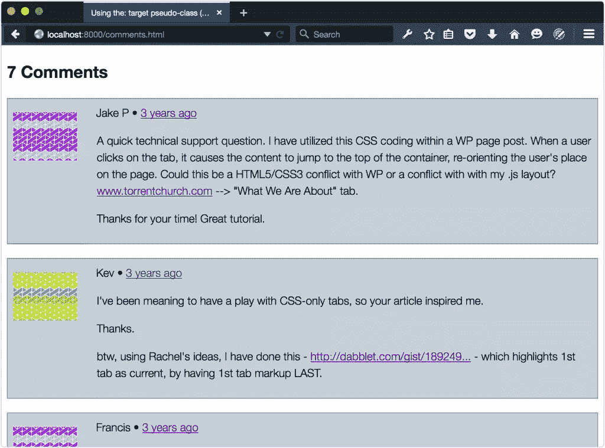
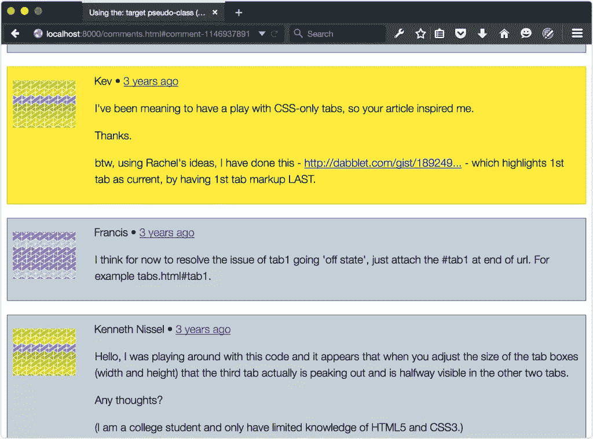
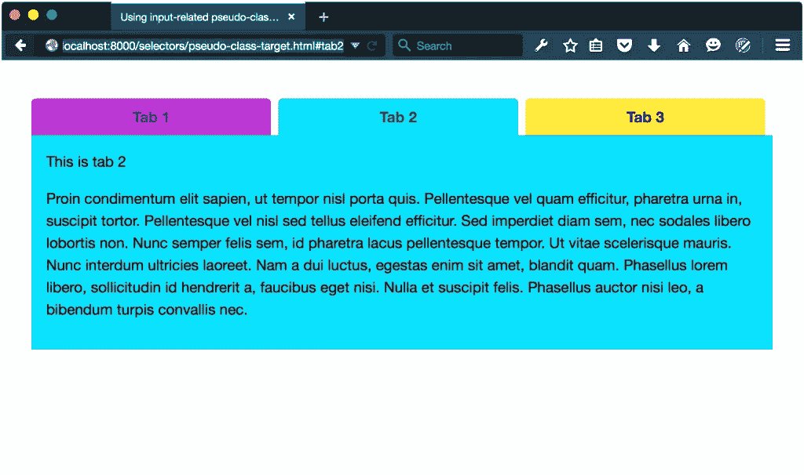
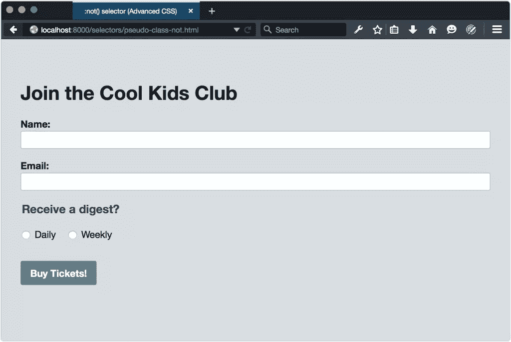

# CSS 伪类::not()和:target

> 原文：<https://www.sitepoint.com/css-selectors-not-target/>


下面是我们的书《CSS 大师》的摘录，作者是蒂芙尼·布朗。世界各地的商店都有出售，或者你可以在这里买到电子书。

正如本章前面提到的，伪类帮助我们定义基于信息的文档样式，这些信息不能从文档树中收集，或者不能使用简单的 [CSS 选择器](https://www.sitepoint.com/css-selectors/)来定位。其中包括逻辑和语言伪类，如`:not()`和`:lang()`。它还包括用户触发的伪类，如`:hover`和`:focus`。

在这一节中，我们将讨论一些深奥且鲜为人知的伪类，重点是浏览器中可用的内容:子索引和类型化子索引伪类，以及输入伪类。子索引和类型化子索引伪类允许我们根据元素在文档子树中的位置来选择元素。输入伪类基于表单字段的输入值和状态来定位表单字段。

## 用`:target`突出显示页面片段

片段标识符是 URL 中跟在`#`后面的部分；比如`#top`或者`#footnote1`。您可能已经用它们创建了页面内导航:所谓的“跳转链接”使用`:target`伪类，我们可以突出显示对应于该片段的文档部分，并且我们可以不使用 JavaScript 来完成。

例如，假设您有一系列评论或讨论板线索:

```
<section id="comments">
<h2>Comments on this post</h2>
<article class="comment" id="comment-1146937891">...</article>
<article class="comment" id="comment-1146937892">...</article>
<article class="comment" id="comment-1146937893">...</article>
</section>
```

有了一些 CSS 和其他有趣的东西，它看起来有点像你在下图中看到的。



上述代码中的每个注释都有一个片段标识符，这意味着我们可以直接链接到它。比如`<a href="#comment-1146937891">`。然后我们需要做的就是使用`:target`伪类为这个注释指定一个样式:

```
.comment:target {
  background: #ffeb3b;
  border-color: #ffc107
}
```

当 URL 的片段标识符部分与一个评论(例如，`http://example.com/post/#comment-1146937891`)匹配时，该评论将有一个黄色背景，如下所示。



您可以使用 CSS 和`:target`的任意组合，这提供了一些有趣的可能性，比如无 JavaScript 标签。Craig Buckler 在他的教程[“如何使用`:target`选择器创建一个只有 CSS3 的标签控件”中详细介绍了这种技术](https://www.sitepoint.com/css3-tabs-using-target-selector/)我们将对它进行一些更新，以使用更多的 CSS3 功能。首先，让我们看看我们的 HTML:

```
<div class="tabbed-widget">
<div class="tab-wrap">
	<a href="#tab1">Tab 1</a>
	<a href="#tab2">Tab 2</a>
	<a href="#tab3">Tab 3</a>
</div>

<ul class="tab-body">
	<li id="tab1">
		<p>This is tab 1.</p>
	</li>
	<li id="tab2">
		<p>This is tab 2</p>
	</li>
	<li id="tab3">
		<p>This is tab 3.</p>
	</li>
</ul>
</div>
```

它相当简单，由选项卡和相关的选项卡内容组成。让我们添加一些 CSS:

```
[id^=tab] {
    position: absolute;
}
[id^=tab]:first-child {
    z-index: 1;
}
[id^=tab]:target {
    z-index: 2;
}
```

神奇的事情就发生在这里。首先，我们已经完全定位了所有的标签。接下来，我们通过添加`z-index: 1`使我们的第一个标签成为最顶层。只有当您希望源顺序中的第一个选项卡成为用户看到的第一个选项卡时，这才是重要的。最后，我们将`z-index: 1`添加到我们的目标选项卡中。这确保了目标层总是最上面的一层。你可以在下面看到结果。



### 提示:提高可访问性

一个更容易访问的版本可能还会使用 JavaScript 根据每个选项卡主体的可见性来切换`hidden`或`aria-hidden=true`属性。

单击一个选项卡会用新的文档片段标识符更新 URL。这又触发了`:target`状态。

## 用`:not()`否定选择器

也许这种新型伪类中最强大的是`:not()`。它返回除匹配选择器参数的元素之外的所有元素。例如，`p:not(.message)`选择每个缺少`message`类的`p`元素。

`:not()`伪类是所谓的 **功能伪类** 。它接受单个参数，就像其他编程语言中的函数一样。传递给`:not()`的任何参数必须是简单的选择器，比如元素类型、类名、ID 或另一个伪类。伪元素将会失败，复合选择器如`label.checkbox`或复杂选择器如`p img`也会失败。

下面是一个使用文本输入类型和单选按钮的表单示例:

```
<form method="post" action="#">
  <h1>Join the Cool Kids Club</h1>
  <p>
	   <label for="name">Name:</label>
	   <input type="text" id="name" name="name" required>
  </p>

  <p>
	  <label for="email">Email:</label>
	  <input type="email" id="email" name="email" required>
  </p>
  <fieldset>
	<legend>Receive a digest?</legend>
	<p>
		<input type="radio" id="daily" name="digest">
		<label for="daily" class="label-radio">Daily</label>                
		<input type="radio" id="weekly" name="digest">
		<label for="weekly" class="label-radio">Weekly</label>
	</p>
  </fieldset>
  <button type="submit">Buy Tickets!</button>
</form>
```

在 HTML 中，与一个`radio`类型相关联的标签有一个`.label-radio`类。我们可以使用`:not()`伪类:来定位那些没有`label-radio`类的元素，如下图所示:

```
label:not(.label-radio) {
  font-weight: bold;
  display:block;   
}
```



这里有一个更棘手的例子。让我们为文本输入创建样式。这些输入类型包括`number`、`email`、`text`以及`password`和`url`。但是让我们通过排除单选按钮、复选框和范围输入来做到这一点。您的第一反应可能是使用以下选择器列表:

```
([type=radio]),
input:not([type=checkbox]),
input:not([type=range]) {
  ...
}
```

不幸的是，这是行不通的，因为每个选择器都会覆盖前一个。这相当于输入:

```
input:not([type=radio]){ ... }
input:not([type=checkbox]) { ... }
input:not([type=range]) {... }
```

相反，我们需要链接我们的`:not()`伪类，以便它们都过滤`input`元素:[<sup class="footnote">【4】</sup>](#ftn.d5e980)

```
input:not([type=radio]):not([type=checkbox]):not([type=range]) {
...
}
```

在没有简单选择器的情况下使用伪类(和伪元素)相当于使用通用选择器。换句话说，`:not([type=radio])`与`*:not([type=radio])`相同。在这种情况下，缺少`type`属性和值`radio`的每个元素都将匹配――包括`html`和`body`。为了防止这种情况，使用带有选择器的`:not()`,比如类名、ID 或属性选择器。顺便说一下，这也适用于类名、ID 和属性选择器:`.warning`和`[type=radio]`与`*.warning`和`*[type=radio]`相同。

CSS 选择器 Level 4 改进了`:not()`的工作方式，因此它可以接受一个列表作为参数，而不仅仅是简单的选择器。我们将能够使用逗号分隔的参数，而不是像以前那样链接伪类:

```
input:not([type=radio], [type=checkbox], [type=range]) {
...
}
```

不幸的是，还没有主流浏览器支持这一点，所以在此期间使用链接。

* * *

[<sup class="para">【4】</sup>](#d5e980)下面的选择器链也会匹配`[type=image]`、`[type=reset]`、`[type=color]`和`[type=submit]`元素。

## 分享这篇文章