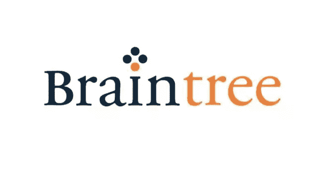
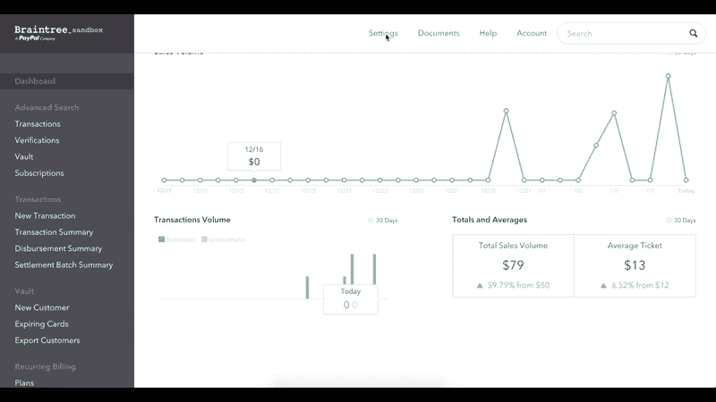
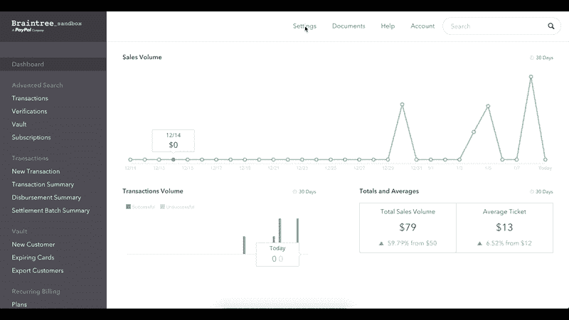

# Laravel & Braintree:中间件和其他高级概念

> 原文：<https://www.sitepoint.com/laravel-and-braintree-middleware-and-other-advanced-concepts/>

*本文由 [Viraj Khatavkar](https://www.sitepoint.com/author/vkhatavkar/) 进行了同行评审。感谢 SitePoint 的所有同行评审员使 SitePoint 的内容尽可能做到最好！*

* * *

[在之前的](https://www.sitepoint.com/laravel-and-braintree-sitting-in-a-tree)中，我们看到了如何配置 Laravel 应用程序来处理 Braintree 订阅。



这一次，我们将讨论如何:

*   防止用户两次注册同一个计划
*   向我们的应用程序添加基本的 flash 消息
*   增加交换计划的能力
*   基于订阅状态创建中间件来保护一些路由
*   限制拥有基本订阅的用户访问优质内容
*   取消和恢复订阅
*   通过 webhooks 向应用程序的事件添加 Braintree 通知

## 双重订阅

就目前情况而言，如果我们访问计划`index`页面，我们仍然可以看到我们当前订阅的计划的`Choose Plan`按钮，这是不应该的。在 plans `index`视图中，让我们添加一个`if conditional`来隐藏基于用户订阅状态的按钮:

```
[...]
@if (!Auth::user()->subscribedToPlan($plan->braintree_plan, 'main'))
    <a href="{{ url('/plan', $plan->slug) }}" class="btn btn-default pull-right">Choose Plan</a>
@endif
[...] 
```

但这并不是说用户不能通过在地址栏中键入指向同一计划的 URL 来访问该计划。为了解决这个问题，让我们将`PlansController`的`show`动作中的代码更新为:

```
[...]
public function show(Request $request, Plan $plan)
{
    if ($request->user()->subscribedToPlan($plan->braintree_plan, 'main')) {
        return redirect('home')->with('error', 'Unauthorised operation');
    }

    return view('plans.show')->with(['plan' => $plan]);
}
[...] 
```

这里，我们从请求对象获取用户；请记住，我们所有的路由都属于认证中间件，因此有可能获得经过认证的用户。一旦我们得到用户，我们检查他们是否已经订阅了该计划。如果是这种情况，我们会将它们重定向到主页并显示一个通知。我们稍后将实现基本的 flash 消息传递。

最后一个预防措施是防止用户使用不同的`plan ID`值提交支付表单。可以检查 DOM 元素并更改隐藏输入的值。在我们的`SubscriptionsController`中，让我们将`store`方法更新为:

```
[...]
public function store(Request $request)
{
    $plan = Plan::findOrFail($request->plan);

    if ($request->user()->subscribedToPlan($plan->braintree_plan, 'main')) {
        return redirect('home')->with('error', 'Unauthorised operation');
    }

    $request->user()->newSubscription('main', $plan->braintree_plan)->create($request->payment_method_nonce);

    // redirect to home after a successful subscription
    return redirect('home')->with('success', 'Subscribed to '.$plan->braintree_plan.' successfully');
}
[...] 
```

## 即时消息

现在让我们实现一些基本的 flash 消息，以在应用程序中显示通知来响应某些操作。在`resources/views/layouts/app.blade.php`文件中，让我们在内容的正上方插入这个块:

```
[...]
<div class="container">
    <div class="row">
        <div class="col-md-8 col-md-offset-2">
            @include ('layouts.partials._notifications')
        </div>
    </div>
</div>
@yield('content')
[...] 
```

然后，我们创建部分通知:

*resources/views/layouts/partials/_ notifications . blade . PHP*

```
@if (session('success'))
    <div class="alert alert-success">
        {{ session('success') }}
    </div>
@endif

@if (session('error'))
    <div class="alert alert-danger">
        {{ session('error') }}
    </div>
@endif 
```

在部分中，我们已经使用了`session`助手来帮助我们根据会话状态(即`success`或`error`)提出不同的通知颜色。

## 交换计划

在用户订阅了我们的应用程序后，他们可能偶尔会想换一个新的订阅计划。

为此，我们首先必须检查用户是否订阅了`SubscriptionsController`的`store`方法中的任何计划。如果没有，我们给他们订一个新的计划。为了将用户换成新的订阅，我们将计划的标识符传递给`swap`方法。

让我们打开我们的`SubscriptionsController`并更新`store`方法:

```
public function store(Request $request)
{
    [...]
    if (!$request->user()->subscribed('main')) {
        $request->user()->newSubscription('main', $plan->braintree_plan)->create($request->payment_method_nonce);
    } else {
        $request->user()->subscription('main')->swap($plan->braintree_plan);
    }

    return redirect('home')->with('success', 'Subscribed to '.$plan->braintree_plan.' successfully');
} 
```

让我们通过选择不同的计划，填写假卡细节*(在以前的帖子中订阅新计划时使用的相同细节)*，然后提交表单，来看看事情是否如预期的那样进行。如果我们看一下`subscriptions`表，我们应该注意到认证用户的计划已经改变。这种变化也应该反映在交易下的 Braintree 中。接下来，我们希望根据订阅状态保护路由。

## 保护路线

对于这个应用程序，我们想介绍一些课程。只有订阅用户才能访问课程。我们将生成一个`LessonsController`:

```
php artisan make:controller LessonsController 
```

…然后转向控制器，创建一个`index`动作。我们不会为此创建视图，只是显示一些文本:

```
[...]
public function index()
{
    return 'Normal Lessons';
}
[...] 
```

然后，我们用`auth middleware`在路由组内创建指向这个索引动作的路由:

```
Route::group(['middleware' => 'auth'], function () {
    Route::get('/lessons', 'LessonsController@index');
}); 
```

让我们也更新一下导航栏，加入这些“课程”的链接:

*资源/视图/布局/app.blade.php*

```
[...]
<ul class="nav navbar-nav navbar-left">
    <li><a href="{{ url('/plans') }}">Plans</a></li>
    <li><a href="{{ url('/lessons') }}">Lessons</a></li>
</ul>
[...] 
```

如果我们现在点击导航栏上的`Lessons`，无论订阅状态如何，我们都会看到文本“普通课程”。不应该是这样的。只有订阅用户应该能够访问课程。为了实现这种行为，我们必须创建一些中间件:

```
php artisan make:middleware Subscribed 
```

让我们在`app/Http/Middleware/Subscribed.php`中打开文件，并将`handle`方法更新为:

```
[...]
public function handle($request, Closure $next)
{
    if (!$request->user()->subscribed('main')) {
        if ($request->ajax() || $request->wantsJson()) {
            return response('Unauthorized.', 401);
        }
        return redirect('/plans');
    }

    return $next($request);
}
[...] 
```

在上面的代码块中，我们检查没有订阅任何计划的用户。如果是这样的话，无论是否使用 ajax，他们都将得到`Unauthorized`响应或者被重定向到计划的`index`页面。如果用户已经订阅了计划，我们将继续下一个请求。

有了这个定义，让我们前往`app/Http/Kernel.php`并将我们的中间件注册到`$routeMiddleware`，这样我们就可以在我们的路由中调用中间件:

*app/Http/Kernel.php*

```
protected $routeMiddleware = [
    [...]
    'throttle' => \Illuminate\Routing\Middleware\ThrottleRequests::class,
    'subscribed' => \App\Http\Middleware\Subscribed::class,
]; 
```

现在，我们可以使用中间件`auth`在组内创建另一个路由组，但是这一次，我们将中间件`subscribed`传入。在这个新的路线组中，我们将定义访问课程的路线:

```
Route::group(['middleware' => 'auth'], function () {
    [...]
    Route::group(['middleware' => 'subscribed'], function () {
        Route::get('/lessons', 'LessonsController@index');
    });
}); 
```

如果我们尝试注册一个新用户，然后点击导航栏上的`Lessons`，我们将被重定向到`/plans`。如果我们用新帐户订阅了一个计划，我们现在就可以访问课程。

## 保护基本用户的优质内容

对于我们的应用程序，我们希望提供基本和优质的内容。拥有基本计划的用户可以访问普通课程，但只有拥有高级订阅的用户才能访问高级课程。出于演示的目的，让我们在`LessonsController`中创建一个`premium`方法:

```
[...]
public function premium()
{
    return 'Premium Lessons';
}
[...] 
```

让我们也更新一下导航栏，加入一个指向`Premium Lessons`的链接:

```
[...]
<ul class="nav navbar-nav navbar-left">
    <li><a href="{{ url('/plans') }}">Plans</a></li>
    <li><a href="{{ url('/lessons') }}">Lessons</a></li>
    <li><a href="{{ url('/prolessons') }}">Premium Lessons</a></li>
</ul>
[...] 
```

我们可以使用`subscribed`中间件将访问优质课程的路径放在路径组内，但这将允许任何人访问优质内容，无论他们是否订阅。我们将不得不创建另一个中间件来阻止基本用户访问优质内容:

```
php artisan make:middleware PremiumSubscription 
```

进入`PremiumSubscription`中间件的代码与我们在`Subscribed`中间件中的代码不会有太大不同。唯一的区别是，在检查用户的订阅状态时，我们必须针对具体的计划。如果用户没有订阅保费计划，他们将被重定向到计划的`index`页面:

*app/Http/Middleware/premium . PHP*

```
[...]
public function handle($request, Closure $next)
{
    if (!$request->user()->subscribed('premium', 'main')) {
        if ($request->ajax() || $request->wantsJson()) {
            return response('Unauthorized.', 401);
        }
        return redirect('/plans');
    }

    return $next($request);
}
[...] 
```

在为高级用户创建新的路由组之前，让我们在内核中注册这个新的中间件:

*app/Http/Kernel.php*

```
protected $routeMiddleware = [
    [...]
    'subscribed' => \App\Http\Middleware\Subscribed::class,
    'premium-subscribed' => \App\Http\Middleware\PremiumSubscription::class,
]; 
```

然后，我们在带有`subscribed`中间件的组下面创建新的路由组:

```
Route::group(['middleware' => 'auth'], function () {
    [...]
    Route::group(['middleware' => 'premium-subscribed'], function () {
        Route::get('/prolessons', 'LessonsController@premium');
    });
}); 
```

仅此而已。拥有基本订阅的任何人都不能访问高级内容，但是高级用户可以访问高级和基本内容。接下来，我们将了解如何取消和恢复订阅。

## 取消订阅

要取消和恢复订阅，我们必须创建一个新页面。让我们打开我们的`SubscriptionsController`并添加一个`index`动作。在`index`动作中，我们将返回视图来管理订阅:

```
[...]
class SubscriptionController extends Controller
{
    public function index()
    {
        return view('subscriptions.index');
    }
    [...]
} 
```

在创建`index`视图之前，让我们先在视图中创建一个 subscriptions 文件夹。然后，我们将下面的代码片段粘贴到视图中:

*资源/视图/订阅/index.blade.html*

```
@extends('layouts.app')

@section('content')
<div class="container">
    <div class="row">
        <div class="col-md-8 col-md-offset-2">
            <div class="panel panel-default">
                <div class="panel-heading">Manage Subscriptions</div>

                <div class="panel-body">
                    ...
                </div>
            </div>
        </div>
    </div>
</div>
@endsection 
```

然后，我们应该定义一条指向该视图的路线。该路由应该在具有`subscribed`中间件的路由组内:

```
Route::group(['middleware' => 'subscribed'], function () {
    Route::get('/lessons', 'LessonsController@index');
    Route::get('/subscriptions', 'SubscriptionController@index');
}); 
```

让我们更新导航栏中的下拉列表，以包含一个指向我们刚刚创建的*(将链接放在注销链接之上)*的`index`视图的链接。此链接应该仅对订阅用户可见:

*资源/视图/布局/app.blade.html*

```
<ul class="dropdown-menu" role="menu">
    [...]
    <li>
        @if (Auth::user()->subscribed('main'))
            <a href="{{ url('/subscriptions') }}">
                Manage subscriptions
            </a>
        @endif
    </li>
    [...]
</ul> 
```

下一步是创建一个链接，使用户能够取消他们的订阅。为此，我们需要一个表单。表单很重要，因为我们需要使用 [CSRF](https://en.wikipedia.org/wiki/Cross-site_request_forgery) 保护来确保取消订阅的用户确实是正确的用户。让我们用类`panel-body`在`div`中创建表单:

*资源/视图/订阅/index.blade.html*

```
[...]
<div class="panel-body">
    @if (Auth::user()->subscription('main')->cancelled())
        <!-- Will create the form to resume a subscription later -->
    @else
        <p>You are currently subscribed to {{ Auth::user()->subscription('main')->braintree_plan }} plan</p>
        <form action="{{ url('subscription/cancel') }}" method="post">
            <button type="submit" class="btn btn-default">Cancel subscription</button>
            {{ csrf_field() }}
        </form>
    @endif
</div>
[...] 
```

请注意，我们如何有条件地检查用户是否有取消的订阅，如果是这样，我们将让他们选择恢复订阅。如果用户仍然有一个有效的订阅，这时将显示取消表单。

取消订阅时，收银员会自动在我们的数据库中设置`ends_at`列。该列用于知道`subscribed`方法何时应该开始返回`false`。例如，如果一个客户在 3 月 1 日取消了一个订阅，但是该订阅直到`March 5th`才计划结束，`subscribed`方法将继续返回`true`直到 3 月 5 日。

有了取消订阅的表单，我们现在可以定义各种控制器动作和路由来处理取消过程。

在`SubscriptionsController`中，让我们添加一个`cancel`方法:

```
[...]
class SubscriptionController extends Controller
{
    public function cancel(Request $request)
    {
        $request->user()->subscription('main')->cancel();

        return redirect()->back()->with('success', 'You have successfully cancelled your subscription');
    }
    [...]
} 
```

这里，我们从请求对象中获取用户，获取他们的订阅，然后在这个订阅上调用 Cashier 的`cancel`方法。之后，我们将用户重定向回同一个页面，但带有取消成功的通知。

我们还需要一个路由来处理表单的发布操作:

```
Route::group(['middleware' => 'subscribed'], function () {
    [...]
    Route::post('/subscription/cancel', 'SubscriptionController@cancel');
}); 
```

## 恢复订阅

用户必须仍在“宽限期”内才能继续订购。如果用户取消订阅，然后在订阅完全过期之前恢复订阅，他们不会立即被计费。取而代之的是，他们的订阅将被简单地重新激活，并且他们将在最初的计费周期内被计费。

恢复订阅的过程与取消订阅的过程类似。唯一的区别是我们在订阅上调用了`resume`方法，而不是`cancel`方法。我们还会在表单顶部通知用户宽限期何时结束。

让我们更新我们的`resources/views/subscriptions/index.blade.html`视图，以包含允许用户恢复订阅的表单:

```
<div class="panel-body">
    @if (Auth::user()->subscription('main')->cancelled())
        <p>Your subscription ends on {{ Auth::user()->subscription('main')->ends_at->format('dS M Y') }}</p>
        <form action="{{ url('subscription/resume') }}" method="post">
            <button type="submit" class="btn btn-default">Resume subscription</button>
            {{ csrf_field() }}
        </form>
    @else
    [...] 
```

然后，我们创建控制器动作和路由来处理表单的发布动作:

*app/Http/controllers/subscription controller . PHP*

```
[...]
class SubscriptionController extends Controller
{
    [...]
    public function resume(Request $request)
    {
        $request->user()->subscription('main')->resume();

        return redirect()->back()->with('success', 'You have successfully resumed your subscription');
    }
    [...]
} 
```

让我们更新我们的路线以适应表单的发布操作:

```
Route::group(['middleware' => 'subscribed'], function () {
    [...]
    Route::post('/subscription/cancel', 'SubscriptionController@cancel');
    Route::post('/subscription/resume', 'SubscriptionController@resume');
}); 
```

正如你所看到的，收银台使管理订阅变得非常容易。接下来，我们将看看如何为我们的应用程序设置 webhooks。

## Webhooks

Stripe 和 Braintree 都可以通过 webhooks 通知我们的应用程序各种事件。webhook 是应用程序的一部分，当第三方服务或其他服务器上发生动作时，可以调用它。简而言之，我们的应用程序如何知道当我们试图向某人收取会员费时，他的卡是否被拒绝，或者他的卡是否过期，或者发生了其他问题？当在 Braintree 上发生这种情况时，我们希望我们的应用程序知道它，这样我们就可以取消订阅。

为了处理 Braintree webhooks，我们定义了一个指向收银员 webhook 控制器的路由。该控制器将处理所有传入的 webhook 请求，并将它们分派给适当的控制器方法:

```
Route::post(
    'braintree/webhooks',
    '\Laravel\Cashier\Http\Controllers\WebhookController@handleWebhook'
); 
```

请注意，该路由不在任何路由组内，因为我们不需要为此进行身份验证。

默认情况下，`WebhookController`将自动处理取消太多失败费用的订阅(由您的 Braintree 设置定义)；但是，您可以扩展这个控制器来处理任何您喜欢的 webhook 事件。你可以在这里阅读更多关于如何扩展`WebhookController` [的内容。](https://laravel.com/docs/5.3/billing#defining-webhook-event-handlers)

一旦我们注册了这个路由，让我们在 Braintree 控制面板设置中配置 webhook URL。我们可以选择通知各种各样的事件，但对于本教程，我们将坚持取消:



### Webhooks 和 CSRF 保护

由于 Braintree webhooks 需要绕过 Laravel 的 CSRF 保护，我们必须在我们的 VerifyCsrfToken 中间件中将 URI 列为例外，或者列出 web 中间件组之外的路由:

*app/Http/Middleware/verifycsrftoken . PHP*

```
protected $except = [
    'braintree/*',
]; 
```

### 测试 Webhooks

到目前为止，我们一直在本地开发我们的应用程序，不可能从另一台计算机访问该应用程序。

为了测试 webhooks 是否按预期工作，我们必须使用类似于 [Ngrok](https://www.sitepoint.com/use-ngrok-test-local-site/) 的东西来服务应用程序。

Ngrok 是一个方便的工具和服务，当它在 NAT 或防火墙后面时，它允许我们将来自广泛开放的互联网的请求隧道传输到我们的本地机器。通过 Ngrok 提供应用程序也将为我们提供一个 URL，让任何人都可以从另一台机器访问我们的应用程序。让我们更新 Braintree 的 webhook URL 以使用这个新的 URL:



我们可以通过从 Braintree 的控制面板手动取消用户的订阅来进行测试。一旦我们取消订阅，Braintree 会将这些数据发送到我们刚刚创建的 webhook，然后 Cashier 会处理剩下的事情。

如果我们现在查看 subscriptions 表中的数据，我们会注意到刚刚取消订阅的用户的`ends_at`列已经更新。

## 结论

我们已经走了很长的路才走到这一步。我们的应用程序现在支持大多数网站的订阅功能。我们可能没有穷尽 Cashier 提供的所有方法，但是正如您可能已经注意到的，Cashier 使管理 Braintree 订阅变得极其容易，从而为开发人员节省了大量时间。

收银员不仅限于 Braintree，因为它也支持[条纹](https://stripe.com/)。如果你认为我们没有涵盖一些更重要的特性，或者有你自己的实现来演示，请在评论中告诉我们！

## 分享这篇文章