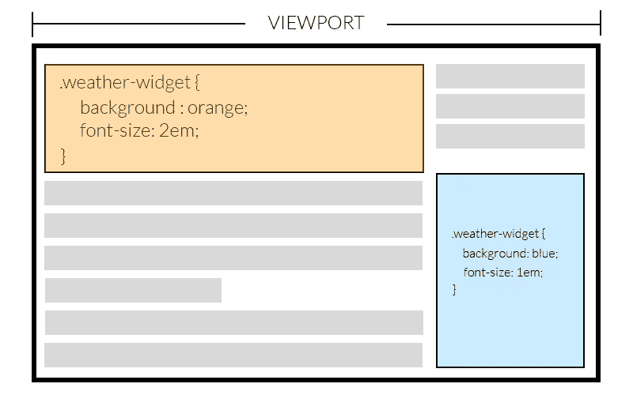
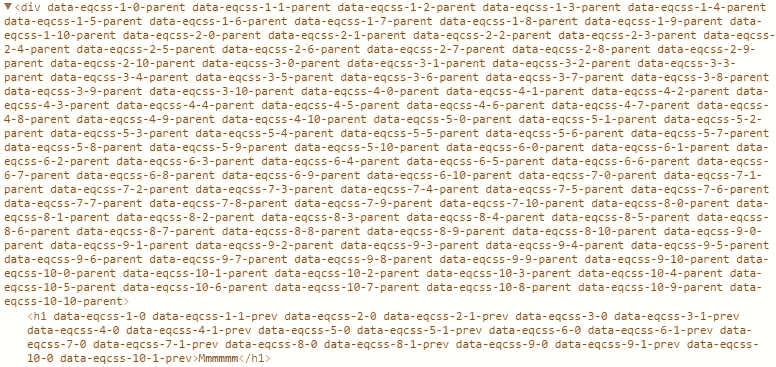

# 现在使用 EQCSS 编写元素查询

> 原文：<https://www.sitepoint.com/eqcss-a-javascript-plugin-to-write-element-queries/>


本文由 Adrian Sandu、Giulio Mainardi 和 Tom Hodgins 进行了同行评审。感谢 SitePoint 的所有同行评审员使 SitePoint 的内容尽可能做到最好！

我们都熟悉在 CSS 中使用媒体查询来根据屏幕宽度改变元素的外观。[元素查询](http://elementqueries.com/)类似于媒体查询，但是，现在响应条件应用于网页上的单个元素，而不是视口。例如，您现在可以根据元素自身的宽度、包含的字符数或用户滚动的量，对元素应用不同的样式规则。

## 为什么我们需要元素查询？

正如我在介绍中提到的，元素查询可以帮助您基于许多属性而不仅仅是视口的宽度和高度来设计元素的样式。除此之外，在其他一些情况下，这个库也可以被证明是非常有用的。

假设您刚刚创建了一个漂亮的响应式布局，其中所有元素都完美地结合在一起。现在，要求您在现有栏的旁边添加另一个栏。这将减少所有列的可用空间。

您的图像和文本在 1366 像素宽的视窗中以 800 像素宽的列显示时比例完美，但在同一视窗中以 600 像素宽的列显示时可能就不那么好了。在这种情况下，视窗宽度根本没有改变，但是各个列变窄了，因为它们必须为侧边栏腾出空间。在这种情况下，使用元素查询而不是媒体查询可以节省您大量的时间，因为您不必在每次布局发生变化时都重写 CSS。

在下面的演示中，如果我们有一个较小的视窗(窄于 500 像素)，我们将图像宽度设置为 100%，并将其全部移动到一列中。然而，在一个更大的视窗中，如果你点击“添加侧边栏”按钮，我们的主栏的宽度会显著减小，而视窗宽度不会有任何变化。因此，图像看起来太小，因为视窗宽度没有改变。

在 [CodePen](http://codepen.io) 上看到笔[通过 SitePoint (](http://codepen.io/SitePoint/pen/ygObXN/) [@SitePoint](http://codepen.io/SitePoint) )向布局添加更多列。

现在，让我们假设您正在创建一个小部件或插件，并且您正在使用媒体查询来使它做出响应。这里的问题是，小部件可以位于宽度等于视口的容器中，也可以位于宽度仅为视口四分之一的容器中。如果小部件的宽度取决于其容器的宽度，那么依赖于视口的大小来适当地设置样式是行不通的。元素查询现在可以帮上忙了！元素查询在这里可以很好地工作，因为它们使用小部件自己的宽度来设置样式。

在下图中，同一个小部件在一个网页上被放置了两次。您可以看到，视窗宽度相同，但这两个小部件的宽度不同。因为样式规则是基于小部件的宽度应用的，所以它们都非常适合布局。



使用元素查询，元素的响应条件变得独立于页面布局。因此，您可以创建导航栏和表格等组件并设置其样式，而不必担心周围的元素。这意味着为网站 A 创建的价格表可以直接在网站 b 中使用。当您创建模板时，它会有很大的帮助。

## EQCSS 入门

要在项目中使用元素查询，必须在 HTML 中包含 EQCSS.js。你可以从他们的 [GitHub 库](https://github.com/eqcss/eqcss)下载文件，或者直接链接到 CDNjs 上的[缩略文件](https://cdnjs.cloudflare.com/ajax/libs/eqcss/1.4.0/EQCSS.min.js)。

该插件支持所有现代浏览器，包括 IE9 及以上版本。如果你打算支持 IE8，你还必须在你的项目中包含一个聚合填充。polyfill 需要包含在实际的插件之前。

```
<!‐‐[if lt IE 9]>
  <script src="https://cdnjs.cloudflare.com/ajax/libs/eqcss/1.4.0/EQCSS-polyfills.min.js"></script>
<![endif]‐‐>   
<script src="https://cdnjs.cloudflare.com/ajax/libs/eqcss/1.4.0/EQCSS.min.js"></script>
```

一旦包含了必要的文件，就可以开始在项目中使用 EQCSS 了。有两种方法可以做到这一点。更简单的方法是在常规 CSS 中的`<style>`或`<link>`标签中编写 EQCSS。另一种方法是在一个`<script>`标签中单独包含 EQCSS 样式，自定义类型如下:

```
<script type=text/eqcss> /* Put your EQCSS here */ </script>

or 

<script type="text/eqcss" src="path/to/styles.eqcss"></script>
```

默认情况下，一旦内容加载，脚本就会执行并计算所有的样式，之后，在发生`resize`和`scroll`事件时。从 1.2 版本开始，插件也开始监听`input`、`click`、`mouseup`和`mousemove`事件。对于`scroll`事件，如果查询应用于`body`或`html`，则滚动事件被附加到`window`。在其他情况下，滚动事件被附加到查询中指定的元素。

如果您需要基于任何其他事件重新计算样式，您可以调用`EQCSS.apply()`。

## 编写元素查询

元素查询的语法非常类似于媒体查询的语法。例如，每个元素查询都以`@element`开头，后跟至少一个应用样式的选择器。

```
@element {selector} and {condition} { 
  /* All your valid CSS */
}
```

我在上面创建的第一个演示中的图像可以使用下面的查询完全填充我们的容器的宽度:

```
@element ".content" and (max-width: 480px) {
  .content img {
    width: 100%;
  }
}
```

使用上面的查询，一旦内容的宽度低于 480px，内容中的所有图像的宽度都被设置为 100%。现在唯一的问题是，EQCSS 仅在浏览器调整大小时或者有点击或滚动事件时才重新计算样式。在我们的例子中，我们必须在按钮的“click”事件中调用`EQCSS.apply()`。下面是一个演示，展示我们的图像如何适应另一列的添加(如果元素仍然不低于 480px，您可能需要减小 SitePoint 窗口的大小):

在 [CodePen](http://codepen.io) 上查看笔[通过 SitePoint (](http://codepen.io/SitePoint/pen/rjemwL/) [@SitePoint](http://codepen.io/SitePoint) )用 EQCSS 管理更多栏目。

元素查询中的条件不限于元素的宽度和高度。您还可以根据元素中的字符数来设置元素的样式。我想到的一个例子是 SitePoint 主页上基于卡片的布局。特色部分下的所有卡片具有相同的宽度和高度，但卡片标题的长度可以不同。当标题太长而无法放入卡片时，您可以使用 EQCSS 来减小其字体大小:

```
@element ".card h2" and (min-characters: 50) {
  $this {
    font-size: 1em;
  }
}
```

通过 [CodePen](http://codepen.io) 上的 SitePoint ( [@SitePoint](http://codepen.io/SitePoint) )查看标题为的 Pen [卡片布局。](http://codepen.io/SitePoint/pen/qRZmjX/)

你们中的一些人可能已经注意到我在这里使用了`$this`而不是`.card h2`。这是因为使用`.card h2`会改变所有卡片标题的字体大小，而`$this`只会改变字符数超过指定限制的标题的字体大小。其他类似于`$this`的选择器还有`$parent`、`$prev`和`$next`。所有这些选择器统称为*元选择器*。

## 使用元素查询

在决定尝试元素查询之前，SitePoint 的读者可能会想知道插件实际上是如何工作的，这样他们就可以自己决定它是否是他们项目的正确解决方案(并了解如何避免错误地使用它)。以下是幕后的情况:

它遍历所有元素查询，并找到每个查询的目标元素。之后，它遍历所有这些元素，并以属性的形式为每个元素分配一个惟一的标识符。该标识符的格式是`data-eqcss-{element-query-index}-{matched-element-index}`。为了标识一个元素的父元素，一个数据属性被添加到父元素中，该父元素是通过将`-parent`添加到元素的标识符中而获得的。相似的属性也被添加到上一个和下一个同级。最后，将每个元素及其查询与所有可能的条件进行匹配，如`min-height`、`max-height`、`min-scroll-x`等等，以对其应用适当的样式。

样式被添加到文档的`<head>`中。节流确保每 200 毫秒`EQCSS.apply()`不会被调用一次以上(默认超时值)。与调整大小、输入和单击事件不同，滚动事件仅在使用滚动元素查询的元素上被侦听。

由于不同元素的样式是使用 JavaScript 计算的，这意味着性能取决于应用样式的元素数量。由于元素太多，Firefox 和 Edge 都有明显的滞后。在最新版本的 Firefox 中，性能有所提高，预计将来会变得更好。

理想情况下，插件应该为每个元素添加一到两个 EQCSS 数据属性。如果你不小心使用它们，你可能会得到一个有几十个 EQCSS 属性的元素，这会使标记非常混乱。您不希望您的标记像这样结束:



请记住，您不必在原始 HTML 中手动添加这些属性。它们是插件运行时自动添加的。

与调试媒体查询相比，调试元素查询有点困难。目前，浏览器只知道媒体查询—不知道元素查询，所以它们只知道 EQCSS 应用的样式。

在阅读了所有这些特性之后，用元素查询完全取代媒体查询可能很有诱惑力。**请避免这样做**。首先，媒体查询将比元素查询运行得更快，因为它们依赖 JavaScript 来计算样式。使用太多的元素查询会导致你的网站性能下降(在 Firefox 和 IE 中)。

*(作为旁注:2015 年，插件在 Firefox 中运行流畅。然而，在 2016 年初，他们在浏览器中做了一些改变，导致插件的性能下降，开发者不得不将`EQCSS.throttle()`添加到库中，以控制插件重新计算样式的频率。*

其次，媒体查询不仅仅用于设计屏幕上的元素。它们还用于为其他媒体类型和功能提供样式。例如，您仍然需要媒体查询来指定应用于网页的打印样式。

## 结论

如果使用得当，EQCSS 是一个很好的工具。它可以帮你做很多媒体查询做不到的事情。当网页上有很多元素时，性能可能是一个问题，但从好的方面来看，语法类似于媒体查询，所以学习曲线不会太陡。

在未来，浏览器可能会获得类似 [ResizeObserver](https://github.com/WICG/ResizeObserver) 的功能，这将帮助开发者为`min-width`、`max-width`、`min-height`和最大高度条件创建更好的插件，以及 [Houdini](https://www.smashingmagazine.com/2016/03/houdini-maybe-the-most-exciting-development-in-css-youve-never-heard-of/) 功能，这将让他们直接在浏览器中添加支持。开发人员将致力于创建一个插件，利用所有这些功能，但他们计划继续支持目前的 EQCSS 插件。他们的目标是开发一系列插件，每个插件都适合我们希望支持的特定浏览器。

你对这个图书馆有什么看法？你在你的项目中用过它吗？请在评论中告诉我们。