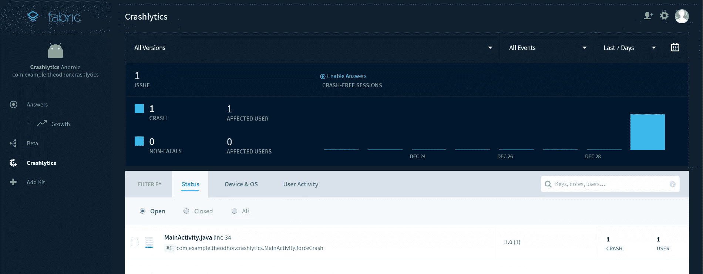
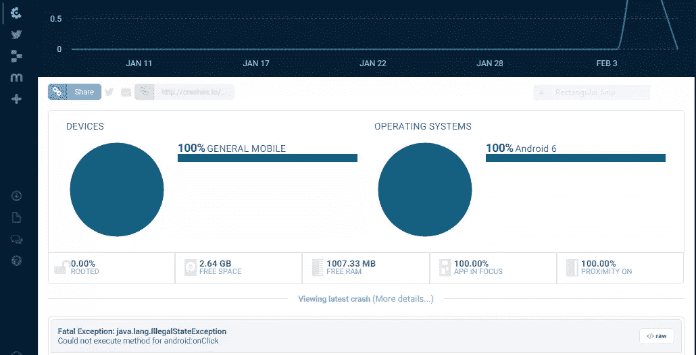
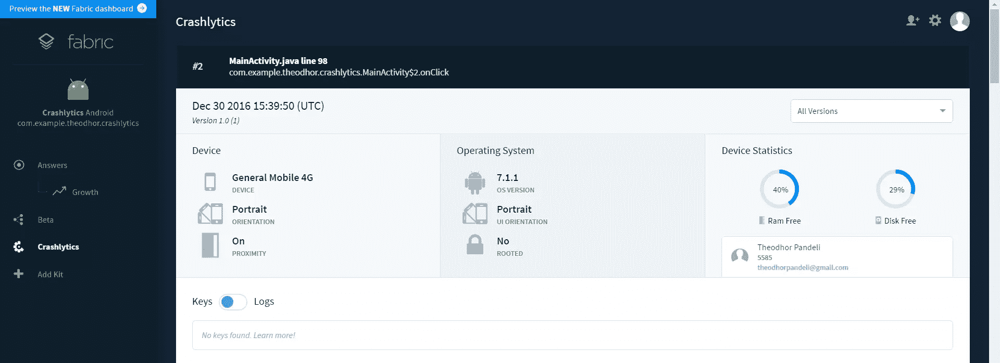
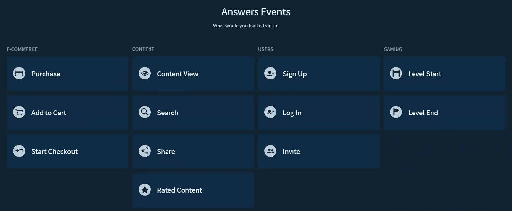

# 使用 Crashlytics 和 Fabric 报告 Android 应用程序崩溃

> 原文：<https://www.sitepoint.com/crash-reporting-an-android-app-with-crashlytics-and-fabric/>

*本文更新于 2017 年 1 月 18 日。具体来说:增加了 Crashlytics 答案的覆盖面*。

Twitter 的 [Fabric](https://get.fabric.io/) 库提供了一套工具来补充和增强你的应用。在本教程中，我将重点介绍帮助查明和跟踪应用程序崩溃的崩溃报告功能。

## 添加结构插件

在 Android Studio 中创建一个新项目，选择最低 API 级别为 18 的*并添加一个*空白活动*。*

打开 Android Studio 插件管理器，点击*浏览库*，搜索 *Fabric* ，安装插件。重启 Android Studio 让插件生效，一个新的图标会出现在上方的工具栏中。


点击图标将在 Android Studio 窗口的右侧打开一个面板。点击电源按钮注册或登录到结构服务，然后点击*下一步*、*崩溃*和*安装*。

Fabric 将向您显示它需要对您的应用程序进行的更改，检查这些更改，然后单击屏幕右下角的 *Apply* 。

## 强制一个简单的崩溃

由于这是一个示例应用程序，您必须通过单击应用程序中的按钮来强制崩溃。

打开 *activity_main.xml* ，删除不必要的‘浮动动作栏按钮’代码。

在 *content_main.xml* 布局中添加两个按钮来表示 Crashlytics 支持的报告类型。

用以下代码替换`TextView`:

```
<LinearLayout
  android:orientation="vertical"
  android:layout_width="match_parent"
  android:layout_height="wrap_content"
  android:layout_marginTop="50dp">

  <Button
      android:layout_width="wrap_content"
      android:layout_height="wrap_content"
      android:text="Simple Crash"
      android:onClick="forceCrash"
      android:layout_gravity="center" />

  <Button
      android:layout_width="wrap_content"
      android:layout_height="wrap_content"
      android:text="Extra Info Crash"
      android:onClick="showUserDialog"
      android:layout_gravity="center"
      android:layout_marginTop="30dp" />
</LinearLayout>
```

打开*MainActivity.java*类，删除‘浮动动作按钮’代码。在`onCreate()`方法之前，添加以下内容:

```
private EditText userIdentifierEditText, userEmailEditText, userNameEditText;
private String userIdentifier, userEmail, userName;
```

这些变量将用于包含自定义用户信息的第二种崩溃报告类型。

第一个简单的崩溃抛出一个`RuntimeException`导致应用程序崩溃。

在`onCreate()`方法后添加以下内容:

```
public void forceCrash(View view) {
  throw new RuntimeException("This is a simple crash");
}
```

当点击按钮调用视图时，该函数将一个`View`作为参数，并且需要是`public`。单击时，方法`forceCrash`抛出一个`RuntimeException`并向 Fabric 仪表板发送一个报告。此报告中包含的信息将包含导致崩溃的代码行和一般设备信息。


## 强制包含用户信息的崩溃

第二个按钮模拟一次崩溃，允许用户在对话框中输入信息。例如，用户的电子邮件或社交网络用户名。

在`forceCrash(View view){}`后增加如下功能:

```
public void logUser(String userIdentifier, String userEmail, String userName) {
  // TODO: Use the current user's information
  // You can call any combination of these three methods
  Crashlytics.setUserIdentifier(userIdentifier);
  Crashlytics.setUserEmail(userEmail);
  Crashlytics.setUserName(userName);
}
```

该函数需要三个类型为`String`的参数，并将它们添加到发送的报告中。要从用户那里获得这些数据，您需要一个带有三个输入字段的自定义对话框。

创建一个名为 *custom_dialog_layout.xml* 的自定义布局，并添加以下代码:

```
<LinearLayout
    xmlns:android="http://schemas.android.com/apk/res/android"
    android:orientation="vertical"
    android:layout_width="match_parent"
    android:layout_height="match_parent">

    <android.support.design.widget.TextInputLayout
        android:layout_width="match_parent"
        android:layout_height="wrap_content"
        android:layout_marginLeft="10dp"
        android:layout_marginRight="10dp">

    <EditText
        android:layout_width="match_parent"
        android:layout_height="wrap_content"
        android:id="@+id/userIdentifier"
        android:inputType="number"
        android:hint="User Identifier:"/>
    </android.support.design.widget.TextInputLayout>

    <android.support.design.widget.TextInputLayout
        android:layout_width="match_parent"
        android:layout_height="wrap_content"
        android:layout_marginLeft="10dp"
        android:layout_marginRight="10dp">

    <EditText
        android:layout_width="match_parent"
        android:layout_height="wrap_content"
        android:id="@+id/userEmail"
        android:hint="User Email:"/>
    </android.support.design.widget.TextInputLayout>

    <android.support.design.widget.TextInputLayout
        android:layout_width="match_parent"
        android:layout_height="wrap_content"
        android:layout_marginLeft="10dp"
        android:layout_marginRight="10dp">

    <EditText
        android:layout_width="match_parent"
        android:layout_height="wrap_content"
        android:id="@+id/userName"
        android:hint="User Name:"/>
    </android.support.design.widget.TextInputLayout>
</LinearLayout>
```

将以下方法添加到*MainActivity.java*中，该方法创建对话、获取信息、执行崩溃并发送报告:

```
public void showUserDialog(View view) {
    LayoutInflater inflater = getLayoutInflater();
    View alertLayout = inflater.inflate(R.layout.custom_dialog_layout, null);
    userIdentifierEditText = (EditText) alertLayout.findViewById(R.id.userIdentifier);
    userEmailEditText = (EditText) alertLayout.findViewById(R.id.userEmail);
    userNameEditText = (EditText) alertLayout.findViewById(R.id.userName);

    AlertDialog.Builder alert = new AlertDialog.Builder(this);
    alert.setTitle("Information");
    alert.setView(alertLayout);
    alert.setCancelable(false);
    alert.setNegativeButton("Cancel", new DialogInterface.OnClickListener() {

        @Override
        public void onClick(DialogInterface dialog, int which) {

        }
    });

    alert.setPositiveButton("Crash & Send", new DialogInterface.OnClickListener() {
        @Override
        public void onClick(DialogInterface dialog, int which) {
            // code for matching password
            userIdentifier = userIdentifierEditText.getText().toString();
            userEmail = userEmailEditText.getText().toString();
            userName = userNameEditText.getText().toString();
            if (!userIdentifier.equals("") && !userEmail.equals("") && !userName.equals("")) {
                logUser(userIdentifier, userEmail, userName);
                Toast.makeText(getBaseContext(), "Sending extra information...", Toast.LENGTH_SHORT).show();
                throw new RuntimeException("This is a crash with extra information");
            }
            Toast.makeText(getBaseContext(), "Information not send! Please complete all fields...", Toast.LENGTH_SHORT).show();
        }
    });
    AlertDialog dialog = alert.create();
    dialog.show();

}
```

当单击第二个按钮时，应用程序会显示一个要求输入的对话框。点击*崩溃&发送*检查字符串是否有值，执行崩溃并发送包含信息的报告。


## Crashlytics 仪表板

要查看崩溃报告，请访问单个应用程序的 Crashlytics 仪表板。



图表下方是对应于特定代码行的崩溃。要查看有关崩溃的更详细信息，请单击列表上的项目。



要查看有关发送报告的用户的更多信息，请单击*查看最新崩溃(更多详细信息…)_



## 答案

Fabric 还为您提供了最简单的工具来保存您的应用程序用户指标、事件和行为。

为了跟踪用户访问的任何活动或视图，只需在任何方法中添加以下代码:

```
//New Answers data
        Answers.getInstance().logContentView(new ContentViewEvent()
                .putContentName("MainActivity")
                .putContentType("View")
                .putContentId("1234")
                .putCustomAttribute("Custom Number", 20)
                .putCustomAttribute("Screen Orientation", "Landscape")); 
```

您还可以通过添加以下内容来创建自定义应答事件:

```
Answers.getInstance().logCustom(new CustomEvent("User registered")
                .putCustomAttribute("Custom Attribute", "Sample")
                .putCustomAttribute("Custom", 350)); 
```


但是 Answers 提供了更多关于应用程序指标的选项，以及许多其他事件，如下所示:



## 结论

Fabric 的 Crashlytics 组件提供了一种向应用程序添加崩溃报告的快速方法，帮助您识别用户遇到的常见问题并改进您的应用程序。

如果你有任何问题，请在下面的评论中告诉我。

## 分享这篇文章