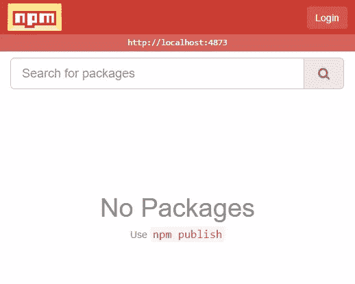
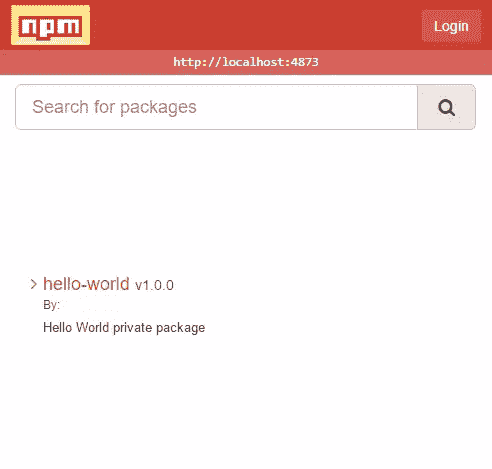

# 使用 Verdaccio 托管、发布和管理私有 npm 包

> 原文：<https://www.sitepoint.com/private-npm-packages-verdaccio/>

*托管、发布和管理 Verdaccio 的私有 npm 包由[Panayiotis pvgr Velisarakos](https://github.com/pvgr)和 [Jurgen Van de Moere](https://www.sitepoint.com/author/jvandemoere/) 进行同行评审。感谢 SitePoint 的所有同行评审员使 SitePoint 的内容尽可能做到最好！*


我相信你知道，事实上的 JavaScript 包管理器是 npm，它的注册表是世界上最大的代码集合。但是当你开发一个很棒的新包时，有时你需要额外的隐私。可能是因为你正在做一个不打算与公众分享的公司项目，你的硕士/学士论文项目，或者仅仅是因为你像我一样，有时会对你迈出新主题的第一步感到羞愧。

无论原因是什么，都有几种选择。也许最简单的方法是注册一个 npm 的商业优惠，你就可以开始了。但这一价格可能并不适合所有人。

幸运的是，有一个叫做 [Verdaccio](https://github.com/verdaccio/verdaccio) 的免费替代品，可能会帮到你。

## 介绍 Verdaccio

Verdaccio 是一个 npm 包，允许您创建本地 npm 注册表，无需任何配置。这是一个包含电池的项目，有自己的数据库。它通过充当本地缓存/代理服务器来实现这一点。

这意味着每当你试图从你的自定义库安装一些不存在的东西时，它将 ping 官方的 npm 注册表并下载依赖项。您的自定义存储库在一个名为`storage`的简单文件夹中维护这些内容。下一次后续安装将使用这个本地缓存的副本。最重要的是，来自 npm 客户端的一些命令，比如`npm login/adduser/publish`被复制以支持本地私有包的创建，您将在本文稍后看到这些命令的使用。

如果你认为这不是什么新鲜事，中国已经有了，你是对的。Verdaccio 只是 Sinopia 的一个分支，它保持向后兼容性，但试图跟上官方 npm 的变化。其中一个变化是作用域包，这在 Sinopia 中是不可用的，在使用 Angular 2 或 TypeScript npm 托管类型等库时，您可能已经见过了。您可以通过前导@符号轻松识别它们:

```
# Installing an Angular2 dependency
npm install @angular/core

# Installing the official Node.js type definitions for TypeScript 
npm install @types/node 
```

Sinopia 和 Verdaccio 都可以在 Mac/Linux 和 Windows 上运行。

## Verdaccio 入门

因为 Verdaccio 是一个 npm 软件包，所以您只需运行以下命令来安装它:

```
npm install -g verdaccio 
```

随后对`verdaccio`的调用将启动实例并让您的私有注册中心运行。

默认情况下，它将侦听端口 4873。我们稍后将讨论如何更改这些设置。

> 在本文中，我们将在您的开发机器上设置注册表。在公司环境中，您可能希望在专用服务器上这样做，以便所有开发人员都可以访问它。

Verdaccio 是一个 Node.js 应用程序，这意味着您应该注意在偶尔崩溃的情况下重新启动它。我推荐用 [pm2](https://github.com/Unitech/PM2) 。您只需要运行以下步骤:

```
# Install pm2
npm install pm2 -g

# start Verdaccio using pm2
pm2 start PATH-TO-GLOBAL-VERDACCIO/verdaccio
# --> e.g for Windows: C:/Users/[USERNAME]/AppData/Roaming/npm/node_modules/verdaccio/bin/verdaccio 
```

此外，如果在本文结束时，您得出的结论是 Verdaccio 不适合您，请停止该过程，并使用以下命令卸载 Verdaccio:

```
npm uninstall -g verdaccio 
```

### 配置客户端

既然注册表已经启动并运行，您需要将您的 npm 客户端指向新地址。这是通过运行以下命令完成的:

```
npm set registry http://localhost:4873/ 
```

> 如果您只是按照本文中的步骤进行操作，稍后想要恢复到原始的 npm 注册表，只需运行这个命令`npm set registry https://registry.npmjs.org`进行基于 HTTPS 的访问，或者运行`npm set registry http://registry.npmjs.org`进行传统的 HTTP 访问。

此外，如果您通过 HTTPS 服务您的注册中心，您将需要设置适当的 CA 信息。

```
# setting the value to null will use the list provided by the operating system
npm set ca null 
```

现在，您可以通过导航到地址`http://localhost:4873`来访问注册表浏览器。



### 配置您的自定义注册表

当服务器启动时，会自动创建一个名为`config.yaml`的新配置文件。默认情况下，它将被创建在您的`users`文件夹中。在 Windows 上，这可能如下所示:

```
C:\Users\[USERNAME]\.config\verdaccio\config.yaml 
```

一个重要的设置是配置 Verdaccio 监听的默认端口。您可以通过在配置文件的末尾添加以下行来更改这一点。

```
listen:
 - http://localhost:[YOURPORT] 
```

另一个有趣的设置可能是代理的使用，尤其是在公司环境中。这些设置包含以下条目:

```
http_proxy: http://something.local/
https_proxy: https://something.local/
no_proxy: localhost,127.0.0.1 
```

只需记住通过终止当前进程来重新启动 Verdaccio，或者在更改任何配置后暂停 pm2 进程并重新启动它。

### 注册用户

最后但同样重要的是，我们需要配置一个将软件包发布到您的注册中心的用户。我们可以使用默认的`adduser`命令，指向我们的自定义注册表。

```
npm adduser --registry http://localhost:4873 
```

之后，只需按照命令行上的提示。

> 请记住使用您之前配置的相同端口

该用户将用于根据 Verdaccio 实例进行身份验证。在上述文件`config.yaml`的旁边，您会发现一个新创建的`htpasswd`，用于存储您的登录和凭证。

## 您的第一个私有 npm 包

现在，我们准备创建我们的第一个私有包。我们将创建一个简单的`hello-world`包，并查看发布它的过程。

### 创建包

首先，在某个地方创建一个名为`hello-world`的新文件夹。现在，我们需要启动一个新的包，我们使用命令`npm init`来完成。你会被问一堆问题，但是现在，大多数问题都可以默认接受。只要给它一个描述，保持在`index.js`的入口点，并添加你的名字作为作者。结果是一个名为`package.json`的文件描述了您的包。

> 一个好的做法是在你的包名前面加上前缀，这样你就可以立刻分辨出你是在和一个本地的还是官方的 npm 源一起工作。

下一步是创建实际的包。因此我们创建了一个文件`index.js`。这个简单的例子将只导出一个`HelloWorld`函数:

```
// content of index.js
function HelloWorld() {
  return "Hello World";
}

module.exports = HelloWorld; 
```

### 发布包

现在剩下的就是发布你的包了。为此，我们首先需要用`npm login`登录我们的注册表。系统将提示您输入之前设置的用户名和密码。

完成后，在`hello-world`的根目录下运行`npm publish`就完成了。

如果您现在再次在浏览器中访问注册表浏览器，通过 http://localhost:4873/，您会看到列表中包含了新的软件包。



## 消费者应用程序示例

现在，我们已经发布了我们的私有包，让我们创建一个简单的演示应用程序来使用它。

在新文件夹`demo`中，我们再次使用`npm init`创建一个新的节点应用程序。再次，接受所有的建议，也许只是添加一个描述和作者信息。

之后，创建一个`index.js`作为我们应用程序的根。

### 安装您的私有包

为了安装私有包，您基本上必须做与标准 npm 过程相同的事情。

```
npm install --save hello-world 
```

这将在您的`node_modules`文件夹中安装软件包，并更新您的`package.json`的依赖部分。

我们现在可以使用这个包了。打开`index.js`并添加以下代码:

```
const helloWorld = require("hello-world");

console.log(helloWorld()); 
```

当你现在用`node index.js`运行应用程序时，你应该在命令行上看到`Hello World`的输出。

恭喜你，你刚刚发布并使用了你自己的私有包！

### 请求一个公共包

这同样适用于公共包。你只需继续运行`npm install package-name`，一切都会照常安装在`node_modules`文件夹中。

Verdaccio 在后台做的是查看它的存储文件夹，并检查请求的包是否存在。如果没有，它会尝试将请求转发到官方的 npm 注册表，下载并存储它，然后回复您的请求。下一次您为同一个软件包发布 npm 安装时，它现在将完全满足这个要求。

因此，即使官方注册表因为某种原因关闭或无法访问，您仍然可以访问自己的缓存版本。Verdaccio 将总是只下载所请求的内容。如果您发布了一些更新，将根据需要下载这些更新。

> 请注意，注册表浏览器不应该显示公共包。如果您真的需要显示它们，您可以编辑文件`.sinopia-db.json`并将包名手动添加到`list`数组中。之后不要忘记重新启动 Verdaccio。

## 结论

因此，现在您可以托管自己的私有注册表，并从缓存的公共包中受益。最重要的是，你现在还可以发布私有包，而不必与云对话。安装完成后，所有相关的 npm 客户端命令都和往常一样。

在疯狂的情况下，你的一些包被破坏或损坏，记住它只是一个文件夹`storage`存放你的包，所以导航到那里，删除有问题的包。下一次安装可能会解决您的问题。

我希望你喜欢这篇文章，并期待在评论中听到你的声音！

## 分享这篇文章