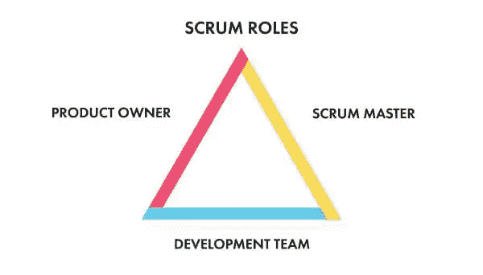
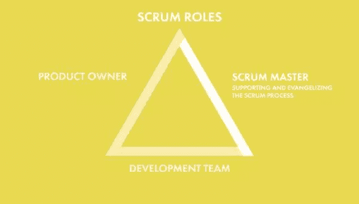

# Scrum 角色:Scrum Master

> 原文：<https://www.sitepoint.com/scrum-roles-scrum-master/>

以下是摘自我们的书《Scrum:新手到忍者，作者是 M. David Green。世界各地的商店都有出售，或者你可以在这里买到电子书。

Scrum 是一个支持团队持续生产力的系统。但是如果你试图采用 scrum，并且没有充分考虑 scrum 分配给参与者的每个角色的目的，你很可能会发现维持 scrum 的平衡和节奏有问题。在已定义的角色上偷工减料是 scrum 中最普遍的反模式之一，通过使角色的分配深思熟虑且明确，这很容易避免。

传统的 scrum 只定义了三个关键角色:scrum master、产品所有者和团队成员。我们从这些开始。但是 scrum 是在一个环境中进行的，对于 web 和移动开发来说，这个环境通常是一个公司或组织试图为客户、用户或顾客创造体验的技术体现。

### 没有等级

敏捷 scrum 团队在一个可能有管理层级的组织中运作。但是就过程而言，scrum 中的角色都是平等的。

虽然这个标题听起来很有气势，但是 scrum master 除了在 scrum 过程中扮演仆人领导者的角色之外，没有任何权力。产品负责人除了维护产品的愿景和引导产品通过 scrum 过程之外，没有任何权力。团队除了评估、接受、拒绝、承诺、处理和完成故事的权力之外，没有其他权力。每个人都应该被授权来执行这些角色，以保持一个敏捷的工作环境。

### 注:一个仆人领导？

术语 **仆人领导** 经常在讨论 scrum 主占据的微妙平衡位置时使用。scrum master 除了 scrum 的仪式和工件之外，没有任何正式的权威，但是通过拥抱和传播 scrum 的概念从内部领导团队。scrum 大师服务于整个团队的需求——帮助消除 **阻碍者**(scrum 工作流程的障碍),指导人们如何遵循 scrum 的实践——并且应该在倡导和捍卫 scrum 时以身作则。

### Scrum 角色和组织角色

scrum 的角色独立于正式的职位，这些职位可能作为公司层级的一部分被分配和管理。对于一些团队来说，这可能会导致不属于正式敏捷过程的人如何融入过程的困惑。scrum 团队之外的人真的不需要理解 scrum 就能工作。但是 scrum 的一个重要部分是透明性，scrum 团队的活动可能会吸引外界的注意。

在这一章中，我们将回顾 scrum master、产品负责人和团队成员的关键角色。此外，我们将讨论 scrum 团队之外的许多人的动机和观点，他们的参与可能会影响 scrum 工作的好坏，并且最终可能是在一个组织中倡导和维护 scrum 的关键。

## Scrum 大师

一个 **scrum master** 是一个 scrum 团队的粘合剂。Scrum masters 负责让人们清楚他们的角色，管理 Scrum 的仪式和工件(我们很快就会谈到)，并指导团队内部和整个组织的人们帮助克服障碍，保持可持续的生产速度。

与项目经理不同，scrum 大师作为团队的仆人领导，有着明确的使命。scrum 大师在组织中没有正式的权力，除了通过 scrum 的仪式指导团队，并维护跟踪团队进展的工件。但是 scrum master 在 scrum 过程以及如何应用它的问题上有最终的权威。

### 注意:Scrum 大师的参与

scrum master 可能是开发团队的一部分，但是通常 scrum master 可能不参与团队的日常开发工作。对于已经遵循 scrum 实践一段时间的团队来说，如果他们对 scrum 很熟悉，那么一个没有开发职责的 scrum 大师可以同时负责两个团队。

### 警告:Scrum 主管的职责

scrum 大师通常是工程部门的一部分，在某些情况下可能是开发团队的一员。对于一个 scrum 大师来说，成为一个开发团队的管理者是有利益冲突的。一个 scrum 大师不应该对团队有正式的组织权威，否则团队可能会因为潜在的分歧而对向 scrum 大师提出问题感到压抑。

### 责任

scrum 大师必须遵守一些重要的习惯。至少，这些包括每日站立会议、冲刺计划会议、冲刺结束演示和冲刺回顾。我们很快会更详细地介绍这些仪式。

除了主持 scrum 的仪式之外，scrum master 还负责在整个 scrum 过程中指导团队。这可能包括大胆地参与关于个人角色和职责的讨论，并帮助人们以一种可以理解的方式交流他们的需求和期望。从这个意义上来说，scrum 大师可以成为团队的倡导者、顾问和组织其他部门的联络人。

Scrum masters 还维护了许多工件，这些工件帮助团队专注于他们的目标，并测量他们朝着承诺进展的可持续性。这些工件，以及它们包含的数据，可能在团队内外都有广泛的解释，所以一个 scrum master 需要能够解释团队的状态和它的进展，如果需要的话，可以让组织内外的广泛受众理解。

### 生命中的一天

Scrum 大师需要参与产品开发的每个方面，所以他们必须与许多人密切合作，并处理许多关键工具——如下表所示。(如果这里有一些不熟悉的术语，请不要担心。我们很快会讨论 scrum 的工件和仪式。)所以，他们的活动包括:

*   计划和主持 scrum 的仪式，包括每日站立会议、冲刺计划会议、冲刺演示和冲刺回顾

*   协助团队识别阻碍他们开发工作的障碍

*   向团队成员、产品负责人或组织中任何能够帮助消除障碍并让故事继续下去的人寻求帮助

*   维护 scrum 的工件，并确保每个人都可以访问它们

*   指导团队成员了解他们的角色和职责，同时观察问题并帮助解决问题

*   与产品负责人合作，帮助澄清故事，并维护一个整洁的待办事项列表

*   为了产品和团队的利益，向管理层和整个组织代表 scrum 的需求。

每个 scrum 大师每天都会尝试主持的一个仪式是与整个团队以及任何愿意观察的客人一起站立 15 分钟。对于一些团队来说，这将在一天的早些时候发生，而其他团队更喜欢晚些时候发生。

Scrum masters 可能会在会议结束时参与一些后续讨论。最重要的措施包括清除团队成员中的阻挡者，如果没有协调的帮助，他们将无法前进。Scrum masters 还将会见产品负责人和团队成员等委托人，跟进在会议期间提出的任何其他问题。

在安排了其他仪式的日子里，比如 sprint 规划会议、sprint 演示或者 sprint 回顾，scrum master 领导这个过程，确保团队同意的所有步骤都被遵循，并且时间限制得到遵守。

更新 scrum 的工件是 scrum 大师的日常职责。这些总是保持在一种状态，让任何人一眼就能看到团队在做什么，以支持保持 scrum 工作的基本透明性。这包括计算和报告团队度量，例如速度，并向团队之外的人阐明这些概念的相关性。

Scrum masters 在支持团队每个成员的 Scrum 职责方面也起着关键作用。scrum 大师需要在问题出现时指导团队，并在问题出现时识别这些问题。这可能意味着帮助产品负责人弄清楚如何为待办事项列表准备一个故事，观察并参与与开发人员的配对会议以促进该过程，或者用简单的语言准备关于团队状态的报告——为了那些不在团队中但需要了解正在发生的事情的人。

## 分享这篇文章