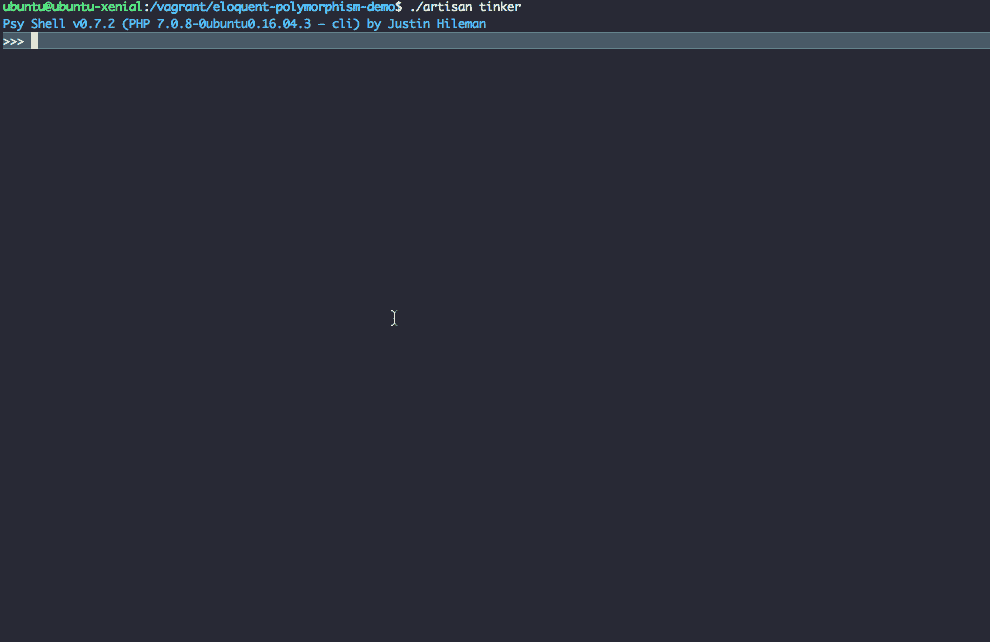

# 雄辩和多态关系:概述和使用指南

> 原文：<https://www.sitepoint.com/what-are-polymorphic-relations-and-how-do-we-use-them-with-eloquent/>

当我为一个客户开发一个应用程序时，我必须实现一个新的模块，它包含以下内容:

*   用户要求对某项任务进行预算报价。
*   每个任务都有一个位置。
*   专业人士可以订阅不同的区域。
*   区域可以是一个地区或一个城市。

现在，让我们忽略核心应用程序，尝试实现这个单一模块，看看我们可以在这里实现什么。

[](https://www.sitepoint.com/wp-content/uploads/2015/02/1423519219laravel-l-slant.png)

* * *

*这篇文章由[克里斯托弗·文迪](https://www.sitepoint.com/author/cvundi)和[克里斯托弗·皮特](https://www.sitepoint.com/author/assertchris)进行了同行评议。感谢 SitePoint 的所有同行评审员使 SitePoint 的内容尽可能做到最好！*

## 脚手架应用

我假设您已经建立了开发环境。如果没有，你可以查看这个[宅地改良快速提示](https://www.sitepoint.com/quick-tip-get-homestead-vagrant-vm-running/)或者直接用官方的[宅地框](https://laravel.com/docs/5.3/homestead)。

继续使用 Laravel 安装程序或通过 Composer 创建一个新的 Laravel 项目。

```
laravel new demo 
```

或者

```
composer create-project --prefer-dist laravel/laravel demo 
```

用您的数据库凭证编辑您的`.env`文件。

```
DB_CONNECTION=mysql
DB_HOST=127.0.0.1
DB_PORT=3306
DB_DATABASE=homestead
DB_USERNAME=homestead 
DB_PASSWORD=secret 
```

## 创建迁移

在创建我们的迁移之前，我们应该讨论一下[雄辩的多态关系](https://laravel.com/docs/5.3/eloquent-relationships#polymorphic-relations)以及它们如何在这种情况下给我们带来好处！
当一个对象可以有不同的形式(形状)时，经常使用多态。在我们的例子中，专业用户订阅不同的区域，每当在这个区域发布新的工作时，他们都会得到通知。

让我们从创建`zones`表开始。

```
php artisan make:model Zone --migration 
```

这创建了一个迁移文件，但是我们确实需要在它完成之前添加一些代码，如:

```
// database/migrations/2016_12_02_130436_create_zones_table.php

class CreateZonesTable extends Migration
{
    public function up()
    {
        Schema::create('zones', function (Blueprint $table) {
            $table->integer('user_id')->unsigned();

            $table->integer('zone_id')->unsigned();
            $table->string('zone_type');
        });
    }

    public function down()
    {
        Schema::dropIfExists('zones');
    }
} 
```

接下来，我们创建城市和地区表。

```
php artisan make:model Region --migration 
```

```
// database/migrations/2016_12_02_130701_create_regions_table.php

class CreateRegionsTable extends Migration
{
    /**
     * Run the migrations.
     *
     * @return void
     */
    public function up()
    {
        Schema::create('regions', function (Blueprint $table) {
            $table->increments('id');
            $table->string('name');
        });

    }

    /**
     * Reverse the migrations.
     *
     * @return void
     */
    public function down()
    {
        Schema::drop('regions');
    }
} 
```

```
php artisan make:model City --migration 
```

```
// database/migrations/2016_12_02_130709_create_cities_table.php

class CreateCitiesTable extends Migration
{
    public function up()
    {
        Schema::create('cities', function (Blueprint $table) {
            $table->increments('id');
            $table->string('name', 255);
            $table->integer('postal_code')->unsigned();

            $table->integer('region_id')->unsigned()->nullable();
        });
    }

    public function down()
    {
        Schema::drop('cities');
    }
} 
```

我们可以通过对城市和地区表建立多对多关系来获得相同的结果。然而，zones 表将作为另外两个表的*抽象类*。`zone_id`将保存一个城市或地区的 id，并使用`zone_type`值来决定返回哪个模型实例。

## 创建模型

雄辩有能力猜测相关的表字段，但是我决定不使用它来解释如何将数据库字段映射到模型。我会边走边解释的！

```
// app/User.php

class User extends Authenticatable
{
    // ...

    public function cities()
    {
        return $this->morphedByMany(City::class, 'zone', 'zones', 'user_id', 'zone_id');
    }

    public function regions()
    {
        return $this->morphedByMany(Region::class, 'zone', 'zones', 'user_id', 'zone_id');
    }
} 
```

`morphedByMany`方法类似于`manyToMany`方法。我们指定相关模型、映射字段名称(用于`zone_type`和`zone_id`)、相关表名称、当前模型外键和变形的关系键。
我们可以通过让雄辩猜测字段名来实现自动化，如果你看一下[文档](https://laravel.com/docs/5.3/eloquent-relationships#many-to-many-polymorphic-relations)你会发现我们可以将字段命名为`zoneable_id`和`zoneable_type`，然后只指定映射的字段名(`return $this->morphedByMany(City::class, 'zoneable'`)。

```
// app/Region.php

class Region extends Model
{
    // ...

    public function cities()
    {
        return $this->hasMany(City::class);
    }

    public function users()
    {
        return $this->morphMany(User::class, 'zones', 'zone_type', 'zone_id');
    }
} 
```

从上面的代码中我们可以很快猜出参数的定义。我们指定相关的表名、变形的关系类型和 ID。

```
// app/City.php

class City extends Model
{
    // ...

    public function users()
    {
        return $this->morphMany(User::class, 'zones', 'zone_type', 'zone_id');
    }
} 
```

现在一切都准备好了，我们可以开始测试我们的关系，看看是否一切都按预期进行。我们应该首先对我们的表进行种子化，以节省一些时间。您可以从 [GitHub 库](https://github.com/Whyounes/eloquent-polymorphism-demo)中获取数据库种子的代码。

## 使用关系

我们可以使用同步、附加和分离雄辩的方法将城市和地区附加到用户。这里有一个例子:

```
$user = App\User::find(1);

$user->cities()->sync(App\City::limit(3)->get()); 
```

这将把三个城市附加到选定的用户，我们可以对地区做同样的事情。

```
$user = App\User::find(1);

$user->regions()->sync(App\Region::limit(3)->get()); 
```



如果我们现在检查数据库以查看保存了什么，我们可以看到以下内容:

```
mysql> select * from zones;
+---------+---------+------------+
| user_id | zone_id | zone_type  |
+---------+---------+------------+
|       1 |       1 | App\City   |
|       1 |       2 | App\City   |
|       1 |       3 | App\City   |
|       1 |       1 | App\Region |
|       1 |       2 | App\Region |
|       1 |       3 | App\Region |
+---------+---------+------------+
6 rows in set (0.00 sec) 
```

如果区域存在，我们也可以分离它们。

```
$user = App\User::find(1);

$user->regions()->detach(App\Region::limit(3)->get()); 
```

现在，我们可以像在正常的多对多关系中一样获取用户城市和地区:

```
$user = App\User::find(1);

dd($user->regions, $user->cities); 
```

我们可以添加一个名为`zones`的新方法，该方法将合并区域中的城市和单个选定的城市。

```
class User extends Authenticatable
{
    // ...

    public function zones()
    {
        return $this->regions->pluck("cities")->flatten()->merge($this->cities);
    }
} 
```

pluck 方法将从每个区域获取一个城市集合，然后将其展平(将所有集合合并为一个集合)并与用户选择的城市合并。你可以在文档中读到更多关于集合的内容，如果你想了解更多，我推荐 Adam Wathan 的《重构集合》一书。

## 结论

尽管多态关系很少在应用程序中使用，但 concertive 使处理相关的表和返回正确的数据变得很容易。如果你有任何关于雄辩或 Laravel 的问题或评论，你可以在下面发表，我会尽力回答！

## 分享这篇文章