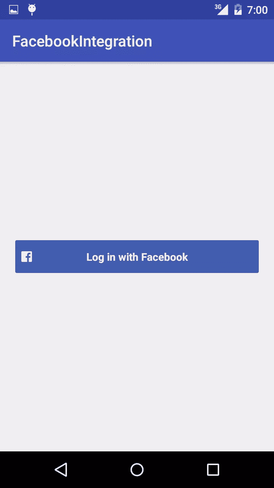
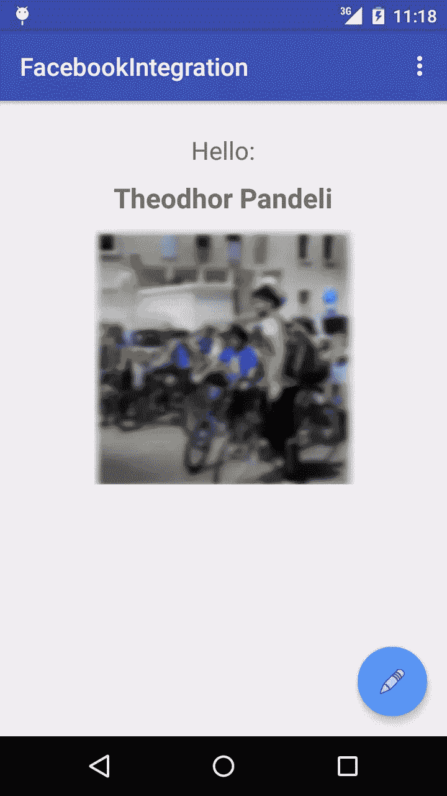
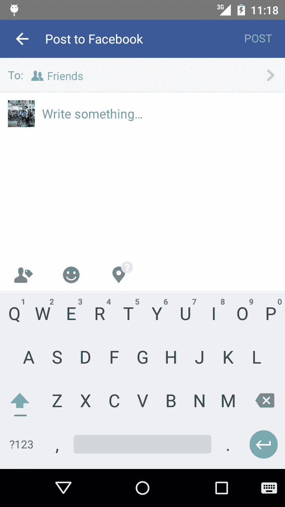
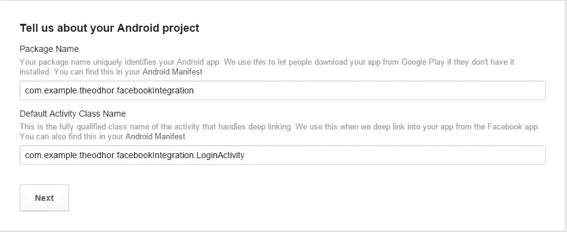
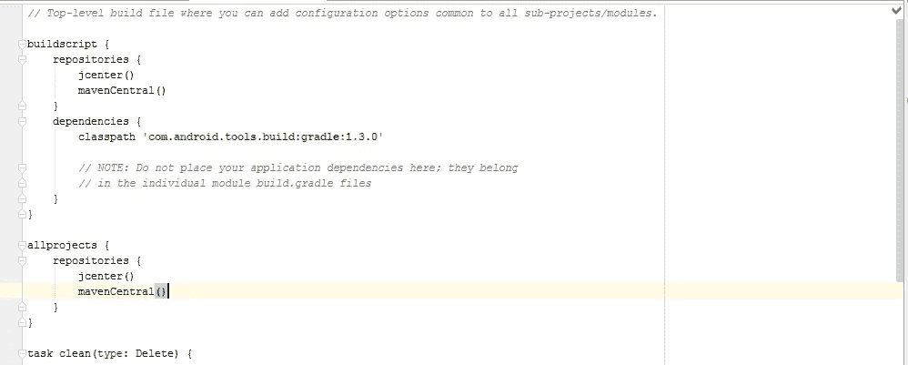

# 将脸书 API 与 Android 集成

> 原文：<https://www.sitepoint.com/integrating-the-facebook-api-with-android/>

本文更新于 2016 年 12 月 13 日。

在本教程中，我将展示如何将您的 Android 应用程序连接到脸书 API。许多移动应用程序使用脸书 API v4.x 来登录、注册和发布数据。







## 创建 Android 项目

确保你有一个最新版本的 Android Studio。我使用的是版本 1.4.1

打开 Android Studio，创建一个*新项目*，随意命名。点击*下一步*，选择*最低 API 等级 17* ，再次点击*下一步*。选择*空活动*作为第一个活动，命名为 *LoginActivity* ，点击*完成*。

接下来，我们向项目添加另一个空白活动。*右击*包，选择*新建- >活动- >空白活动*。保留其默认名称，点击*完成*。

本文的最终项目可以在 [Github](https://github.com/theodhorpandeli/facebook-sdk-4.18.0) 上找到。确保您更改了脸书 API 详细信息，以匹配您自己的详细信息。

## 正在创建脸书应用 ID

要使用脸书 API，我们必须向我们的[脸书开发者应用仪表板](https://developers.facebook.com/quickstarts/?platform=android)添加一个应用入口。如果您还没有脸书开发者帐户，您将需要一个。随机选择一个类别，点击*创建应用 ID* 。

在下一页上，向下滚动到底部，用项目包名称填写两个字段。



点击*下一个*。

现在我们需要添加一个开发密钥散列。有两种方法可以生成一个。第一种选择是使用命令行。

### Windows 操作系统

```
keytool -exportcert -alias androiddebugkey -keystore %HOMEPATH%\.android\debug.keystore | openssl sha1 -binary | openssl base64
```

### 苹果个人计算机

```
keytool -exportcert -alias androiddebugkey -keystore ~/.android/debug.keystore | openssl sha1 -binary | openssl base64
```

打开脸书的 *[我的应用](https://developers.facebook.com/apps/)* 板块，复制应用 ID:


在您的项目中打开 *strings.xml* ,并添加这行代码:

```
<string name="facebook_app_id">{Your App ID here}</string>
```

## 设置脸书 SDK

打开 *build.gradle (Project)* 并将`mavenCentral()`添加到两个存储库部分。然后打开 *build.gradle (Module)* ，通过在`dependencies`中添加这一行来添加 SDK 库:

```
 compile 'com.facebook.android:facebook-android-sdk:4.18.0'
```



现在同步。

## 活动和布局

打开 *AndroidManifest.xml* 并进行这些更改。

更改`MainActivity`标签:

```
<activity
        android:name=".MainActivity"
        android:label="@string/app_name"
        android:theme="@style/Theme.AppCompat.NoActionBar" >
    </activity>
```

添加这些标签:

```
 <meta-data
        android:name="com.facebook.sdk.ApplicationId"
        android:value="@string/app_id" />

    <activity
        android:name="com.facebook.FacebookActivity"
        android:label="@string/app_name"
        android:screenOrientation="portrait"/>

    <provider              android:authorities="com.facebook.app.FacebookContentProvider"                 android:name="com.facebook.FacebookContentProvider"
    android:exported="true"/>
```

现在我们将使用 Java 类和布局。

首先，我们将和 LoginActivity.java 一起工作。该类打开到脸书 API 的经过身份验证的连接，并从中获取数据。

在类中的`onCreate`方法之前添加以下几行:

```
private CallbackManager callbackManager;
private AccessTokenTracker accessTokenTracker;
private ProfileTracker profileTracker;

//Facebook login button
private FacebookCallback<LoginResult> callback = new FacebookCallback<LoginResult>() {
    @Override
    public void onSuccess(LoginResult loginResult) {
        Profile profile = Profile.getCurrentProfile();
        nextActivity(profile);
    }
    @Override
    public void onCancel() {        }
    @Override
    public void onError(FacebookException e) {      }
};
```

这里我们创建一个名为`callback`的`FacebookCallback`。这在我们从脸书 API 得到响应后执行下一个动作，方法是`onSuccess()`。

在`onSuccess`方法中，我们创建一个新的脸书概要文件，并获取该概要文件的数据。稍后我们将创建一个名为`nextActivity()`的简单函数来切换我们的活动。

我们将初始化脸书 SDK，这样我们就可以使用它的功能和方法。在`onCreate()`内添加以下几行:

```
FacebookSdk.sdkInitialize(getApplicationContext());
callbackManager = CallbackManager.Factory.create();
accessTokenTracker = new AccessTokenTracker() {
    @Override
    protected void onCurrentAccessTokenChanged(AccessToken oldToken, AccessToken newToken) {
    }
};

profileTracker = new ProfileTracker() {
    @Override
    protected void onCurrentProfileChanged(Profile oldProfile, Profile newProfile) {
        nextActivity(newProfile);
    }
};
accessTokenTracker.startTracking();
profileTracker.startTracking();
```

接下来，我们需要显示著名的脸书登录按钮。我们不需要从头开始创建它，因为它存在于 SDK 的库中，可以在我们的布局中调用。

因此，我们将编辑我们的 LoginActivity 的布局。它的名字应该是`content_login.xml`。事实上，最新版本的 Android Studio 创建了两个默认的*。我们创建的每个活动的 xml* 文件。另一个布局文件叫做`activity_login.xml`。

在 *activity_login.xml* 中，删除浮动按钮的代码，因为我们不再需要它。

在 *content_login.xml* 中只有一个`TextView`元素。我们将删除它并创建一个新的水平方向的`LinearLayout`。在布局中，我们将添加登录按钮。粘贴下面的代码来替换 *content_login.xml* 的当前内容:

```
<?xml version="1.0" encoding="utf-8"?>
<LinearLayout xmlns:android="http://schemas.android.com/apk/res/android"
android:layout_width="match_parent"
android:layout_height="match_parent"
android:orientation="horizontal">

<com.facebook.login.widget.LoginButton
    android:id="@+id/login_button"
    android:layout_width="match_parent"
    android:layout_height="wrap_content"
    android:layout_gravity="center_vertical"
    android:gravity="center"
    android:layout_margin="4dp"
    android:paddingTop="12dp"
    android:paddingBottom="12dp"/>

</LinearLayout>
```

我在顶部和底部添加了一些填充，并将水平线性布局居中。让我们返回到登录类并创建按钮。

在右括号前的`onCreate()`方法内，添加以下代码:

```
LoginButton loginButton = (LoginButton)findViewById(R.id.login_button);
callback = new FacebookCallback<LoginResult>() {
    @Override
    public void onSuccess(LoginResult loginResult) {
        AccessToken accessToken = loginResult.getAccessToken();
        Profile profile = Profile.getCurrentProfile();
        nextActivity(profile);
        Toast.makeText(getApplicationContext(), "Logging in...", Toast.LENGTH_SHORT).show();    }

    @Override
    public void onCancel() {
    }

    @Override
    public void onError(FacebookException e) {
    }
};
loginButton.setReadPermissions("user_friends");
loginButton.registerCallback(callbackManager, callback);
```

这里我们在 *content_login.xml* 中的按钮和脸书 SDK 库之间创建了一个连接。

在*LoginActivity.java*内部有一些我们需要的`@Overrided`方法。添加以下几行:

```
@Override
protected void onResume() {
    super.onResume();
    //Facebook login
    Profile profile = Profile.getCurrentProfile();
    nextActivity(profile);
}

@Override
protected void onPause() {

    super.onPause();
}

protected void onStop() {
    super.onStop();
    //Facebook login
    accessTokenTracker.stopTracking();
    profileTracker.stopTracking();
}

@Override
protected void onActivityResult(int requestCode, int responseCode, Intent intent) {
    super.onActivityResult(requestCode, responseCode, intent);
    //Facebook login
    callbackManager.onActivityResult(requestCode, responseCode, intent);

}
```

这个类中的最后一个函数是`nextActivity()`，它将切换活动并将数据传递给下一个活动。

```
private void nextActivity(Profile profile){
    if(profile != null){
        Intent main = new Intent(LoginActivity.this, MainActivity.class);
        main.putExtra("name", profile.getFirstName());
        main.putExtra("surname", profile.getLastName());
        main.putExtra("imageUrl", profile.getProfilePictureUri(200,200).toString());
        startActivity(main);
    }
}
```

我们需要个人资料的名和姓，以及一张 200×200 像素的个人资料图片。在这个阶段，我们只得到它的`Uri`。这三根弦将在我们的下一个活动中作为临时演员使用。

## 主要活动类别

`LoginActivity`类中的`nextActivity()`函数向我们的下一个活动传递了一些字符串。现在我们通过在`MainActivity`类的`onCreate()`方法中创建另外三个字符串并在其中存储传递的数据来使用它们:

```
Bundle inBundle = getIntent().getExtras();
String name = inBundle.get("name").toString();
String surname = inBundle.get("surname").toString();
String imageUrl = inBundle.get("imageUrl").toString();
```

为了显示这些数据，我们需要改变`content_main.xml`布局。下面的代码添加了显示数据所需的元素。将这段代码添加到`RelativeLayout`标签中:

```
<LinearLayout
    android:layout_width="match_parent"
    android:layout_height="match_parent"
    android:orientation="vertical">
    <TextView
        android:text="Hello:"
        android:layout_width="wrap_content"
        android:layout_height="wrap_content"
        android:layout_marginTop="10dp"
        android:textSize="20dp"
        android:layout_gravity="center_horizontal"/>
    <TextView
        android:layout_width="wrap_content"
        android:layout_height="wrap_content"
        android:id="@+id/nameAndSurname"
        android:textSize="22dp"
        android:textStyle="bold"
        android:layout_marginTop="10dp"
        android:layout_gravity="center_horizontal"/>
    <ImageView
        android:layout_width="200dp"
        android:layout_height="200dp"
        android:id="@+id/profileImage"
        android:layout_marginTop="10dp"
        android:layout_gravity="center_horizontal"/>
    <Button
        android:layout_width="wrap_content"
        android:layout_height="wrap_content"
        android:layout_gravity="center_horizontal"
        android:text="Logout"
        android:id="@+id/logout"/>
</LinearLayout>
```

要显示配置文件名，请将下面的代码添加到`MainActivity`类的`onCreate()`方法中:

```
TextView nameView = (TextView)findViewById(R.id.nameAndSurname);
nameView.setText("" + name + " " + surname);
```

接下来，我们要显示个人资料图片。在上一个活动中，我们得到了图片 Uri 字符串。我们可以使用这个 Uri 下载图片作为位图文件。

创建一个新类，并添加下面的代码:

```
public class DownloadImage extends AsyncTask<String, Void, Bitmap> {
    ImageView bmImage;

    public DownloadImage(ImageView bmImage) {
        this.bmImage = bmImage;
    }

    protected Bitmap doInBackground(String... urls) {
        String urldisplay = urls[0];
        Bitmap mIcon11 = null;
        try {
            InputStream in = new java.net.URL(urldisplay).openStream();
            mIcon11 = BitmapFactory.decodeStream(in);
        } catch (Exception e) {
            Log.e("Error", e.getMessage());
            e.printStackTrace();
        }
        return mIcon11;
    }

    protected void onPostExecute(Bitmap result) {
        bmImage.setImageBitmap(result);
    }
}
```

要在我们的应用程序中显示个人资料图片，在添加的最后一行之后，在 *MainActivity* 类的`onCreate()`方法中添加下面的一行。

```
new DownloadImage((ImageView)findViewById(R.id.profileImage)).execute(imageUrl);
```

它使用 *imageUrl* 字符串，下载图像并显示在`content_main.xml`布局中。

现在显示数据已经完成，我们将添加一个共享对话框到浮动的动作按钮，这样应用程序可以发布到脸书。

打开 *activity_main.xml* 并更改:

```
android:src="@android:drawable/ic_dialog_email"
```

收件人:

```
android:src="@android:drawable/ic_menu_edit"
```

通过编辑 *colors.xml* 中的颜色值来更改按钮颜色。我用了这种颜色:

```
<color name="colorAccent">#5694f7</color>
```

下一步让按钮做点什么。

在`MainActivity`类中声明一个`private ShareDialog`变量:

```
private ShareDialog shareDialog;
```

在`onCreate()`方法中创建这个对话框:

```
shareDialog = new ShareDialog(this);
```

我们希望在单击浮动按钮时显示该对话框。用下面的代码替换`OnClick`方法中的`Snackbar code`:

```
ShareLinkContent content = new ShareLinkContent.Builder().build();
shareDialog.show(content);
```

我们的应用程序现在可以发布到脸书，但我们还没有完成，注销功能丢失。

首先应用程序需要了解它是否登录。像我们在`LoginActivity`中所做的那样，通过在`onCreate()`方法中添加这行代码来初始化脸书 SDK:

```
FacebookSdk.sdkInitialize(getApplicationContext());
```

添加`logout()`功能:

```
Button logout = (Button)findViewById(R.id.logout);
        logout.setOnClickListener(new View.OnClickListener() {
            @Override
            public void onClick(View view) {
                LoginManager.getInstance().logOut();
                Intent login = new Intent(MainActivity.this, LoginActivity.class);
                startActivity(login);
                finish();
            }
        });
```

现在你可以运行你的应用程序，并张贴到脸书！如果你有任何问题，请在下面的评论中告诉我。

## 分享这篇文章