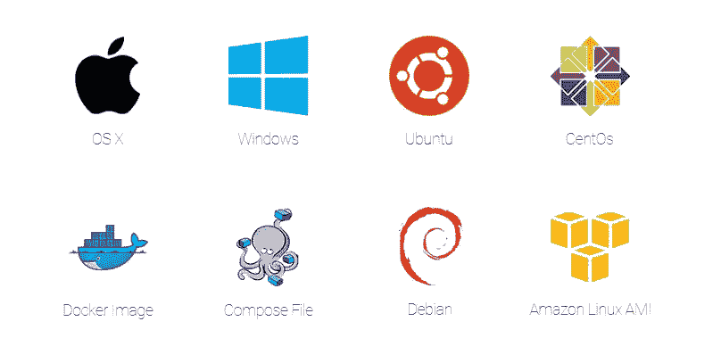

# Deepstream:构建实时应用的开源服务器

> 原文：<https://www.sitepoint.com/deepstream-an-open-source-server-for-building-realtime-apps/>


SitePoint 的开源周到了！整整一周我们都在发布专注于开源、自由软件和社区的文章，所以请继续查看 ***[OSW 标签](https://www.sitepoint.com/blog/)*** 获取最新更新。


埃尔顿，深溪的吉祥物

实时应用越来越受欢迎，但它们也很难构建。Wolfram Hempel 推出了 deepstream T1，这是一款开源服务器，他参与创建了该服务器，使数据同步、请求-响应和发布-订阅变得更加容易。

## 实时应用的兴起

实时正在吞噬世界！或者至少它吃得越来越多。无论是在谷歌文档中的协作编辑，通过脸书信使的聊天，移动中的金融交易，物联网控制，实时仪表盘还是多人游戏——用户越来越希望看到变化发生。

即使是传统的静态网站，如社交网络或论坛，也开始放弃刷新按钮，而是直接更新到你的订阅源。

尽管实时应用程序很受欢迎，但它们也很难构建。虽然对于较小的项目或 POC 来说，只需添加少量的 Socket.io 就可以引入实时特性，但是大规模的用例需要完全不同的架构。并发连接、故障转移、流数据一致性、持久性、加密和许可等概念都必须融入支持新一代应用的结构中。

我非常了解这一点的一个行业是投资银行业。为全球交易大厅无数闪烁的屏幕提供动力的服务器是巨大的庞然大物，既复杂又贵得惊人。但是他们速度很快。非常快。他们还做对了一件事:他们使用了一个叫做“数据同步”的概念。

## 实时概念

如果你已经建立了一个实时应用程序，你很可能已经使用了一种称为“发布-订阅”或简称“发布-订阅”的模式:订阅者监听一个频道上的事件，其他人发布这些事件。这是一种多对多通信的有效机制，由广泛的技术和服务支持，如开源方面的 [Socket.io](http://socket.io/) 或 [SocketCluster](http://socketcluster.io/#!/) ，或 PaaS 领域的 [Pusher](https://pusher.com/) 、 [PubNub](https://www.pubnub.com/) 或 [Ably](https://www.ably.io/) 。

但是有一个关键的东西是发布订阅无法提供的:状态。几乎每个应用程序都有一些状态——需要创建、读取、更新和删除的数据，但发布订阅只提供立即消失的一次性消息。一种常见的解决方法是使用事件作为更新通知，进而提示客户端通过传统的请求-响应来检索最新状态。但这很复杂，容易出现不一致，最重要的是，速度很慢。

这导致了数据同步的发展，数据同步是一种结合状态和实时更新的方法。数据是持久的，并且在连接的客户端和后端进程之间保持同步。

支持这一点的技术非常罕见。在开源方面，曾经有现在已经停产的[horizon . io](http://horizon.io/)；在 PaaS 领域，有[谷歌的 Firebase](https://firebase.google.com/) 。

为了填补这一空白，我们启动了 [deepstream.io](https://deepstream.io/) 。我们的目标是创建一个开源服务器，具有与金融交易或多人游戏系统相同的性能和多功能性，但以开放和可扩展的方式使其易于用于任何类型的应用程序。

## Deepstream.io

Deepstream 是一种新型的大规模处理实时数据的服务器。它的安装类似于数据库或 HTTP 服务器。最终用户和后端服务通过轻量级 SDK 连接到 it，这些 SDK 采用一系列不同的编程语言，如 JS/Node、Java/Android 或 Swift/ObjC。


它提供数据同步以及发布-订阅和经典请求-响应，并满足广泛的功能需求，如故障转移、许可、加密、一致性和冲突解决。

Deepstream 旨在开源生态系统中茁壮成长，并附带一系列用于流行数据库、缓存或消息总线的连接器。

但最重要的是:它是可扩展的，可靠的，非常快。

## 使用 Deepstream

所有这些听起来都很好，但是它实际上是如何工作的呢？让我们快速地触及要点。

### 装置

Deepstream 以 Mac 和 Windows 可执行文件、`yum`和`apt`包或 Docker 映像的形式出现，所有这些都可以在安装页面上找到。



### 配置

服务器的每个方面都可以在一个名为`config.yml`的文件中进行配置，这个文件在 Linux 上位于`/etc/deepstream/conf/`中，在 Windows 或 Mac 上位于`conf`目录中

### 启动服务器

通过在命令行上运行`deepstream start`或者双击可执行文件来启动服务器。

### 获取客户端 SDK

连接到 deepstream 需要给定编程语言的 SDK。例如，对于浏览器和节点，这可以通过`npm install deepstream.io-client-js`来安装。

### 连接到服务器

最简单的连接方式是调用`var client = deepstream('localhost:6020').login()`。这一行还有更多的内容要添加，比如传递客户端选项、身份验证参数或者在登录后等待回调，但是我们就到此为止吧。

### 使用数据同步

Deepstream 的数据同步使用了一个称为“记录”的概念——可以被操纵和观察的 JSON 文档，可以在所有连接的客户端之间同步，也可以在后端持久化。这听起来比实际更复杂。记录由唯一的名称标识，并动态创建或加载:

```
pizzaGuy = ds.record.getRecord( 'driver/14' ) 
```

记录的值可以这样设置:

```
pizzaGuy.set({
  name: 'John Doe',
  position: { x: 4234, y: 2454 },
  speed: 22
}) 
```

…或者部分，就像这样:

```
pizzaGuy.set( 'position.x', 4244 ) 
```

类似地，其他客户端可以订阅对整个记录的更改:

```
pizzaGuy.subscribe(( data )=>{
  //...
}) 
```

…或其中的路径:

```
pizzaGuy.subscribe( 'position', updateMapMarker ) 
```

### 使用事件

事件是 deepstream 的发布-订阅机制。它们提供短暂的多对多消息传递。每个客户端都可以订阅一个事件:

```
ds.event.subscribe( 'something-happened', data => {}) 
```

…或发出它:

```
ds.event.emit( 'something-happened', { size: 'big' }) 
```

### 使用 RPC

远程过程调用是 deepstream 的请求-响应通信机制。Deepstream 在提供者和请求者之间路由请求，管理故障转移、重试和数据序列化。

进程可以将自己注册为 RPC 提供程序:

```
ds.rpc.provide( 'add-two', input, ( response ) => {
  response.send( input + 2 )
}) 
```

…并要求他们:

```
ds.rpc.make( 'add-two', 5, ( err, result ) => { /* result = 7 */}) 
```

### 认证和许可

Deepstream 提供了一系列不同的策略来验证传入的连接，例如通过配置文件或 [http-webhooks](https://deepstream.io/tutorials/core/auth/http-webhook/) 。每个传入的请求都使用一种叫做 [Valve](https://deepstream.io/tutorials/core/permission/valve-introduction/) 的实时许可语言进行认证。

```
record:
  #an auctioned item
  auction/item/$sellerId/$itemId:

    #everyone can see the item and its price
    read: true

    #only users with canBid flag in their authData can bid
    #and bids can only be higher than the current price
    write: "user.data.canBid && data.price > oldData.price"

    #only the seller can delete the item
    delete: "user.id == $sellerId" 
```

### 添加连接器

使用连接器很容易将数据库 [Mongo](https://deepstream.io/tutorials/plugins/database/mongodb/) 、 [Rethink](https://deepstream.io/tutorials/plugins/database/rethinkdb/) 或 [Postgres](https://deepstream.io/tutorials/plugins/database/postgres/) 、缓存 [Redis](https://deepstream.io/tutorials/plugins/cache/redis/) 、 [Memcached](https://deepstream.io/tutorials/plugins/cache/memcached/) 或 [Hazelcast](https://deepstream.io/tutorials/plugins/cache/hazelcast/) 或消息系统(如 RabbitMQ 或 Kafka)添加到 deepstream。所有连接器都是通过命令行安装的，例如，通过运行以下命令:

```
deepstream install cache redis 
```

## 把所有的放在一起

总而言之，deepstream 是一个通用的、可扩展的、高性能的实时服务器，可以用作从 CRUD 应用程序到要求苛刻的消息应用程序、实时仪表板甚至多人游戏的后端。它健壮、安全，并提供了在生产中运行大规模实时应用程序所需的所有功能。

## 分享这篇文章