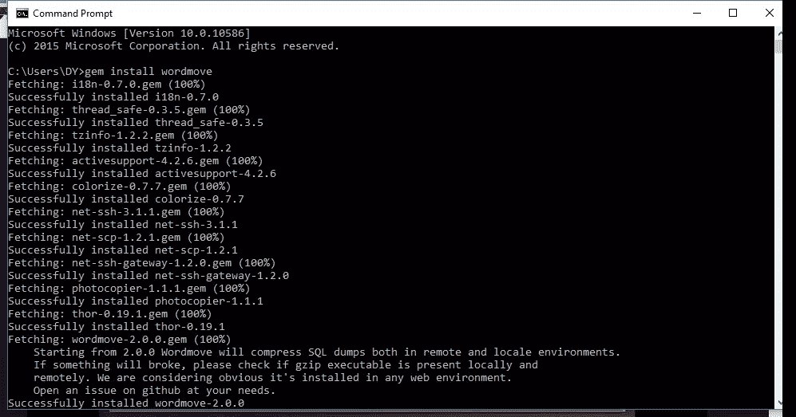

# WordPress 部署工具 Wordmove 简介

> 原文：<https://www.sitepoint.com/wordmove-wordpress-deployment-tool/>

作为一个 PHP 应用程序，WordPress 通常使用一种更老的方法来部署:通过 FTP 上传文件。这可能是有压力的和耗时的，尤其是当需要部署一个重型 WordPress 项目的时候。

有不少工具像:[詹金斯](http://jenkins.io)、[豆茎](http://beanstalkapp.com)、[部署](https://deployhq.com)；它承诺通过自动化的方法实现一个没有痛苦的 WordPress 部署。然而，在本文中，我将向您介绍一个强大的 Ruby 包——Wordmove，它提供了一个非常快速简单的自动化 WordPress 网站部署。


## 那么，什么是 Wordmove 呢？

Wordmove 是一个小小的 Ruby gem，它让我们可以自动地将本地 WordPress 安装和数据库数据来回镜像，从本地开发机器到远程登台服务器。

我们可以简单地把 Wordmove 看作是 WordPress 的一个 Capistrano，拥有完整的推拉功能。或者，如果我们非常熟悉 GitHub，我们可以把 Wordmove 看作 Git，我们的远程 WordPress 充当我们的 GitHub repo，我们的本地 WordPress 安装作为我们的 repo 的本地克隆分支。

Wordmove 完全支持 OS X 和 Linux 操作系统，也支持 SSH 连接，而 FTP[计划在未来开发的某个时候](https://github.com/welaika/wordmove/wiki/FTP-support-disclaimer)停止使用。

## Wordmove 的好处

*   **将本地 WordPress 部署到实时站点:** Wordmove 提供了一种自动化的简单方法来将我们的 WordPress 站点部署到生产服务器上。我们不必经历耗时的手动过程，一个简单的命令:`wordmove push --all`就可以完成所有工作。

*   **推和拉功能:** Wordmove 使我们能够将新的变更推送到生产服务器，也可以从生产服务器拉新的变更，如更新的数据库。当手动备份 WordPress 文件和数据库时，Wordmove 可以让这个过程变得更快。

*   **能够指定只推/拉什么:** Wordmove 知道我们不会一直对推**所有的** WordPress 文件感兴趣，所以它提供了一个选项来指定推什么——数据库、插件、主题或只上传媒体文件。

*   **一次处理多个环境:**如果我们有准备站点、生产站点等，它还允许我们一次处理多个环境。参见这篇维基文章[多重环境解释](https://github.com/welaika/wordmove/wiki/Multiple-environments-explained)其中有你需要知道的东西。

*   **超级快:**用 Wordmove 推送和拉取 WordPress 文件，速度惊人，简单易行。这是因为 Wordmove 使用 rsync，这使得文件复制速度非常快，大约是 FTP 的 5-10 倍。

## 安装 Wordmove

对于 Windows 用户来说，安装 Wordmove 相当容易。在安装 Wordmove 之前，必须先在机器上安装 Ruby。与 Linux 和其他一些操作系统相比，Windows 没有预装 Ruby。安装完成后，我们可以在终端或命令提示符下运行这个命令。

`gem install wordmove`



值得注意的是，Wordmove 没有对 Windows 提供任何官方支持，请参见这里的 [windows(不)支持免责声明](https://github.com/welaika/wordmove/wiki/Windows-%28un%29support-disclaimer)；不过不代表 Wordmove 在 Windows 上就不行(我个人在 Windows 上用 Wordmove)。只是 Wordmove 开发人员不能帮助解决有关 Windows 环境的问题，以防我们有任何问题。

## 使用

```
 wordmove help

      Tasks:

        wordmove help [TASK] # Describe available tasks for one or more specific task
        wordmove init        # Generate  a brand new Movefile
        wordmove pull        # Pulls WordPress data from remote host to the local machine
        wordmove push        # Pushes WordPress data from local machine to remote host 
```

## Movefile

Wordmove 需要一个**Movefile**——一个包含所有本地和远程主机信息的 YAML 文件，它只是作为一个配置文件，在任何推送或拉取操作完成之前，请参见示例[。要创建 Movefile，请转到 WordPress 根目录中的(命令行中的 cd ),然后复制以下内容:](https://github.com/welaika/wordmove)

`wordmove init`

这个命令在我们的 WordPress 根目录中生成一个新的 Movefile，我们用任何文本编辑器打开它，并用我们的设置编辑它。请参见这篇 wiki 文章[Movefile Configuration Explained](https://github.com/welaika/wordmove/wiki/Movefile-configurations-explained)以了解有关支持的配置的更多信息，并对 Movefile 有更深入的了解。

## 将所有 WordPress 安装推送到远程服务器

Wordmove 允许我们通过在终端或命令提示符下简单地运行一行命令，将所有的 WordPress 安装推送到我们的远程服务器上，没有任何压力。

`wordmove push --all`

这不是很好吗？在运行这个简单的命令之后，所有的 WordPress 安装将被转移到我们的生产站点。当只推送新文件或修改过的文件时，我们使用相同的命令，因为 Wordmove 会检查文件差异，只推送编辑过的或新的文件；所以不必担心重复的文件被推送。

### 从远程拉动

Wordmove 还允许我们轻松地将一些文件从远程服务器拖到本地服务器。我们可以简单地运行一个 pull 命令，并附加一个选项来选择要拉的内容，例如，假设我们想要拉一个更新的数据库和新的上传，我们运行:

`wordmove pull -dbu`

其中`dbu`代表`database and uploads`。参见[用法和标志说明](https://github.com/welaika/wordmove/wiki/Usage-and-flags-explained)获取可用标志及其说明的综合列表。

### 推送特定文件夹

Wordmove 知道我们不会一直推送所有的 WordPress 文件，所以它提供了一个选项来指定一组要推送的文件；比如我们的插件文件、主题或者上传。假设我们修改了我们的主题，我们可以通过运行以下命令将更改提交到我们的远程服务器:

`wordmove push -t`

其中`-t`代表**主题**，`-u`代表**上传**，`p`代表**插件**，`d`代表**数据库**，这取决于我们正在推送的内容。

## 结论

每当我们开始部署我们的 WordPress 项目时，自动化部署节省了我们做重复性工作的时间。它还有助于最大限度地减少部署期间的停机时间，并消除常见的人为错误，如丢失文件或上传错误的文件。

在这篇文章中，我向您介绍了 Wordmove，这是一个强大的 WordPress 部署工具，它有助于确保一个简单和超级快速的 WordPress 部署。我已经概述了它的优点，并演示了如何使用它执行基本的推拉操作。

如果你尝试过 Wordmove，请在下面的评论区与我们分享你的经验或观点。

## 分享这篇文章