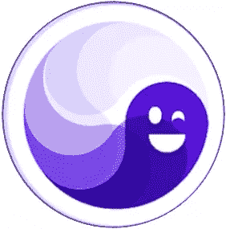

# 2016 年 11 月浏览器趋势:失败者的崛起

> 原文：<https://www.sitepoint.com/browser-trends-november-2016-rise-underdog/>

10 月，我们讨论了 [Edge 难以获得发展势头](https://www.sitepoint.com/browser-trends-october-2016-microsoft-edges-downward/)的原因。11 月的 [StatCounter 浏览器统计](https://gs.statcounter.com/#browser-ww-monthly-201511-201610)对微软旗舰浏览器更有利吗？…

## 2016 年 9 月至 10 月全球台式机和平板电脑浏览器统计

下表显示了过去一个月中浏览器的使用情况。

| 浏览器 | 九月 | 十月 | 变化 | 亲戚 |
| 铬 | 58.89% | 59.39% | +0.50% | +0.80% |
| 火狐浏览器 | 13.66% | 13.28% | -0.38% | -2.80% |
| IE11 | 7.68% | 6.95% | -0.73% | -9.50% |
| 老人 | 2.13% | 1.94% | -0.19% | -8.90% |
| 边缘 | 2.78% | 2.82% | +0.04% | +1.40% |
| 旅行队 | 4.30% | 4.79% | +0.49% | +11.40% |
| iPad 野生动物园 | 5.30% | 5.42% | +0.12% | +2.30% |
| 歌剧 | 1.72% | 1.91% | +0.19% | +11.00% |
| 其他人 | 3.54% | 3.50% | -0.04% | -1.10% |

## 2015 年 10 月至 2016 年 10 月全球台式机和平板电脑浏览器统计

下表显示了过去 12 个月中浏览器的使用情况:

| 浏览器 | 2015 年十月 | 2016 年 10 月 | 变化 | 亲戚 |
| 铬 | 53.78% | 59.39% | +5.61% | +10.40% |
| 火狐浏览器 | 15.52% | 13.28% | -2.24% | -14.40% |
| IE11 | 10.00% | 6.95% | -3.05% | -30.50% |
| 老人 | 5.28% | 1.94% | -3.34% | -63.30% |
| 边缘 | 1.10% | 2.82% | +1.72% | +156.40% |
| 旅行队 | 9.12% | 10.21% | +1.09% | +12.00% |
| 歌剧 | 1.78% | 1.91% | +0.13% | +7.30% |
| 其他人 | 3.42% | 3.50% | +0.08% | +2.30% |

(这些表格显示了桌面浏览器的市场份额估计值。“变化”栏是市场份额的绝对增加或减少。“相对”栏显示比例变化，即上个月有 9.5%的老年用户迁移到其他地方。有几个警告，所以我建议你阅读[如何计算浏览器市场份额](https://www.sitepoint.com/how-browser-market-share-is-calculated)和[StatCounter vs net Market Share](https://www.sitepoint.com/browser-trends-october-2016-microsoft-edges-downward/)。)

Chrome 以 Firefox 和 IE 为代价继续上升，但对于处于劣势的浏览器来说，这也是一个好月份:

*   边缘增大。诚然，差得不多，但至少方向是正确的。
*   歌剧经历了几年来的最高点。与 Chrome 相比，这款浏览器越来越令人印象深刻，速度也越来越快，尽管使用了相同的 Blink 渲染引擎。
*   Safari 度过了最好的一个月，尽管开发社区一直对苹果对网络的黯淡态度耿耿于怀。这可能是在新的操作系统和设备发布后实现的，但[移动图表](#mobile)没有记录类似的收益？

虽然很容易认为只有五种主要的浏览器，但实际情况要复杂得多。超过三十分之一的网络用户与“其他人”一起上网。自 2014 年初以来，替代应用一直在稳步增长，并可能在特定国家或市场产生强大影响。这里有一个新的和现有的选择名单，你可能会考虑。

### [幽灵](https://ghostbrowser.com/)

 Ghost 是一款新的基于 Blink 的浏览器，它有一个独特的卖点:*多会话浏览*。该应用程序允许您设置彩色标签组，这些标签组有自己的一组私有 cookies。这允许您在同一个浏览器窗口中使用多个帐户登录单个网站。该选项对开发人员尤其有用。

Ghost 仍处于测试阶段，但您可以注册一个邀请。

### [分钟](https://minbrowser.github.io/min/)

如果你认为浏览器提供了太多的垃圾，闵将网络剥离回绝对的基础。功能包括标签管理，广告拦截和其他功能。目前可用于 MacOS 和 Ubuntu，Min 是一个用 HTML、CSS 和 JavaScript 开发的[电子应用程序](http://electron.atom.io/)。

### [项目漩涡](http://project-maelstrom.bittorrent.com/)

谦虚地命名为*“网络的未来就在这里”*，Maelstrom 项目呈现标准的 HTTP 服务页面以及打包成种子的页面。然后，可以从多个对等点下载文件，而不是从一台服务器下载，这增加了网络带宽和可靠性。基于 Blink 的测试版浏览器可以在今天下载。

### [UC 浏览器](http://www.ucweb.com/ucbrowser/)

UC 浏览器已经超过 iPhone，成为移动排行榜上的第二名，但可用于一系列桌面、平板电脑、智能手机和功能手机设备。该应用程序由中国阿里巴巴集团所有(介于亚马逊和易贝之间，但比两者都大得多)。它使用自己的 U3 渲染引擎。

其他受欢迎的中国应用包括[奇虎 360 安全](http://se.360.cn/)、[搜狗浏览器](https://www.sogou.com/)和 [QQ 浏览器](http://browser.qq.com/)。

### [傲游](http://www.maxthon.com/)

傲游可能是唯一一款获得西方青睐的中文浏览器，它同时提供了 Trident (IE)和 WebKit 渲染引擎。这在本世纪早期很有用，当时许多网站都是“在 IE 浏览器中最佳浏览”。

### [月景](http://www.lunascape.tv/)

如果两个渲染引擎还不够，Lunascape 在一个浏览器中提供了三个引擎:Trident、Gecko 和 WebKit。开发人员可以在三向层叠视图中查看同一页面，以确保像素级完美对齐。该应用程序可用于 Windows 和 Android，Mac OS 即将推出。还有一个 iOS 版本，但由于苹果的限制，它是 Safari 的克隆版。

### [苍月浏览器](https://www.palemoon.org/)

苍白的月亮是 Firefox 的开源浏览器分支，使用自己的 Goanna 渲染引擎。它适用于 Windows、Linux 和 Android (MacOS 正在开发中)。浏览器将继续支持 XUL 和 XPCOM 插件，尽管 Mozilla 对这些技术有着未来的打算。

### t 0】 yandex 【t 1 号

Yandex 是第一个出现在 StatCounter 数字中的替代浏览器。免费的桌面、平板和智能手机 Blink 浏览器由俄罗斯网络搜索公司 Yandex 提供。尽管来自谷歌的强大竞争，该应用程序目前占据了俄罗斯市场 9%的份额。

### [Coc Coc](https://coccoc.com/)

另一个基于 Blink 的选项 Coc Coc 面向越南市场，但也提供英语翻译。该浏览器是越南第二大最受欢迎的浏览器，拥有 24%的市场份额。

你喜欢更主流一点的吗？为什么不考虑一下 [Blisk 开发浏览器](https://www.sitepoint.com/blisk-your-next-web-development-browser/)或者看看[Chrome 的竞争对手是如何竞争的？](https://www.sitepoint.com/browser-trends-august-2016-how-do-chromes-rivals-stack-up/)

## 2016 年 10 月全球移动浏览器统计

10 月份，手机浏览器的使用大幅增长了 1.66%。它现在占所有网络活动的 48.84%。长期承诺的[移动/桌面平价](https://gs.statcounter.com/#desktop+mobile-comparison-ww-monthly-201311-201610)可能很快就会实现。

本月最受欢迎的移动浏览应用是:

| 移动浏览器 | 九月 | 十月 | 变化 | 亲戚 |
| 铬 | 39.09% | 40.64% | +1.55% | +4.00% |
| UC 浏览器 | 17.04% | 17.90% | +0.86% | +5.00% |
| 苹果手机 | 17.90% | 16.69% | -1.21% | -6.80% |
| Opera Mini/Mobile | 9.77% | 8.64% | -1.13% | -11.60% |
| 三星互联网 | 6.86% | 6.52% | -0.34% | -5.00% |
| 机器人 | 6.33% | 5.83% | -0.50% | -7.90% |
| 不变的 | 1.26% | 1.13% | -0.13% | -10.30% |
| 其他人 | 1.75% | 2.65% | +0.90% | +51.40% |

Chrome 继续快速增长，但主要新闻是 UC 浏览器取代了 iPhone 的第二名位置。加州大学以前也有过这种情况，但其五个月的任期于 2016 年 5 月结束。奇怪的是，与 iPad 和 Mac OS 上 Safari 的增长相比，iPhone 下降了很多？也许情况会在下个月稳定下来。

## 分享这篇文章