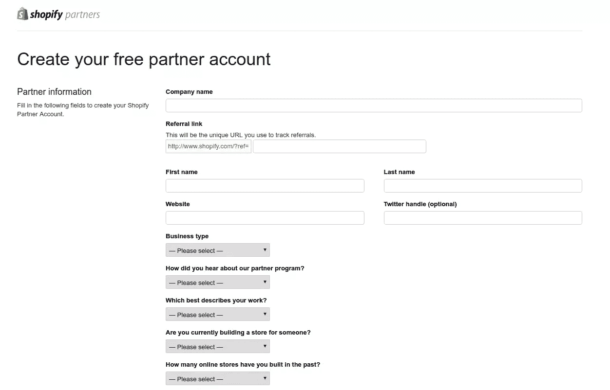
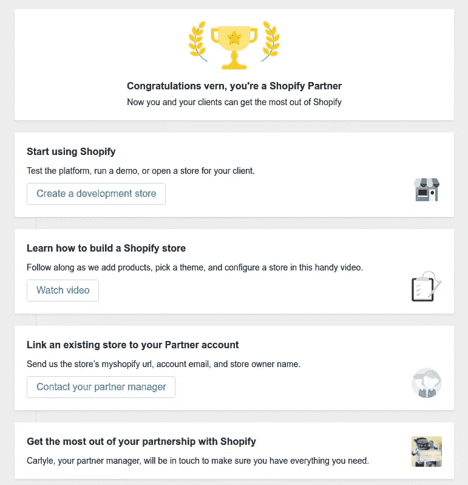
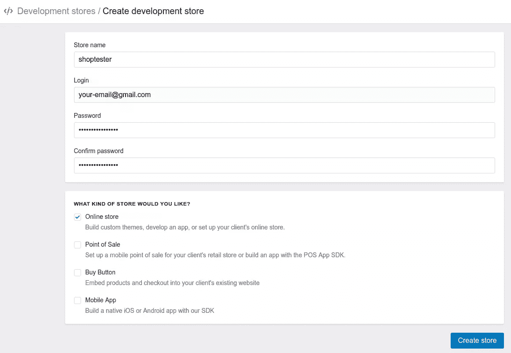
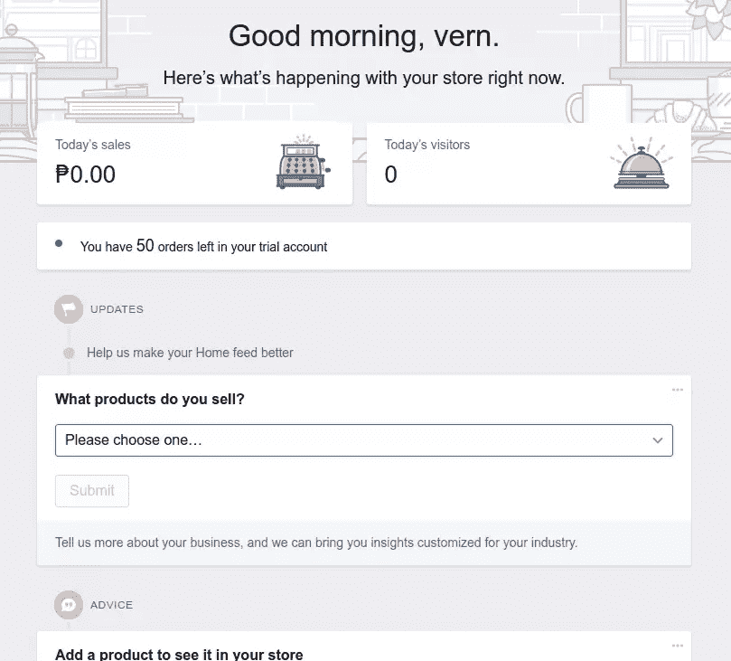
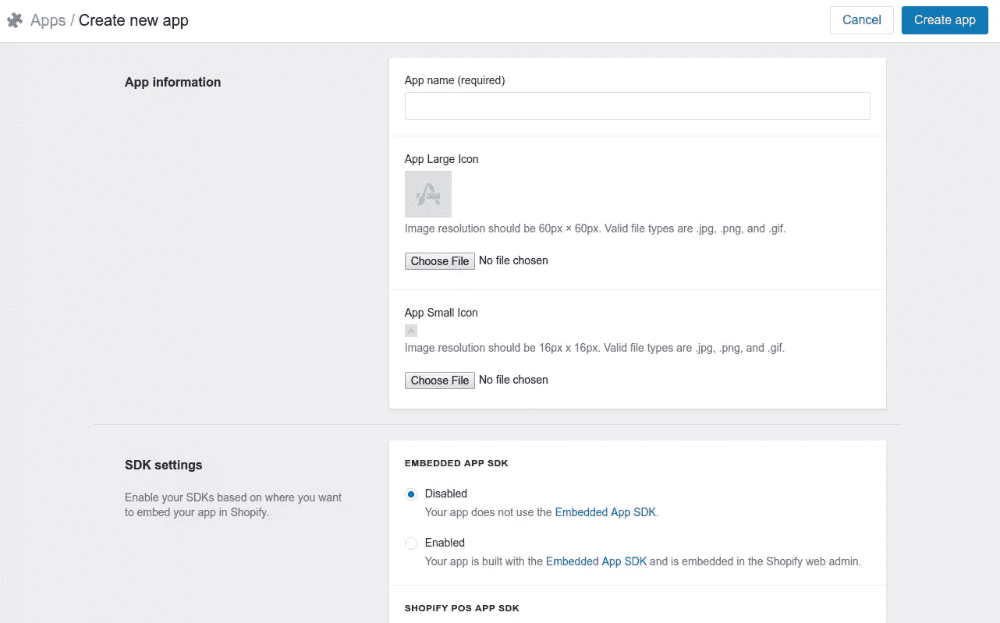
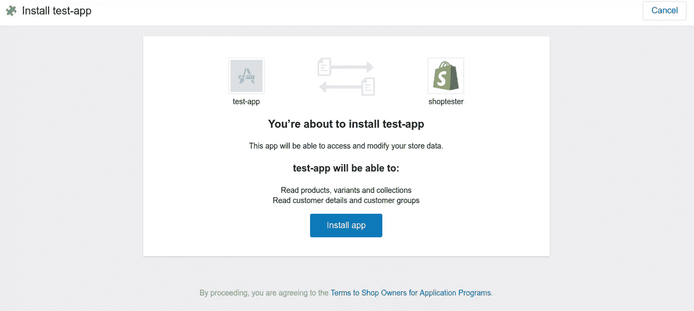

# 通过 HTTP APIs 和 Guzzle 简化 Shopify 应用程序开发

> 原文：<https://www.sitepoint.com/shopify-app-development-made-simple/>

*这篇文章由[德姬·阿卡拉](https://www.sitepoint.com/author/dakala/)进行了同行评审。感谢 SitePoint 的所有同行评审员使 SitePoint 的内容尽可能做到最好！*

在本教程中，您将开始开发 [Shopify](https://shopify.com) 应用程序。您将创建一个简单的应用程序，列出来自 Shopify 商店的产品。该应用的完整源代码可在 [Github](https://github.com/sitepoint-editors/shopify-tester) 上获得。


## 什么是 Shopify 应用？

Shopify 应用程序是一种扩展 Shopify 商店功能的方式，或者为网站或移动应用程序提供电子商务功能。以下是实现这一点的方法列表:

*   [HTTP API](https://help.shopify.com/api/reference)–让 web 应用程序能够在 Shopify 商店中执行不同的操作。比如添加客户、获取产品列表或监听不同的事件。这是通过[网钩](https://help.shopify.com/api/reference/webhook/)完成的。
*   [JavaScript Buy SDK](https://help.shopify.com/api/sdks/js-buy-sdk)——允许你从网站或混合移动应用程序(如用 [Cordova](https://cordova.apache.org/) 构建的应用程序)获取产品信息，将商品添加到购物车，并结账。
*   [嵌入式应用 SDK](https://help.shopify.com/api/sdks/embedded-app-sdk/)–允许您将 web 应用直接嵌入到 Shopify 管理界面中。这对于有管理设置页面的应用程序很有用。用户不必在单独的网站上访问它，web 应用程序将作为 iframe 加载。
*   [iOS 和 Android Buy](https://help.shopify.com/api/sdks/embedded-app-sdk/)–用于将 Shopify checkout 集成到您的 iOS 或 Android 应用程序中。
*   [Shopify POS App SDK](https://help.shopify.com/api/sdks/shopify-pos-app-sdk/)–允许您将您的网络应用直接嵌入到 [Shopify POS](https://www.shopify.com/blog/8814755-introducing-shopify-pos) 中。

在本教程中，您将学习 HTTP API。

## 注册一个 Shopify 合作伙伴帐户

你需要做的第一件事是[注册一个 Shopify 合作伙伴账户](https://app.shopify.com/services/partners/signup)。这允许您创建一个开发商店来测试 Shopify 应用程序。您将被要求填写一张表格，内容包括公司名称、业务类型、电子邮件地址、网站、密码和其他相关信息。



如果您提供的所有信息都有效，您将看到以下页面:



## 创建开发商店

下一步是创建一个类似 Shopify 商店的开发商店。你可以添加产品，存储主题的 HTML 和 CSS 代码，并通过一个虚假的支付网关测试购买。唯一的限制是，你不能在开发商店中添加自定义域或向客户收费。

点击**创建开发商店**按钮，您将被重定向至以下页面:



添加商店名称、登录商店的密码(您的 Shopify 合作伙伴电子邮件地址是登录电子邮件)以及要创建的商店类型。暂时坚持开网店。这使您能够构建自定义主题、开发应用程序或设置客户的在线商店。填写完表格后，点击**创建商店**按钮创建开发商店。

## 设置开发商店

创建开发商店后，您可以单击成功警告消息中的**登录**链接来登录商店。登录后，您将看到以下页面:



您可以从选择产品类别开始。我为自己选择了**电子产品&小玩意**。

接下来，您可以向商店添加产品和客户。您可以通过点击侧菜单中的**产品**或**客户**链接来完成此操作。一旦您开始使用 Shopify API，添加这些细节将为您提供一些数据。

设置开发商店的最后一步是启动它。如果你还没有注意到，Shopify 不会立即向世界其他地方开放你的商店。如果你去`https://{your-storename}.myshopify.com`你会看到一个即将开放的页面。你可以通过点击管理页面侧边菜单中的**在线商店**链接来解决这个问题。然后，点击**选择免费主题**按钮，显示您可以使用的免费主题。从显示的列表中选择一个主题，然后单击**发布主题**按钮为您的商店使用该主题。

## 创建应用程序

现在，您可以创建一个新的 Shopify 应用程序了。前往 Shopify 合作伙伴网站，在侧边菜单中，点击**应用**，然后点击**创建新应用**按钮。这将向您显示以下界面:



输入应用程序名称、应用程序 URL 和重定向 URL。应用程序 URL 和重定向 URL 可以是本地主机路径。这里有一个例子:

```
http://localhost/shopify-tester
http://localhost/shopify-tester/login 
```

您可以保留所有其他字段的默认值，因为在本教程中您不会真正接触到这些内容。如果您对嵌入式应用程序 SDK 和 Shopify POS 应用程序 SDK 有疑问，您可以禁用它们，因为您将只使用 HTTP API。

一旦应用程序被创建，它应该向您显示应用仪表板，其中显示的 API 密钥和秘密。记下这些，因为您稍后在发出 API 请求时会用到它们。

## 认证用户

既然您已经创建了一个应用程序和一个要测试的开发商店，那么是时候对用户进行身份验证了，以便他们可以使用您的应用程序。您可能会想，如果我拥有开发商店和应用程序，为什么我需要进行身份验证？开发商店代表任何 Shopify 用户拥有的真实商店。这意味着他们将无法访问您的应用程序，除非他们安装了该应用程序。为了安装它，他们必须首先通过 OAuth 授权过程。这与脸书或谷歌等网站安装第三方应用程序时的授权过程非常相似。

授权过程的第一步是让用户安装应用程序。应用可以在 [Shopify 应用商店](https://apps.shopify.com/)上找到。只有在 Shopify 批准后，您才能让您的应用程序上市。您可以点击应用程序页面上的**编辑应用程序商店列表**按钮提交您的应用程序以获得批准。在本教程中，您不会真的经历这些，所以您将在浏览器中直接访问安装 URL。以下是已经在 app store 中列出的应用程序的实际授权流程:

1.  用户从 app store 安装应用程序。
2.  用户被重定向到应用程序安装页面。这是 app 里的一个页面，说明是你管理的。该页面要求输入商店的名称(例如 test-shop.myshopify.com)。
3.  用户点击**安装**。
4.  该应用程序生成一个唯一的字符串，并将其与商店名称一起保存在数据库中。
5.  该应用程序构建 Shopify 应用程序授权 URL，并将用户重定向到该 URL。在这个页面上，用户可以看到应用程序的名称和它要求的权限列表。从那里，用户可以点击**安装应用**按钮。
6.  Shopify 会将用户重定向到您在应用程序设置中指定的重定向 URL。访问代码、hmac、状态和时间戳作为查询参数传递给重定向 URL。
7.  应用程序验证请求是否有效。
8.  如果请求有效，应用程序将从 Shopify API 请求永久访问令牌。
9.  将访问令牌和其他重要细节保存到应用程序数据库中。

## 演示应用程序

我们现在将继续浏览每个步骤，只有步骤 1 将被替换为直接在浏览器中访问安装页面。此页面负责初始化应用程序安装请求。

### 安装依赖项

```
composer require twig/twig guzzlehttp/guzzle nesbot/carbon vlucas/phpdotenv ircmaxell/random-lib 
```

### 安装页面

创建一个`install.php`文件并添加以下代码:

```
<?php
require 'vendor/autoload.php';

$dotenv = new Dotenv\Dotenv(__DIR__);
$dotenv->load();

$db = new Mysqli(getenv('MYSQL_HOST'), getenv('MYSQL_USER'), getenv('MYSQL_PASS'), getenv('MYSQL_DB')); 

if (!empty($_POST)) {

    $store = $_POST['store'];

    $factory = new RandomLib\Factory;
    $generator = $factory->getMediumStrengthGenerator();
    $nonce = $generator->generateString(20);

    $api_key = getenv('SHOPIFY_APIKEY');
    $scopes = getenv('SHOPIFY_SCOPES');
    $redirect_uri = urlencode(getenv('SHOPIFY_REDIRECT_URI'));

    if ($query = $db->prepare('INSERT INTO installs SET store = ?, nonce = ?, access_token = ""')) {
        $query->bind_param('ss', $store, $nonce);
        $query->execute();
        $query->close();
        $url = "https://{$store}/admin/oauth/authorize?client_id={$api_key}&scope={$scopes}&redirect_uri={$redirect_uri}&state={$nonce}";
        header("Location: {$url}");
    }

} else {
    $loader = new Twig_Loader_Filesystem('templates');
    $twig = new Twig_Environment($loader, [
        'cache' => 'cache',
        'debug' => true
    ]);

    $template = $twig->loadTemplate('install.html');
    echo $template->render([]);
} 
```

分解上面的代码，我们首先连接到 MySQL 数据库。您可以在 [Github repo](https://github.com/sitepoint-editors/shopify-tester/blob/master/db/shopifytester-database.sql) 中找到该模式。

```
$db = new Mysqli(getenv('MYSQL_HOST'), getenv('MYSQL_USER'), getenv('MYSQL_PASS'), getenv('MYSQL_DB')); 
```

这使用 [phpdotenv](https://github.com/vlucas/phpdotenv) 从工作目录根目录下的`.env`文件加载配置。`.env`文件包含以下内容:

```
MYSQL_HOST=localhost
MYSQL_DB=shopifytester
MYSQL_USER=YOUR_DB_USER
MYSQL_PASS=YOUR_DB_PASSWORD
SHOPIFY_APIKEY="YOUR SHOPIFY APP API KEY"
SHOPIFY_SECRET="YOUR SHOPIFY APP SECRET"
SHOPIFY_SCOPES="read_products,read_customers"
SHOPIFY_REDIRECT_URI="http://localhost/shopify-tester/login.php" 
```

继续用您自己的值替换占位符值。如果您使用不同的重定向 URL，也可以替换`SHOPIFY_REDIRECT_URI`。

接下来，检查用户是否提交了表单。如果没有，返回安装页面:

```
if (!empty($_POST)) {
    ...
} else {
    $loader = new Twig_Loader_Filesystem('templates');
    $twig = new Twig_Environment($loader, [
        'cache' => 'cache',
        'debug' => true
    ]);

    $template = $twig->loadTemplate('install.html');
    echo $template->render([]);
} 
```

安装页面位于`templates/install.html`，包含以下内容:

```
<!DOCTYPE html>
<html lang="en">
<head>
    <meta charset="UTF-8">
    <title>Install</title>
    <link rel="stylesheet" href="https://cdnjs.cloudflare.com/ajax/libs/picnic/6.1.1/picnic.min.css">
    <link rel="stylesheet" href="https://cdnjs.cloudflare.com/ajax/libs/picnic/6.1.1/plugins.min.css">
    <link rel="stylesheet" href="css/style.css">
</head>
<body>

    <nav>
      <a href="#" class="brand">
        <span>Shopify App</span>
      </a>
    </nav>

    <main>
        <form method="POST">
            <fieldset class="flex one">
              <label>
                Store Name
                <input type="text" name="store" placeholder="e.g. test-shop.myshopify.com">
              </label>
            </fieldset>
            <button>Install</button>
        </form>
    </main>

</body>
</html> 
```

如您所见，这是一个非常标准的 HTML 页面，带有一个要求输入商店名称的表单。

[野餐. css](http://picnicss.com/) 用于美化页面，但也有`css/style.css`文件用于添加主要内容的样式:

```
main {
    width: 500px;
    margin: 0 auto;
    padding-top: 150px;
} 
```

回到`install.php`文件，下面是表单提交后执行的代码。首先，它生成一个随机字符串。如果授权请求有效，这将在以后用作附加检查:

```
$factory = new RandomLib\Factory;
$generator = $factory->getMediumStrengthGenerator();
$nonce = $generator->generateString(20); 
```

将商店名称和随机字符串插入数据库，然后将用户重定向到 Shopify 授权页面:

```
$api_key = getenv('SHOPIFY_APIKEY');
$scopes = getenv('SHOPIFY_SCOPES');
$redirect_uri = urlencode(getenv('SHOPIFY_REDIRECT_URI'));

if ($query = $db->prepare('INSERT INTO installs SET store = ?, nonce = ?, access_token = ""')) {
    $query->bind_param('ss', $store, $nonce);
    $query->execute();
    $query->close();
    $url = "https://{$store}/admin/oauth/authorize?client_id={$api_key}&scope={$scopes}&redirect_uri={$redirect_uri}&state={$nonce}";
    header("Location: {$url}");
} 
```

授权页面 URL 需要`store`、`client_id`、`scope`、`redirect_uri`和`state`。`store`是 Shopify 商店的名称(例如 test-shop.myshopify.com)，`client_id`是您的应用程序的 API 密钥，`redirect_uri`是您提供给应用程序设置的重定向 URL。

如果您决定使用不同的重定向 URL，您可以随时更新应用程序设置以反映这些更改。`scope`是您希望应用程序能够访问的数据。这是您可以提供的示波器的[列表。在本教程中，你将只使用`read_products`和`read_customers`示波器。每个作用域可以用逗号分隔，比如:`read_products,read_customers`。最后，`state`是您生成的随机字符串。](https://help.shopify.com/api/guides/authentication/oauth#scopes)

一旦替换了这些值，授权 URL 应该如下所示:

```
https://yourshopifystore.myshopify.com/admin/oauth/authorize?client_id=your_api_key&scope=read_products,read_customers&redirect_uri=http://localhost/shopify-tester/login.php&state=your_unique_key 
```

用户被重定向到该 URL，他们将看到以下屏幕:



用户可以验证页面是否显示了正确的应用程序名称和您要求的范围。如果正确，用户可以点击**安装应用**按钮安装应用。

在那里，Shopify 生成访问码和 HMAC(键控散列消息认证码)。这些将与`shop`、`timestamp`和`state`一起传递到您的重定向 URL。在应用程序中，您可以使用这些信息来验证请求是否有效。

### 授权页面

一旦 Shopify 重定向到重定向 URL，您负责验证请求是否有效。如果有效，则请求访问令牌。在工作目录的根目录下创建一个`auth.php`文件，并添加以下代码:

```
<?php
require 'vendor/autoload.php';

use Carbon\Carbon;
use GuzzleHttp\Client;

$dotenv = new Dotenv\Dotenv(__DIR__);
$dotenv->load();

$db = new Mysqli(getenv('MYSQL_HOST'), getenv('MYSQL_USER'), getenv('MYSQL_PASS'), getenv('MYSQL_DB')); 

$api_key = getenv('SHOPIFY_APIKEY');
$secret_key = getenv('SHOPIFY_SECRET');

$query = $_GET; 
if (!isset($query['code'], $query['hmac'], $query['shop'], $query['state'], $query['timestamp'])) {
    exit; //or redirect to an error page
}

$one_minute_ago = Carbon::now()->subSeconds(60)->timestamp;
if ($query['timestamp'] < $one_minute_ago) {
    exit; //or redirect to an error page
}

$hmac = $query['hmac'];
$store = $query['shop'];
unset($query['hmac']);

foreach ($query as $key => $val) {
    $params[] = "$key=$val";
} 

asort($params);
$params = implode('&', $params);

$calculated_hmac = hash_hmac('sha256', $params, $secret_key);
if($hmac == $calculated_hmac){

    $client = new Client();

    $response = $client->request(
        'POST', 
        "https://{$store}/admin/oauth/access_token",
        [
            'form_params' => [
                'client_id' => $api_key,
                'client_secret' => $secret_key,
                'code' => $query['code']
            ]
        ]
    );

    $data = json_decode($response->getBody()->getContents(), true);
    $access_token = $data['access_token'];

    $nonce = $query['state'];

    if ($select = $db->prepare("SELECT id FROM installs WHERE store = ? AND nonce = ?")) {

        $select->bind_param('ss', $store, $nonce);
        $select->execute();
        $select->bind_result($id);
        $select->fetch();
        $select->close();

        if ($id > 0) {
            $db->query("UPDATE installs SET access_token = '$access_token' WHERE id = '$id'");
        }
    }

} 
```

分解上面的代码，首先检查您期望的所有参数是否都在 URL 中传递:

```
$query = $_GET; 
if (!isset($query['code'], $query['hmac'], $query['shop'], $query['state'], $query['timestamp'])) {
    exit; //or redirect to an error page
} 
```

将`hmac`的值保存到一个变量中，因为您需要从查询参数数组中取消对它的设置。然后遍历剩余的参数，构造一个包含键值对的数组。

```
$hmac = $query['hmac'];
unset($query['hmac']);

$params = [];
foreach ($query as $key => $val) {
    $params[] = "$key=$val";
} 
```

对结果数组进行排序，并将其转换为字符串:

```
asort($params);
$params = implode('&', $params); 
```

根据参数和 Shopify 应用程序密钥计算`hmac`:

```
$calculated_hmac = hash_hmac('sha256', $params, $secret_key); 
```

如果生成的`hmac`的值与作为查询参数传入的值相同，您可以确定请求来自 Shopify。在那里，从 Shopify API 请求永久访问令牌，并将其存储在数据库中:

```
$store = $query['shop'];
if($hmac === $calculated_hmac){

    $client = new Client();

    $response = $client->request(
        'POST', 
        "https://{$store}/admin/oauth/access_token",
        [
            'form_params' => [
                'client_id' => $api_key,
                'client_secret' => $secret_key,
                'code' => $query['code']
            ]
        ]
    );

    $data = json_decode($response->getBody()->getContents(), true);
    $access_token = $data['access_token'];

    $nonce = $query['state'];

    if ($select = $db->prepare("SELECT id FROM installs WHERE store = ? AND nonce = ?")) {
        $select->bind_param('ss', $store, $nonce);
        $select->execute();
        $select->bind_result($id);
        $select->fetch();
        $select->close();

        if ($id > 0) {
            $db->query("UPDATE installs SET access_token = '$access_token' WHERE id = '$id'");
        }
    }
} 
```

## 向 API 发出请求

现在您已经获得了一个访问令牌，您可以代表用户发出 API 请求。访问令牌就像是用户商店的钥匙。它为您提供了对 [API 参考页面](https://help.shopify.com/api/reference)中列出的任何端点的读写访问权限，只要这是您在用户安装应用程序时要求的权限的一部分。

另请注意，贴有“Shopify Plus”标签的终端仅供 [Shopify Plus 商家](https://www.shopify.com.ph/plus)使用。这意味着，只有安装该应用程序的用户是 Shopify Plus 商家，该应用程序才能访问它。

为了演示如何向 Shopify API 发出请求，您将创建一个页面，显示您添加到商店的产品列表。首先创建一个`products.php`文件，并添加以下代码:

```
<?php
require 'vendor/autoload.php';

use GuzzleHttp\Client;

$dotenv = new Dotenv\Dotenv(__DIR__);
$dotenv->load();

$db = new Mysqli(getenv('MYSQL_HOST'), getenv('MYSQL_USER'), getenv('MYSQL_PASS'), getenv('MYSQL_DB')); 

$store = 'test-shop.myshopify.com'; 
$select = $db->query("SELECT access_token FROM installs WHERE store = '$store'");
$user = $select->fetch_object();
$access_token = $user->access_token;

$client = new Client();

$response = $client->request(
    'GET', 
    "https://{$store}/admin/products.json",
    [
        'query' => [
            'fields' => 'id,images,title,variants',
            'access_token' => $access_token
        ]
    ]
);

$result = json_decode($response->getBody()->getContents(), true);

$loader = new Twig_Loader_Filesystem('templates');
$twig = new Twig_Environment($loader, [
    'cache' => 'cache',
    'debug' => true
]);

$template = $twig->loadTemplate('products.html');
echo $template->render(['products' => $result['products']]); 
```

分解上面的代码，首先从数据库获取访问令牌。为了快速演示，Shopify 商店的名称是硬编码的。对于显示来自 Shopify 商店的数据的 Shopify 应用程序，通常使用用于显示数据的网站的域名。

```
$store = 'test-shop.myshopify.com'; 
$select = $db->query("SELECT access_token FROM installs WHERE store = '$store'");
$user = $select->fetch_object();
$access_token = $user->access_token; 
```

接下来，向[产品端点](https://help.shopify.com/api/reference/product)发出请求。注意，基本 URL 是商店名称:`https://test-shop.myshopify.com`。这意味着每个商店的基本 URL 都是不同的，这就是为什么将商店名称保存在数据库中很重要，以便以后可以引用它。当向 API 发出请求时，您总是需要提供`access_token`。对于`GET`请求，您可以将它作为一个`query`参数提供。对于`POST`请求，将其添加为`form_params`。

products 端点不要求提供任何东西作为查询参数，尽管下面提供了参数`fields`来指定您想要返回的字段。如果不指定`fields`参数，它将返回所有的产品字段(如标题、图片、描述)。您还可以通过提供这些参数中的任何一个[来过滤和限制结果。](https://help.shopify.com/api/reference/product#index)

```
$client = new Client();

$response = $client->request(
    'GET', 
    "https://{$store}/admin/products.json",
    [
        'query' => [
            'fields' => 'id,images,title,variants',
            'access_token' => $access_token
        ]
    ]
);

$result = json_decode($response->getBody()->getContents(), true); 
```

这将在打印时产生以下结果:

```
Array
(
    [products] => Array
        (
            [0] => Array
                (
                    [id] => 6664000769
                    [title] => Arduino Uno
                    [images] => Array
                        (
                            [0] => Array
                                (
                                    [id] => 12780821761
                                    [product_id] => 6664000769
                                    [position] => 1
                                    [created_at] => 2016-06-21T07:31:02-04:00
                                    [updated_at] => 2016-06-21T07:31:02-04:00
                                    [src] => https://cdn.shopify.com/s/files/1/1354/0873/products/uno.jpg?v=1466508662
                                    [variant_ids] => Array
                                        (
                                        )

                                )

                        )

                )

            [1] => Array
                (
                    [id] => 6663985537
                    [title] => Raspberry Pi 3 Model B Motherboard
                    [images] => Array
                        (
                            [0] => Array
                                (
                                    [id] => 12780794177
                                    [product_id] => 6663985537
                                    [position] => 1
                                    [created_at] => 2016-06-21T07:29:10-04:00
                                    [updated_at] => 2016-06-21T07:29:10-04:00
                                    [src] => https://cdn.shopify.com/s/files/1/1354/0873/products/berry.jpg?v=1466508550
                                    [variant_ids] => Array
                                        (
                                        )

                                )

                        )

                )

        )

) 
```

但是，您实际上不会打印出结果，而是将结果数据传递给模板并呈现页面:

```
$loader = new Twig_Loader_Filesystem('templates');
$twig = new Twig_Environment($loader, [
    'cache' => 'cache',
    'debug' => true
]);

$template = $twig->loadTemplate('products.html');
echo $template->render(['products' => $result['products']]); 
```

模板(`templates/products.html`)的内容如下:

```
<!DOCTYPE html>
<html lang="en">
<head>
    <meta charset="UTF-8">
    <title>Products</title>
    <link rel="stylesheet" href="https://cdnjs.cloudflare.com/ajax/libs/picnic/6.1.1/picnic.min.css">
    <link rel="stylesheet" href="https://cdnjs.cloudflare.com/ajax/libs/picnic/6.1.1/plugins.min.css">
    <link rel="stylesheet" href="css/style.css">
</head>
<body>

    <nav>
      <a href="#" class="brand">
        <span>Shopify App</span>
      </a>
    </nav>

    <main>
        <h1>Products</h1>
        <div class="flex two">
          
          <div>
            <article class="card">
              
              <section>
                <h3>{{ prod.title }}</h3>
                <strong>{{ prod.variants[0].price }} PHP</strong>
              </section>
            </article>
          </div>
          
        </div>
    </main>

</body>
</html> 
```

## 结论

就是这样！在本教程中，您已经学习了开发 Shopify 应用程序的基础知识。正如你所看到的，开发一个 Shopify 应用程序与开发一个标准的 PHP 应用程序非常相似。唯一的区别是，您使用 Shopify API 来操作来自 Shopify 商店的数据，而不是直接来自数据库。

在未来的帖子中，我们将通过构建一个更复杂的应用程序，并利用一些适当的代码结构框架，让事情变得更有趣。

你用 Shopify 吗？你过得怎么样？

## 分享这篇文章