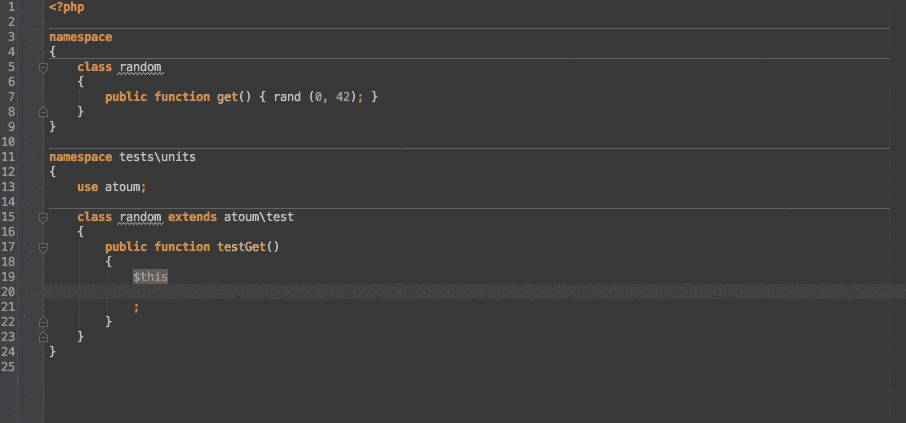
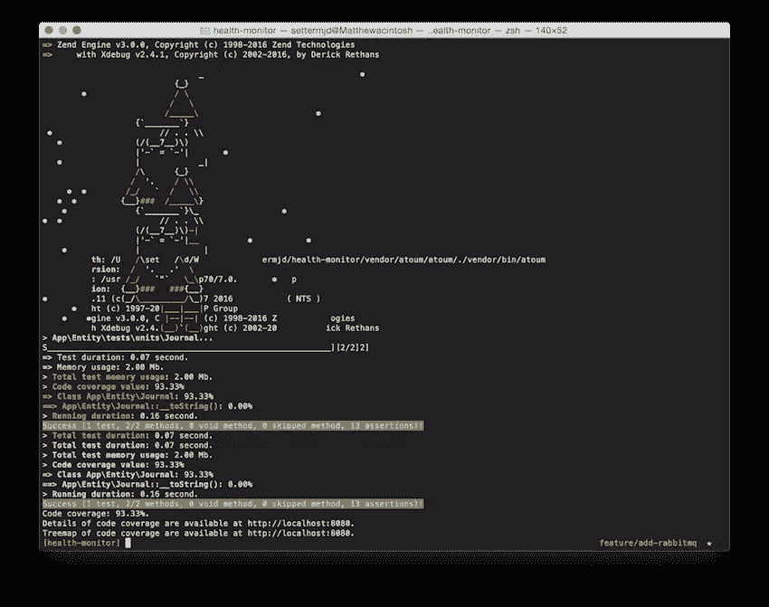
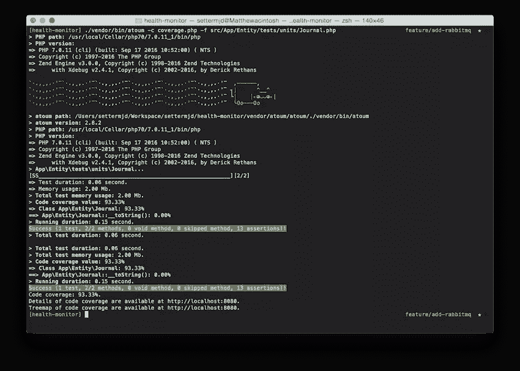
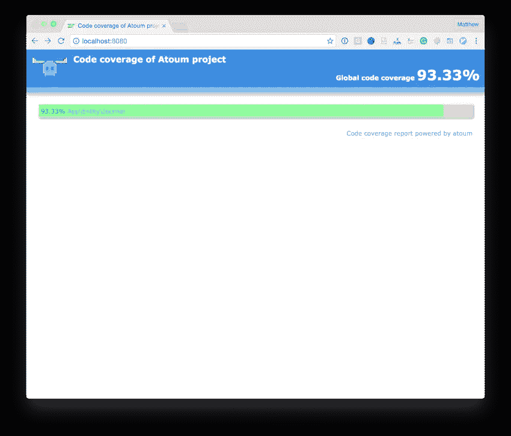
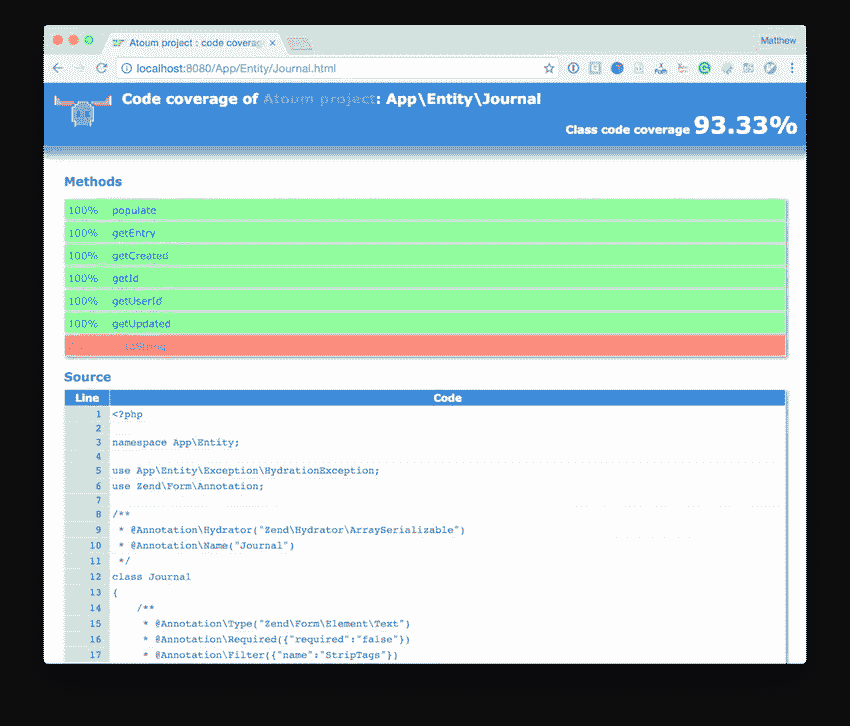
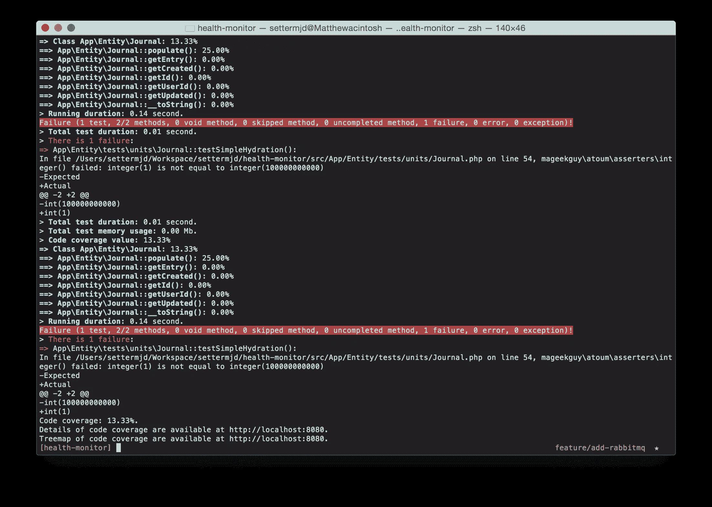

# 用 Atoum 测试 PHP 代码 PHPUnit 的替代方案

> 原文：<https://www.sitepoint.com/testing-php-code-with-atoum-an-alternative-to-phpunit/>

*这篇文章由[克里斯多佛·皮特](https://www.sitepoint.com/author/assertchris/)、[@朱比安池](https://twitter.com/jubianchi)和[伊万·恩德林](https://twitter.com/mnt_io)进行了同行评议。感谢 SitePoint 的所有同行评审员使 SitePoint 的内容尽可能做到最好！*

如果你接触 PHP 已经有一段时间了，毫无疑问你已经开始测试你的代码了。如果你问 PHP 领域的任何人用什么来编写单元测试，他们给你的第一个答案可能是 PHPUnit。

这是 PHP 社区中事实上的标准，并且有充分的理由。但这不是唯一的选择。虽然它确实占了很大一部分，但是还有很多其他的选择，其中一个我将在本教程中带你了解；叫做 atoum 。

如果这是你第一次听说它，它自我描述为:

> 一个简单、现代、直观的 PHP 单元测试框架！


我不能保证它一定那么直观，但它肯定使用起来相当简单。虽然它的`composer.json`目前指定了 PHP 5.3.3 的最低版本，但一位核心开发者告诉我，从 3.0 版本开始，对 PHP 5.3 的支持将正式被 PHP 5.6 取代。所以不要被愚弄了，这是 PHP 测试的一个现代版本。

最近，我决定在我现有的代码库上进行测试，这是一个健康监测应用程序，我一直在编写它，以帮助我处理我在过去 12-24 个月中遇到的一些健康问题。我发现这是一个有趣的软件测试，将几种不同的风格结合到一个包中。

## 安装 Atoum

像所有现代 PHP 软件一样，我们用 [Composer](https://www.sitepoint.com/php-dependency-management-with-composer/) 安装它。

```
composer require atoum/atoum 
```

出于本教程的目的，我假设您正在使用 PhpStorm。无意冒犯*维姆*、 *Emacs* 和其他编辑。

考虑到这一点，以及 atoum 的源代码是如何构建的，我们还应该安装一个名为 [atoum/stubs](https://github.com/atoum/stubs) 的补充库。

没有它，试图在 IDE 中用 atoum 执行任何类型的代码补全都是不直接的。如下图所示，存根使得使用 atoum 更加用户友好。



```
composer require atoum/stubs 
```

## 配置 Atoum

现在它已经安装好了，让我们执行一些初步的配置。具体来说，我们要做的是配置如何报告代码覆盖率，以及当从终端运行时，测试报告会是什么样子。

严格来说，这不是必需的，但是由于我们可能会经常查看终端中的测试输出，这有助于赋予它一点生命力。第二，虽然内置代码覆盖率很好，但有时通过浏览器查看更容易，我们稍后会看到这一点。

如果这是你第一次听说代码覆盖率，代码覆盖率会报告被测试覆盖的代码库的百分比。代码覆盖报告帮助我们了解我们的测试有多完整，以及在对代码进行修改时我们有多自信。因此，尽管在建立代码覆盖率方面有一些工作要做，但还是值得做的。

要开始配置 atoum，在项目的根目录下创建一个名为`.atoum.php`的新文件。在那里，添加以下内容:

```
<?php

use mageekguy\atoum;

$stdout = new atoum\writers\std\out;
$report = new atoum\reports\realtime\santa;
$script->addReport(
    $report->addWriter($stdout)
); 
```

不，你不是在做梦，报告风格设置为圣诞老人。如果你在抱怨离圣诞节还有几个月，现在已经是十月了。我敢肯定，你所在地区的商店很快就会摆满所有俗气的圣诞商品。

但是在你抱怨太多之前，还有很多其他的选择；其中包括: [cli、phing、tap 和 NyanCat](http://docs.atoum.org/en/latest/configuration_bootstraping.html#having-fun-with-atoum) 。

完成后，让我们将代码覆盖率设置为导出为 HTML 格式。在项目的根目录下创建一个新的目录结构`/coverage/html`。

然后，将`vendor/atoum/resources/configurations/runner/coverage.php.dist`作为`coverage.php`复制到项目的根目录。在那里，我们需要更新配置条目，如下面的代码片段所示:

```
<?php

use \mageekguy\atoum\report\fields\runner\coverage;

$coverageHtmlField = new coverage\html(
    'Your project name',
    '/path/to/destination/directory'
);
$coverageHtmlField->setRootUrl('http://url/of/web/site');
$coverageTreemapField = new coverage\treemap(
    'Your project name',
    '/path/to/destination/directory'
);

$coverageTreemapField
    ->setTreemapUrl('http://url/of/treemap')
    ->setHtmlReportBaseUrl($coverageHtmlField->getRootUrl());

$script
    ->addDefaultReport()
    ->addField($coverageHtmlField)
    ->addField($coverageTreemapField); 
```

之后，我们就可以开始编写测试了。

## 我们的第一个测试

在我的应用程序的源代码中，我有一个名为`Journal`的实体，它存储我写的每日食物摄入条目，以跟踪我吃了什么，以及我对它的反应。在其中，我有以下功能:

```
public function populate(array $data)
{
    if (empty($data)) {
        throw new HydrationException();
    }

    $this->id = $data['id'];
    $this->userId = $data['userId'];
    $this->entry = $data['entry'];
    $this->created = $data['created'];
    $this->updated = $data['updated'];
} 
```

可以看到它带了一个参数，`$data`，是一个数组。如果`$data`为空，那么它抛出一个`HydrationException`，这是一个自定义异常。

如果`$data`不为空，那么它使用来自`$data`的同名键填充五个私有成员变量。没什么特别的，但足以测试。

为了创建第一个测试，默认情况下，我们没有遵循你可能在许多其他项目中发现的相同方法，例如 Zend Framework、Symfony 或 Laravel。

开箱即用，atoum 建议了一种不同的风格——创建一个名为`tests/units`的目录，该目录与您将要测试的类相关。

因此，在我的位于`src/App/Entity`的`Journal`实体的情况下，我将在`tests/units/Entity/Journal.php`中创建一个新的测试类，也命名为`Journal`。

然后，我给它一个 PSR-4 类型的名称空间，`namespace App\Entity\tests\units;`。之后，我只需要使用 atoum 名称空间，就可以开始编写测试了。

```
<?php

namespace App\Entity\tests\units;

use App\Entity\Exception\HydrationException;
use App\Entity\Journal as Entity;
use Faker\Factory;
use Faker\Generator;
use atoum; 
```

我将从包含测试需要的所有名称空间和类开始。之后，和 PHPUnit 一样，我创建了第一个测试，遵循标准的命名风格，在测试前加上`test`，这表明它是一个测试。

然后，使用[优秀的 Faker 库](https://www.sitepoint.com/simplifying-test-data-generation-with-faker/)，我创建了一个测试数据数组来填充实体。准备好之后，我们下一步就要通过测试了。

```
class Journal extends atoum
{
    public function testHydration()
    {
        $faker = Factory::create();

        $data = [
          'id' => $faker->randomDigitNotNull,
          'userId' => $faker->randomDigitNotNull,
          'entry' => $faker->text,
          'created' => $faker->dateTime,
          'updated' => $faker->dateTime,
        ];

        $this
            ->given($entity = new Entity())
            ->when($entity->populate($data))
            ->then
                ->integer($entity->getId())
                ->isEqualTo($data['id']);
    }
} 
```

Atoum 有许多编写测试的风格。你可以使用`given -> when -> then`的 BDD/小黄瓜风格的，就像我上面提到的。或者，您可以采取更直接的方法，如下例所示。

```
faker = Factory::create();
$entity = new Entity();
$data = [
    'id' => faker->randomDigitNotNull,
    'userId' => faker->randomDigitNotNull,
    'entry' => faker->text,
    'created' => faker->dateTime,
    'updated' => faker->dateTime,
];
$entity->populate($data);
$this
    ->object($entity)
    ->integer($entity->getId())
    ->isEqualTo($this->data['id']); 
```

就我个人而言，虽然有点啰嗦，但我更喜欢前者而不是后者。我觉得可读性更强，更直观。选择权在你。

现在让我们更深入地看看测试。我们使用了`given`方法来建立前导码，或者设置被测系统(SUT)，这是一个`Journal`实体对象。然后，我们使用`when`方法运行 SUT 并获得结果，特别是通过调用它的`populate()`方法用测试数据对其进行水合。

对象水合后，我们使用`then()`和两个断言计算测试结论，比较对象的后状态和水合数据。在对 SUT 后状态的评估中，我们只检查通过调用`$entity->getId()`返回的`Journal`的`id`成员变量是否是整数，并且等于`$data`的 id 元素中的值。

由于可以在对象上设置许多属性，我们可以继续使用 fluent 界面来测试所有属性，如下例所示:

```
$this->object($entity)
    ->integer($entity->getId())->isEqualTo(data['id'])
    ->integer($entity->getUserId())->isEqualTo(data['userId'])
    ->string($entity->getEntry())->isEqualTo(data['entry'])
    ->dateTime($entity->getCreated())->isEqualTo(data['created'])
    ->dateTime($entity->getUpdated())->isEqualTo(data['updated']); 
```

这里，我们使用了另一种断言方法，`string()`用于返回字符串的值，而`dateTime()`用于返回`dateTime`值，而不是`integer()`。然而，正如您可能从一个全面的测试库中期望的那样，还有一系列其他断言选项。

## 运行测试

测试准备好了，是时候运行它了。从命令行，在项目的根目录中，运行以下命令:

```
./vendor/bin/atoum -c coverage.php -f src/App/Entity/tests/units/Journal.php 
```

这将使用`-f`开关运行我们已经创建的测试，并使用`-c`开关启用代码覆盖。当您运行它时，您应该会看到类似于下图的输出—**呵呵呵**！



但是，如果您愿意，可以随意将输出样式更改为其他样式；我个人最喜欢的是 [NyanCat](http://www.nyan.cat/) 。谁不会喜欢这样疯狂的输出:



## 代码覆盖率

现在我们已经有了一个工作测试，让我们更仔细地看看代码覆盖率报告，从命令行输出开始。我们可以看到，在下面简化的示例输出中，对于测试的类`App\Entity\Journal`，它的总代码覆盖率为 93.33%。这是因为它的`__toString`方法根本没有覆盖。

```
> Code coverage value: 93.33%
=> Class App\Entity\Journal: 93.33%
==> App\Entity\Journal::__toString(): 0.00%
Success (1 test, 2/2 methods, 0 void method, 0 skipped method, 13 assertions)!
> Code coverage value: 93.33%
=> Class App\Entity\Journal: 93.33%
==> App\Entity\Journal::__toString(): 0.00%
> Running duration: 0.15 second. 
```

现在让我们看看 HTML 覆盖率输出。使用命令`php -S 127.0.0.1:8080 -t ./coverage/html`启动 PHP 的 web 服务器，我们可以在`http://localhost:8080`看到 HTML 报告:



在那里，我们看到了覆盖率报告中覆盖的所有类的列表，以及它们的代码覆盖率。通过点击它，我们可以看到代码覆盖率是如何被评估的。



除了`__toString()`，每个方法都有 100%的代码覆盖率。透过源代码，我们可以看到，用绿色突出显示的是已经覆盖的内容，用橙色突出显示的是尚未覆盖的内容。

这就是为什么使用生成的报告更有效，因为它提供了比命令行输出更好的理解。

## 调试测试

但是，如果出了问题怎么办？比方说，我没有在`$data`数组中为`id`设置一个值，或者我希望它匹配一个不同的值。考虑到这一点，当我运行它时，我希望看到这样的错误:



在这种情况下，不容易看出哪里出了问题。然而，atoum 在这种情况下提供了几个选项。这些以`dump()`、`stop()`和`executeOnFailure()`方法的形式出现。

我将重点介绍`dump()`，但您也可以随意看看其他两个。Dump，类似于 PHP 的`var_dump()`，将变量的内容转储到`stdout`，作为运行测试的一部分。要使用它，我只需在测试中添加一个对它的调用，就像这样:

```
$this
    ->dump($entity)
    ->object($entity)
    ->integer($entity->getId())->isEqualTo(100000000000)
    ->integer($entity->getUserId())->isEqualTo($data['userId'])
    ->string($entity->getEntry())->isEqualTo($data['entry'])
    ->dateTime($entity->getCreated())->isEqualTo($data['created'])
    ->dateTime($entity->getUpdated())->isEqualTo($data['updated'])
    ->dump($entity) 
```

不过，有一点需要记住:只有在调试模式下运行测试时，调试方法才会起作用。为此，我们必须在调用 atoum 时使用`-d`或`--debug`开关。当您这样做时，您将看到类似如下的输出。

```
=> In App\Entity\tests\units\Journal::testSimpleHydration():
/Users/settermjd/Workspace/settermjd/health-monitor/vendor/atoum/atoum/classes/test.php:429:
class App\Entity\Journal#195 (5) {
  private $id =>
  int(1)
  private $userId =>
  int(3)
  private $entry =>
  string(165) "Reiciendis quod at voluptatem cupiditate error exercitationem at.
  Deserunt quos vero omnis est aliquam qui. Esse at quo dolorum fugit.
  Qui voluptas omnis amet nihil."
  private $created =>
  class DateTime#194 (3) {
    public $date =>
    string(26) "1992-06-18 01:55:51.000000"
    public $timezone_type =>
    int(3)
    public $timezone =>
    string(3) "UTC"
  }
  private $updated =>
  class DateTime#193 (3) {
    public $date =>
    string(26) "2016-09-28 08:27:18.000000"
    public $timezone_type =>
    int(3)
    public $timezone =>
    string(3) "UTC"
  }
} 
```

您可以在这里看到`Journal`实体的结构，并将预期收到的内容与实际收到的内容进行比较。

## 利用注释

### 针对不同版本的 PHP 进行测试

我们到目前为止所看到的，可以说，对于单元测试库来说是相当标准的。现在，让我们结束对 atoum 的初步参观，看看它是如何开始进入自己的领域的。

假设您开始重构应用程序的一些现有库以使用 PHP 7，但是它们还没有准备好引入主分支，因为它仍然高度依赖于 PHP 5.6。Atoum 可以通过使用`@php`注释过滤掉那些不能在给定 PHP 运行时测试的代码方面的测试。

Atoum 通过使用注释，允许您指定测试运行的 PHP 有效版本。它通过`@php`注释来实现这一点。对于需要 PHP 7 的方法，我们在 PhpDoc 块头中指定了`@php 7.0`。对于所有其他方法，我们可以让它们保持原样。如果整个测试类需要 PHP 7，我们可以在类的注释中使用它，而不是在类中包含的每个测试中使用它。

现在这可能看起来是一件奇怪的事情。自然地，如果你有一个不仅仅是简单使用 PHP 7 的类，比如标量类型提示，如果你用 PHP 7 之外的任何东西运行脚本(或应用程序)，那么它将导致致命的错误。所以我建议在移植过程中使用这个特性。

### 扩展ˌ扩张

现在，如果您需要特定的扩展来使测试方法工作，该怎么办呢？和`@php`一样，我们可以指定`@extensions`。假设我们需要一个或 mbstring、PDO 和 Xdebug 扩展的组合。我们可以使用下面的`@extensions`注释来要求这些扩展。

```
/**
   * @extensions mbstring
   * Or
   * @extensions pdo xdebug
 */ 
```

通过巧妙地使用这些注释，我们可以开始创建更复杂的测试，以及更复杂的测试自动化基础设施；它允许我们无缝地将应用从 PHP 5.6 迁移到 7.0(或 7.1)。

## 最后

这是对 atoum 的高层次概述，深入探讨了许多领域。还有更多我无法涵盖的内容，比如扩展。

有[visibility extension])(https://github . com/atoum/visibility-extension)，它允许测试受保护的和私有的方法。有[标尺扩展](https://github.com/atoum/ruler-extension)，允许过滤运行的测试。然后是[Blackfire 扩展](https://github.com/atoum/blackfire-extension)，它允许你使用 atoum 编写 black fire 测试套件。

除此之外，还有 [CI 服务器集成](http://docs.atoum.org/en/latest/cookbook.html#use-with-continous-integration-tools-ci)，因为 atoum 可以与 Hudson、Jenkins 和 TravisCI 等进行集成。

但是不要让这个介绍成为你发现的全部。虽然 atoum 比 PHP 事实上的测试库 PHPUnit 更新，但我认为它是一个非常值得考虑的库——尤其是如果 PHPUnit 的工作方式不是你所喜欢的。

请记住，这个项目有一个强大的社区、几个发布经理和一个核心开发团队。有很多东西要做，而且开始并不像我希望的那样直观。然而，一旦你开始运行，它真的会让你越来越喜欢！

如果这个教程吊起了你的胃口，一定要查看一下在线文档，在那里你可以找到更多关于这个库各个方面的信息。

你觉得阿托姆怎么样？你试过了吗？你会吗？

## 链接

*   https://github.com/atoum/bdd-extension
*   https://github.com/atoum/visibility-extension
*   https://github.com/atoum/json-schema-extension
*   https://github.com/atoum/ruler-extension
*   https://github.com/atoum/atoum

## 分享这篇文章