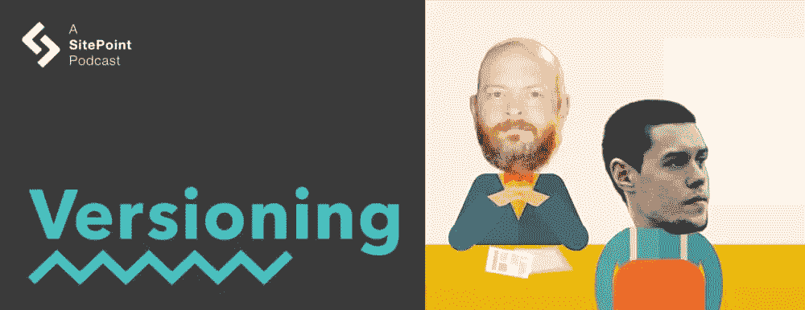

# 工作面试，以及获得网络开发工作的技巧

> 原文：<https://www.sitepoint.com/versioning-show-episode-13-getting-a-web-development-job/>

在这个版本控制节目的一对一节目中，蒂姆和大卫讨论了网络行业工作面试的来龙去脉，包括准备面试和充分利用面试的技巧，招聘人员的利与弊，白板的优点，以及你肯定不想被问到的问题。

[https://w.soundcloud.com/player/?url=https%3A//api.soundcloud.com/tracks/288914330&color=ff5500&auto_play=false&hide_related=false&show_comments=true&show_user=true&show_reposts=false](https://w.soundcloud.com/player/?url=https%3A//api.soundcloud.com/tracks/288914330&color=ff5500&auto_play=false&hide_related=false&show_comments=true&show_user=true&show_reposts=false)

**[iTunes 上订阅](https://itunes.apple.com/us/podcast/the-versioning-show/id1135300597)|[Stitcher 上订阅](http://www.stitcher.com/podcast/sitepoint/the-versioning-show) | /p >** 

## 显示注释

*   Tim 关于如何获得网络开发工作的文章
*   [玻璃门](https://www.glassdoor.com)
*   [冒泡排序算法](https://en.wikipedia.org/wiki/Bubble_sort)
*   [JavaScript `with`语句](https://developer.mozilla.org/en-US/docs/Web/JavaScript/Reference/Statements/with)
*   在推特上打招呼:[@ mdavid green](https://twitter.com/mdavidgreen)|[@ tevko](https://twitter.com/tevko)|[@ versioningshow](https://twitter.com/versioningshow)|[@ sitepointdotcom](https://twitter.com/sitepointdotcom)

## 谈话要点

> 我认为我们可以肯定地说，无论你是通过外部招聘人员还是内部招聘经理接触一家公司，我必须给出的建议是，尽快与技术人员交谈非常重要。

* * *

> 你要付出 80%到 100%的工作时间——这是一种不可再生的资源——并把它给别人以换取一定数量的金钱。金钱当然是一种非常可再生的资源。
> 
> 在这样的交易中，你肯定是失败的一方，除非你带着这样的想法进入，你需要评估这是否是你想为之工作的公司，这些是你接下来想学习的技术，以便你可以继续发展你的职业生涯。

* * *

> 在公司面试你之前先面试他们。在他们开始对你作为候选人进行技术评估之前，做你的研究，问你的问题，确保你有你需要的信息。

* * *

> 当我面试一家潜在的公司来雇用我时，我发现自己最近更多地关注他们的商业模式——如果它看起来是可持续的，而不是基于炒作，最重要的是，内部反馈。

* * *

> 获得工作机会有很多角度，你真的要一头扎进去。看看商业模式，看看资金信息，看看员工的满意度。要求见人，不断要求见人。

* * *

> 如果公司承诺让你参加面试，那他们就是在你身上投资了很多。你必须尊重这一点，你必须意识到，如果你已经到了接受这些面试的地步，他们对你是认真的，他们希望你成功。

* * *

> 因此，当一家公司要求，<q>在白板上做这件事，</q>这不是一个准确的挑战。这不是对日常工作的准确描述。那是困扰我的事情。在这一点上，这告诉我，该公司主要是希望我加入这个团队，而不是根据我的工作技能进行评估。

* * *

> 你不应该在处理白板编码挑战时，好像他们期望能够将白板上的内容打印到计算机屏幕上，并让它立即完美地运行。你应该这样理解，这就是我解决这个问题的方法。让我们弄清楚问题到底是什么，然后再来看细节。

* * *

> 我面试候选人的时候会找 CodePen，会找 LinkedIn 和 GitHub 以及一切我能找到的。如果他们给我他们的 Twitter 账号，我会看看他们是否会关注我在这个行业关注的那些人。我会做这些事情，因为我想了解它们与行业的合拍程度。我想看看他们编写、分享和贡献的代码。

## 副本

David:

嘿！大家好吗？这是大卫·格林先生…

Tim:

…这位是蒂姆·埃夫科…

David:

…您正在收听的是版本控制播客的第 13 集。

Tim:

这是一个我们聚在一起讨论从开发到设计的 web 行业的地方，一些人今天正在实现它，并计划它在下一个版本中的发展方向。

David:

这一集，我们将谈论如何在 web 开发、web 行业以及一般的技术行业中找到一份工作——一些细节，一些该做的和不该做的，以及一份工作是否真的是你正在寻找的。那么，让我们开始这个版本吧。

Tim，我知道你已经在 SitePoint 上写了一篇关于这个问题的文章，关于人们应该如何寻找网络开发的工作。你在关注什么？

Tim:

今天的科技行业非常新，如果你来自不同的职业领域，或者如果这是你在科技领域的第一次面试，这种传统的面试方式可能会让人们有点惊讶。很多人写了文章，发了微博，写了关于这个过程的博客，很多人有时会挑毛病，这是很有道理的。我想做的是让人们知道他们可以期待什么，以及他们可以使整个过程对他们更好，对希望雇用他们的人更好的方法。

David:

我认为其中一个具有挑战性的事情是，在许多这样的公司中，很难确定谁是真正负责招聘的人——因为这一责任通常落在实际上没有很多人力资源经验的工程师手中，他们在很多情况下会听取不太懂工程的人力资源人员的建议，并让他们以有意义的方式一起工作。这可能非常棘手。

Tim:

这是一个很好的观点，这就是为什么我会说，当我发现自己处于这种情况下，我首先要做的事情之一就是——尽快——弄清楚我在和谁说话。你可能不总是有这种奢侈，但我不喜欢与外部招聘人员打交道。对很多人来说，这是一种特权，但这让我能够与内部工作的招聘经理或为公司工作的首席技术官联系，而不是外部的第三方。因为，很多时候，发生的是，第三方有他们自己的利益，不一定是你的利益。

然而，一家公司的招聘经理、首席技术官或工程师，如果想直接聘用某人，他们会更关心申请人。而像外部招聘人员这样的第三方，他们得到*报酬*来做这件事。很多时候，如果可以的话，我根本不会和这些第三方打交道。再说一次，这不是每个人都可以选择去做的事情。

其次，我会立即尝试识别我在和一个技术人员还是一个非技术人员交谈。当你尽快发现这一点时，整个过程会变得容易得多。

David:

我注意到，我记得当我开始我的科技职业生涯时，招聘人员给了我极大的帮助。

在我职业生涯的后期，我把自己重新定位为一名工程师。在从事写作、营销和公关等工作多年后，我成了一名工程师。作为一名新工程师，我直接去找招聘人员，我非常感谢他们的洞察力和反馈——我如何在简历中定位自己，如何从局外人的角度与我共事过的技术招聘经理交谈。这对我很有用。

随着我作为一名工程师变得更加成熟，我现在已经到了这样一个地步，我认为我处于和你一样的位置，招聘人员碍手碍脚，干扰了你可以直接与公司建立的联系。但是当你开始工作，并且你正在寻找前几份工作的时候——特别是当你第一次从一家公司跳槽到另一家公司的时候——让招聘人员站在你这边和你一起工作是非常有价值的。

Tim [4:11]:

的确如此，这也是对我的一个很好的提醒。因为，既然你提到了，当我第一次离开我的咨询工作，在 Craigslist 上随便找了几家公司，当我从那家公司到我的第一家全职公司做网站开发时，那里有一个招聘人员，他是一个很好的帮助者，并且比他需要的更进一步，帮助我找到一份工作。因此，我应该更加小心地抛弃所有第三方招聘人员。*【咯咯笑】*

其中很多对你找工作非常有帮助——尤其是如果你对这整个场景和整个场景都不熟悉的话。如果那就是你，如果那确实描述了你，试探一下他们，看看他们到底有多有用，在这个过程中他们能给你多少帮助。因为有时候——我想对你和我来说，大卫——它们非常有用。非常好的观点。

David:

如你所说，了解他们的重要性至关重要。当我开始工作时，我以前至少有过一些工作经验，所以我知道选择一个与我相容的招聘人员的重要性，他了解我正在经历的事情，并能与我产生共鸣。我和几个人谈了谈，这有点像是对他们的面试，这样他们就可以有机会把我介绍给一家公司，并获得我第一年工资的 20%(或者他们最终能得到的任何东西)。

是的，绝对的。你需要考虑这个招聘人员，而不仅仅是因为这个人联系你，因为他们在 LinkedIn 上看到了你的简介，知道了这份工作，突然之间他们成了你唯一可以谈论这份工作的人。不，事情不是这样的。他们告诉你一份工作，或者他们告诉你一份工作的提示，但你通常可以使用谷歌找到其余的。

Tim:

是的。

David:

你和你认识的、你喜欢的招聘人员一起工作，因为那是支持你的人，而那个人知道，按照现在的职业发展方式，你可能最多在两三年内再次换工作——如果他们只是支持你并和你一起工作，他们会从你那里得到另一份佣金。

Tim:

是啊。也就是说，我认为我们可以肯定地说，无论你是通过外部招聘人员还是内部招聘经理接触一家公司，我必须给出的建议是，尽快与技术人员交谈非常重要。一个你可以问问题的人。

很多时候，这些公司会有这样的流程，你会和招聘人员交谈，然后，你会立即得到一个类似技术电话屏幕，甚至来面试。你会直接从与非技术人员交谈变成被技术人员评估。这有时意味着在你经历技术筛选的麻烦之前，你没有机会问很多关键和重要的问题。

在这个过程中，我尝试做的一件事是，在评估我的技术熟练程度之前，尽快与技术人员交谈，无论是首席开发人员还是公司的首席技术官。

这让我有能力问这样的问题，嘿，你用什么样的软件？你实践了好的开发原则吗？你的团队是一个多元化的团队吗？你的团队中有来自不同背景和性别的人吗，或者它会是一种内部俱乐部？你实行良好的工作时间吗？之类的东西。

我喜欢在进入代码挑战和白板之类的事情之前提出这些问题，这样我就可以在整个面试过程中浪费(或可能浪费)大量时间之前对公司有所了解。

David [8:04]:

我喜欢你所谈论的背后的元信息，因为你所谈论的是你面试公司的重要性，而不仅仅是公司面试你。我想很多求职者都会伸出手，绝望地说，<q>请给我一份工作。至少让我有资格做这份工作。</q>

Tim:

是啊。

David:

但是不，你绝对是在把自己置于危险之中，当你找工作时要记住的事情是，你要付出 80%到 100%的工作时间，时间——这是一种不可再生的资源——并把它给别人以换取一定数量的金钱。金钱当然是一种非常可再生的资源。

在这样的交易中，你肯定是失败的一方，除非你带着这样的想法进入，你需要评估这是否是你想为之工作的公司，这些是你接下来想学习的技术，以便你可以继续发展你的职业生涯。你必须明白，首席执行官、高管、负责这家公司的人是否有你相信并支持的愿景，以至于你愿意说，<q>好吧，我将在未来两年把我 100%的时间给你，作为交换，你要支付足够的钱，也许是我的租金</q>(如果你在旧金山，*，如果你不在旧金山，可能会多一点)。*

 *你要记住，你是在面试这家公司。他们不只是在采访你。* 

 *Tim:

是的。我想我们可以把第一点总结为:在公司面试你之前面试他们。在他们开始对你作为候选人进行技术评估之前，做你的研究，问你的问题，确保你有你需要的信息。我认为，一旦你能够做到这一点，一旦你给负责招聘决策的人留下这样的印象，<q>嘿，我对你的评估就像你对我的评估一样严格，</q>我认为，我希望，你开始被更加认真地对待。

所以我认为我们的第一点可以是:在公司开始面试你之前面试他们。你认为这听起来好吗，大卫？

David:

是啊。正如你所说，如果你以这种方式做功课，并真正寻找自己的最大利益，你会对这些公司更有吸引力，因为他们会认为你是认真对待这件事的人，做过研究，了解他们是什么样的人，并且正在关注严重的问题。你已经准备好去那里和他们一起工作，你不是随便找个人给你钱。

Tim:

我对公司了解得越多——我已经这样做过几次了(我对它的运作方式有点熟悉)——我开始更加关注事情的商业方面。当我面试一家潜在的公司来雇用我时，我发现自己最近更多地关注他们的商业模式——如果它看起来是可持续的，而不是基于炒作，最重要的是，内部反馈。

我要做的第一件事就是在 [Glassdoor](https://www.glassdoor.com) 上搜索该公司，看看评论是什么样的——看看人们在可能是最恶劣的环境中对他们的评价。因为在 Glassdoor 中，公司不能对评论者所说的话做出回应。如果你得到一星评价，它将永远停留在那里。我喜欢看这个，但我也喜欢看，好吧，你的商业模式是什么？你是 A 轮吗，意思是，你刚刚得到第一轮资金，现在你正在招聘工程师吗？你盈利了吗？你做生意有一段时间了吗？你招人是因为也许某个真正重要的人离开了，还是因为他们的薪水对你这个季度来说有点太高了？如果我决定为你工作，我想确保你的生意非常好。

David [11:56]:

这就是为什么很多在换工作时感到最满意的人是那些在他们有以前共事过的同事的公司找到工作的人，并且他们和他们的关系网保持联系的最重要的原因之一。这些人可以告诉他们，从一个内部人员的角度来看，<q>哦，你将进入这个部门，你将向这个主管汇报，</q>和，<q>这些人有这种态度，这是他们努力工作的方向。你可以从公司内部的人那里了解到这一点。</q>

我注意到像 Glassdoor 这样的资源，虽然它可能有大约 80%的准确性，但有一种现象——我不知道你是否听说过它——它被称为<q>glass door turting</q>，在这种情况下，公司实际上发布他们自己公司的评论，就好像它们是由在那里工作的外部人员发布的一样。当你在公司工作时，如果你看到的是一篇关于 Glassdoor turf 的评论，这是很明显的，但对于我们这些在外面做研究的人来说，这并不完全明显。因此，利用你的关系网去调查那些你认识在那里工作的人的公司是非常重要的。你可以从内部发现什么是真正的独家新闻，以及在那里的真实感受。

Tim:

这很有帮助。这就是为什么参与社区是一件如此有益的事情——同样，如果你有能力做这些事情的话。就我个人而言，我总是希望自己能更多地参与社区活动。因为我的工作是与在各种有趣的公司工作的人接触，以前也发生过这种情况，我会得到一份工作邀请，我会对某人说，【to】嘿，你在这家公司工作过。你能告诉我什么？我应该期待什么？这里的人怎么样？这是一种更轻松的感觉，因为当你没有这种感觉时，即使面试进行得很顺利，每个人看起来都很好，你也可能进入一个团队，第一天就遇到一个你从未见过的充满敌意的经理。这是一个可怕的情况。

David:

确实是。尤其是如果你是职场新人，你可能会觉得这是这个行业中人们工作的唯一方式。我告诉你，有些工程师对非常支持他们的经理非常满意。有些工程师对不知道如何保护他们免受公司内部冲击的经理非常不满。

最终，公司的责任是为股东赚钱，如果是上市公司的话。如果不是，对投资者来说。如果你在为一家自助公司工作，那么你会看到一位首席执行官不顾一切地想要从他自己的口袋里，从天使投资者的口袋里收回他投入的钱。当我现在经历这些时，我在想，我的上帝，当我开始做这个的时候它对我是如此有用，以至于我在成为工程师之前有一个 MBA 学位。

如今，要想在这些公司找到一份工作，并评估我们刚刚谈到的事情，你必须有足够的商业基础——你知道，什么是 A 系列？所有这些资助模式是什么？你怎么知道这些事情的？在你试图为自己在一份工作、一家公司中定位之前，你必须了解商业是如何运作的，因为你不知道你要放弃什么，你要用什么来交换。

Tim:

是啊，我经历了很多惨痛的教训。不久前，我还不知道 A 系列是什么。我不知道查看某家公司在一定数量的年份里获得了多少轮融资会是一个极好的主意。例如，看看这家公司是做什么的？这听起来是不是很新潮的事情？

举个例子(如果你为这家公司工作，我很抱歉)，但如果你为一家每月出售神秘猫玩具的电子商务公司工作——如果你得到了这家公司的工作机会，你必须对自己说，<q>这是一家会持续吸纳大量新用户的公司吗？负责这项业务的人是否向我保证会发生这种情况，所以我会接受他们的提议？</q>

获得工作机会有很多角度，你真的要一头扎进去。看看商业模式，看看资金信息，看看员工的满意度。要求见人，不断要求见人。

再说一次，我认为我们到目前为止还没有触及的东西，公司花钱雇人。即使你不使用外部招聘人员，你也必须从技术上审查人员，这意味着你让工程师远离工程时间，你让他们转向招聘。现在，在这个行业中，我们很多人的收入都很高，这意味着一个工程师花一个小时从技术上审查一个潜在的雇员，可能会从工程时间中损失 100 到 200 美元，所以你可能每小时花费 100 到 200 美元来面试一个人。这意味着尽快完成这一过程符合公司的最大利益，也就是说，如果没有必要，他们不会花时间把你介绍给公司里你每天要打交道的每个人。那要靠你去找出那个信息。

David [16:45]:

在第二轮面试中，我总是强调这一点:我特别要求会见各种各样的人。例如，在我职业生涯的早期，我是一名前端工程师，我总是强调说，作为面试过程的一部分，我需要会见首席设计师。

他们会说，<q>好吧，你没有被预约去见首席设计师。为什么要和设计师见面？</q>我说，<q>因为我在前端工作，我需要知道设计和工程是如何协同工作的。</q>你可以为此提出有力的理由，但这需要设计师的时间。

如果公司承诺让你参加面试，那他们就是在你身上投资了很多。你必须尊重这一点，你必须意识到，如果你已经到了接受这些面试的地步，他们对你是认真的，他们希望你成功。他们希望有人来帮助他们解决他们试图解决的问题，他们迫切希望你是那个可以来做这件事的人，他们可以给你一点钱——从他们的角度来看一点，希望从你的角度来看很多——但给你一些钱，解决他们的问题。所以问他们你想要什么。请他们去见你想见的人。

Tim:

我认为第二点很好:面试过程是一个昂贵的过程，你可以利用这一点。

David:

这是公平的。这是公平的。

Tim:

我们还没有深入到事情的技术层面，这是可怕的部分。

David:

我们要讨论白板编码，不是吗？

Tim:

不，事实上，我是你能找到的最反白人的人。我有时发现这是一个危险信号。不总是这样，但有时，当一家公司说，我们将带你到现场四个小时，你会发现这是一个危险信号。那不是一段时间，我只是从空气中抽出来。我不止一次看到那种情况。整个过程都将是一场技术性的面试。

困扰我的原因是，因为在这一点上，我已经给你发了我的 GitHub 个人资料，我的 CodePen 个人资料，我的作品集网站。此时，我已经向您发送了我的所有信息，其中有大量代码，顺便说一下，如果您正在面试一份工作，请确保您有大量公开可见的代码。如果你能做到这一点，这是一个很大的优势。但是，如果你要邀请我参加一个技术面试，其中包括四个小时的白板演示，甚至一个小时半的白板演示，当我把所有这些信息发给你的时候，我有点担心你的流程可能有点过时了。

我更喜欢有人说，<q>嘿，我们将向你发送一个代码挑战，你可以在一台可以访问谷歌的计算机上完成。</q>因为这就是现代 web 开发的方式。所有的 web 开发都是这样进行的。如果你不这样做，而要我在白板上写一些像[冒泡排序](https://en.wikipedia.org/wiki/Bubble_sort)的算法——我做不到，请注意——我有时会想到网络上很酷、错综复杂的东西。我从未编写过冒泡排序算法，我也不知道如何开始编写。但是，如果你让我在网上做点什么，我会完成的。这可能很难，但我会完成的。

因此，当一家公司要求，<q>在白板上做这件事，</q>这不是一个准确的挑战。这不是对日常工作的准确描述。那是困扰我的事情。在这一点上，这告诉我，该公司主要是希望我加入这个团队，而不是根据我的工作技能进行评估。当公司进行这些启动过程之一时，它在某种程度上告诉我，缺乏真正的能力，缺乏<q>我们真的对你解决问题的能力感兴趣，我们将付钱给你解决这些问题，</q>和更多的<q>我们都是这样做的，现在你必须这样做。</q>

David [20:22]:

哇，这很有趣，因为我的倾向，在听到你这样谈论它之后，几乎是在唱反调——我不是一个大的白板编码爱好者。我认为这是评估工程师最糟糕的方式之一。

Tim:

是啊。

David:

也就是说，我所在的公司迫切需要引进人才，但却没有足够的资源来组织类似编码挑战和评估编码挑战的活动。这些公司向员工(即有前景的员工)提供的机会不足以吸引合格的候选人接受编码挑战。我们会向人们发出编码挑战，他们会说，<q>你想让我花四个小时的时间为你写你要用的代码，而你却不打算为此付钱给我？</q>还有，你知道，所有这些东西。

Tim:

是啊。

David:

事情变得复杂了。另一方面，如果管理得当，白板编码挑战可以成为评估工程师技能的有效方式，评估他们如何与需求进行交互，并向前推进以找到解决方案。我在想，白板挑战是以一种互动的方式完成的，几乎就像编程一样，有人有需求，他们和你站在一起，当你解决问题时，你可以问他们问题，你可以展示你对问题所在领域的理解，然后来来回回，几乎共同解决问题。

在我看来，面试候选人的最佳方式可能更多的是结对编程，你和被面试的人——不管是谁——坐下来讨论一个问题，理想情况下，你们都不知道这个问题的完整解决方案，或者可能有多个同样有效的解决方案，在结对编程的情况下，共同在一台计算机上工作， 想出一个解决方案，让对话进行下去，并证明你们两人能够和谐地一起工作，并且你们尊重彼此的技能和能力。

Tim:

我认为这是一个非常公平的观点。我会说我对白板的问题，除了我不会做，因为我从来不在白板上写代码。我可以画出分配系统之类的概念和模糊、粗略的轮廓。就像你和其他工程师开会时，你试图谈论我们如何让我们的用户登录 90 天，但如果他们试图编辑他们的帐户信息，就提示他们再次登录。我可以在白板上画出这些概念，但是我不会在白板上写 JavaScript 来解决实际的代码问题。

我认为这是我在白板式面试中遇到的最大问题——如果你想测试我在解决技术挑战方面的能力，我们需要一台电脑，因为代码就在那里。

David:

绝对的。电脑是一个必要的组成部分，我见过一些公司全力以赴<q>这是一台电脑，这是互联网接入，这是谷歌，这是四个小时，这是挑战。你在现场。先做这件事，然后我们再讨论。</q>这是一种方法，我个人更喜欢互动方法，即有一台计算机，两个人一起工作，试图解决一个问题。

即使你面临一种情况——你会面临这种情况:如果你去面试工作，你会面临一种有白板的情况——你需要控制这种情况，并清楚地表明你要在白板上写的很可能是伪代码。

Tim:

是的。

David [23:50]:

你需要恰当地构建问题，你需要要求测试用例，要求所有的需求，通常问题会以这样一种方式呈现给你，它们可以用多种不同的方式解决。当你在白板上写代码的时候，你有机会和一个人在房间里，来来回回地做一些事情。

他们真正评估你的不是你是否在屏幕上的 JavaScript 的每一行末尾都加了分号。他们真正评估你的是你的智力，以及你在问题领域内的推理能力。因此，你不应该在处理白板编码挑战时，好像他们期望能够将白板上的内容打印到计算机屏幕上，并让它立即完美地运行。你应该这样理解，这就是我解决这个问题的方法。让我们弄清楚问题到底是什么，然后再来看细节。如果你把白板看作你正在谈论的东西，它就不那么可怕了——它是一个构思概念的地方，而不是一个写代码的地方。

Tim:

是的，我想说我最喜欢的采访方式是让某人完成一个代码挑战，然后当他们进来时回顾这个挑战。那是我最喜欢的方式。我个人认为，如果有必要的话，我会最好地评估候选人。大多数时候，当我面试候选人时，如果我能逃脱，我不会让他们写一行代码。这可能有点对抗性，这可能有点尖锐，但这是交易，大卫。让我们现实一点。

David:

放马过来，伙计！

Tim:

这是独特的。这可能是我的特殊情况。我面试候选人的时候会找 CodePen，会找 LinkedIn 和 GitHub 以及一切我能找到的。如果他们给我他们的 Twitter 账号，我会看看他们是否会关注我在这个行业关注的那些人。我会做这些事情，因为我想了解它们与行业的合拍程度。我想看看他们编写、分享和贡献的代码。如果一切按计划进行，当他们亲自来的时候，我知道他们有能力编写我所寻找的代码类型。如果我不这样做，那就是编码挑战的时候了。

当他们进来时，我们坐下来交谈。<q>你喜欢前端开发的什么？你优先考虑什么，绩效还是业务目标？当你写 JavaScript 时，你最喜欢的组织代码的方式是什么？和我谈谈你最近用 CSS 解决的一个挑战性的问题。</q>

David:

我最喜欢问应聘者的一个问题是，<q>当你继承一个代码库时，你最害怕看到的是什么？</q>

Tim:

哦…一个`with`声明？*【笑声】*

这可能是你在这个节目中听到的最无聊的笑话了。也就是说，我喜欢与候选人进行这种类型的对话，因为当我进行这种对话时，我可以感受到，好吧，当我们谈论性能时，你提到了 HTTP2，或者你提到了像在 CSS 中使用动画转换这样的事情。我寻找候选人提到的那些事情，如果发生了——这种方法还没有让我失望，也许我说得太早了，它会回来咬我——但如果发生了，我已经通过面试并雇用了一些人，而没有让他们为我写一行代码，因为我已经做了我的研究，我已经有过这样的对话，我听到他们谈论开发，他们喜欢的东西，提到一些技术东西。到目前为止，我已经完成了这项工作。

我要说的是(给在招聘过程中工作的人的一个提示):如果在任何时候你发现自己在要求应聘者回答一个你自己都不知道答案的问题，你应该离开这个房间。这可能和我今天要面对的一样。

David:

在这一点上我要和你对质，因为我认为面试中最有价值的事情之一就是问别人一个你不知道答案的问题，然后一起解决它。

Tim [27:50]:

好吧，也许我应该澄清一下。这是公平的。你叫我出来。好吧。很好。如果我带着一系列问题来到一个房间，其中一个问题是，<q>如何在 JavaScript 中反转字节？我只是勉强知道这个问题的答案。我想是用波浪符或者类似的东西，但是我不能明确地告诉你这个问题的答案。</q>

David:

JavaScript 引擎从来没有针对字节进行过优化。

Tim:

给你。所以我都不知道自己在说什么。如果我问一个候选人这个问题，有一个原因。我正在试图解决这个问题，我想看看他们是如何处理这个问题的，他们是如何思考这个问题的。也许我们会一起想出答案，或者我在骗他们，或者我在看你有多聪明。你必须超级聪明，因为我不想和一个笨蛋一起工作。

David:

这是公平的。我知道你想说什么。

Tim:

是啊。

David:

我把你叫了出来，但我在这一点上有点退步，因为我曾经在一家没有前端工程师来评估我技能的公司面试前端工作。他们问了我一些关于 HTML 结构的基本问题，他们从维基百科上找到了所有问题的答案。这是很久以前的事了，答案已经和当代的 HTML 过时了。我给出了当代 HTML 的答案，他们说，<q>不，这不完全是我们的回答。上面写着…</q>

你知道，这完全是因为面试我的人实际上并不知道我被面试的技能。

你完全正确。如果你需要就某项技能面试某人，你至少需要有理解力——你需要有一个能够评估该技能的员工。如果你带来了某人却没有，那就是一个挑战。

Tim:

是啊。这是一个艰难的情况，有时这将不得不发生。如果你正在招聘你的第一个前端员工，你会怎么做？这是一个艰难的情况，但我曾经参加过面试，面试官是我所说的充满敌意的人。试图欺骗你，或者真的不喜欢你的感觉，或者你知道，只是——你必须这么聪明。

在这种情况下，如果你发现自己在面试，或者如果我再次发现自己在那种类型的面试中，我可能会起身离开。并不是所有的公司都有完美的文化和优秀的员工，这些面试可能会令人不愉快、沮丧和不安，有时如果你发现自己处于这种情况下，在这样一个消极的情况下继续下去真的不值得。

David:

确实如此。其中一个问题是，我们是工程师。工程师专注于与机器一起工作，不一定与人一起工作，也可能没有接受过如何面试的培训。他们可能没有受过人际交往技能的训练。我经常遇到这样的情况，公司手头没有预算、资源或人才来提供那些能与候选人轻松共事的面试官，帮助他们度过难关，并以一种不令人讨厌的方式评估他们。

Tim:

是啊。

David:

有时候最有技术，最有资格的候选人，公司内部最有资格做评估的人，未必是最有资格和人类对话的人。

Tim:

是的。在这里，我们要走出去，并排队第三点:每一个采访-我要袖手旁观这个声明-每一个采访应该感到舒适和友好。一直都是。不管怎样。

David:

是的。这就是目标。

Tim:

每一次面试都应该是友好的、舒适的、友好的、友好的，永远不要让你觉得自己没有价值、不好或尴尬。

在那些采访中，我一直站在错误的一边。我参加过一些面试，面试很明显提前结束了，因为面试官没有发现我的技能达到了他们的标准。那是一段尴尬又糟糕的时光。我再也不想经历这种事了。太可怕了。从那时起，我就对自己承诺，如果我采访过任何人，严格来说，我们会在采访结束时成为朋友。

David [31:54]:

我们已经检查了一堆东西。让我们看看。我们有三个要点。你能总结一下这些要点吗？因为我们走的时候是你写的。

Tim:

当然了。让我打开笔记本。我们有纸音效吗？

*【笑声】*

第一点是:在公司面试你之前面试他们——这意味着做你的研究，问所有的问题，找出你能找到的所有信息，一般来说，在公司开始技术评估之前，只需要得到你想要的所有信息。这就是目标，对吧？你并不总是有机会获得所有的信息，但是如果可以的话，先试着去面试这家公司。这听起来公平吗？

我认为第二点是面试过程是一个昂贵的过程，你可以利用这一点。公司花钱面试你，例如，如果他们给你开出了一份令你不满意的工作，就把它踢回去。他们不会说，算了吧，我们只是要重新开始这个漫长的、令人疲惫不堪的、耗费财力的过程，并把某人带到这一步。不会。他们会在合理的范围内非常配合，因为对他们来说这是一个昂贵的过程，你完全有权利利用这一点。

第三点是，面试过程是一个很好的指标，表明公司有多好，公司里的人有多好。第三点是，面试过程应该总是让人感觉舒适、友好和有帮助。即使你在面试过程中发现，也许你对这份工作的技术不够熟练，这在我身上发生过很多次，或者这不是你的公司，或者这不是你非常感兴趣的角色，你至少应该从这个过程中学到一些东西，一个有价值的教训，也许是关于代码的额外东西，也许是你可以在未来改进的东西， 但是你应该总是觉得这不是浪费你的时间，这不是一种沮丧和拒绝的感觉。

David:

从一个已经向你证明你在技术上不能胜任他们招聘的工作的面试中走出来，这给了你一个机会，不仅可以问很多关于你接下来可以学习的东西的问题——你现在正在和知道所有这些东西而你不知道的人交谈，所以这是一个很好的机会——但是在我参加过的几乎所有工作面试中， 我已经在 LinkedIn 上建立了至少一两个新的联系，他们是我在面试中遇到的有趣的人。 我不一定接受这份工作，但我想和这些人保持联系。这是给公司一些他们以前没有的东西，这是与你的网络的联系，这是你带来的另一个非常有价值的东西。

Tim:

是啊。说到 LinkedIn，我很高兴你提到这个。我会把这个分享给每一个正在听的人。在我职业生涯的早期，我面试过的一家公司是 LinkedIn，我发现它在技术上远远不够专业。我在 LinkedIn 面试了一个前端开发人员的角色。这是一次视频结对编程练习，我没有通过一些更技术性的 JavaScript 问题，但这是我参加过的最友好、最通情达理、总体来说还不错的面试。面试官说，听着，事实证明你并不符合我们对你这个角色的要求，但是请在六个月后再给我发信息，我们会从上次中断的地方继续。

六个月过去了，我找到了一份不同的工作，我对现在的工作很满意，但我以前从未对面试如此满意。为什么不应该一直这样呢？

David [35:45]:

为什么不应该一直这样呢？记住这一点很重要。你参加了一个工作的面试，而在当时，你并不适合这份工作，但是由于我们所处领域的性质，一份工作的资格可以在几个月的特定框架或特定语言的培训中获得。你进去了，你被面试了，你被发现有欠缺，你活下来了！它没有杀死你。这并没有阻止你的前景。它并没有立即向所有招聘经理发出警告，告诉他们不要雇佣这个人，他没有通过 LinkedIn 的面试。

这只是你经历的一些事情，你进入了下一个阶段。你进入了下一步，现在你正在继续前进。

Tim:

这激励了我，因为你知道我做了什么，我上了谷歌日历，我展望了未来六个月。我给自己做了一个小小的提醒，再次给 LinkedIn 打电话。接下来六个月的每一天，你知道我做了什么吗？我学的是 JavaScript。我做了 CodePen 演示。我真的很努力地工作，我看了我不会看的东西，因为也许它很无聊或很难，但我有动力这样做，因为有人坐在电脑的另一边说，<q>嘿，你能做到这一点。六个月后我们会再做一次，那时你会很棒的。</q>这非常有帮助。

David:

它告诉你应该往哪里想。把你的注意力放在什么方向。我记得有一次面试，在面试过程中我第一次接触到递归问题，我不知道如何解决一个递归问题。我甚至不知道是什么样的问题…我在做这个荒谬的，深度嵌套的…这是废话，我可以告诉你，但他们在面试时向我解释，<q>这是一个递归问题。因为这个，这个，这个就能看出来。</q>

我离开，研究它。我了解了更多。现在，我正在为 SitePoint 编写一门 JavaScript 函数式编程课程，其中涉及了许多主题，如果我没有在这种背景下接触过这些主题，我就不会有动力去了解它们。

Tim:

是的，非常正确。我们有我们的三点。

David:

我觉得那三点不错。

Tim:

我们还有其他要排列的点吗？

David:

我认为主要的一点是:祝你好运，记住你的时间是多么宝贵。你的时间是你永远无法收回的东西，考虑到他们给你的钱占他们的百分比，而你给他们的时间占你的百分比，你把它非常便宜地卖给了这些公司。

Tim:

不要低估你的时间和薪水。

* * *

非常感谢大家的聆听。我们一直很高兴能与大家谈论技术。

David:

我们还要感谢 SitePoint.com 和我们的制片人 Adam Roberts 和奥菲利·勒沙特，他们在制作上得到了拉尔夫·梅森的帮助。请随时在 Twitter 上给我们发送您的评论—[@ versioningshow](https://twitter.com/versioningshow)——[在 iTunes 上给我们评分](https://itunes.apple.com/us/podcast/the-versioning-show/id1135300597)，让我们知道我们做得如何。

Tim:

我们下次再见，希望你喜欢这个版本。* 

## *分享这篇文章*