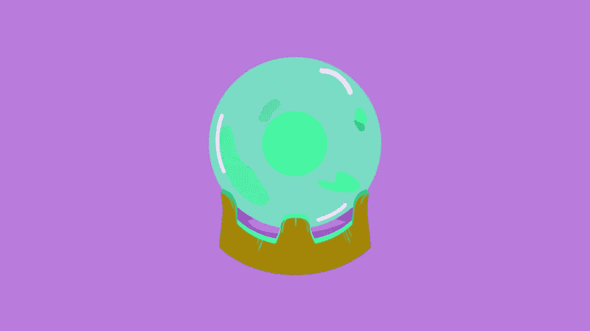

# AtoZ CSS 快速提示:用不透明度控制元素可见性

> 原文：<https://www.sitepoint.com/atoz-css-quick-tip-opacity/>

本文是我们 AtoZ CSS 系列的一部分。你可以在这里找到这个系列[的其他条目。
你可以在这里](https://www.sitepoint.com/blog/)查看`opacity` [的完整文字稿和截屏。](https://www.sitepoint.com/atoz-css-screencast-opacity)

欢迎来到我们的 AtoZ CSS 系列！在这个系列中，我将探索不同的 CSS 值(和属性),每个值都以字母表中不同的字母开始。我们知道有时仅仅靠截屏是不够的，所以在这篇文章中，我们为你添加了一个关于`opacity`的新的快速提示。



## o 代表`opacity`

我们可以使用`opacity`来控制页面上元素的可见性——从完全透明到完全不透明，就像在[原始截屏视频](https://www.sitepoint.com/atoz-css-screencast-opacity)中讨论的那样。

这里有几个使用`opacity`的技巧，以确保元素的正确部分是半透明的，并演示我们如何在不依赖 JavaScript 效果库的情况下创建渐变效果。

### 提示 1: `opacity`适用于整个元素

当在一个元素上设置`opacity`时，整个元素，包括其子元素，都是半透明的。孩子们继承的`opacity`不是*，所以不幸的是，你不能在他们身上设置`opacity: 1`，让他们再次完全不透明。*

 *如果你想让元素的`background`半透明，但想让子元素(如文本或图像)不透明，使用半透明的`background`而不是使用`opacity`。

```
.module {
  background: rgba(255,255,255,0.5); /* semi-trans white */
}
```

### 提示 2: `opacity`影响堆叠上下文

当不透明度设置为小于`1`的值时，元素被放置在一个新层上，因此`background`可以显示在半透明元素的下面。这类似于`z-index`的工作方式，就像`z-index`一样，使用`opacity`创建一个新的堆叠上下文。

### 技巧 3:不使用 jQuery 创建渐变效果

我先声明:我喜欢 jQuery 并经常使用它——几乎在我参与的每个项目中。我在这里说的不是放弃 jQuery(虽然在这种情况下你并不真的*需要*它),而是使用原生 CSS 功能，而不是依赖 JS 来获得效果。

我们可以通过组合`opacity`、`transition`和可能的一些 JS 类切换来非常简单地创建淡入和淡出效果。

为了概述这个场景，想象一下单击一个按钮会在模式窗口中淡入显示一些附加内容的情况。这个模态内容可以在页面加载时隐藏，然后使用 jQuery 的`fadeIn()`方法显示。

```
$('.show-modal-button').on('click',function(e) {
  e.preventDefault();
  $('.modal').fadeIn();
});
```

这将使用 JavaScript 通过注入内联样式将元素从`display:none`动画化为`display:block`。

我倾向于避免不必要地注入内联样式，我们实际上可以通过在 CSS 中设置“状态”类来实现相同的效果——一个用于可见状态，一个用于不可见状态——对我们想要淡化的元素应用过渡，然后使用简单的类切换来切换不同的状态。如果你想保持纯粹的 CSS 效果，你可以使用 CSS 伪状态，比如`:hover`或`:focus`。

首先，我们在 CSS 中设置州。我使用命名约定前缀`is-`来证明该类是由 JS 触发的状态。

```
.modal {
  /* other styles for modal */
  transition: opacity 1s ease;
}
.modal.is-visible {
  opacity: 1;
}
.modal.is-hidden {
  opacity: 0;
}
```

我们现在可以通过动态添加或删除 JS 中的类来切换状态(假设您从 HTML 中的类`is-hidden`开始):

```
$('.show-modal-button').on('click',function(e) {
  // turn off the is-hidden class and turn on the is-visible class
  $('.modal').toggleClass('is-hidden is-visible');
});
```

现在你有了关于`opacity`房产的 3 个快速提示。

我最鼓励你使用的一个方法是利用 CSS 来获得比使用 JavaScript 更好的效果。我发现我对动画和过渡有了更好的控制，并且您可以在没有大量 jQuery 动画回调的情况下实现一些非常漂亮的效果。* 

## *分享这篇文章*