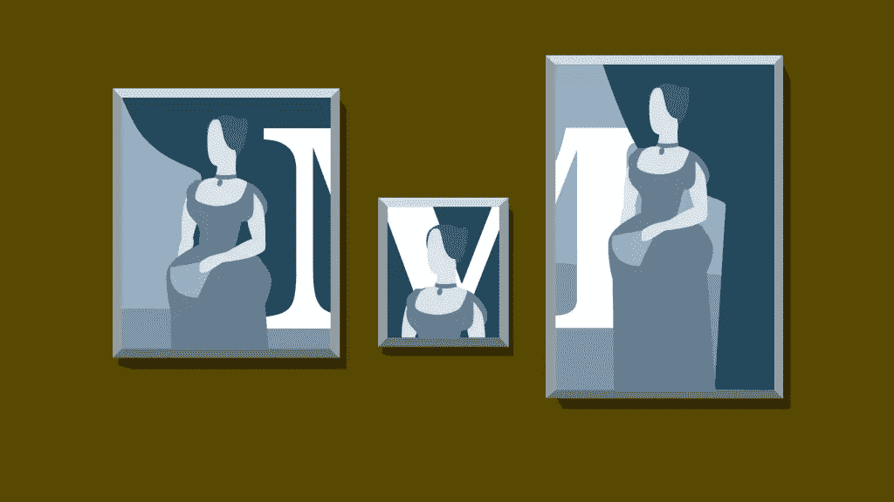

# AtoZ CSS:利用媒体询问创建响应式设计

> 原文：<https://www.sitepoint.com/atoz-css-media-queries/>

本文是我们 AtoZ CSS 系列的一部分。点击此处查看完整的截屏和媒体提问文字记录[。](https://www.sitepoint.com/atoz-css-screencast-media-queries)

欢迎来到我们的 AtoZ CSS 系列！在这个系列中，我将探索不同的 CSS 值(和属性),每个值都以字母表中不同的字母开始。我们知道，有时屏幕广播是不够的，所以在这篇文章中，我为你添加了一个新的关于媒体询问的快速提示/课程。



## m 代表媒体查询

我大胆猜测，现在绝大多数的网页设计者和开发者都很熟悉响应式设计的概念。如果没有，请查看[媒体询问截屏](https://www.sitepoint.com/atoz-css-screencast-media-queries)。

由于响应式设计如此受欢迎，这是一个很好的地方来收集一些技巧，以改进我们为多种设备开发网站和应用程序的方式。这里有一些 CSS 技巧可以帮助你。

### 技巧 1:不要使用设备特定的断点

希望这是不言而喻的，但是万一您需要提醒或者您以前没有遇到过这个最佳实践，我认为它值得重申。

在您的代码中，通过如下所示的媒体查询，可以轻松识别设备特定的断点(为清晰起见，添加了注释):

```
/* ipad portrait */
@media screen and (min-width: 768px;) {}

/* ipad landscape */
@media screen and (min-width: 1024px;) {}

/* iphone */
@media screen and (min-width: 320px) and (max-width: 480px;) {}
```

这些断点是为苹果设备设置的，具有“幻数”值，如`768px`或`1024px`。

如果用户的窗口是`1025px`或者`1023px`怎么办？

媒体查询不会生效，该设备尺寸的样式也不会适用。

有时候你可能需要一个非常具体的断点值(稍后会详细介绍)，但是对我来说，看到这些特定于设备的断点是一种代码味道。

那么你应该怎么做呢？

### 技巧 2:设置主要*断点*和次要*断点*

当在一个响应式项目中工作时，我倾向于设置任意整数断点，这些断点大约是大多数电话、平板电脑和台式机/笔记本电脑设备的尺寸。

我倾向于使用以下主要断点(尽管有时可能会因项目而异):

```
/* large phones and small tablets */
@media screen and (min-width: 500px;) {}

/* tablets and small monitors */
@media screen and (min-width: 800px;) {}

/* laptops and desktops */
@media screen and (min-width: 1200px;) {}
```

使用这些断点并不限制设计仅在这些点上进行更改，而是为处理三种主要设备类型提供了良好的基础。

对于基于内容的设计调整(即:当内容开始看起来破碎、不平衡或不太合适时)，您可以使用调整点来微调元素并润色项目的细节。

```
/* tweak position of share button */
@media screen and (min-width: 1150px;) {
  margin-right: 1em;
}
```

### 技巧 3:使用`em`或`rem`作为断点单位

如果用户缩放页面或增加文本大小，使用这些相对单位中的一个来获得更好的可伸缩性，而不是使用`px`。作为一个例子，当在 ems 中调整大小时，我上面的主要断点看起来如下。

```
/* 500px / 16px = 31.25em */
@media screen and (min-width: 31.25em;) {}

/* 800px / 16px = 50em */
@media screen and (min-width: 50em;) {}

/* 1200px / 16px = 75em */
@media screen and (min-width: 75em;) {}
```

## 分享这篇文章