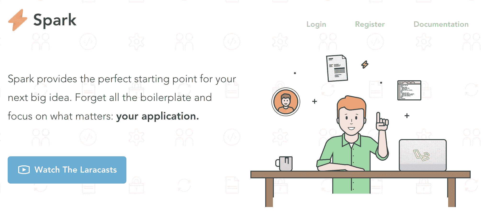

# 增强你的火花体验的 9 个热门技巧

> 原文：<https://www.sitepoint.com/9-hot-laravel-spark-tips/>

不久前，[我写了一个我想要建立的产品](https://www.sitepoint.com/starting-a-business-with-laravel-spark)，允许对[页面套件](https://pagekit.com)站点进行简单的远程备份。从那时起，我就一直在做这件事(周期性的)，并且遇到了一些有趣的建议。

我决定使用 [Laravel Spark](https://spark.laravel.com) 作为产品的基础，我认为分享建议会有所帮助。无论你是刚刚开始使用你的 Spark 应用程序，还是处于维护模式，我想你会发现其中一些提示很有用！



## 1.你不必保留所有的基本文件

您可能担心从标准 Spark 安装中删除太多的基本文件。当我第一次开始时，我认为不改变认证控制器(在`app/Http/Controllers/Auth`中)是至关重要的，因为担心它会破坏注册和登录系统。

原来，这些文件并没有被 Spark 使用。事实上，如果你给它们添加路线，并尝试注册/登录，你可能只会遇到问题。这些默认的身份验证控制器共享相同的身份验证保护(会话驱动程序)，因此通过其中一个登录将使您通过另一个进行身份验证。

但是，如果您尝试通过非 Spark 控制器注册，您的用户和团队帐户将会丢失重要的 Spark 信息。删除这些辅助身份验证控制器会更简洁明了。

*如果你不确定，[做一个完整备份](https://docs.spatie.be/laravel-backup/v4/introduction)。然后您可以回滚，以防您的测试发现任何回归。*

## 2.使用简单的存储库

Spark 包括几个简单的存储库。这些类似于静态配置列表(针对国家和其他大部分静态数据)，但是它们可以通过 IoC 容器加载。它们看起来像这样:

```
namespace Laravel\Spark\Repositories\Geography;

use Laravel\Spark\Contracts\Repositories\↩
    Geography\CountryRepository as Contract;

class CountryRepository implements Contract
{
    /**
     * {@inheritdoc}
     */
    public function all()
    {
        return [
            'AF' => 'Afghanistan',
            'AX' => 'Åland Islands',
            'AL' => 'Albania',
            // ...snip
            'YE' => 'Yemen',
            'ZM' => 'Zambia',
            'ZW' => 'Zimbabwe',
        ];
    }
} 
```

*这是出自`vendor/bin/laravel/spark/src/Repositories/Geography/CountryRepository.php`*

我们可以在一些注册视图中看到这样的例子:

```
<select class="form-control" v-model="registerForm.country"↩
    lazy>
    @foreach (app(Laravel\Spark\Repositories\↩
        Geography\CountryRepository::class)->all()↩
        as $key => $country)
        <option value="{{ $key }}">{{ $country }}</option>
    @endforeach
</select> 
```

*这是出自`resources/views/vendor/spark/auth/register-address.blade.php`*

我强烈建议您将这些存储库用于国家和州数据。我还建议您对自己的列表使用这种存储库样式:

```
namespace App\Repositories;

use DateTimeZone;

class TimezoneRepository
{
    /**
     * @return array
     */
    public function get()
    {
        $identifiers = DateTimeZone::listIdentifiers(DateTimeZone::ALL);

        return array_combine(
            $identifiers,
            array_map(function ($identifier) {
                return str_replace("_", " ", $identifier);
            }, $identifiers)
        );
    }
} 
```

您不必为每个存储库创建一个接口。事实上，我认为这有点过头了。但是我认为这些微小的储存库比替代品更干净，更容易使用。

此外，您可以在应用程序服务提供者中为这些设置别名:

```
namespace App\Providers;

use App\Repositories\CountryRepository;
use App\Repositories\TimezoneRepository;
use Illuminate\Support\ServiceProvider;

class AppServiceProvider extends ServiceProvider
{
    /**
     * @inheritdoc
     */
    public function register()
    {
        $this->app->singleton("timezones", function () {
            return new TimezoneRepository();
        });
    }
} 
```

*这是出自`app/Providers/AppServiceProvider.php`*

这使得它们在视图中非常容易使用:

```
<select class="form-control" v-model="registerForm.timezone"↩
    lazy>
    @foreach (app("timezones")->get() as $key => $timezone)
        <option value="{{ $key }}">{{ $timezone }}</option>
    @endforeach
</select> 
```

一般来说，您应该尝试使用现有的数据列表。当你必须保持你自己的时候，我发现这个策略很有效。

## 3.不要使用插入符号(^) Laravel 依赖项

Laravel 进化很快。这对于保持开发人员的兴趣很有帮助，但是它有维护上的缺点。帮自己一个忙，用`~x.x.x`版本号替换任何`^x.x`依赖版本号。

Spark `1.x`是用 Laravel `5.2.x`打造的。如果你不小心的话(阅读:使用`^5.2`)，调用`composer update`会将 Laravel 升级到`5.3.x`，这引入了许多突破性的变化。

Laravel 没有声称跟随 Semver，所以没有理由假设小版本颠簸将是安全的。也就是说，当谈到升级次要版本所涉及的困难时，Taylor 是相当合理的。如果引入的突破性变化需要很长时间才能缓解，它们将被推迟到下一个主要版本。

Spark `2.x`是基于 Laravel `5.3.x`的，所以如果可以就从那里开始吧。然后你就可以从一开始就使用`5.3.x`中所有闪亮的新功能。启动一个新的 Spark 应用程序比升级一个现有的要容易得多。请相信我…

*同样，你最好在运行`composer update`之前做一个完整的备份。你在制造一个产品。你已经付钱使用 Spark 了。备份现在是一件事。*

## 4.医生是你的朋友

Spark 中捆绑了许多假定的知识。大多数捆绑视图使用(或至少引用)VueJS 组件。火花取决于[收银员](https://laravel.com/docs/5.3/billing)和[条纹](https://stripe.com/docs/testing)或[布伦特里](https://developers.braintreepayments.com/reference/general/testing/php)。

您不需要成为这些方面的专家，但是如果您需要接触它们中的任何一个，不要在没有首先浏览相关文档的情况下尝试去做。或者所有的文件。

我发现像“添加注册字段”这样的部分特别有用，因为它们涵盖了进行更改所需的全部编辑内容。

看看[免费的 Laracasts 视频](https://laracasts.com/series/laravel-spark)吧。它们现在有点过时了，但仍然是很好的知识来源。

## 5.不要觉得学习 VueJS 有压力

我知道我刚刚提到了 VueJS，但事实是，在尝试 Spark 之前，您真的不需要学习它。在我花了很多时间在 Spark 之前，我以为我有。结果是文档告诉了你所有你需要知道的，捆绑的视图用例子填补了任何空白。

如果你的目标是做一些前端的东西，学习 VueJS 是个不错的主意。如果您所需要的(JabbaScript-wise)只是在这里或那里添加一个字段，只需遵循代码中的示例即可。

没有什么能阻止你把你所有的应用程序代码变成普通的 HTML 和 PHP。

## 6.Forge 上的主机

真诚地说(没有任何鼓励提及它们)，我不能高度推荐 [Forge](https://forge.laravel.com) 。这是明智的、经济的服务器管理，面向 Laravel 应用程序。

我在那里主持过其他(非 Spark)的东西，但它让我的 Spark 经历更加丰富。我特别喜欢`.env`、调度器和排队作业守护程序管理工具。每个基于订阅的应用程序都需要预定的作业。每个中等复杂程度的应用程序都受益于排队作业。

## 7.重新安排中间件

Laravel 最好的一个特性(我个人认为)是[路由模型绑定](https://www.sitepoint.com/laravel-quick-tip-model-route-binding/)。这时你就像这样定义路线:

```
use App\Http\Controllers\CustomersController;

Route::get("customers/:customer", [
    "uses" => CustomersController::class,
    "as" => "customers.edit",
]); 
```

…然后将该动作定义为:

```
/**
 * @param Customer $customer
 *
 * @return Response
 */
public function edit(Customer $customer)
{
    return view("customers.edit", [
        "customer" => $customer,
        "groups" => Groups::all(),
    ]);
} 
```

如果你运行这个代码(作为一个控制器动作)，`$customer`将自动从数据库中被拉出来。功能很强大！当我开始这个 Spark `1.x`应用程序时，我很小心地将全局范围应用到所有团队特定的模型:

```
namespace App\Scopes;

use App\User;
use Illuminate\Database\Eloquent\Builder;
use Illuminate\Database\Eloquent\Model;
use Illuminate\Database\Eloquent\Scope;

class TeamScope implements Scope
{
    /**
     * @param Builder $builder
     * @param Model $model
     *
     * @return Builder
     */
    public function apply(Builder $builder, Model $model)
    {
        /** @var User $user */
        $user = auth()->user();

        return $builder->where(
            "team_id", "=", $user->currentTeam()->id
        );
    }
} 
```

*这是出自`app/Scopes/TeamScope.php`*

我将此应用于模型的`boot()`方法:

```
namespace App;

use App\Scopes\TeamScope;
use Illuminate\Database\Eloquent\Model;

class Customer extends Model
{

    /**
     * @inheritdoc
     */
    protected static function boot()
    {
        parent::boot();

        static::addGlobalScope(new TeamScope());
    }
} 
```

预期的行为是根据登录用户的当前团队过滤所有客户。问题是，这在`5.2.x`中不起作用，因为当路由模型绑定发生时，会话没有启动。为了解决这个问题，我不得不将会话中间件从`web`组转移到全局组:

```
/**
 * The application's global HTTP middleware stack.
 *
 * These middleware are run during every request to your application.
 *
 * @var array
 */
protected $middleware = [
    \Illuminate\Foundation\Http\Middleware\CheckForMaintenanceMode::class,
    \Illuminate\Session\Middleware\StartSession::class
];

/**
 * The application's route middleware groups.
 *
 * @var array
 */
protected $middlewareGroups = [
    'web' => [
        \App\Http\Middleware\EncryptCookies::class,
        \Illuminate\Cookie\Middleware\AddQueuedCookiesToResponse::class,
        // \Illuminate\Session\Middleware\StartSession::class,
        \Illuminate\View\Middleware\ShareErrorsFromSession::class,
        \App\Http\Middleware\VerifyCsrfToken::class,
    ],

    'api' => [
        'throttle:60,1',
    ],
]; 
```

*这是出自`app/Http/Kernel.php`*

注意我是如何注释掉`$middlewareGroups["web"]`中的`\Illuminate\Session\Middleware\StartSession::class`，并将其添加到`$middleware`？这样做将在`Model::boot()`之前启动会话，这意味着`auth()->user()`(或`Auth::user()`)将返回登录的用户。

## 8.做你自己的助手

我无法告诉你我用了多少次下面的代码:

```
/** @var User $user */
$user = auth()->user();

/** @var Team $team */
$team = user()->currentTeam(); 
```

…在我创建这些助手之前:

```
use App\User;
use App\Team;

if (!function_exists("user")) {
    /**
     * @return App\User
     */
    function user() {
        return auth()->user();
    }
}

if (!function_exists("team")) {
    /**
     * @return App\Team
     */
    function team() {
        return user()->team();
    }
} 
```

他们既不疯狂也不复杂。它们甚至没有太多需要输入的代码。但是我建议您从一开始就包含它们，因为您将会输入(和输入提示)大量的替代项。

## 9.使用 Ngrok 测试 Web 挂钩

围绕一个或多个第三方服务来构建产品是很常见的。想想看，您已经依赖于 Stripe 和/或 Braintree。当你想在 Twitter 上发帖，或者[发短信](https://www.nexmo.com/)时呢？

当这种情况发生时，您通常需要提供一个 web-hook URL。这些是应用程序中响应第三方服务请求(或从中收集数据)的路由。它通常是来自交易邮件服务的递送报告，或者来自运输提供商的确认数据。

您可能会尝试将您的应用程序上传到公共服务器，这样这些第三方服务就可以到达 web-hook URL。您可以这样做(尽管这会大大减慢您的开发周期),或者您可以使用类似于 [Ngrok](https://www.sitepoint.com/use-ngrok-test-local-site/) 的东西给本地开发服务器一个模糊的公共 URL。

这比你想象的要容易。用[自制软件](http://brew.sh)安装 Ngrok:

```
brew install ngrok 
```

…然后为您的 Laravel 应用程序提供服务(假设使用 PHP 开发服务器):

```
php artisan serve 
```

…在另一个选项卡中，运行 Ngrok:

```
ngrok http 8000 
```

你会看到一个公共 url(比如`http://7d54aeb8.ngrok.io -> localhost:8000`)。当您在浏览器中尝试访问该 URL 时，您将能够查看您的应用程序！

## 结论

如果你对尝试 Spark 犹豫不决，我可以推荐它。这给了我的产品一个良好的开端，否则它不会有。希望这些建议能为你节省更多的时间。你有没有发现任何开发 Spark 的小技巧？在评论中让你的开发者伙伴知道吧！

## 分享这篇文章