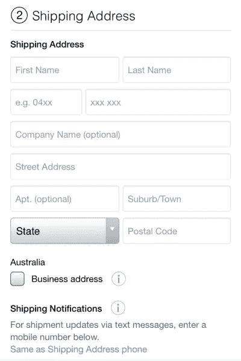
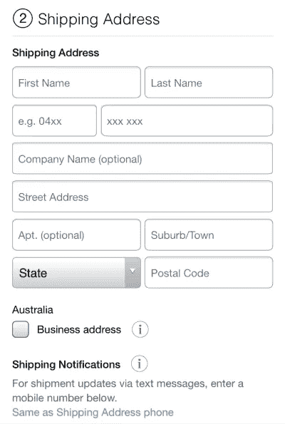
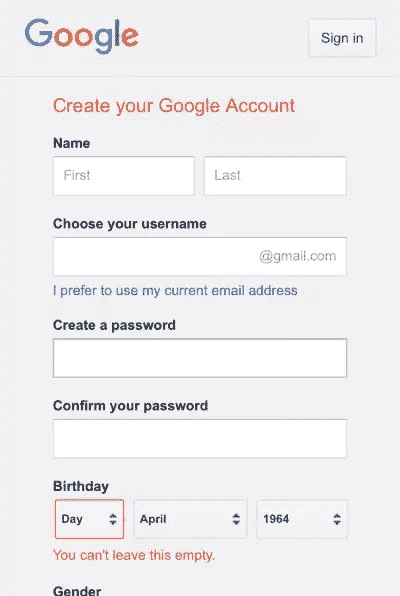
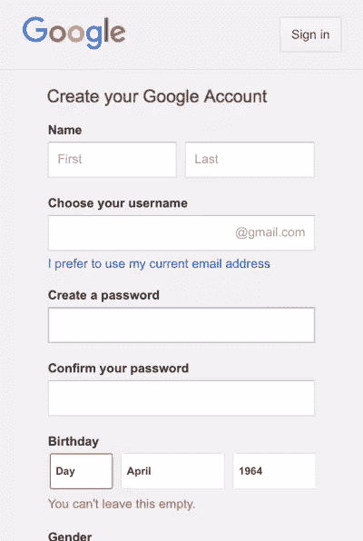
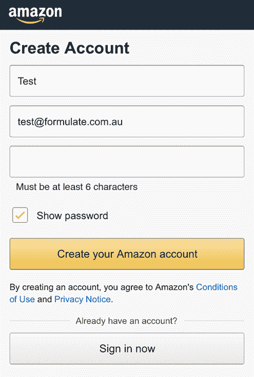
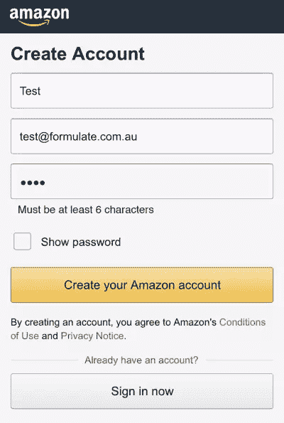
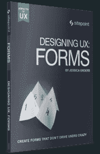

# 来自 UX:有时甚至苹果、谷歌和亚马逊也会犯错

> 原文：<https://www.sitepoint.com/form-ux-sometimes-even-apple-google-and-amazon-make-mistakes/>

杰西卡的新书《[设计 UX:网络表单](https://www.sitepoint.com/premium/books/designing-ux-forms)》(2016 年 9 月)刚刚出版。

*   在[站点点](https://www.sitepoint.com/premium/books/designing-ux-forms)上阅读
*   或者[从奥赖利那里获得你自己的副本](http://shop.oreilly.com/product/9780994347053.do)

有没有被要求设计出“像苹果一样漂亮”、“像谷歌一样简单”或“像亚马逊一样受欢迎”的东西？技术巨头的成功使他们成为客户的目标——在许多情况下，你最好向他们学习。

但是当涉及到表格时，即使是数字巨头有时也会出错。

## 苹果和可访问性

客户通常以提到苹果开始，所以让我们也这样做。苹果设计了极简现代的界面，包括它们的形式。图 1 给出了一个例子。

图 1–苹果送货地址表单

问题是:有时他们过于简约。

我四十多岁了，认为自己还很年轻。但是我的视力，和所有人一样，在我三十多岁的时候开始恶化。当然，许多人甚至更早就需要眼镜，而且各种年龄的人都使用屏幕放大镜，反转屏幕上的颜色，降低亮度等等。

对于所有用户都可以访问的表单，颜色之间必须有足够的对比度，尤其是文本和背景。Web 内容可访问性指南 2.0 版要求最低对比度为 4.5:1。灰色标签和白色背景之间的比例略低于 3:1。更糟糕的是，浅灰色文本框边框和白色背景之间的比例是 1.5:1。

所以苹果没有达到所有用户可访问性的最低标准。

图 2:对比度增加

*图 2* 显示了相同形状的替代设计，具有足够的对比度。还是极简，现在好用多了。

## 谷歌的所有颜色

像苹果一样，谷歌也有一个小的颜色问题。*图 3* 显示红色用于错误(见屏幕底部的生日)以及表单标题(靠近屏幕顶部的“创建您的 Google 帐户”)。

图 3: Google 帐户创建

另一个不寻常的区别是字段后面的背景颜色。在文本框中，背景是白色的，与灰色的表单背景形成鲜明的对比。然而，下拉菜单和表单有保存的背景颜色，使得这些字段很难看到。一些用户很可能会被这种不一致所拖累或困惑。

*图 3* 还显示生日是通过三个下拉框收集的:一个是日，一个是月，一个是年。这种方法可以减少——尽管不能消除——错误。但是这意味着用户要做更多的工作。出于各种原因，总的来说，三个文本框是更好的方法。看看这在*图 4* 中会是什么样子。

图 4:谷歌账户创建被调整。

## 亚马逊取得控制权

最后是亚马逊，二十多年来，他们一直在不断发展他们的形式。最近的一个变化是可以在他们的账户创建表单上显示密码(见*图 5* )。允许解密密码可以提高可用性并减少错误。如果实施得好，它对安全性的影响也很小，甚至没有影响——*不幸的是，亚马逊在这里真的没有注意到*。

图 5:默认情况下，Amazon 在屏蔽密码字段的下方显示您的密码。

亚马逊默认选择了“显示密码”选项。一个典型的用户会直接从上到下填写这些字段，然后震惊地看到他们的密码清晰地显示在他们被屏蔽的条目下面。到那个时候，附近的人可能也看到了。

没有人喜欢让他们感觉不受控制的意外行为。亚马逊从用户手中夺走控制权的另一种方式是隐藏密码要求。用户不得不猜测和测试潜在的密码，而不知道他们何时或如何触发错误或成功。将用户置于一个多么糟糕而又不必要的境地！

一个更好的方法是在表单上说明密码要求，并且默认不选择“显示密码”字段(见图 6 )。

图 6:重新设想的亚马逊账户创建

## 这些形成了设计见解和更多

表单是一种特殊的界面。它们无处不在，然而在公共领域对它们的了解却如此之少。它们的元素和交互都不同于所有其他界面。

事实上，上面提到的只是这些特殊表单问题的一个子集(占位符标签，有人知道吗？).除此之外，他们还做好许多事情。诀窍在于知道哪个是哪个。

好消息是有一本新书可以帮助你。你不需要成为一个技术巨人就能把表单做好，只要给自己拿一本“[设计 UX:表单](https://www.sitepoint.com/premium/books/designing-ux-forms)”就行了。我上面提到的每一个问题都在本书中有所涉及——更详细——还有更多。你将获得制作优秀表格的所有知识，即使是在一个团队中。

## 分享这篇文章