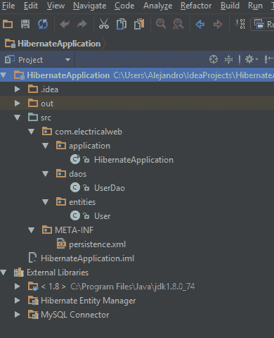

# Hibernate 简介——用简单的方法持久化 Java 对象

> 原文：<https://www.sitepoint.com/hibernate-introduction-persisting-java-objects/>

当谈到对象持久性时，JPA/Hibernate tandem 是那些一旦习惯了就再也不想离开的宝石之一。索本·让桑写了一篇关于这个主题的[精彩介绍](https://www.sitepoint.com/5-reasons-to-use-jpa-hibernate/)，列举了使用它的五个理由。(这不是本文的先决条件，但我仍然强烈建议您阅读一下。)在本教程中，我们将关注 Hibernate 的核心特性:持久化对象图。

## 为什么我们需要自动化持久化？–冬眠箱

让我们首先回答这个问题，为什么我们要使用一个框架来持久化应用程序数据。JDBC(Java 数据库连接)对我们来说不够好吗？

好吧，如果我们看看我们的应用程序保存的数据，我们通常会看到一个复杂的对象网络，也称为对象图，我们希望写入和读取一些存储，通常是关系数据库。不幸的是，持久化过程并不简单。将整个对象图转换成简单的表格数据绝非易事，使用简单的 JDBC 存储对象既痛苦又麻烦，因为该标准公开了一个底层 API。您知道，连接到数据库并从头开始编写 SQL 查询是非常好的。但是对自己诚实一点:你想一遍又一遍地做那件事吗？如果你和我一样，你就不会。

这就是[休眠](http://hibernate.org/ "Hibernate")的用武之地。除了许多其他事情，它允许我们创建保存数据的对象，称为实体，就像我们习惯的那样，并自动化读写它们的过程。

我们开始吧！

## 开发基本的 Java 应用程序——开始使用 Hibernate

开始驾驭 Hibernate 的一个好方法是创建一个简单的例子。为此，我打算开发一个简单的 Java 应用程序，其功能可以归结为对一些用户对象执行 [CRUD](https://en.wikipedia.org/wiki/Create,_read,_update_and_delete%20/%22CRUD) 操作。反过来，对象将从 MySQL 数据库中被持久化、获取、更新和删除。

为了让事情按预期进行，我们首先需要获得所需的 Hibernate ORM JARs，以及相应的 MySQL Java 连接器。Maven 将很好地为我们完成这项工作，因此我们可以专注于编码，而不是处理依赖性问题。

这是我的 POM 文件:

```
<?xml version="1.0" encoding="UTF-8"?>
<project xmlns="http://maven.apache.org/POM/4.0.0"
    xmlns:xsi="https://www.w3.org/2001/XMLSchema-instance"
    xsi:schemaLocation="http://maven.apache.org/POM/4.0.0
        http://maven.apache.org/xsd/maven-4.0.0.xsd">

    <modelVersion>4.0.0</modelVersion>
    <groupId>com.electricalweb.hibernatepplication</groupId>
    <artifactId>hibernateapplication</artifactId>
    <version>1.0-SNAPSHOT</version>

    <dependencies>
        <dependency>
            <groupId>org.hibernate</groupId>
            <artifactId>hibernate-core</artifactId>
            <version>5.2.2.Final</version>
        </dependency>

        <dependency>
            <groupId>mysql</groupId>
            <artifactId>mysql-connector-java</artifactId>
            <version>6.0.3</version>
        </dependency>
    </dependencies>
</project> 
```

在这个特殊的例子中，我将使用 [IntelliJ IDEA](https://www.jetbrains.com/idea/ "IntelliJ IDEA") 作为我的个人 IDE，但是这个项目可以很容易地在 [NetBeans](https://netbeans.org/ "Netbeans") 、 [Eclipse](https://eclipse.org/downloads/ "Eclipse") 或者你选择的 IDE 中创建。

有了 POM 文件，下面是这个示例应用程序的布局:



如上所示，应用程序的框架仅由三个包构成:`com.electricalweb.entities`，它包含对用户建模的域类，`com.electricalweb.daos`，它包含一个基本的用户 DAO 类，最后是`com.electricalweb.application`，它是应用程序的入口点。因为主要目标是在 MySQL 中持久化用户对象，所以让我们定义`User`域类。

## 定义持久实体——Hibernate 的核心特性

为了简单起见，域类将会非常缺乏，只有几个私有属性，`name`和`email`，以及一个参数化的构造函数和典型的 setter/getter。下面是我们讨论的这个类:

```
@Entity
@Table(name = "users")
public class User {

    @Id
    @GeneratedValue(strategy = GenerationType.AUTO)
    private int id;
    private String name;
    private String email;

    public User() {}

    public User(String name, String email) {
        this.setName(name);
        this.setEmail(email);
    }

    // getters and setters for name and email

} 
```

是的，你说得对。上面的类只是一个轻量级的数据容器，没有附加任何行为(请随意判断我是否犯了这个大罪)。这里唯一值得强调的细节是，为了使它对 Hibernate(或任何其他 JPA 实现)是持久的，它被标记了一个`@Entity`注释。此外，Hibernate 需要知道如何处理实体的主键。

为了解决这个问题，`@Id`和`@GeneratedValue(strategy = GenerationType.AUTO)`注释指示 Hibernate 为每个用户实体自动生成一个 ID，这个 ID 将被映射到相应数据库条目的主键。最后，`@Table(name = "users")`注释告诉 Hibernate 将类的实例映射到`users`表中的行。

已经定义了域类之后，启动并运行示例应用程序的最后一步是创建一个配置文件，名为`persistence.xml`，它将包含连接到数据库并将实体映射到数据库所需的所有数据。

## 访问数据库–创建持久性单元

毫无疑问，设置数据库连接参数以及其他 Hibernate 专有选项的最常见方式是定义前面提到的`persistence.xml`文件。相信我，这个过程很无聊，但是非常简单。

以下是该文件的典型版本:

```
<?xml version="1.0" encoding="UTF-8"?>
<persistence xmlns="http://java.sun.com/xml/ns/persistence" version="2.0">

    <persistence-unit name="user-unit" transaction-type="RESOURCE_LOCAL">
        <provider>org.hibernate.jpa.HibernatePersistenceProvider</provider>
        <class>com.electricalweb.entities.User</class>
        <properties>
            <property name="javax.persistence.jdbc.url" value="jdbc:mysql://localhost:3306/usersdb" />
            <property name="javax.persistence.jdbc.user" value="username" />
            <property name="javax.persistence.jdbc.password" value="password" />
            <property name="javax.persistence.jdbc.driver" value="com.mysql.jdbc.Driver" />
            <property name="hibernate.dialect" value="org.hibernate.dialect.MySQLDialect"/>
            <property name="hibernate.hbm2ddl.auto" value="update"/>
        </properties>
    </persistence-unit>
</persistence> 
```

正如您所看到的，该文件从上到下很容易阅读。它只设置了几个数据库连接参数，如果您以前使用过 JDBC，您应该很熟悉这些参数，包括数据库 URL、JDBC 驱动程序、数据库用户名和密码(确保为您自己的数据库服务器提供正确的值)。

此外，这是文件中最有趣的部分，它定义了一个*持久化单元*，这是一组持久化实体(在本例中只是用户，但也可能是包装在几个`<class>`标签中的多个实体)，由 JPA 实体管理器处理。考虑到在这种情况下 Hibernate 是选择的 JPA 实现，实体将由 Hibernate 的实体管理器管理。

如果您和我一样，此时您会渴望了解如何使用实体管理器对一些用户实体执行 CRUD 操作。放松点。下一节将深入讨论这个过程。

## 对实体执行 CRUD 操作——使用 Hibernate 的实体管理器

简而言之，在用户对象上运行 CRUD 操作比人们想象的要容易得多。整个过程可以归结为生成`EntityManager`并使用它的 API。真的就那么简单。

例如，我们可以使用应用程序的入口点，它是一个简单的类，有一个简单的静态`main`方法，并以下面的方式调用实体管理器:

```
EntityManager entityManager = Persistence
        .createEntityManagerFactory("user-unit")
        .createEntityManager();
EntityTransaction entityTransaction = entityManager.getTransaction();

/* Persist a User entity */
entityTransaction.begin();
User user = new User("Alejandro", "alejandro@domain.com");
entityManager.persist(user);
entityTransaction.commit();

/* Fetch a User entity */
entityManager.find(User.class, 1);

/* Update a User entity */
entityTransaction.begin();
User user = entityManager.find(User.class, 1);
user.setName("Alex");
user.setEmail("alex@domain.com");
entityManager.merge(user);
entityTransaction.commit();

/* Remove a User entity */
entityTransaction.begin();
User user = entityManager.find(User.class, 1);
entityManager.remove(user);
entityTransaction.commit();

entityManager.close(); 
```

很简单，不是吗？使用非托管实体管理器保存、获取、更新和删除用户实体是一个无需动脑的过程，可以在几分钟内掌握。该过程仅限于首先通过一个`EntityManagerFactory`获取管理器，然后获取一个`EntityTransaction`类的实例，最后调用实体管理器的所需方法。

上面的代码片段假设已经定义了一个名为`users`的 MySQL 数据库表，以及一个运行在本地服务器上的 MySQL 实例。因此，请确保在测试示例应用程序之前设置好它。

至此，您有望了解到用 Hibernate 持久化单个实体背后的基础知识。那么，接下来是什么？嗯，实际上很多。您可能已经注意到，我忽略了与其他实体有特定关系的持久化实体(是的，关系方面)。我故意这样做，是为了让整个学习过程摆脱额外的、不必要的复杂性。毕竟，这只是一个开始使用 Hibernate 的介绍。

尽管如此，我还是想稍微润色一下这个演示，因为在它当前的状态下，它看起来相当单一，并且它的执行流程不能通过用户界面来控制。

考虑到这一点，我接下来要做的是定义一个 [DAO](https://en.wikipedia.org/wiki/Data_access_object/ "DAO") 类，它将封装实体管理器和实体事务的处理，隐藏在声明性 API 的围栏后面。最后，您将看到如何根据在 Java 控制台中输入的选项，使用该类有选择地对用户实体执行 CRUD 方法。


## 添加一个不错的 API——定义一个 DAO 类

相信我。我不是设计模式的盲目崇拜者，在没有强烈理由的情况下到处使用它们。然而，在这种情况下，利用 [DAO 模式](https://en.wikipedia.org/wiki/Data_access_object "DAO Pattern")提供的功能是值得的，因此您可以不费力地尝试一下前面的例子。

简而言之，下面的`UserDao`类所做的就是定义一个容易使用的 API，它允许在给定的用户实体上执行 CRUD 方法。这个类看起来是这样的:

```
public class UserDao {

    private EntityManager entityManager;
    private EntityTransaction entityTransaction;

    public UserDao(EntityManager entityManager) {
        this.entityManager = entityManager;
        this.entityTransaction = this.entityManager.getTransaction();
    }

    public void persist(String name, String email) {
        beginTransaction();
        User user = new User(name, email);
        entityManager.persist(user);
        commitTransaction();
    }

    public User find(int id) {
        return entityManager.find(User.class, id);
    }

    public void update(int id, String name, String email) {
        beginTransaction();
        User user = entityManager.find(User.class, id);
        user.setName(name);
        user.setEmail(email);
        entityManager.merge(user);
        commitTransaction();
    }

    public void remove(int id) {
        beginTransaction();
        User user = entityManager.find(User.class, id);
        entityManager.remove(user);
        commitTransaction();
    }

    private void beginTransaction() {
        try {
            entityTransaction.begin();
        } catch (IllegalStateException e) {
            rollbackTransaction();
        }
    }

    private void commitTransaction() {
        try {
            entityTransaction.commit();
            entityManager.close();
        } catch (IllegalStateException e) {
            rollbackTransaction();
        }
    }

    private void rollbackTransaction() {
        try {
            entityTransaction.rollback();
        } catch (IllegalStateException e) {
            e.printStackTrace();
        }
    }
} 
```

老实说，如果我不向您展示如何在一个具体的案例中使用这个类，这个额外的抽象层(和复杂性)就没有多大意义。因此，检查下面的代码片段，它利用了[依赖注入](https://en.wikipedia.org/wiki/Dependency_injection/ "Dependency Injection")的好处。

```
public class HibernateApplication {

    private final UserDao userDao;
    private final BufferedReader userInputReader;

    public static void main(String[] args) throws Exception {
        EntityManager entityManager = Persistence
                .createEntityManagerFactory("user-unit")
                .createEntityManager();
        UserDao userDao = new UserDao(entityManager);
        BufferedReader userInputReader = 
                new BufferedReader(new InputStreamReader(System.in));
        new HibernateApplication(userDao, userInputReader).run();
    }

    public HibernateApplication(UserDao userDao, BufferedReader userInputReader) {
        this.userDao = userDao;
        this.userInputReader = userInputReader;
    }

    private void run() throws IOException {
        System.out.println("Enter an option: "
                + "1) Insert a new user. "
                + "2) Find a user. "
                + "3) Edit a user. "
                + "4) Delete a user.");
        int option = Integer.parseInt(userInputReader.readLine());

        switch (option) {
            case 1:
                persistNewUser();
                break;
            case 2:
                fetchExistingUser();
                break;
            case 3:
                updateExistingUser();
                break;
            case 4:
                removeExistingUser();
                break;
        }
    }

    private void persistNewUser() throws IOException {
        String name = requestStringInput("the name of the user");
        String email = requestStringInput("the email of the user");
        userDao.persist(name, email);
    }

    private void fetchExistingUser() throws IOException {
        int id = requestIntegerInput("the user ID");
        User user = userDao.find(id);
        System.out.print("Name : " + user.getName() + " Email : " + user.getEmail());
    }

    private void updateExistingUser() throws IOException {
        int id = requestIntegerInput("the user ID");
        String name = requestStringInput("the name of the user");
        String email = requestStringInput("the email of the user");
        userDao.update(id, name, email);
    }

    private void removeExistingUser() throws IOException {
        int id = requestIntegerInput("the user ID");
        userDao.remove(id);
    }

    private String requestStringInput(String request) throws IOException {
        System.out.printf("Enter %s: ", request);
        return userInputReader.readLine();
    }

    private int requestIntegerInput(String request) throws IOException {
        System.out.printf("Enter %s: ", request);
        return Integer.parseInt(userInputReader.readLine());
    }

} 
```

如上所示，`HibernateAplication`类接受在控制台中输入的四个不同的值。根据给定的输入，它使用 DAO 在用户实体上运行特定的 CRUD 操作。不用说，这个修改后的例子的逻辑是不言自明的，所以任何进一步的分析都是多余的。因此，请确保在您自己的开发平台上尝试一下，并根据您的个人需要随意修改它。

## 最后的想法

在本教程中，我向您介绍了使用 Hibernate 在数据库中持久化实体的简明指南。自然，这个框架是一个强大的野兽，它提供的不仅仅是普通的 ORM 功能，包括全文搜索功能、[地理定位](https://en.wikipedia.org/wiki/Geolocation/ "Geolocation")、[域模型](https://en.wikipedia.org/wiki/Domain_model/ "Domain Models")验证等等。由于显而易见的原因，在一篇文章中涵盖所有这些特性不仅不可能，而且不切实际。当然，如果您想测试示例应用程序并随意修改它，可以随意从 git lab(https://gitlab.com/alejandrogervasio/hibernate.git)克隆存储库

无论如何，如果你是 Hibernate 的新手，并且想马上开始使用它，这篇指南有望成为一个好的起点。请随时给我留言。我会尽量及时回复。下一篇文章再见！

## 分享这篇文章