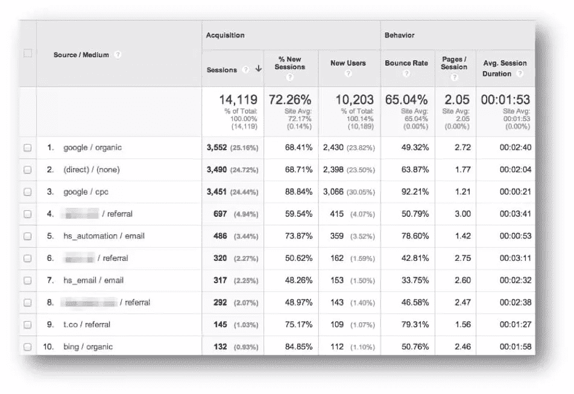
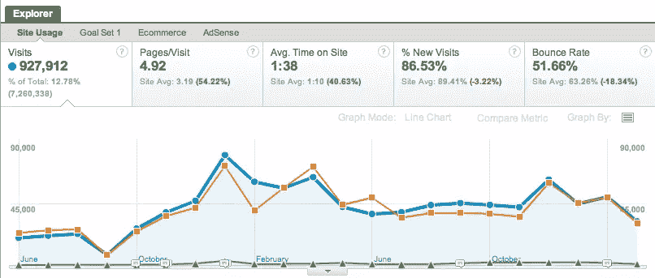

# 持续的 UX 基准如何帮助你避免 UX 噩梦

> 原文：<https://www.sitepoint.com/how-constant-benchmarking-ux-helps-you-avoid-disasters/>

<small>红潮——1995 年:丹泽尔·华盛顿&吉恩·海克曼</small>

如果你曾经看过任何一部海底电影——比如《赤潮热》、《T2》、《猎杀红色十月》——有一种声音你会*永远*听到。那个空洞的、闪闪发光的‘乒’!..平！..'声音。

当然，那是潜艇用来航行于最深、最暗的海洋的主动声纳的声音。每一个脉冲通过水面发射出去，从障碍物上反弹回来，勾画出车辆周围世界的最新视图。

潜艇使用持续测试系统——如果这些脉冲停止，潜艇实际上是盲目的。

UX 测试也没什么不同。

*   企业如何知道一个网站或软件的用户体验(UX)的改变是否有影响？
*   他们如何知道某个特定的网页是否比以前产生了更多的客户投诉？
*   企业如何衡量任何 UX 设计元素的成功？

必须经常测量它们。

一个不经常对其 UX 元素进行基准测试的企业就像一艘只发出一声“乒”的潜艇。他们可能知道一些他们周围正在发生的事情，但是细节会很快消失，他们在应对变化时会有很大的困难。

UX 设计涵盖了如此广泛的软件和网站元素，以至于将其作为一个整体来衡量可能会很复杂，但将其分解为单个元素并进行衡量可以提供大量有价值的信息。

企业还需要设定他们的 UX 基准，以便能够衡量 UX 元素变化的成败。没有一个衡量统计数据的基准，它们就相对没有价值。旧的基准可能是有用的信息，但是您必须经常更新当前的性能基准以保持有用。

## 了解您的关键指标

虽然 UX 设计在快速发展的数字世界中仍然是一个相对较新的概念，但公司已经发现了衡量其许多方面性能的指标。其中一些源自客户体验研究的相似方面和物理业务层面的映射，另一些则完全是 UX 独有的。

[根据公司的具体目标](https://www.usability.gov/what-and-why/benefits-of-ucd.html)，需要测试不同的用户体验元素，并收集不同的测量数据。如果目标是提高某个元素的性能，他们可以考虑:

*   用户错误或客户投诉数量的变化。
*   增加或减少元素的易用性。
*   学习使用设计方面的难度变化。

增加软件或网站曝光率的目标是常见的，可以通过以下方式衡量:

*   注意流量、互动次数和受众规模的变化。
*   意识到回头客访问的增加或减少(客户保持)。
*   标记新客户访问量的变化(客户吸引力)。
*   注意从搜索引擎进入网站的新流量。

使用谷歌图行来衡量 UX 的表现随着时间的推移。下面是 Google Analytics 如何通过各种指标衡量用户互动的例子。

<small>[转换室亚太博客](http://conversionroom-japac.blogspot.in/2011/04/new-google-analytics-quick-insights.html)</small>

如果客户打算与网站开展业务，网站需要值得信赖。您可以通过注意以下几点来衡量可信度:

*   客户满意率的变化
*   用户在网站中显示的信任度
*   推荐访问次数的增加或减少(用户转化)

减少网站或软件所需的资源总是一件好事。牢记这一目标，公司应该衡量:

*   总开发成本
*   开发时间的变化
*   维护、重新设计和其他支持成本的增加或减少
*   基本培训要求的减少或增加
*   必要文件的数量

最后，增加销售的目标可以通过测量交易、购买或产品销售数量的变化来监控。您应该努力保持对这些关键指标的持续监督。

## 收集用户信息的方法

与 UX 测量方法变化如此之大的原因相同，用户体验数据的收集方法也必须多样化。不同的信息将来自不同的来源——从简单的监控工具中可以很容易地收集到流量、访问量、销售额和其他类似的数字数据。然而，UX 不仅仅关心统计数据。

UX 的研究和设计是以客户为中心的，收集客户数据可以通过不同的方法来完成。

### 背景面试

观察用户与你的网站或软件的互动。他们试图完成什么任务，他们如何着手完成这些任务？用户体验设计师可以使用这种方式获得的信息来了解客户偏好，任务是如何完成的，以及其他类似的现实世界的考虑因素。情境访谈为公司提供了用户对其服务看法的反馈。

### 不要忽视焦点小组

作为一种基于脚本的信息收集方法，焦点小组可能不会像情境访谈那样捕捉到很多细微的测量，但他们可以快速收集公司认为有价值的信息。焦点小组也有利于初步评估和回答具体问题。

### 知道如何制作原型

这种形式的信息收集为 UX 元素的初始性能提供了重要的第一基准。原型制作不是单独完成的，而是与其他类型的信息收集结合在一起完成的。事实上，与其说原型制作是一种信息收集的方法，不如说它是在选择继续项目之前收集信息的时间。

### 进行彻底的 A/B 测试

这种类型的信息收集用于在两个或更多选项之间做出决定。它是一个网站、服务、UX 元素或软件中各种变化的性能之间的并排或背靠背的比较。

下表举例说明了如何追踪你的用户来自哪里，他们是如何找到你的，以及哪些营销方法在起作用。

这些收集 UX 信息的方法最好在真实用户中进行，但大多数也可以在假设的目标客户中进行。

## 明智地使用 UX 测量值

为什么对 UX 性能进行基准测试和频繁测量如此重要？

因为它允许企业监控他们的客户群，并且允许改进他们的客户与他们的网站或软件的交互。然而，这只是衡量 UX 的明显好处。测量 UX 会带来一些企业可能没有意识到的好处。

第一个好处是在更广泛的用户体验中跟踪特定的目标。知道你在年底获得了利润和大量的流量是很好的，但不是很有用。测量特定用户体验元素的性能允许创建更多信息的报告和设置更具体的改进目标。

知道*UX 的变化是如何增加流量或销售额的，比简单地意识到它的发生要好。*

更好地激励用户体验设计团队的好处与了解特定 UX 元素的性能密切相关。同样，仅仅知道总体表现良好并没有太大帮助。为了激励 UX 设计师，经理需要能够指出做得非常好的具体领域，并给予适当的表扬，或者告诉设计师这个领域或那个领域需要更多的工作。员工在反馈中茁壮成长，测量 UX 元素允许为他们工作的员工提供反馈。

花大量时间衡量 UX 可以帮助企业采纳一种更加以用户为中心的文化。一些企业非常善于从客户的角度看问题，并据此做出商业决策。其他公司更专注于其他事情，他们的客户因此遭受损失。

最后，基准用户体验允许企业做出更好的设计决策。一个网站或软件的设计应该关注客户如何与它互动，对设计的任何改变都需要根据它对客户的影响来衡量。如果没有以前客户交互信息的基准，设计变更的结果很难评估。此外，了解在一个领域中哪些工作可以显著改善用户体验，对于推动其他领域的设计变革也很有用。

在 UX 设计中，标杆管理和绩效评估与在其他商业元素中一样必要，而且比其中一些更有必要。没有基准和持续的测量，企业很大程度上对他们的成功和失败视而不见。UX 测量也可以有一些令人惊讶的好处，可以推动设计决策，并影响整个企业。

## 分享这篇文章