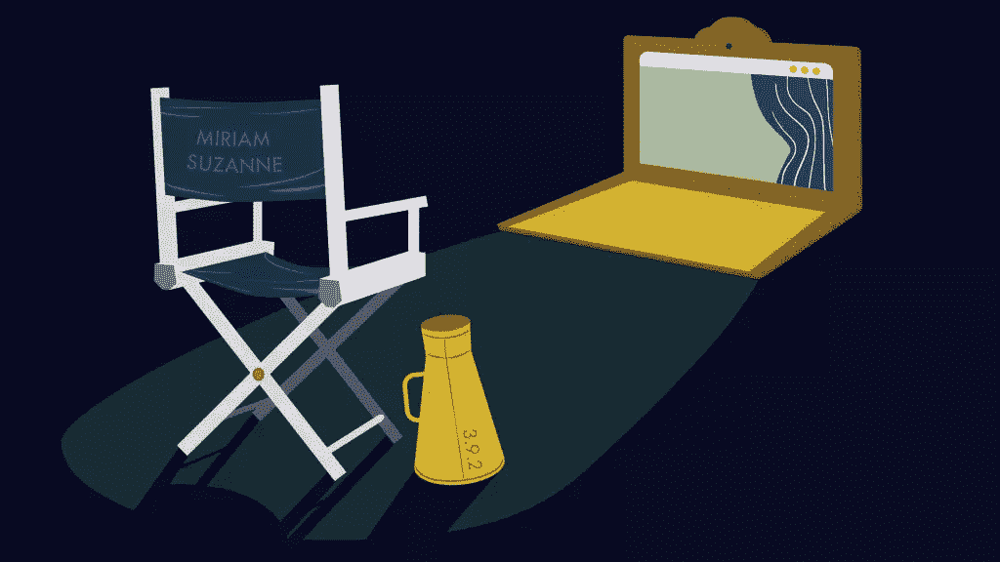

# 萨斯，苏西，单元测试，和找到你的声音，与米里亚姆·苏珊娜

> 原文：<https://www.sitepoint.com/versioning-show-episode-8-miriam-suzanne/>

在这一集的版本控制节目中，Tim 和 David 加入了 Miriam Suzanne，她因 Susy 而闻名，Susy 是一个针对 Sass 的响应性布局工具包。他们讨论了从一个潜伏者到发现你的声音，写下你所学的东西的重要性，偶然成名，接近新项目，以及 Sass 中的单元测试。

[https://w.soundcloud.com/player/?url=https%3A//api.soundcloud.com/tracks/282805438&color=ff5500&auto_play=false&hide_related=false&show_comments=true&show_user=true&show_reposts=false](https://w.soundcloud.com/player/?url=https%3A//api.soundcloud.com/tracks/282805438&color=ff5500&auto_play=false&hide_related=false&show_comments=true&show_user=true&show_reposts=false)

[访问版本控制展示主页](https://www.sitepoint.com/versioning-show/)

**[在 iTunes 上订阅](https://itunes.apple.com/us/podcast/the-versioning-show/id1135300597) | [在 Stitcher 上订阅](http://www.stitcher.com/podcast/sitepoint/the-versioning-show) | [查看所有剧集](https://www.sitepoint.com/blog/)**

## 显示注释

*   [oddbird.net](http://oddbird.net/)
*   米里亚姆在推特上:[@米里苏珊娜](https://twitter.com/mirisuzanne)
*   [MiriamSuzanne.com](http://www.miriamsuzanne.com/)
*   [清晰度会议](http://clarityconf.com/)
*   [干旱](http://susy.oddbird.net/)
*   [克里斯·爱普斯坦](https://twitter.com/chriseppstein)
*   娜塔莉·唐恩
*   娜塔莉·唐恩 2008 年关于[编写可维护 CSS](http://www.slideshare.net/nataliedowne/css-systems-presentation) 的演讲
*   埃里克·迈耶的 [css/edge](http://meyerweb.com/eric/css/edge/)
*   雷切尔·纳伯斯
*   [真](http://oddbird.net/true/)，Miriam 的 Sass 单元测试工具
*   米里亚姆在旧金山 Clarity 网站上的演讲
*   米里亚姆以一盒索引卡的形式发行的小说《骑马》
*   更多 Twitter 链接:[@ mdavidling](https://twitter.com/mdavidgreen)|[@ tevko](https://twitter.com/tevko)|[@ versioningshow](https://twitter.com/versioningshow)|[@ sitepointdotcom](https://twitter.com/sitepointdotcom)

## 谈话要点

> 我认为在某些方面是自信的问题。我是个潜伏者，因为我认为我的声音不重要，或者我没有发言权。然后在某个时候，我周围的萨斯变得很大。它变大的时候我碰巧在玩它。我偶然成为某方面的专家。我必须在精神上赶上。在我还没准备好发表意见之前，人们就想听听我的意见，我也一直在想办法表达我的意见，并适应这个角色。

* * *

> 我看到这些人是标准的传播者。他们总是给我灵感，我想，<q>我会喜欢的。那会很有趣。我可以成为标准的传播者。我不知道。</q>现在，我想我是一个错误的说教者。

* * *

> 我的方法是收集尽可能多的信息，并开始写下来。我的感觉是，你不去找一个糟糕的初稿，而是去找一堆糟糕的东西。没关系。你满脑子都是东西。点击维基百科上的链接——任何与你想去的地方相关的链接。你拥有的相互联系的信息越多，你就越有可能建立有趣的联系。

* * *

> 我会说写下你在做某事中学到的东西。我认为这永远是最有趣的分享。我和我团队中的许多人谈过，他们说他们最喜欢的博客帖子是新手写的，因为当他们是新手时，这些帖子是最有用的…如果你想出了什么，你可能会认为在你之前已经有一百万人想出了。但是他们没有写出来。

* * *

> 我想我从很大程度上来说是这样的:我弄清楚我想要创造什么，然后我就弄清楚我需要什么技术来实现它。因此，最终产品是第一位的，或者说，最终产品的想法先于对某项技术的兴趣。

## 副本

Tim:

嘿。大家好吗？这是蒂姆·埃夫科…

David:

…这位是大卫·格林先生…

Tim:

…您正在收听的是版本控制播客的第 8 集。

David:

这是一个我们聚在一起讨论网络产业的地方，从开发到设计，加上一些今天让它发生的人和计划它在下一个版本中走向哪里的人。

Tim:

今天，我们将与 Miriam Suzanne 谈论她的背景，她最近在做什么，我们今天将谈论 Sass，这是一个令人兴奋的工具，我一直在使用它。

所以，让我们继续，这个版本开始了。

David:

米里亚姆，你今天过得怎么样？

Miriam:

我很好。你好吗

Tim:

太棒了。很高兴见到你。

Miriam:

是啊。你也是。我很高兴来到这里。

Tim:

几个月前，我在旧金山的 [Clarity Conference](http://clarityconf.com/) 上看过你的演讲，我真的很想见到你，和你谈谈你在设计系统和设计开发背后的哲学。

Miriam:

让我们开始吧。

David:

酷毙了。首先，因为这是版本控制秀，我们想问所有来宾一个哲学问题。我们的哲学问题是这样的:在你目前的职业生涯中，你是什么版本，为什么？

Miriam:

我将把 3 中的某个地方称为主要版本。然后大概就像 3.9 什么的。我不知道。3.9.2.可能里面有一些错误修正。

Tim:

酷毙了。这是你在尝试了一系列不同的事情后得出的结论吗？

Miriam:

我不知道。我只是觉得我的职业生涯在各个阶段都发生过。第一个我是潜伏者，然后突然我不是了。那发生得很快，我没有注意到。从那以后，随着我——我不知道——变得舒服起来，找到了自己的归属，继续自己的职业生涯，事情发生了一些变化。

Tim:

你如何描述一个潜伏者和你现在所处位置的区别？

Miriam:

我认为在某些方面是自信的问题。我是个潜伏者，因为我认为我的声音不重要，或者我没有发言权。然后在某个时候，我周围的萨斯变得很大。它变大的时候我碰巧在玩它。我偶然成为某方面的专家。我必须在精神上赶上。在我还没准备好发表意见之前，人们就想听听我的意见，我也一直在想办法表达我的意见，并适应这个角色。

Tim:

Miriam，我今天早些时候看了你的博客，你写了很多非常有趣的关于开发和其他方面的文章和博客。你是怎么开始做这些的？

Miriam:

具体的发展，还是艺术方面的东西？

Tim:

是啊，非常有趣。让我们从发展开始，然后让我们转到艺术，因为这听起来也很有趣。

Miriam:

你是指我最近用 SitePoint 发布的关于代码和写书的博客吗？是啊。当我意识到人们正在使用我制作的工具，并且他们对我要说的内容感兴趣时，这又是那次意外转变的一部分。我认为实际上我喜欢做的一件事是玩新玩具，然后向人们展示我学到的东西，并从其他人那里获得信息。

我被扔进了开源世界。Susy 只是我为自己写的一个小东西，因为它在我的客户工作中很有用。我没有 GitHub 账户。我对开源了解不多，我哥哥把它放到 GitHub 上说，<q>给你。你现在是一个开源贡献者。你不是维护者。祝你好运。</q>

这就是我的 GitHub 账户的开始，我非常喜欢它的工作方式。那时，只有几个人在关注，我想克里斯·埃普斯坦也没什么更好的事情可做。我从处于低风险环境中的人那里得到了一些快速、良好的反馈，我真的很喜欢这样。

我喜欢来来回回，提出我的想法，然后从社区得到很多批评，做出改变和调整。我觉得那很有趣。

David [4:05]:

苏西真是个好主意。我不知道是否我们所有的听众都熟悉它，但我很熟悉，因为我实际上在大约两年，也许三年前的一个项目中使用过它。我喜欢它的地方在于，它是一个网格系统，不需要将整个页面作为一个整体布局。这是一个有趣的方法。我很好奇你是怎么想出来的。

Miriam:

没有什么是我独有的。我正在用一种我在娜塔莉·唐恩的演讲中看到的方法。我记得她在 2008 年做过一次关于[构建系统而不是使用现有框架](http://www.slideshare.net/nataliedowne/css-systems-presentation)的演讲。构建系统、语言、工具，你可以在不同的项目中重复使用，它们将会非常简单。

我用她的系统设计版面。它非常灵活。在内部使用流体网格，然后将它们放入弹性容器中。我真的很喜欢这种方法，但它需要大量的数学运算。不是很难的数学，而是很多数学，我不喜欢做。所以我开始抱怨，并询问是否有更好的方法。有人给我看了克里斯·埃普斯坦关于无礼的视频。我只是把娜塔莉的东西放在 Sass 里，说:【to】太好了。那对我很合适。在那一点上真的很简单。这是两个方程式。

David:

我想这对我们大多数人来说都很有效。

Miriam:

太好了。

David:

那是你第一次接触 Sass 吗，还是在那之前你已经做过很多 Sass 了？

Miriam:

在那之前我什么都没做过。我和萨斯玩的第一个晚上就写了苏西。这是我想用 Sass 的唯一原因。这听起来令人震惊，因为 Susy 变得又大又复杂。在那一点上，它不是很大也不复杂。这是两个混合和几个变量。已经有了网格系统。我看了看其他网格系统是怎么做的，然后我说，<q>好吧，我要拿这些东西，我要用娜塔莉·唐恩的方法来代替。</q>

David:

非常酷。你真的比很多人无礼得多。我很好奇，萨斯到底吸引了你什么？

Miriam:

是啊，这是个好问题。我认为我喜欢做一名程序员，并且我不理解做一名完全抽象的程序员。我不喜欢玩数据，但是我喜欢设计东西。所以对我来说，落在中间的某个地方是有意义的，我可以玩逻辑结构和编程，但以一种我可以看到最终结果的方式。我可以看到一个网格布局。我能看到一些东西在我面前复活了。对我来说，这是一个很好的组合。所以我喜欢玩它。

我不得不说，我进入 CSS 的方式是有人早些时候在 Eric Meyer 的 [css/edge](http://meyerweb.com/eric/css/edge/) 页面上指点我。我不知道你是否还记得，他在那里用 CSS 做奇怪的实验。这一直是我喜欢的。我说，<q>哦，你可以用这个做实验。让我们开始吧。</q>

David:

回顾一下，我很感兴趣的是你是如何开始进入编程的，是什么让你喜欢上它的？

Miriam:

是啊。我有一个戏剧公司需要一个网站，我让我哥哥给我建一个网站，他拒绝了。所以，就这样了。我必须学习。我建了那个网站，然后给自己建了一个，然后我想我的几个朋友要了网站。然后我突然有了一个客户，然后有了一份工作，就这样开始了。事实证明它比剧院更赚钱！

David:

我喜欢这样。我们发现，在编程方面，我们在这里交谈的许多人基本上都是自学的。虽然我知道你也有音乐背景，有时这两者是相辅相成的。

Miriam:

是啊，那看起来真的很受欢迎。我觉得——特别是在设计会议上——有更多的人举起了有音乐理论背景或某种音乐背景的手，而不是编程或计算机科学。

Tim:

你一直都没有释怀。我相信，当你作为一名程序员工作时，你已经设法保持这种活跃。

Miriam:

是啊。部分原因是我一直认为程序员是一份兼职，这也是我长期潜伏的部分原因。我没把自己当成程序员。我没有在程序员社区里闲逛。我是个艺术家。当我搬到丹佛时，我遇到了艺术家。我所有的朋友都是音乐家和戏剧人。突然，我有了一群追随者，我不得不开始重新思考我是谁。但是艺术并没有离开。这仍然是主要任务的一部分。我认为它对我来说是同一件事的一部分。我也在玩同样的想法。我在和观众互动。我在积累经验。我不知道。我喜欢这一切，感觉这一切都联系在一起。

Tim [8:34]:

我实际上只是想问你，艺术和编程这两者，你有没有发现它们相互影响，帮助你想出一个或另一个的想法？

Miriam:

是啊。我觉得学习成为一名专业创意人员真的帮助了我的私人创意。我学会了如何使用流程。在某种程度上，这是你无论如何都必须在剧院学习的东西，因为你是在和群体打交道，这不同于——许多画家不需要以同样的方式学习过程，但是在剧院你必须把 15 个人聚集在一起创作一件艺术品。

所以——成为剧院的导演，然后成为项目经理和技术设计师——这是一个平稳的过渡。感觉就像，<q>好的，这些是非常相似的东西。与团队合作。试图激励他们。正在尝试编辑。在发布之前，尝试获得更好的工具。</q>然后它以另一种方式返回，说<q>是的，我学会了如何在截止日期前有想法，如何让灵感发生，因为我明天就需要它。</q>

David:

我想这也会转化为你在开源社区所做的工作，因为再次，协调你从未见过的远程人员团队一起工作在一个项目上，这对许多人来说是一个挑战。

Miriam:

是啊。不过，从某些方面来说，这是我从来没有处理过的事情。我偶尔会给苏西投稿。我偶尔也有一些其他人成为定期贡献者，但从来没有达到我真正以那种方式管理团队的规模。

所以我不知道这是否是我在 Susy 或我的其他工具周围运行社区时犯的一个错误。我对此很好奇，我正在考虑尝试做一些改变，看看是否有更多的人加入进来，以及我们可以建立什么样的团队。

David:

这很有意思，因为每个人都有不同的方法去做适合自己的事情，我不确定这种事情有对错之分。

Miriam:

是啊。

Tim:

我肯定有人在听，他们觉得自己处在一个需要灵感的地方，因为他们明天就要截止了。你能给处于这种情况的人一些建议或提示吗？

Miriam:

是啊。我的方法是收集尽可能多的信息，并开始写下来。我的感觉是，你不去找一个糟糕的初稿，而是去找一堆糟糕的东西。没关系。你满脑子都是东西。点击维基百科上的链接——任何与你想去的地方相关的链接。你拥有的相互联系的信息越多，你就越有可能建立有趣的联系。

我特别喜欢跟一个环节走得太远。所以我会说，嗯，好吧。我跟着一个链接来到这里，但这仍然是相关的。加关注多一个链接。它把我带到一个完全意想不到的地方，看看我们如何把它和第一个联系起来。那一个环节太远，最终会成为逻辑上的失误，你需要有一个创造性的灵感。

David:

我不知道。上一次我这样做的时候，我发现自己凌晨 2:30 还在看《史蒂文宇宙》的剧集。

Miriam:

看到了吗？所以是成功的。很好。

*【笑声】*

David:

绝对的。我喜欢你将创造力融入到工作过程中。你工作的技术方面也是如此吗？作为一个自学成才的人，除了 Sass 之外，你是否特别喜欢某些技术？

Miriam:

嗯，可能吧。我想我从很大程度上来说是这样的:我弄清楚我想要创造什么，然后我就弄清楚我需要什么技术来实现它。因此，最终产品是第一位的，或者说，最终产品的想法先于对某项技术的兴趣。

我对很多事情都感兴趣，比如我希望我能更多地了解动画。我需要关注瑞秋·纳伯斯所做的一切，因为这太棒了。像这样的事情我想学的很多，但是我只是需要一个项目来吸引它们并让我去做。

David [12:12]:

是什么吸引了你喜欢出门演讲？因为你一直在做演讲和报告。这不是每个人都会做的事。

Miriam:

是啊。这是最初发现的一部分，即这可能是我喜欢的一件事:不仅仅是在我的客厅——或我刚开始时在我的卧室——私下制作这些东西，而是实际上走出去，与人们交谈，了解其他人如何使用它，以及我如何能让它变得更好。它的互动部分令我兴奋。

人们不停地问我在想什么，所以我开始告诉他们。所以我真的很享受。我的意思是，我在某一点上看到——我想回到我大部分时间潜伏的时候——我看到这些人是标准的传播者。他们总是给我灵感，我想，<q>我会喜欢的。那会很有趣。我可以成为标准的传播者。我不知道。</q>现在，我想我是一个错误的说教者。

David:

我相信，也是一个关注点分离的传道者。

Miriam:

是啊。确实如此。

Tim:

我认为我是一个<q>对我的老板们大喊大叫的采纳绩效福音传道者</q>。

Miriam:

太好了。

David:

我很擅长这个。

*【笑声】*

Tim:

很有趣，因为你一直在研究这么多东西。我很好奇你现在在做什么我们可能还没听说过的东西。

Miriam:

是啊。我不知道有多少人听说过更新的玩具。[真实](http://oddbird.net/true/)是我认为 Sass 中最有生命力，但也是小众受众最少的一个。我真的很好奇那会通向哪里。这是一个用于 Sass 的单元测试工具，我认为它对大多数 Sass 项目没有用。大多数 Sass 项目都是在设计一个站点，没有办法在 Sass 中进行单元测试。如果你正在做的事情使用了很多函数或混合函数，以某种方式操作了很多变量，那么单元测试是有用的。

因此，这是一个真正针对像我这样正在构建 Susy 或其他 Sass 工具的人的工具。希望对人有用。我认为 Susy 有保质期。我还是很惊讶它对人有用。我觉得它几年前就会死去。只是布局技术发生了变化。浏览器越来越擅长处理布局。当 Susy 第一次出现时，它正在处理大约 10 种不同的黑客攻击，以使所有的浏览器协同工作。你只是不再需要那个了。

所以 Susy 有保质期，但是单元测试没有。这在萨斯的世界里只会越来越有用。不过是小众。

David:

我很欣赏这一点，而且我认为肯定有人可以利用这样的事情。我想，这是你不会接触到的东西，除非你在社区中，真正地和人们一起工作。

Miriam:

是啊。我正在使用的其他工具是一套模块化的站点配置工具包，一套用于处理颜色，一套用于处理大小，一套用于处理字体，我还没有公开展示过(我在你提到的 Clarity 会议上开始有一点点展示过)，通过这种方式，机器和人类都可以找到可读的信息。这意味着你可以从它自动生成风格指南。你的文件中有一个真实的来源。我发现这些很有趣，但在我认为它们会广泛流行之前还有一段路要走。

David:

那么，对于那些也可能被福音传道吸引的听众，你如何建议人们审视他们的工作和他们正在做的事情，并进入那个阶段？

Miriam:

是啊。我会说写下你在做某事中学到的东西。我认为这永远是最有趣的分享。我和我团队中的许多人谈过，他们说他们最喜欢的博客帖子是新手写的，因为这些帖子对新手来说是最有用的。你是如何安装这个新工具的？你是怎么让它工作的？你第一次是怎么用的？那些帖子对人们真的很有用。如果你想出了什么，你可能会认为在你之前已经有一百万人想出了。但是他们没有写出来。如果你想通了，把它写下来，与人分享。这总是有用的，你不需要成为一个专家。事实上，许多专家演讲者甚至在知道主题之前就提出了演讲。他们会选择一个他们想学的话题，他们会提出一个关于这个话题的演讲，然后他们会去学。这是一个很好的方法。每个人都可以使用它。

Tim [16:15]:

顺便说一下，我想我确实学到了一些新的东西，关于如何提议谈话。也许我会试一试！

是啊。这是非常有益的。非常感谢你的来访。人们怎样才能找到你，和你说话，跟踪你，做所有这些事情？

Miriam:

是啊。你可以去[oddbird.net](http://oddbird.net/)，你会在那里找到很多链接。我在推特上也是 [@mirisuzanne](https://twitter.com/mirisuzanne) ，或者你可以找到我的网站【MiriamSuzanne.com。

David:

非常好。我们肯定会在展示笔记中放上所有这些的链接。米里亚姆，非常感谢你今天过来和我们谈话。

Miriam:

绝对的。谢谢你。

*【音乐插曲】*

David:

自从我看了米里亚姆在 Clarity 的演讲后，我就一直期待着与她见面。这太有趣了。

David:

是啊。真的是。我没见过她演讲，但我当然很感兴趣，因为我在 Sass 社区认识她。我一听说这件事就开始大吵大闹。我喜欢这个社区的一个原因是它太大了。它是如此广泛。我觉得总是有新的东西。我经常在 CodePen 上看到一个演示，有人写了一大堆数学，做了一个旋转的浮动立方体之类的东西。我想多年前就听说过苏西了。但是，是的，那很有趣，很有意思。我觉得我现在想去写点东西。

David:

我明白你的意思。萨斯社区也有一些最酷的人。你和这些人呆在一起，你对这些人如何将他们生活中的设计和编码结合起来印象深刻。我认为它展现了一种非常古怪有趣的性格类型。

Tim:

是啊。确实如此。我从来不会用 Sass 编程。我确信我能做到，但是我从来没有想到我会对自己说，让我真正尝试用 Sass 编程。这是一个写 JavaScript 库的人说的。也许不是好的，但我对编程肯定不陌生。但我一直在远处欣赏它，如果你明白我的意思。

David:

我知道。我知道。我也是那种人。我一发现 Haml 和 Sass 就一起使用了。当时，我选择的后端语言是 PHP。(不要伤害我！)我正在想办法让我的站点动态地将 Haml 和 Sass 生成为我需要的来自 PHP 后台的 HTML 和 CSS。

所以，好像这些技术从一开始就把我吸引住了。

Tim:

哦，是的，当然。真正激起我兴趣的一件事是米里亚姆谈到演讲，走出去，参与社区活动。我很内向，所以我必须强迫自己那样做。所以和给予鼓励的人交谈总是很好的——出去走走。认识人。在一些地方演讲。提议找个地方谈谈。

我认为这是一个很好的提醒——至少对我来说——去做那些事情真的很重要。你学到了很多。

David:

她让这听起来很容易。开始写东西，开始写你学到的东西。我认为这可能是最好的建议。把你最近学到的东西拿来。写下来不仅是为了外面的社区，也是为了你自己。

我有过这样的经历，我给自己写了关于一个工具或技术的笔记，然后把它贴在我的博客上。然后，几年后，我在网上搜索，试图找出如何做某事，我发现我给自己的建议是基于我几年前写的东西。

Tim [19:55]:

是啊。事实上，在我的另一个屏幕上有一个 CodePen 演示，我正试图通过我的大脑来解决这个问题。没什么疯狂的。这就像你在一个无限列表中滚动，一旦某些项目出现在视窗上方，你就想把它们从列表中去掉，这样你的列表就不会太长，你的计算机也不会崩溃。

我试着去想，好吧，我该怎么自己写，不寻求任何帮助，只是试着看看，如果我要这么做，我该怎么写？

现在，十次有九次，也许十次有十次，当我这样做时，它比正确的方法差一千倍，但我总是最终学到很多关于 DOM 操作，或性能，或帧速率，或诸如此类的东西。

再说一次，当她提到你在做这件事的时候，就把它写下来，我心里想，哇。这里有一篇博文。就在这里。关于滚动事件监听器的东西，以及如何同时批处理你的读和写。

只有一大堆信息。如果它对任何人都没有帮助，至少有一天它会帮助我，当我不得不记起，<q>哦，我是如何在那里附加事件监听器的？</q>

David:

没错。没错。在编程中，事情发展得如此之快。我们以前讨论过这个问题，也和参加过这个节目的其他嘉宾讨论过。事实是，你不可能一直掌握这项技术。它总是在变化。不管你今天学到了什么，总有人还没有学到。有人会在接下来需要它。只是与人们分享，并把它放在那里，这对社区是有益的，它也有助于支持你是谁，并把你的名字放在那里，这样你就可以开始认识与你从事相同工作的人，并可能发展这些社区。

Tim:

是的，肯定的。我想说的一件事是，我认为这是一种特权，至少对于像你我这样的人来说，他们确实有能力去参加工作之外的聚会。因为有些人，比如说，有家庭要照顾。有些人同时做两份工作，没有空间做这些事情。

我当然没有答案，但我很好奇，对于那些发现自己处于这种境地的人来说，解决方案是什么，他们喜欢参加这些活动，但真的真的无法让它为他们工作。

David:

这是一个合理的挑战，我相信有人在那里；你见不到他们，因为他们不参加聚会，因为他们不能参加聚会。当然，你和我也生活在纽约和旧金山。

Tim:

是的。

David:

这本身就是一种特权，我们可以立即接触到一大群人。有些人住在这些大都市中心之外，没有这么方便的交通。如果它不在线，并且他们无法在可用的时间内访问它，它就不会到达他们那里。

Tim:

我认为这将有助于这些事件。举个例子，当我们正在记录的时候，现在是七月。几周后，我会去参加一个 CodePen 会议，做一个简短的演讲。那些较小的活动，虽然不是大型会议，但我认为尽可能把这些东西拍成视频会很有帮助。如果人们不能亲自到场，确保他们可以在家与你互动，因为这样仍然可以受益。

你肯定不会从中获得太多的社交价值，但至少你不会被遗漏。你就能看到发生了什么。就我而言，我喜欢尽可能地上传演讲的视频，因为，同样，你会继续从这些事情中学到很多东西，这对那些不能参加这些活动的人来说是有帮助的。

David:

没错。事实上，就这一点而言，我相信 Miriam 几个月前在旧金山的演讲现在已经在 SitePoint Premium 上播放了。但是我最近和创始人纪娜谈过，他创立了 Clarity Conference。她说她和 SitePoint 达成协议，在我们在 SitePoint Premium 上发布 6 个月后，她将发布 Clarity 的所有视频，这是一个关于设计系统的会议。

她将免费发布它们，这样任何人都可以看到——包括米里亚姆的演讲。这正是我们要做的事情——让这些演示能够为社区所用，这非常有价值。它把每个人聚集在一起。

Tim [24:10]:

是啊。这是个好消息。很高兴听到这个消息。如果你在听这个，并且你感兴趣，我相信我们会在节目笔记中有一个链接，去学习，去繁荣。

David:

我喜欢这样。这对任何人都是好建议。

关于米里亚姆的另一件事是她融合艺术和编码的方式。我不知道你有没有去看过，但是她有一本以一盒索引卡的形式发行的小说，你可以把它混合搭配在一起。简直太棒了。就像，谁想出了写作的方法？

David:

太神奇了。这就好比，你不仅要成为一个优秀的作家，而且还要融入到这种艺术形式中。太不可思议了。

我总是钦佩那些能够将编程和艺术融合在一起，并从对方身上汲取灵感的人。我实际上不发表任何东西，但我在业余时间确实写了很多。但是我还没能把两者混合起来。在听完米里亚姆讲述她的过程以及她是如何做到这一点的之后，我想我可能会尝试一下。请注意，不要公开，但我可能会在没人看得见的地方试一试。

*【笑声】*

David:

在某个时候，有人会看到，然后它会变得有趣。我鼓励你。我很期待看到你在那边写的东西。

Tim:

是的。好吧。听起来不错。有一天。有一天。

David:

有一天。有一天。是啊。总有一天，人们也会看到我创造性的散文。我偶尔会发表一点短篇小说，一点诗歌，但这并不消耗我的工作。我喜欢把它放在那里，我喜欢得到一些反馈。这是一个试探性的事情。你不确定谁会看到这些东西，你会得到什么样的反应。你必须对任何可能做出回应的人以及他们的回应方式持开放态度，不管他们来自何方。

Tim:

首先，这真的很酷。我不知道你喜欢写作。我们应该比较一下时间。

这让我想到了一个主意。如果我们做一集，有客人来，我们只是谈论你在编写代码之外喜欢做的事情，怎么样？我想这可能会有点意思。

David:

这肯定是我们应该向人们询问的内容，因为我们现在已经和一些人谈过了，我们主要谈论的是他们所做的代码工作。就像我们采访的肯·惠勒一样:他谈论了很多他所做的音乐，这很酷。这就体现了这样一个观点，即为了让你成功并享受其中，编码并不一定要消耗你的整个生命。

Tim:

事实上，我认为我开始学到很多——除了花所有时间在开源工作上，写演讲和编码之外，做一些事情是有帮助的。它让你成为更好的程序员，更好的开发者，或者更好的设计师。

David:

我绝对同意这一点。

Tim:

好东西。

* * *

David:

非常感谢大家的聆听。我们一直很高兴能与大家谈论技术。

Tim:

我们还要感谢 SitePoint.com 和我们的制片人 Adam Roberts 和奥菲利·勒沙特。请随时在 Twitter 上给我们发送您的评论—[@ versioningshow](https://twitter.com/versioningshow)—[在 iTunes 上给我们评分](https://itunes.apple.com/us/podcast/the-versioning-show/id1135300597)，让我们知道我们做得如何。

David:

我们下次再见，希望你喜欢这个版本。

## 分享这篇文章