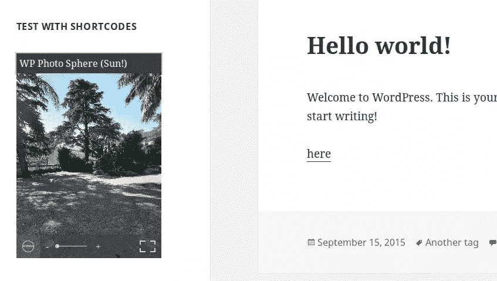
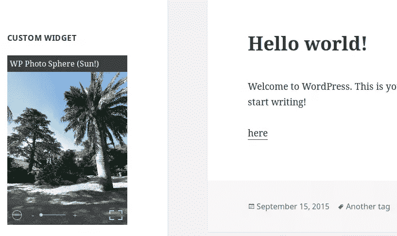

# 快速提示:如何在 WordPress 的小部件中使用短代码

> 原文：<https://www.sitepoint.com/quick-tip-use-shortcodes-within-widgets-wordpress/>

我们可以在 WordPress 中用短代码做很多不同的事情，正如我们在描述 WordPress 短代码 API 的文章中所探讨的。然而，默认情况下，WordPress 只允许在文章(和页面)中使用短代码，其他地方不允许。

如果你想在小部件中使用短代码，默认情况下是不可能的。然而，在这个快速技巧中，我将介绍如何启用这个功能。


## 允许在文本小部件中使用短代码

WordPress 默认提供了几个小部件。其中之一是“文本”小部件，顾名思义，它允许你向小部件添加任何文本。您还可以使用它来添加任何 HTML 代码。

这意味着您还可以在这个小部件中使用 JavaScript 代码，因此它非常强大。然而，如果您需要更多，比如一个 PHP 脚本来访问存储在服务器中的一些数据，这个小部件在默认情况下不会帮助您。

类似于一个帖子。这就是为什么，就像在一个帖子中，我们希望能够使用短代码做任何我们想做的事情。为此，我们可以使用`widget_text`过滤器。调用此过滤器是为了允许修改“文本”小部件的内容。我们将在这里使用它来请求 WordPress 解析这个小部件中的短代码。

WordPress 中短代码的解析得益于`do_shortcode()`函数。它接受一个必需的参数，即要解析的文本，并返回解析后的文本。这意味着我们可以在`widget_text`过滤器中直接使用这个函数作为回调函数。

下面的代码可以在你的主题的插件文件或者`functions.php`文件中使用。

```
<?php
add_filter('widget_text', 'do_shortcode');
?> 
```

我们结束了。现在，您在“文本”小部件中键入的任何现有短代码都将被解析。



## 创建新的短代码小部件

或者，我们也可以创建自己的小部件。由于默认的“文本”小部件工作得很好，我们可以简单地修改下面的代码(在`/wp-includes/default-widgets.php`文件中找到)。值得注意的是，我们应该创建自己的插件，永远不要修改核心 WordPress 文件。

```
<?php
class WP_Widget_Text extends WP_Widget {

    public function __construct() {
        $widget_ops = array('classname' => 'widget_text', 'description' => __('Arbitrary text or HTML.'));
        $control_ops = array('width' => 400, 'height' => 350);
        parent::__construct('text', __('Text'), $widget_ops, $control_ops);
    }

    /**
     * @param array $args
     * @param array $instance
     */
    public function widget( $args, $instance ) {
        /** This filter is documented in wp-includes/default-widgets.php */
        $title = apply_filters( 'widget_title', empty( $instance['title'] ) ? '' : $instance['title'], $instance, $this->id_base );

        /**
         * Filter the content of the Text widget.
         *
         * @since 2.3.0
         *
         * @param string    $widget_text The widget content.
         * @param WP_Widget $instance    WP_Widget instance.
         */
        $text = apply_filters( 'widget_text', empty( $instance['text'] ) ? '' : $instance['text'], $instance );
        echo $args['before_widget'];
        if ( ! empty( $title ) ) {
            echo $args['before_title'] . $title . $args['after_title'];
        } ?>
            <div class="textwidget"><?php echo !empty( $instance['filter'] ) ? wpautop( $text ) : $text; ?></div>
        <?php
        echo $args['after_widget'];
    }

    /**
     * @param array $new_instance
     * @param array $old_instance
     * @return array
     */
    public function update( $new_instance, $old_instance ) {
        $instance = $old_instance;
        $instance['title'] = strip_tags($new_instance['title']);
        if ( current_user_can('unfiltered_html') )
            $instance['text'] =  $new_instance['text'];
        else
            $instance['text'] = stripslashes( wp_filter_post_kses( addslashes($new_instance['text']) ) ); // wp_filter_post_kses() expects slashed
        $instance['filter'] = ! empty( $new_instance['filter'] );
        return $instance;
    }

    /**
     * @param array $instance
     */
    public function form( $instance ) {
        $instance = wp_parse_args( (array) $instance, array( 'title' => '', 'text' => '' ) );
        $title = strip_tags($instance['title']);
        $text = esc_textarea($instance['text']);
?>
        <p><label for="<?php echo $this->get_field_id('title'); ?>"><?php _e('Title:'); ?></label>
        <input class="widefat" id="<?php echo $this->get_field_id('title'); ?>" name="<?php echo $this->get_field_name('title'); ?>" type="text" value="<?php echo esc_attr($title); ?>" /></p>

        <p><label for="<?php echo $this->get_field_id( 'text' ); ?>"><?php _e( 'Content:' ); ?></label>
        <textarea class="widefat" rows="16" cols="20" id="<?php echo $this->get_field_id('text'); ?>" name="<?php echo $this->get_field_name('text'); ?>"><?php echo $text; ?></textarea></p>

        <p><input id="<?php echo $this->get_field_id('filter'); ?>" name="<?php echo $this->get_field_name('filter'); ?>" type="checkbox" <?php checked(isset($instance['filter']) ? $instance['filter'] : 0); ?> />&nbsp;<label for="<?php echo $this->get_field_id('filter'); ?>"><?php _e('Automatically add paragraphs'); ?></label></p>
<?php
    }
}
?> 
```

这里我们没有太多细节需要修改。首先要改变的是类名。我选择把它命名为`WP_Widget_Shortcodes`，但是你可以随意选择任何你想要的名字。由于这个类的构造函数设置了一些关于小部件本身的信息，我们也需要修改它。

```
<?php
public function __construct() {
    $widget_ops = array('classname' => 'widget_shortcodes', 'description' => __('Arbitrary text or HTML with shortcodes.'));
    $control_ops = array('width' => 400, 'height' => 350);
    parent::__construct('shortcodes', __('Shortcodes'), $widget_ops, $control_ops);
}
?> 
```

另一个要改变的是`widget()`方法，它向 WordPress 描述了如何显示小部件。我们改变了包含要显示的文本的变量`$text`的内容。我们删除了对`widget_text`过滤器的调用，并将`do_shortcode()`函数应用于该内容。

```
<?php
$text = empty( $instance['text'] ) ? '' : do_shortcode($instance['text']);
?> 
```

然后，我们需要注册我们的小部件，以便能够像添加任何其他小部件一样添加它。这可以通过 WordPress 注册默认小部件后触发的`widgets_init`动作来实现。

```
<?php
add_action('widgets_init', function() {
    register_widget('WP_Widget_Shortcodes');
});
?> 
```

现在，您可以在可用小部件列表中找到我们的小部件。您可以将它添加到任何兼容的区域，它将解释您使用的任何短代码。



## 结束语

正如我们在上面看到的，在小部件中启用短代码并不复杂，但是您需要小心。事实上，并不是每个短代码都适合显示窗口小部件的地方。如果短码有固定的宽度，这可能是一个问题。

请注意，我们在默认的“文本”小部件中使用的更改是最小的。如果您想要自定义您的 widget，您可以更改任何其他内容。如果你想进一步试验，你可以在这里下载[的示例插件中检索我们使用的过滤器和我们创建的小部件。](http://jeremyheleine.me/downloads/sitepoint/shortcodes-in-widgets.zip)

## 分享这篇文章